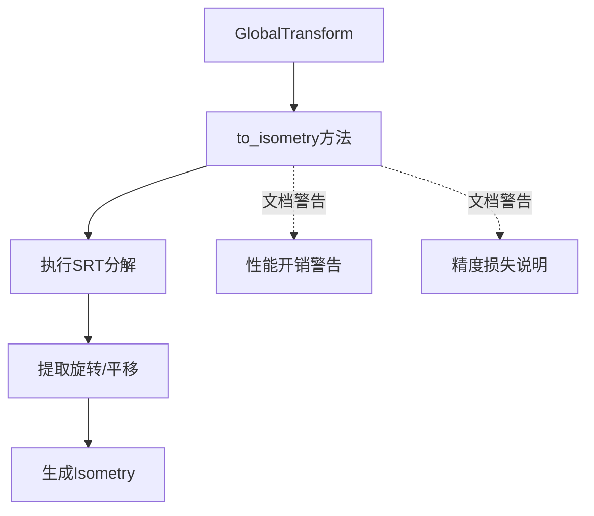

+++
title = "#19645 Clarify GlobalTransform::to_isometry doc"
date = "2025-06-16T00:00:00"
draft = false
template = "pull_request_page.html"
in_search_index = false

[extra]
current_language = "zh-cn"
available_languages = {"en" = { name = "English", url = "/pull_request/bevy/2025-06/pr-19645-en-20250616" }, "zh-cn" = { name = "中文", url = "/pull_request/bevy/2025-06/pr-19645-zh-cn-20250616" }}
+++

# 技术分析报告：PR #19645 - Clarify GlobalTransform::to_isometry doc

## 基础信息
- **标题**: Clarify GlobalTransform::to_isometry doc
- **PR链接**: https://github.com/bevyengine/bevy/pull/19645
- **作者**: atlv24
- **状态**: MERGED
- **标签**: C-Docs, D-Trivial, S-Ready-For-Final-Review, A-Math
- **创建时间**: 2025-06-14T19:36:41Z
- **合并时间**: 2025-06-16T22:20:39Z
- **合并者**: alice-i-cecile

## 描述翻译
### 目标
- `to_isometry` 不是直接转换，它涉及计算过程。文档可以更清晰地说明这一点

### 解决方案
- 改进文档

### 测试
- 文档修改无需特殊测试

## PR技术分析

### 问题背景
在 Bevy 引擎的变换系统中，`GlobalTransform` 组件的 `to_isometry` 方法用于获取变换的等距部分（平移和旋转），忽略缩放。原始文档描述为："Returns the isometric part..."，这可能让开发者误以为这是简单的属性访问操作。实际上，该方法内部执行了计算代价较高的矩阵分解（Scale-Rotation-Translation decomposition），且会丢失缩放信息。这种文档表述不够准确，可能导致开发者在不了解性能开销的情况下频繁调用此方法。

### 解决方案
作者 atlv24 通过精确重写文档来解决此问题：
1. 将 "Returns" 改为 "Computes" 强调计算过程
2. 明确说明涉及 SRT 分解
3. 添加性能警告（costly）和精度说明（lossy）
4. 保留原有关于忽略缩放的说明

### 具体实现
修改集中在 `GlobalTransform::to_isometry` 的文档注释，不涉及功能代码变更。以下是核心改动：

**文件**: `crates/bevy_transform/src/components/global_transform.rs`

```rust
// 修改前
/// Returns the isometric part of the transformation as an [isometry]. Any scaling done by the
/// transformation will be ignored.

// 修改后
/// Computes a Scale-Rotation-Translation decomposition of the transformation and returns
/// the isometric part as an [isometry]. Any scaling done by the transformation will be ignored.
/// Note: this is a somewhat costly and lossy conversion.
```

关键改进点：
1. **术语精确化**：使用 "Computes" 替代 "Returns"，明确表示计算操作
2. **技术细节补充**：说明使用 SRT 分解算法
3. **性能警告**：添加 "costly" 提醒开发者注意性能开销
4. **精度说明**：添加 "lossy" 表明转换会丢失信息

### 技术影响
1. **性能认知**：开发者能明确知道该方法涉及矩阵分解（O(n³) 复杂度），避免在热路径(hot path)中滥用
2. **精度预期管理**："lossy" 警告提示开发者该方法不保留缩放信息
3. **API一致性**：与 Bevy 其他计算型方法（如 `Transform::compute_matrix`）的文档风格保持一致

### 工程考量
- **维护成本**：文档更新不影响实际功能，零维护开销
- **兼容性**：纯文档修改，完全向后兼容
- **最佳实践**：符合 Rust API 文档准则，对计算型方法明确标注性能特征

## 可视化关系



## 关键文件变更

### `crates/bevy_transform/src/components/global_transform.rs`
**修改说明**：更新 `to_isometry` 方法文档，明确计算过程和性能特征

**代码变更对比**：
```diff
@@ -139,8 +139,9 @@ impl GlobalTransform {
         }
     }
 
-    /// Returns the isometric part of the transformation as an [isometry]. Any scaling done by the
-    /// transformation will be ignored.
+    /// Computes a Scale-Rotation-Translation decomposition of the transformation and returns
+    /// the isometric part as an [isometry]. Any scaling done by the transformation will be ignored.
+    /// Note: this is a somewhat costly and lossy conversion.
     ///
     /// The transform is expected to be non-degenerate and without shearing, or the output
     /// will be invalid.
```

## 延伸阅读
1. [Bevy 变换系统文档](https://docs.rs/bevy_transform/latest/bevy_transform/)
2. [仿射变换矩阵分解原理](https://en.wikipedia.org/wiki/Affine_transformation#Decomposition)
3. [Rust API 文档指南 - 性能标注](https://rust-lang.github.io/api-guidelines/documentation.html#c-rate-doc)
4. [glam 库矩阵运算实现](https://github.com/bitshifter/glam-rs) (Bevy 底层数学库)

## 完整代码变更
```diff
diff --git a/crates/bevy_transform/src/components/global_transform.rs b/crates/bevy_transform/src/components/global_transform.rs
index b10d5a9d1aba3..d9fcf80737f8b 100644
--- a/crates/bevy_transform/src/components/global_transform.rs
+++ b/crates/bevy_transform/src/components/global_transform.rs
@@ -139,8 +139,9 @@ impl GlobalTransform {
         }
     }
 
-    /// Returns the isometric part of the transformation as an [isometry]. Any scaling done by the
-    /// transformation will be ignored.
+    /// Computes a Scale-Rotation-Translation decomposition of the transformation and returns
+    /// the isometric part as an [isometry]. Any scaling done by the transformation will be ignored.
+    /// Note: this is a somewhat costly and lossy conversion.
     ///
     /// The transform is expected to be non-degenerate and without shearing, or the output
     /// will be invalid.
```