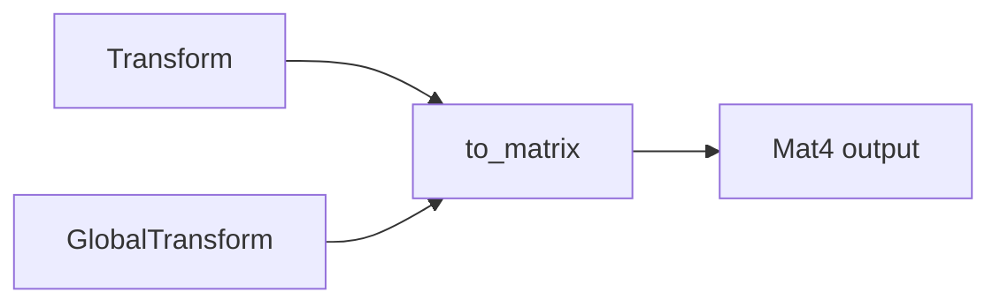

+++
title = "#19646 rename Transform::compute_matrix to to_matrix"
date = "2025-06-18T00:00:00"
draft = false
template = "pull_request_page.html"
in_search_index = true

[taxonomies]
list_display = ["show"]

[extra]
current_language = "en"
available_languages = {"en" = { name = "English", url = "/pull_request/bevy/2025-06/pr-19646-en-20250618" }, "zh-cn" = { name = "中文", url = "/pull_request/bevy/2025-06/pr-19646-zh-cn-20250618" }}
labels = ["D-Trivial", "C-Code-Quality", "A-Math"]
+++

## rename Transform::compute_matrix to to_matrix

### Basic Information
- **Title**: rename Transform::compute_matrix to to_matrix
- **PR Link**: https://github.com/bevyengine/bevy/pull/19646
- **Author**: atlv24
- **Status**: MERGED
- **Labels**: D-Trivial, C-Code-Quality, S-Ready-For-Final-Review, A-Math, M-Needs-Migration-Guide
- **Created**: 2025-06-14T20:08:01Z
- **Merged**: 2025-06-18T07:13:55Z
- **Merged By**: alice-i-cecile

### Description Translation
# Objective

- Parity with #19643

## Solution

- Rename

## Testing

- None

### The Story of This Pull Request

This PR addresses a naming inconsistency in Bevy's transform APIs that emerged after PR #19643. Previously, #19643 renamed `GlobalTransform::compute_matrix` to `GlobalTransform::to_matrix` to better reflect its actual behavior - the method doesn't perform complex computations but simply converts existing transform data into matrix form. However, this change was only applied to `GlobalTransform`, leaving `Transform::compute_matrix` with the original name.

The inconsistency became apparent when comparing both transform types. The `Transform` component still used `compute_matrix` while `GlobalTransform` used the clearer `to_matrix` name. This violated the principle of least surprise and created unnecessary cognitive load for developers working with both transform types.

The solution was straightforward: apply the same renaming convention to `Transform::compute_matrix` that was applied to `GlobalTransform`. The method was renamed to `to_matrix` to:
1. Maintain consistency between related APIs
2. More accurately describe the method's purpose (conversion rather than computation)
3. Reduce developer confusion when switching between transform types

Implementation required updating all call sites across the codebase. The changes were mechanical but widespread, affecting multiple crates including bevy_transform, bevy_core_pipeline, bevy_pbr, and bevy_light_probe. Each call site was updated to use the new method name:

```rust
// Before:
transform.compute_matrix()

// After:
transform.to_matrix()
```

This renaming also required updating the documentation to reflect the new method name while preserving the existing functionality. The method's behavior remains identical - it still constructs a 4x4 transformation matrix from the translation, rotation, and scale components.

```rust
// Before:
pub fn compute_matrix(&self) -> Mat4 {
    Mat4::from_scale_rotation_translation(self.scale, self.rotation, self.translation)
}

// After:
pub fn to_matrix(&self) -> Mat4 {
    Mat4::from_scale_rotation_translation(self.scale, self.rotation, self.translation)
}
```

Since this is a breaking change, the PR includes migration guide updates. The existing migration guide for #19643 was consolidated into a single file that now covers both renames. The new guide clearly explains the change and provides the necessary replacement instructions.

The changes were trivial but required careful verification to ensure all call sites were updated. No functional changes were made - only method names were modified. The PR maintains backward compatibility with the previous functionality while improving API consistency.

### Visual Representation



### Key Files Changed

1. **`crates/bevy_transform/src/components/transform.rs`**  
   Renamed the method and updated documentation:
   ```rust
   // Before:
   pub fn compute_matrix(&self) -> Mat4 {
       Mat4::from_scale_rotation_translation(self.scale, self.rotation, self.translation)
   }
   
   // After:
   pub fn to_matrix(&self) -> Mat4 {
       Mat4::from_scale_rotation_translation(self.scale, self.rotation, self.translation)
   }
   ```

2. **`crates/bevy_core_pipeline/src/skybox/mod.rs`**  
   Updated method call in skybox rendering:
   ```rust
   // Before:
   transform.compute_matrix().inverse()
   
   // After:
   transform.to_matrix().inverse()
   ```

3. **`crates/bevy_pbr/src/light/mod.rs`**  
   Updated light frustum calculation:
   ```rust
   // Before:
   world_from_view.compute_matrix().inverse()
   
   // After:
   world_from_view.to_matrix().inverse()
   ```

4. **`crates/bevy_pbr/src/light_probe/mod.rs`**  
   Updated environment map uniform generation:
   ```rust
   // Before:
   transform.compute_matrix().inverse()
   
   // After:
   transform.to_matrix().inverse()
   ```

5. **`release-content/migration-guides/rename_transform_compute_matrix.md`**  
   Added new migration guide covering both transforms:
   ```md
   ---
   title: Transform and GlobalTransform::compute_matrix rename
   pull_requests: [19643, 19646]
   ---
   
   `GlobalTransform::compute_matrix` has been renamed to `GlobalTransform::to_matrix`...
   `Transform::compute_matrix` has been renamed to `Transform::to_matrix`...
   ```

6. **`release-content/migration-guides/rename_global_transform_compute_matrix.md`**  
   Removed redundant migration guide (consolidated into new file).

### Further Reading
- [Original PR for GlobalTransform rename (#19643)](https://github.com/bevyengine/bevy/pull/19643)
- [Bevy Transform Documentation](https://docs.rs/bevy_transform/latest/bevy_transform/components/struct.Transform.html)
- [API Design Guidelines: Naming Conventions](https://rust-lang.github.io/api-guidelines/naming.html)