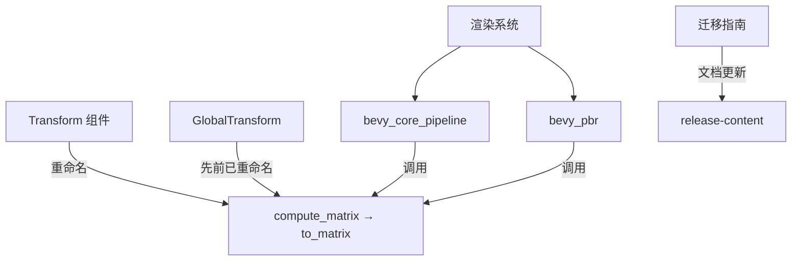

+++
title = "#19646 rename Transform::compute_matrix to to_matrix"
date = "2025-06-18T00:00:00"
draft = false
template = "pull_request_page.html"
in_search_index = false

[extra]
current_language = "zh-cn"
available_languages = {"en" = { name = "English", url = "/pull_request/bevy/2025-06/pr-19646-en-20250618" }, "zh-cn" = { name = "中文", url = "/pull_request/bevy/2025-06/pr-19646-zh-cn-20250618" }}
+++

# rename Transform::compute_matrix to to_matrix

## Basic Information
- **标题**: rename Transform::compute_matrix to to_matrix
- **PR 链接**: https://github.com/bevyengine/bevy/pull/19646
- **作者**: atlv24
- **状态**: 已合并
- **标签**: D-Trivial, C-Code-Quality, S-Ready-For-Final-Review, A-Math, M-Needs-Migration-Guide
- **创建时间**: 2025-06-14T20:08:01Z
- **合并时间**: 2025-06-18T07:13:55Z
- **合并者**: alice-i-cecile

## 描述翻译
### 目标 (Objective)
- 与 #19643 保持一致 (Parity with #19643)

### 解决方案 (Solution)
- 重命名 (Rename)

### 测试 (Testing)
- 无 (None)

## 本 PR 的技术演进

### 问题背景
该 PR 源于 #19643 的后续需求。在 #19643 中，`GlobalTransform::compute_matrix` 方法被重命名为 `to_matrix`，因为该方法实际并不执行复杂计算，而只是将现有数据转换为矩阵形式。然而，`Transform` 组件中仍保留着 `compute_matrix` 方法，这导致了 API 命名的不一致。这种不一致性会增加使用者的认知负担，不符合代码质量优化原则。

### 解决方案
为保持 API 一致性，开发者决定将 `Transform::compute_matrix` 同样重命名为 `to_matrix`。这种重命名属于低风险变更：
1. 方法功能完全不变
2. 仅涉及标识符修改
3. 所有调用点同步更新
4. 配套更新迁移指南

该方案避免了任何功能修改或性能影响，纯粹解决命名一致性问题。由于是简单重命名，无需额外测试，依赖现有测试套件即可验证。

### 具体实现
核心修改集中在 `Transform` 组件的定义文件，将方法名从 `compute_matrix` 改为 `to_matrix`。同时更新了方法注释以更准确描述其行为：

```rust
// 文件: crates/bevy_transform/src/components/transform.rs
// 修改前:
pub fn compute_matrix(&self) -> Mat4 {
    Mat4::from_scale_rotation_translation(self.scale, self.rotation, self.translation)
}

// 修改后:
pub fn to_matrix(&self) -> Mat4 {
    Mat4::from_scale_rotation_translation(self.scale, self.rotation, self.translation)
}
```

该组件的所有调用点同步更新。例如在天空盒处理模块：

```rust
// 文件: crates/bevy_core_pipeline/src/skybox/mod.rs
// 修改前:
transform: Transform::from_rotation(skybox.rotation)
    .compute_matrix()
    .inverse(),

// 修改后:
transform: Transform::from_rotation(skybox.rotation)
    .to_matrix()
    .inverse(),
```

在光照系统中也做了相应更新：

```rust
// 文件: crates/bevy_pbr/src/light/mod.rs
// 修改前:
clip_from_world = clip_from_view * world_from_view.compute_matrix().inverse();

// 修改后:
clip_from_world = clip_from_view * world_from_view.to_matrix().inverse();
```

### 迁移指南调整
为帮助用户升级，迁移指南做了两项关键变更：
1. 删除单独的 GlobalTransform 迁移文档
2. 新增统一文档覆盖两种变换类型

```markdown
// 文件: release-content/migration-guides/rename_transform_compute_matrix.md
---
title: Transform and GlobalTransform::compute_matrix rename
pull_requests: [19643, 19646]
---

`GlobalTransform::compute_matrix` 已重命名为 `GlobalTransform::to_matrix`
`Transform::compute_matrix` 为保持一致性也重命名为 `Transform::to_matrix`
```

### 技术影响
该变更带来三方面改进：
1. **API 一致性**：Transform 和 GlobalTransform 的矩阵转换方法使用相同命名
2. **语义准确性**：`to_matrix` 更准确反映方法行为（类型转换而非复杂计算）
3. **升级体验**：合并迁移文档减少用户升级成本

由于是纯重命名操作，不影响运行时性能或内存布局，但提升了代码可读性和可维护性。

## 组件关系图



## 关键文件变更

### 1. Transform 组件定义
**文件**: `crates/bevy_transform/src/components/transform.rs`  
**变更说明**: 核心重命名操作，同步更新方法注释  
**代码对比**:
```rust
// 修改前:
/// Returns the 3d affine transformation matrix from this transforms translation,
/// rotation, and scale.
#[inline]
pub fn compute_matrix(&self) -> Mat4 {
    Mat4::from_scale_rotation_translation(self.scale, self.rotation, self.translation)
}

// 修改后:
/// Computes the 3d affine transformation matrix from this transform's translation,
/// rotation, and scale.
#[inline]
pub fn to_matrix(&self) -> Mat4 {
    Mat4::from_scale_rotation_translation(self.scale, self.rotation, self.translation)
}
```

### 2. 天空盒渲染
**文件**: `crates/bevy_core_pipeline/src/skybox/mod.rs`  
**变更说明**: 更新天空盒矩阵计算方法调用  
**代码对比**:
```rust
// 修改前:
transform: Transform::from_rotation(skybox.rotation)
    .compute_matrix()
    .inverse(),

// 修改后:
transform: Transform::from_rotation(skybox.rotation)
    .to_matrix()
    .inverse(),
```

### 3. 点光源处理
**文件**: `crates/bevy_pbr/src/light/mod.rs`  
**变更说明**: 更新视锥体计算中的矩阵转换  
**代码对比**:
```rust
// 修改前:
clip_from_world = clip_from_view * world_from_view.compute_matrix().inverse();

// 修改后:
clip_from_world = clip_from_view * world_from_view.to_matrix().inverse();
```

### 4. 迁移指南更新
**文件**: `release-content/migration-guides/rename_transform_compute_matrix.md`  
**变更说明**: 创建统一迁移文档覆盖两种变换类型  
**新增内容**:
```markdown
---
title: Transform and GlobalTransform::compute_matrix rename
pull_requests: [19643, 19646]
---

`GlobalTransform::compute_matrix` 已重命名为 `GlobalTransform::to_matrix`
`Transform::compute_matrix` 为保持一致性也重命名为 `Transform::to_matrix`
```

**文件**: `release-content/migration-guides/rename_global_transform_compute_matrix.md`  
**变更说明**: 删除单独的 GlobalTransform 迁移文档  
**操作**: 完整删除该文件

## 扩展阅读
1. [相关 PR #19643](https://github.com/bevyengine/bevy/pull/19643): GlobalTransform 的初始重命名
2. [Bevy 变换系统文档](https://docs.rs/bevy_transform/latest/bevy_transform/): Transform 组件 API 参考
3. [Rust API 设计指南](https://rust-lang.github.io/api-guidelines/naming.html): 方法命名最佳实践