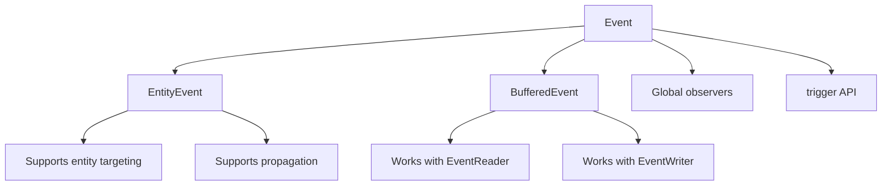

+++
title = "#19647 Event Split: `Event`, `EntityEvent`, and `BufferedEvent`"
date = "2025-06-15T00:00:00"
draft = false
template = "pull_request_page.html"
in_search_index = true

[taxonomies]
list_display = ["show"]

[extra]
current_language = "en"
available_languages = {"en" = { name = "English", url = "/pull_request/bevy/2025-06/pr-19647-en-20250615" }, "zh-cn" = { name = "中文", url = "/pull_request/bevy/2025-06/pr-19647-zh-cn-20250615" }}
labels = ["C-Docs", "A-ECS", "C-Usability", "X-Contentious", "D-Modest"]
+++

# Event Split: `Event`, `EntityEvent`, and `BufferedEvent`

## Basic Information
- **Title**: Event Split: `Event`, `EntityEvent`, and `BufferedEvent`
- **PR Link**: https://github.com/bevyengine/bevy/pull/19647
- **Author**: Jondolf
- **Status**: MERGED
- **Labels**: C-Docs, A-ECS, C-Usability, S-Ready-For-Final-Review, M-Needs-Migration-Guide, M-Needs-Release-Note, X-Contentious, D-Modest
- **Created**: 2025-06-14T20:51:54Z
- **Merged**: 2025-06-15T17:10:23Z
- **Merged By**: alice-i-cecile

## Description Translation
# Objective

Closes #19564.

The current `Event` trait looks like this:

```rust
pub trait Event: Send + Sync + 'static {
    type Traversal: Traversal<Self>;
    const AUTO_PROPAGATE: bool = false;
    
    fn register_component_id(world: &mut World) -> ComponentId { ... }
    fn component_id(world: &World) -> Option<ComponentId> { ... }
}
```

The `Event` trait is used by both buffered events (`EventReader`/`EventWriter`) and observer events. If they are observer events, they can optionally be targeted at specific `Entity`s or `ComponentId`s, and can even be propagated to other entities.

However, there has long been a desire to split the trait semantically for a variety of reasons, see #14843, #14272, and #16031 for discussion. Some reasons include:

- It's very uncommon to use a single event type as both a buffered event and targeted observer event. They are used differently and tend to have distinct semantics.
- A common footgun is using buffered events with observers or event readers with observer events, as there is no type-level error that prevents this kind of misuse.
- #19440 made `Trigger::target` return an `Option<Entity>`. This *seriously* hurts ergonomics for the general case of entity observers, as you need to `.unwrap()` each time. If we could statically determine whether the event is expected to have an entity target, this would be unnecessary.

There's really two main ways that we can categorize events: push vs. pull (i.e. "observer event" vs. "buffered event") and global vs. targeted:

|              | Push            | Pull                        |
| ------------ | --------------- | --------------------------- |
| **Global**   | Global observer | `EventReader`/`EventWriter` |
| **Targeted** | Entity observer | -                           |

There are many ways to approach this, each with their tradeoffs. Ultimately, we kind of want to split events both ways:

- A type-level distinction between observer events and buffered events, to prevent people from using the wrong kind of event in APIs
- A statically designated entity target for observer events to avoid accidentally using untargeted events for targeted APIs

This PR achieves these goals by splitting event traits into `Event`, `EntityEvent`, and `BufferedEvent`, with `Event` being the shared trait implemented by all events.

## `Event`, `EntityEvent`, and `BufferedEvent`

`Event` is now a very simple trait shared by all events.

```rust
pub trait Event: Send + Sync + 'static {
    // Required for observer APIs
    fn register_component_id(world: &mut World) -> ComponentId { ... }
    fn component_id(world: &World) -> Option<ComponentId> { ... }
}
```

You can call `trigger` for *any* event, and use a global observer for listening to the event.

```rust
#[derive(Event)]
struct Speak {
    message: String,
}

// ...

app.add_observer(|trigger: On<Speak>| {
    println!("{}", trigger.message);
});

// ...

commands.trigger(Speak {
    message: "Y'all like these reworked events?".to_string(),
});
```

To allow an event to be targeted at entities and even propagated further, you can additionally implement the `EntityEvent` trait:

```rust
pub trait EntityEvent: Event {
    type Traversal: Traversal<Self>;
    const AUTO_PROPAGATE: bool = false;
}
```

This lets you call `trigger_targets`, and to use targeted observer APIs like `EntityCommands::observe`:

```rust
#[derive(Event, EntityEvent)]
#[entity_event(traversal = &'static ChildOf, auto_propagate)]
struct Damage {
    amount: f32,
}

// ...

let enemy = commands.spawn((Enemy, Health(100.0))).id();

// Spawn some armor as a child of the enemy entity.
// When the armor takes damage, it will bubble the event up to the enemy.
let armor_piece = commands
    .spawn((ArmorPiece, Health(25.0), ChildOf(enemy)))
    .observe(|trigger: On<Damage>, mut query: Query<&mut Health>| {
        // Note: `On::target` only exists because this is an `EntityEvent`.
        let mut health = query.get(trigger.target()).unwrap();
        health.0 -= trigger.amount();
    });

commands.trigger_targets(Damage { amount: 10.0 }, armor_piece);
```

> [!NOTE]
> You *can* still also trigger an `EntityEvent` without targets using `trigger`. We probably *could* make this an either-or thing, but I'm not sure that's actually desirable.

To allow an event to be used with the buffered API, you can implement `BufferedEvent`:

```rust
pub trait BufferedEvent: Event {}
```

The event can then be used with `EventReader`/`EventWriter`:

```rust
#[derive(Event, BufferedEvent)]
struct Message(String);

fn write_hello(mut writer: EventWriter<Message>) {
    writer.write(Message("I hope these examples are alright".to_string()));
}

fn read_messages(mut reader: EventReader<Message>) {
    // Process all buffered events of type `Message`.
    for Message(message) in reader.read() {
        println!("{message}");
    }
}
```

In summary:

- Need a basic event you can trigger and observe? Derive `Event`!
- Need the event to be targeted at an entity? Derive `EntityEvent`!
- Need the event to be buffered and support the `EventReader`/`EventWriter` API? Derive `BufferedEvent`!

## Alternatives

I'll now cover some of the alternative approaches I have considered and briefly explored. I made this section collapsible since it ended up being quite long :P

<details>

<summary>Expand this to see alternatives</summary>

### 1. Unified `Event` Trait

One option is not to have *three* separate traits (`Event`, `EntityEvent`, `BufferedEvent`), and to instead just use associated constants on `Event` to determine whether an event supports targeting and buffering or not:

```rust
pub trait Event: Send + Sync + 'static {
    type Traversal: Traversal<Self>;
    const AUTO_PROPAGATE: bool = false;
    const TARGETED: bool = false;
    const BUFFERED: bool = false;
    
    fn register_component_id(world: &mut World) -> ComponentId { ... }
    fn component_id(world: &World) -> Option<ComponentId> { ... }
}
```

Methods can then use bounds like `where E: Event<TARGETED = true>` or `where E: Event<BUFFERED = true>` to limit APIs to specific kinds of events.

This would keep everything under one `Event` trait, but I don't think it's necessarily a good idea. It makes APIs harder to read, and docs can't easily refer to specific types of events. You can also create weird invariants: what if you specify `TARGETED = false`, but have `Traversal` and/or `AUTO_PROPAGATE` enabled?

### 2. `Event` and `Trigger`

Another option is to only split the traits between buffered events and observer events, since that is the main thing people have been asking for, and they have the largest API difference.

If we did this, I think we would need to make the terms *clearly* separate. We can't really use `Event` and `BufferedEvent` as the names, since it would be strange that `BufferedEvent` doesn't implement `Event`. Something like `ObserverEvent` and `BufferedEvent` could work, but it'd be more verbose.

For this approach, I would instead keep `Event` for the current `EventReader`/`EventWriter` API, and call the observer event a `Trigger`, since the "trigger" terminology is already used in the observer context within Bevy (both as a noun and a verb). This is also what a long [bikeshed on Discord](https://discord.com/channels/691052431525675048/749335865876021248/1298057661878898791)  seemed to land on at the end of last year.

```rust
// For `EventReader`/`EventWriter`
pub trait Event: Send + Sync + 'static {}

// For observers
pub trait Trigger: Send + Sync + 'static {
    type Traversal: Traversal<Self>;
    const AUTO_PROPAGATE: bool = false;
    const TARGETED: bool = false;
    
    fn register_component_id(world: &mut World) -> ComponentId { ... }
    fn component_id(world: &World) -> Option<ComponentId> { ... }
}
```

The problem is that "event" is just a really good term for something that "happens". Observers are rapidly becoming the more prominent API, so it'd be weird to give them the `Trigger` name and leave the good `Event` name for the less common API.

So, even though a split like this seems neat on the surface, I think it ultimately wouldn't really work. We want to keep the `Event` name for observer events, and there is no good alternative for the buffered variant. (`Message` was suggested, but saying stuff like "sends a collision message" is weird.)

### 3. `GlobalEvent` + `TargetedEvent`

What if instead of focusing on the buffered vs. observed split, we *only* make a distinction between global and targeted events?

```rust
// A shared event trait to allow global observers to work
pub trait Event: Send + Sync + 'static {
    fn register_component_id(world: &mut World) -> ComponentId { ... }
    fn component_id(world: &World) -> Option<ComponentId> { ... }
}

// For buffered events and non-targeted observer events
pub trait GlobalEvent: Event {}

// For targeted observer events
pub trait TargetedEvent: Event {
    type Traversal: Traversal<Self>;
    const AUTO_PROPAGATE: bool = false;
}
```

This is actually the first approach I implemented, and it has the neat characteristic that you can only use non-targeted APIs like `trigger` with a `GlobalEvent` and targeted APIs like `trigger_targets` with a `TargetedEvent`. You have full control over whether the entity should or should not have a target, as they are fully distinct at the type-level.

However, there's a few problems:

- There is no type-level indication of whether a `GlobalEvent` supports buffered events or just non-targeted observer events
- An `Event` on its own does literally nothing, it's just a shared trait required to make global observers accept both non-targeted and targeted events
- If an event is both a `GlobalEvent` and `TargetedEvent`, global observers again have ambiguity on whether an event has a target or not, undermining some of the benefits
- The names are not ideal

### 4. `Event` and `EntityEvent`

We can fix some of the problems of Alternative 3 by accepting that targeted events can also be used in non-targeted contexts, and simply having the `Event` and `EntityEvent` traits:

```rust
// For buffered events and non-targeted observer events
pub trait Event: Send + Sync + 'static {
    fn register_component_id(world: &mut World) -> ComponentId { ... }
    fn component_id(world: &World) -> Option<ComponentId> { ... }
}

// For targeted observer events
pub trait EntityEvent: Event {
    type Traversal: Traversal<Self>;
    const AUTO_PROPAGATE: bool = false;
}
```

This is essentially identical to this PR, just without a dedicated `BufferedEvent`. The remaining major "problem" is that there is still zero type-level indication of whether an `Event` event *actually* supports the buffered API. This leads us to the solution proposed in this PR, using `Event`, `EntityEvent`, and `BufferedEvent`.

</details>

## Conclusion

The `Event` + `EntityEvent` + `BufferedEvent` split proposed in this PR aims to solve all the common problems with Bevy's current event model while keeping the "weirdness" factor minimal. It splits in terms of both the push vs. pull *and* global vs. targeted aspects, while maintaining a shared concept for an "event".

### Why I Like This

- The term "event" remains as a single concept for all the different kinds of events in Bevy.
- Despite all event types being "events", they use fundamentally different APIs. Instead of assuming that you can use an event type with any pattern (when only one is typically supported), you explicitly opt in to each one with dedicated traits.
- Using separate traits for each type of event helps with documentation and clearer function signatures.
- I can safely make assumptions on expected usage.
	- If I see that an event is an `EntityEvent`, I can assume that I can use `observe` on it and get targeted events.
	- If I see that an event is a `BufferedEvent`, I can assume that I can use `EventReader` to read events.
	- If I see both `EntityEvent` and `BufferedEvent`, I can assume that both APIs are supported.

In summary: This allows for a unified concept for events, while limiting the different ways to use them with opt-in traits. No more guess-work involved when using APIs.

### Problems?

- Because `BufferedEvent` implements `Event` (for more consistent semantics etc.), you can still use all buffered events for non-targeted observers. I think this is fine/good. The important part is that if you see that an event implements `BufferedEvent`, you know that the `EventReader`/`EventWriter` API should be supported. Whether it *also* supports other APIs is secondary.
- I currently only support `trigger_targets` for an `EntityEvent`. However, you can technically target components too, without targeting any entities. I consider that such a niche and advanced use case that it's not a huge problem to only support it for `EntityEvent`s, but we could also split `trigger_targets` into `trigger_entities` and `trigger_components` if we wanted to (or implement components as entities :P).
- You can still trigger an `EntityEvent` *without* targets. I consider this correct, since `Event` implements the non-targeted behavior, and it'd be weird if implementing another trait *removed* behavior. However, it does mean that global observers for entity events can technically return `Entity::PLACEHOLDER` again (since I got rid of the `Option<Entity>` added in #19440 for ergonomics). I think that's enough of an edge case that it's not a huge problem, but it is worth keeping in mind.
- ~~Deriving both `EntityEvent` and `BufferedEvent` for the same type currently duplicates the `Event` implementation, so you instead need to manually implement one of them.~~ Changed to always requiring `Event` to be derived.

## Related Work

There are plans to implement multi-event support for observers, especially for UI contexts. [Cart's example](https://github.com/bevyengine/bevy/issues/14649#issuecomment-2960402508) API looked like this:

```rust
// Truncated for brevity
trigger: Trigger<(
    OnAdd<Pressed>,
    OnRemove<Pressed>,
    OnAdd<InteractionDisabled>,
    OnRemove<InteractionDisabled>,
    OnInsert<Hovered>,
)>,
```

I believe this shouldn't be in conflict with this PR. If anything, this PR might *help* achieve the multi-event pattern for entity observers with fewer footguns: by statically enforcing that all of these events are `EntityEvent`s in the context of `EntityCommands::observe`, we can avoid misuse or weird cases where *some* events inside the trigger are targeted while others are not.

## The Story of This Pull Request

### Problem and Context
Bevy's existing event system used a single `Event` trait for both buffered events (handled via `EventReader`/`EventWriter`) and observer events (triggered immediately with `Commands::trigger`). This design led to several issues:

1. **Semantic ambiguity**: Most events are used exclusively as either buffered or observer events, but the unified trait suggested they could be used interchangeably
2. **Runtime errors**: No compile-time prevention for using buffered events with observers or vice versa
3. **Ergonomics issues**: Recent changes to entity targeting required `.unwrap()` calls for common cases
4. **Lack of static guarantees**: Unable to enforce correct usage patterns at the type level

The core problem was that Bevy's event system needed clearer boundaries between fundamentally different event handling patterns.

### Solution Approach
The PR introduces a clear separation of concerns by splitting the event system into three distinct traits:

1. **`Event`**: Base trait for all events, supporting global observers
2. **`EntityEvent`**: Extends `Event` with entity targeting and propagation capabilities
3. **`BufferedEvent`**: Extends `Event` for use with `EventReader`/`EventWriter`

This approach was chosen after evaluating several alternatives (documented in the PR description) that proved less optimal due to:
- Reduced API clarity
- Weaker type guarantees
- Unintuitive naming schemes
- Incomplete coverage of use cases

The key engineering decisions were:
- Maintaining `Event` as the shared base trait
- Making `EntityEvent` and `BufferedEvent` opt-in extensions
- Preserving backward compatibility where possible
- Providing clear migration paths

### Implementation
The implementation required changes across multiple areas of the codebase:

**Core Trait Definitions (`base.rs`):**
```rust
// Base event trait
pub trait Event: Send + Sync + 'static {
    fn register_component_id(world: &mut World) -> ComponentId;
    fn component_id(world: &World) -> Option<ComponentId>;
}

// Entity-targeting extension
pub trait EntityEvent: Event {
    type Traversal: Traversal<Self>;
    const AUTO_PROPAGATE: bool = false;
}

// Buffered event marker
pub trait BufferedEvent: Event {}
```

**Derive Macros (`component.rs`):**
```rust
// Event derive
pub fn derive_event(input: TokenStream) -> TokenStream {
    // ... generates Event implementation
}

// EntityEvent derive
pub fn derive_entity_event(input: TokenStream) -> TokenStream {
    // ... generates EntityEvent implementation
}

// BufferedEvent derive
pub fn derive_buffered_event(input: TokenStream) -> TokenStream {
    // ... generates BufferedEvent implementation
}
```

**Observer System (`observer/mod.rs`):**
```rust
// Only provide target() for EntityEvents
impl<'w, E: EntityEvent, B: Bundle> On<'w, E, B> {
    pub fn target(&self) -> Entity {
        self.trigger.target.unwrap_or(Entity::PLACEHOLDER)
    }
    
    pub fn set_propagate(&mut self, propagate: bool) { ... }
    pub fn get_propagate(&self) -> bool { ... }
}
```

**Migration Changes:**
- Updated all existing events to derive appropriate traits
- Converted benchmark events to use `BufferedEvent`
- Fixed examples to use new event traits
- Updated documentation throughout

### Technical Insights
Key technical aspects of the implementation:

1. **Trait Hierarchy**: 
   - `EntityEvent` and `BufferedEvent` both require `Event`
   - This maintains a unified event concept while allowing specialization

2. **Observer Ergonomics**:
   - `On::target()` now directly returns `Entity` for `EntityEvent`s
   - Removes need for `.unwrap()` in common cases
   - Uses `Entity::PLACEHOLDER` for non-targeted events

3. **Propagation Control**:
   - Propagation methods only available for `EntityEvent`s
   - Matches the only context where propagation makes sense

4. **Backward Compatibility**:
   - Existing events can be upgraded by adding derives
   - Most changes are mechanical additions of `EntityEvent` or `BufferedEvent`

5. **Performance**:
   - Zero-cost abstractions maintain existing performance characteristics
   - No additional runtime overhead for event handling

### Impact
The changes provide significant benefits:

1. **Clearer APIs**: 
   - Function signatures now clearly indicate supported event types
   - Removes ambiguity about how an event should be used

2. **Stronger Guarantees**:
   - Compile-time prevention of invalid event usage patterns
   - Eliminates entire categories of runtime errors

3. **Improved Ergonomics**:
   - Direct `Entity` access for targeted events
   - No more `.unwrap()` for entity observers

4. **Better Documentation**:
   - Traits serve as self-documenting markers for event capabilities
   - Examples demonstrate proper usage patterns

5. **Foundation for Future Features**:
   - Enables safer implementation of multi-event observers
   - Provides clearer extension points for event system improvements

The main trade-off is the need to add additional derives to existing events, but this is a straightforward mechanical change that improves long-term maintainability.

## Visual Representation



## Key Files Changed

### `crates/bevy_ecs/src/event/base.rs` (+276/-38)
- Simplified `Event` trait by removing `Traversal` and `AUTO_PROPAGATE`
- Added `EntityEvent` and `BufferedEvent` traits
- Updated documentation to explain the new event types

```rust
// Before:
pub trait Event: Send + Sync + 'static {
    type Traversal: Traversal<Self>;
    const AUTO_PROPAGATE: bool = false;
    
    fn register_component_id(world: &mut World) -> ComponentId;
    fn component_id(world: &World) -> Option<ComponentId>;
}

// After:
pub trait Event: Send + Sync + 'static {
    fn register_component_id(world: &mut World) -> ComponentId;
    fn component_id(world: &World) -> Option<ComponentId>;
}

pub trait EntityEvent: Event {
    type Traversal: Traversal<Self>;
    const AUTO_PROPAGATE: bool = false;
}

pub trait BufferedEvent: Event {}
```

### `crates/bevy_ecs/src/observer/mod.rs` (+68/-42)
- Modified `On` to provide `target()` only for `EntityEvent`s
- Made propagation methods exclusive to `EntityEvent`s
- Updated documentation examples

```rust
// Before:
impl<'w, E, B: Bundle> On<'w, E, B> {
    pub fn target(&self) -> Option<Entity> { ... }
}

// After:
impl<'w, E: EntityEvent, B: Bundle> On<'w, E, B> {
    pub fn target(&self) -> Entity { ... }
    pub fn set_propagate(&mut self, propagate: bool) { ... }
    pub fn get_propagate(&self) -> bool { ... }
}
```

### `crates/bevy_ecs/macros/src/component.rs`
- Added derive implementations for new traits
- Updated attribute handling for `EntityEvent`

```rust
// EntityEvent derive with attributes
pub fn derive_entity_event(input: TokenStream) -> TokenStream {
    let mut ast = parse_macro_input!(input as DeriveInput);
    let mut auto_propagate = false;
    let mut traversal: Type = parse_quote!(());
    
    // Parse #[entity_event(...)] attributes
    for attr in &ast.attrs {
        // ... attribute processing
    }
    
    // Generate implementation
    quote! {
        impl #impl_generics #bevy_ecs_path::event::EntityEvent for #struct_name #type_generics #where_clause {
            type Traversal = #traversal;
            const AUTO_PROPAGATE: bool = #auto_propagate;
        }
    }
}
```

### `crates/bevy_ecs/README.md` (+22/-22)
- Updated examples to use new event traits
- Clarified differences between event types

```markdown
// Before:
#[derive(Event)]
struct MyEvent;

// After:
#[derive(Event, BufferedEvent)]
struct MyBufferedEvent;

#[derive(Event, EntityEvent)]
struct MyEntityEvent;
```

### `crates/bevy_window/src/event.rs` (+24/-21)
- Added `BufferedEvent` to window events
- Maintained existing functionality while updating to new trait

```rust
// Before:
#[derive(Event)]
struct WindowResized { ... }

// After:
#[derive(Event, BufferedEvent)]
struct WindowResized { ... }
```

## Further Reading
- [Observer System Documentation](https://bevyengine.org/learn/book/observer/)
- [Event System RFC](https://github.com/bevyengine/rfcs/pull/45)
- [Entity Targeting Examples](https://github.com/bevyengine/bevy/tree/main/examples/ecs/observer_propagation.rs)

## Full Code Diff
```diff
diff --git a/benches/benches/bevy_ecs/events/iter.rs b/benches/benches/bevy_ecs/events/iter.rs
index dc20bc3395a52..9ad17ed8c8536 100644
--- a/benches/benches/bevy_ecs/events/iter.rs
+++ b/benches/benches/bevy_ecs/events/iter.rs
@@ -1,6 +1,6 @@
 use bevy_ecs::prelude::*;
 
-#[derive(Event)]
+#[derive(Event, BufferedEvent)]
 struct BenchEvent<const SIZE: usize>([u8; SIZE]);
 
 pub struct Benchmark<const SIZE: usize>(Events<BenchEvent<SIZE>>);
diff --git a/benches/benches/bevy_ecs/events/send.rs b/benches/benches/bevy_ecs/events/send.rs
index fa996b50aa5d0..be8934e789152 100644
--- a/benches/benches/bevy_ecs/events/send.rs
+++ b/benches/benches/bevy_ecs/events/send.rs
@@ -1,6 +1,6 @@
 use bevy_ecs::prelude::*;
 
-#[derive(Event)]
+#[derive(Event, BufferedEvent)]
 struct BenchEvent<const SIZE: usize>([u8; SIZE]);
 
 impl<const SIZE: usize> Default for BenchEvent<SIZE> {
diff --git a/benches/benches/bevy_ecs/observers/propagation.rs b/benches/benches/bevy_ecs/observers/propagation.rs
index e2be1afed4850..808c3727d5af9 100644
--- a/benches/benches/bevy_ecs/observers/propagation.rs
+++ b/benches/benches/bevy_ecs/observers/propagation.rs
@@ -61,14 +61,10 @@ pub fn event_propagation(criterion: &mut Criterion) {
     group.finish();
 }
 
-#[derive(Clone, Component)]
+#[derive(Event, EntityEvent, Clone, Component)]
+#[entity_event(traversal = &'static ChildOf, auto_propagate)]
 struct TestEvent<const N: usize> {}
 
-impl<const N: usize> Event for TestEvent<N> {
-    type Traversal = &'static ChildOf;
-    const AUTO_PROPAGATE: bool = true;
-}
-
 fn send_events<const N: usize, const N_EVENTS: usize>(world: &mut World, leaves: &[Entity]) {
     let target = leaves.iter().choose(&mut rand::thread_rng()).unwrap();
 
diff --git a/benches/benches/bevy_ecs/observers/simple.rs b/benches/benches/bevy_ecs/observers/simple.rs
index b3006ec9249bc..9c26b074e5adf 100644
--- a/benches/benches/bevy_ecs/observers/simple.rs
+++ b/benches/benches/bevy_ecs/observers/simple.rs
@@ -1,7 +1,7 @@
 use core::hint::black_box;
 
 use bevy_ecs::{
-    event::Event,
+    event::{EntityEvent, Event},
     observer::{On, TriggerTargets},
     world::World,
 };
@@ -13,7 +13,7 @@ fn deterministic_rand() -> ChaCha8Rng {
     ChaCha8Rng::seed_from_u64(42)
 }
 
-#[derive(Clone, Event)]
+#[derive(Clone, Event, EntityEvent)]
 struct EventBase;
 
 pub fn observe_simple(criterion: &mut Criterion) {
diff --git a/crates/bevy_a11y/src/lib.rs b/crates/bevy_a11y/src/lib.rs
index f8c46757ddf93..22b2f71f075e9 100644
--- a/crates/bevy_a11y/src/lib.rs
+++ b/crates/bevy_a11y/src/lib.rs
@@ -26,7 +26,8 @@ use accesskit::Node;
 use bevy_app::Plugin;
 use bevy_derive::{Deref, DerefMut};
 use bevy_ecs::{
-    prelude::{Component, Event},
+    component::Component,
+    event::{BufferedEvent, Event},
     resource::Resource,
     schedule::SystemSet,
 };
@@ -44,7 +45,7 @@ use serde::{Deserialize, Serialize};
 use bevy_reflect::{ReflectDeserialize, ReflectSerialize};
 
 /// Wrapper struct for [`accesskit::ActionRequest`]. Required to allow it to be used as an `Event`.
-#[derive(Event, Deref, DerefMut)]
+#[derive(Event, BufferedEvent, Deref, DerefMut)]
 #[cfg_attr(feature = "serialize", derive(Serialize, Deserialize))]
 pub struct ActionRequest(pub accesskit::ActionRequest);
 
diff --git a/crates/bevy_animation/src/lib.rs b/crates/bevy_animation/src/lib.rs
index dd68595961405..ae7ce42ed67a2 100644
--- a/crates/bevy_animation/src/lib.rs
+++ b/crates/bevy_animation/src/lib.rs
@@ -324,13 +324,13 @@ impl AnimationClip {
             .push(variable_curve);
     }
 
-    /// Add a untargeted [`Event`] to this [`AnimationClip`].
+    /// Add an [`EntityEvent`] with no [`AnimationTarget`] to this [`AnimationClip`].
     ///
     /// The `event` will be cloned and triggered on the [`AnimationPlayer`] entity once the `time` (in seconds)
     /// is reached in the animation.
     ///
     /// See also [`add_event_to_target`](Self::add_event_to_target).
-    pub fn add_event(&mut self, time: f32, event: impl Event + Clone) {
+    pub fn add_event(&mut self, time: f32, event: impl EntityEvent + Clone) {
         self.add_event_fn(
             time,
             move |commands: &mut Commands, entity: Entity, _time: f32, _weight: f32| {
@@ -339,7 +339,7 @@ impl AnimationClip {
         );
     }
 
-    /// Add an [`Event`] to an [`AnimationTarget`] named by an [`AnimationTargetId`].
+    /// Add an [`EntityEvent`] to an [`AnimationTarget`] named by an [`AnimationTargetId`].
     ///
     /// The `event` will be cloned and triggered on the entity matching the target once the `time` (in seconds)
     /// is reached in the animation.
@@ -349,7 +349,7 @@ impl AnimationClip {
         &mut self,
         target_id: AnimationTargetId,
         time: f32,
-        event: impl Event + Clone,
+        event: impl EntityEvent + Clone,
     ) {
         self.add_event_fn_to_target(
             target_id,
@@ -360,19 +360,19 @@ impl AnimationClip {
         );
     }
 
-    /// Add a untargeted event function to this [`AnimationClip`].
+    /// Add an event function with no [`AnimationTarget`] to this [`AnimationClip`].
     ///
     /// The `func` will trigger on the [`AnimationPlayer`] entity once the `time` (in seconds)
     /// is reached in the animation.
