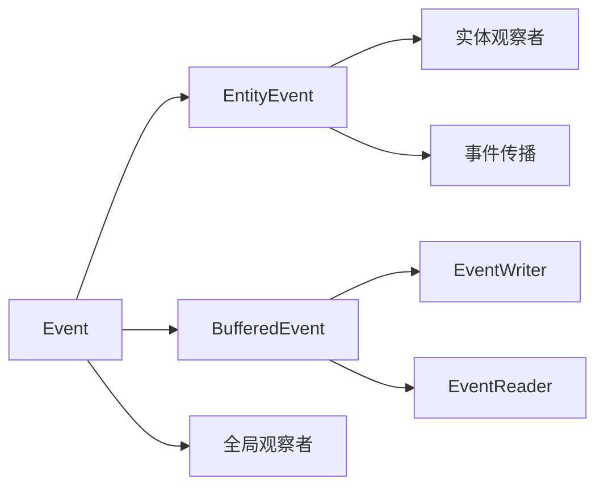

+++
title = "#19647 Event Split: `Event`, `EntityEvent`, and `BufferedEvent`"
date = "2025-06-15T00:00:00"
draft = false
template = "pull_request_page.html"
in_search_index = false

[extra]
current_language = "zh-cn"
available_languages = {"en" = { name = "English", url = "/pull_request/bevy/2025-06/pr-19647-en-20250615" }, "zh-cn" = { name = "中文", url = "/pull_request/bevy/2025-06/pr-19647-zh-cn-20250615" }}
labels = ["C-Docs", "A-ECS", "C-Usability", "X-Contentious", "D-Modest"]
+++

# PR分析报告：Event Split: `Event`, `EntityEvent`, and `BufferedEvent`

## Basic Information
- **Title**: Event Split: `Event`, `EntityEvent`, and `BufferedEvent`
- **PR Link**: https://github.com/bevyengine/bevy/pull/19647
- **Author**: Jondolf
- **Status**: MERGED
- **Labels**: C-Docs, A-ECS, C-Usability, S-Ready-For-Final-Review, M-Needs-Migration-Guide, M-Needs-Release-Note, X-Contentious, D-Modest
- **Created**: 2025-06-14T20:51:54Z
- **Merged**: 2025-06-15T17:10:23Z
- **Merged By**: alice-i-cecile

## Description Translation
该PR的目标是解决#19564问题。当前的`Event` trait设计如下：

```rust
pub trait Event: Send + Sync + 'static {
    type Traversal: Traversal<Self>;
    const AUTO_PROPAGATE: bool = false;
    
    fn register_component_id(world: &mut World) -> ComponentId { ... }
    fn component_id(world: &World) -> Option<ComponentId> { ... }
}
```

`Event` trait同时被缓冲事件(`EventReader`/`EventWriter`)和观察者事件使用。如果是观察者事件，它们可以选择性地针对特定的`Entity`或`ComponentId`，甚至可以传播到其他实体。

然而，长期以来有多个原因希望从语义上拆分这个trait，详见#14843、#14272和#16031的讨论。一些原因包括：
- 很少将单个事件类型同时用作缓冲事件和目标观察者事件，它们的使用方式和语义通常不同
- 常见的问题是错误地将缓冲事件与观察者一起使用，或者将事件读取器与观察者事件一起使用，因为类型系统无法防止这种误用
- #19440使`Trigger::target`返回`Option<Entity>`，这在实体观察者的常见情况下严重损害了人体工程学，因为每次都需要`.unwrap()`

我们可以通过两种主要方式对事件进行分类：推式 vs 拉式（即"观察者事件" vs "缓冲事件"）以及全局 vs 目标：

|              | Push            | Pull                        |
| ------------ | --------------- | --------------------------- |
| **Global**   | Global observer | `EventReader`/`EventWriter` |
| **Targeted** | Entity observer | -                           |

这个PR通过将事件trait拆分为`Event`、`EntityEvent`和`BufferedEvent`来实现这些目标，其中`Event`是所有事件共享的基础trait。

### `Event`、`EntityEvent`和`BufferedEvent`
`Event`现在是一个非常简单的trait，被所有事件共享：

```rust
pub trait Event: Send + Sync + 'static {
    // 观察者API所需
    fn register_component_id(world: &mut World) -> ComponentId { ... }
    fn component_id(world: &World) -> Option<ComponentId> { ... }
}
```

你可以为*任何*事件调用`trigger`，并使用全局观察者监听事件：

```rust
#[derive(Event)]
struct Speak {
    message: String,
}

// ...

app.add_observer(|trigger: On<Speak>| {
    println!("{}", trigger.message);
});

// ...

commands.trigger(Speak {
    message: "Y'all like these reworked events?".to_string(),
});
```

要允许事件针对实体并进一步传播，你可以额外实现`EntityEvent` trait：

```rust
pub trait EntityEvent: Event {
    type Traversal: Traversal<Self>;
    const AUTO_PROPAGATE: bool = false;
}
```

这让你可以调用`trigger_targets`，并使用目标观察者API如`EntityCommands::observe`：

```rust
#[derive(Event, EntityEvent)]
#[entity_event(traversal = &'static ChildOf, auto_propagate)]
struct Damage {
    amount: f32,
}

// ...

let enemy = commands.spawn((Enemy, Health(100.0))).id();

// 生成一些装甲作为敌人实体的子实体
// 当装甲受到伤害时，事件会冒泡到敌人实体
let armor_piece = commands
    .spawn((ArmorPiece, Health(25.0), ChildOf(enemy)))
    .observe(|trigger: On<Damage>, mut query: Query<&mut Health>| {
        // 注意：`On::target`只因为这是`EntityEvent`而存在
        let mut health = query.get(trigger.target()).unwrap();
        health.0 -= trigger.amount;
    });

commands.trigger_targets(Damage { amount: 10.0 }, armor_piece);
```

> [!NOTE]
> 你*仍然*可以使用`trigger`无目标地触发`EntityEvent`。我们*可以*将其设为二选一，但我不确定这是否真的可取。

要允许事件与缓冲API一起使用，你可以实现`BufferedEvent`：

```rust
pub trait BufferedEvent: Event {}
```

然后该事件可以与`EventReader`/`EventWriter`一起使用：

```rust
#[derive(Event, BufferedEvent)]
struct Message(String);

fn write_hello(mut writer: EventWriter<Message>) {
    writer.write(Message("I hope these examples are alright".to_string()));
}

fn read_messages(mut reader: EventReader<Message>) {
    // 处理所有类型为`Message`的缓冲事件
    for Message(message) in reader.read() {
        println!("{message}");
    }
}
```

总结：
- 需要一个可以触发和观察的基本事件？派生`Event`！
- 需要事件针对实体？派生`EntityEvent`！
- 需要事件被缓冲并支持`EventReader`/`EventWriter` API？派生`BufferedEvent`！

### 替代方案
我考虑了其他几种替代方法：

<details>
<summary>展开查看替代方案</summary>

#### 1. 统一的`Event` Trait
一个选项是不要有*三个*独立的trait（`Event`、`EntityEvent`、`BufferedEvent`），而是使用`Event`上的关联常量来确定事件是否支持目标和缓冲：

```rust
pub trait Event: Send + Sync + 'static {
    type Traversal: Traversal<Self>;
    const AUTO_PROPAGATE: bool = false;
    const TARGETED: bool = false;
    const BUFFERED: bool = false;
    
    fn register_component_id(world: &mut World) -> ComponentId { ... }
    fn component_id(world: &World) -> Option<ComponentId> { ... }
}
```

然后方法可以使用类似`where E: Event<TARGETED = true>`或`where E: Event<BUFFERED = true>`的约束来限制API为特定类型的事件。

这会将所有内容保留在一个`Event` trait下，但我不认为这是个好主意。它使API更难阅读，文档也不能轻松引用特定类型的事件。你还可以创建奇怪的约束：如果你指定`TARGETED = false`，但启用了`Traversal`和/或`AUTO_PROPAGATE`会怎样？

#### 2. `Event`和`Trigger`
另一个选项是只将trait拆分为缓冲事件和观察者事件，因为这是人们主要要求的，并且它们有最大的API差异。

如果我们这样做，我认为我们需要*清晰*地分离术语。我们不能真正使用`Event`和`BufferedEvent`作为名称，因为`BufferedEvent`不实现`Event`会很奇怪。类似`ObserverEvent`和`BufferedEvent`的名称可能有效，但会更冗长。

对于这种方法，我会保留`Event`用于当前的`EventReader`/`EventWriter` API，并将观察者事件称为`Trigger`，因为"trigger"术语已经在Bevy的观察者上下文中使用（既作为名词也作为动词）。这也是去年[Discord上的一次长时间讨论](https://discord.com/channels/691052431525675048/749335865876021248/1298057661878898791)最终达成的共识。

```rust
// 用于`EventReader`/`EventWriter`
pub trait Event: Send + Sync + 'static {}

// 用于观察者
pub trait Trigger: Send + Sync + 'static {
    type Traversal: Traversal<Self>;
    const AUTO_PROPAGATE: bool = false;
    const TARGETED: bool = false;
    
    fn register_component_id(world: &mut World) -> ComponentId { ... }
    fn component_id(world: &World) -> Option<ComponentId> { ... }
}
```

问题是"event"对于"发生"的事情来说是一个非常合适的术语。观察者正在迅速成为更突出的API，所以给它们命名为`Trigger`而将好的`Event`名称留给不太常见的API会显得奇怪。

因此，即使这样的拆分表面上看起来很简洁，我认为它最终不会真正奏效。我们希望为观察者事件保留`Event`名称，而缓冲变体没有好的替代名称。（`Message`被建议过，但说"发送碰撞消息"很奇怪。）

#### 3. `GlobalEvent` + `TargetedEvent`
如果我们不关注缓冲与观察的拆分，而*只*区分全局事件和目标事件会怎样？

```rust
// 共享的事件trait以允许全局观察者工作
pub trait Event: Send + Sync + 'static {
    fn register_component_id(world: &mut World) -> ComponentId { ... }
    fn component_id(world: &World) -> Option<ComponentId> { ... }
}

// 用于缓冲事件和非目标观察者事件
pub trait GlobalEvent: Event {}

// 用于目标观察者事件
pub trait TargetedEvent: Event {
    type Traversal: Traversal<Self>;
    const AUTO_PROPAGATE: bool = false;
}
```

这实际上是我实现的第一个方法，它有一个简洁的特性：你只能对`GlobalEvent`使用非目标API如`trigger`，而对`TargetedEvent`只能使用目标API如`trigger_targets`。你可以完全控制实体是否应该有目标，因为它们在类型级别是完全不同的。

然而，有几个问题：
- 没有类型级别的指示表明`GlobalEvent`是否支持缓冲事件或仅支持非目标观察者事件
- 单独的`Event`实际上什么都不做，它只是一个共享trait，用于使全局观察者同时接受非目标和目标事件
- 如果一个事件同时是`GlobalEvent`和`TargetedEvent`，全局观察者再次在事件是否有目标上存在歧义，削弱了一些好处
- 名称不理想

#### 4. `Event`和`EntityEvent`
我们可以通过接受目标事件也可以用于非目标上下文来修复替代方案3的一些问题，并简单地拥有`Event`和`EntityEvent` trait：

```rust
// 用于缓冲事件和非目标观察者事件
pub trait Event: Send + Sync + 'static {
    fn register_component_id(world: &mut World) -> ComponentId { ... }
    fn component_id(world: &World) -> Option<ComponentId> { ... }
}

// 用于目标观察者事件
pub trait EntityEvent: Event {
    type Traversal: Traversal<Self>;
    const AUTO_PROPAGATE: bool = false;
}
```

这本质上与本PR相同，只是没有专门的`BufferedEvent`。剩下的主要"问题"是仍然没有类型级别的指示表明`Event`事件*实际*是否支持缓冲API。这引导我们到本PR提出的解决方案，使用`Event`、`EntityEvent`和`BufferedEvent`。

</details>

### 结论
本PR提出的`Event` + `EntityEvent` + `BufferedEvent`拆分旨在解决Bevy当前事件模型的所有常见问题，同时保持"怪异"因素最小。它在推式 vs 拉式*以及*全局 vs 目标方面进行了拆分，同时保持了事件的共享概念。

#### 为什么我喜欢这个方案
- 术语"event"保留为Bevy中所有不同类型事件的单一概念。
- 尽管所有事件类型都是"events"，但它们使用根本不同的API。不是假设你可以将事件类型用于任何模式（当通常只支持一种时），而是通过专用trait显式选择每种模式。
- 为每种事件类型使用单独的trait有助于文档和更清晰的函数签名。
- 我可以安全地对预期使用方式做出假设。
	- 如果我看到事件是`EntityEvent`，我可以假设我可以对其使用`observe`并获得目标事件。
	- 如果我看到事件是`BufferedEvent`，我可以假设我可以使用`EventReader`读取事件。
	- 如果我看到同时是`EntityEvent`和`BufferedEvent`，我可以假设两种API都受支持。

总结：这允许事件的统一概念，同时通过选择加入trait限制使用它们的不同方式。使用API时不再需要猜测。

#### 问题？
- 因为`BufferedEvent`实现了`Event`（为了更一致的语义等），你仍然可以将所有缓冲事件用于非目标观察者。我认为这没问题/很好。重要的部分是，如果你看到事件实现了`BufferedEvent`，你知道应该支持`EventReader`/`EventWriter` API。它是否*也*支持其他API是次要的。
- 我目前只支持对`EntityEvent`使用`trigger_targets`。但是，你也可以在不针对任何实体的情况下针对组件。我认为这是一个如此小众和高级的用例，只为`EntityEvent`支持它不是大问题，但我们也可以将`trigger_targets`拆分为`trigger_entities`和`trigger_components`（或者将组件实现为实体 :P）。
- 你仍然可以*无*目标地触发`EntityEvent`。我认为这是正确的，因为`Event`实现了非目标行为，如果实现另一个trait*移除*行为会很奇怪。然而，这确实意味着实体事件的全局观察者技术上可以再次返回`Entity::PLACEHOLDER`（因为我移除了#19440中为人体工程学添加的`Option<Entity>`）。我认为这是一个足够边缘的情况，不是大问题，但值得记住。
- ~~为同一类型同时派生`EntityEvent`和`BufferedEvent`当前会复制`Event`实现，因此你需要手动实现其中之一。~~ 更改为始终需要派生`Event`。

### 相关工作
有计划为观察者实现多事件支持，特别是UI上下文。[Cart的示例](https://github.com/bevyengine/bevy/issues/14649#issuecomment-2960402508) API如下所示：

```rust
// 为简洁而截断
trigger: Trigger<(
    OnAdd<Pressed>,
    OnRemove<Pressed>,
    OnAdd<InteractionDisabled>,
    OnRemove<InteractionDisabled>,
    OnInsert<Hovered>,
)>,
```

我相信这不应该与本PR冲突。如果有什么的话，本PR可能*有助于*以更少的陷阱实现实体观察者的多事件模式：通过在`EntityCommands::observe`的上下文中静态强制所有事件都是`EntityEvent`，我们可以避免误用或奇怪的情况，其中*一些*触发器内部的事件是目标事件而其他不是。

## The Story of This Pull Request

### 问题和背景
Bevy的现有事件系统存在几个设计问题：
1. **语义混淆**：`Event` trait同时服务于三种不同的事件处理模式（全局观察者、实体目标观察者、缓冲事件），导致API边界模糊
2. **类型安全缺失**：开发者可能错误地将缓冲事件用于观察者系统，或将事件读取器用于观察者事件，编译器不会报错但功能无效
3. **目标实体可选性**：实体观察者中目标实体使用`Option<Entity>`，增加了`.unwrap()`调用，降低了易用性

这些问题在多个issue中已被讨论（#19564、#14843、#14272、#16031），核心矛盾在于单一trait试图满足三种不同使用场景的需求。

### 解决方案方法
PR采用分层trait设计：
1. **`Event`**：基础trait，所有事件必须实现，支持全局观察者
2. **`EntityEvent`**：扩展`Event`，增加实体目标和传播功能
3. **`BufferedEvent`**：扩展`Event`，支持缓冲事件模式

关键决策点：
- 保持`Event`名称作为基础概念，避免破坏性命名变更
- 允许事件同时实现多个trait（如既是`EntityEvent`又是`BufferedEvent`）
- 为实体观察者提供强类型的目标实体访问（`On::target()`直接返回`Entity`）
- 通过派生宏简化新事件类型的创建

### 实现细节
#### 核心trait拆分
```rust
// 基础事件trait
pub trait Event: Send + Sync + 'static {
    fn register_component_id(world: &mut World) -> ComponentId;
    fn component_id(world: &World) -> Option<ComponentId>;
}

// 实体目标事件扩展
pub trait EntityEvent: Event {
    type Traversal: Traversal<Self>;
    const AUTO_PROPAGATE: bool = false;
}

// 缓冲事件扩展
pub trait BufferedEvent: Event {}
```

#### 实体观察者API改进
```rust
// 修改前：返回Option<Entity>
pub fn target(&self) -> Option<Entity>;

// 修改后：直接返回Entity（仅当事件实现EntityEvent时可用）
impl<'w, E: EntityEvent, B: Bundle> On<'w, E, B> {
    pub fn target(&self) -> Entity;
}
```

#### 宏系统更新
```rust
// 新派生宏
#[proc_macro_derive(Event)]
#[proc_macro_derive(EntityEvent, attributes(entity_event))]
#[proc_macro_derive(BufferedEvent)]
```

### 技术洞察
1. **关注点分离**：明确区分三种事件处理模式，各司其职
2. **类型驱动API**：通过trait约束确保API正确使用，如：
   - `trigger_targets`要求`EntityEvent`
   - `EventWriter`要求`BufferedEvent`
3. **向后兼容**：保留现有`Event`功能作为基础，新增功能通过扩展trait实现
4. **传播机制**：`EntityEvent`保留`Traversal`和`AUTO_PROPAGATE`用于事件传播

### 影响
1. **迁移要求**：
   - 仅需全局观察者：保留`#[derive(Event)]`
   - 需实体目标：添加`#[derive(EntityEvent)]`
   - 需缓冲事件：添加`#[derive(BufferedEvent)]`
   
2. **错误预防**：编译器现在可捕获事件类型误用，如：
   ```rust
   // 编译错误：MyEvent未实现BufferedEvent
   fn read_events(mut reader: EventReader<MyEvent>) { ... }
   ```

3. **性能**：无显著性能影响，主要变化在类型系统层面

4. **代码库影响**：修改64个crates文件、31个examples文件，影响广泛但局部

## Visual Representation



## Key Files Changed

### `crates/bevy_ecs/src/event/base.rs` (+276/-38)
1. **变更描述**：重构事件trait系统，定义`Event`、`EntityEvent`和`BufferedEvent`三个核心trait
2. **关键代码**：
```rust
// Before:
pub trait Event: Send + Sync + 'static {
    type Traversal: Traversal<Self>;
    const AUTO_PROPAGATE: bool = false;
    // ...
}

// After:
pub trait Event: Send + Sync + 'static { /* 基础方法 */ }
pub trait EntityEvent: Event { /* 实体相关扩展 */ }
pub trait BufferedEvent: Event { /* 缓冲事件标记 */ }
```
3. **关联性**：这是PR的核心变更，建立了新的事件类型系统基础

### `crates/bevy_ecs/src/observer/mod.rs` (+68/-42)
1. **变更描述**：调整观察者系统以支持新的事件trait，特别是优化实体目标访问
2. **关键代码**：
```rust
// 为EntityEvent提供直接的目标实体访问
impl<'w, E: EntityEvent, B: Bundle> On<'w, E, B> {
    pub fn target(&self) -> Entity { ... }
}
```
3. **关联性**：确保实体观察者能充分利用`EntityEvent`的强类型目标

### `crates/bevy_window/src/event.rs` (+24/-21)
1. **变更描述**：更新窗口事件以使用新的事件trait
2. **关键代码**：
```rust
// 为所有窗口事件添加BufferedEvent派生
#[derive(Event, BufferedEvent)]
struct WindowResized { ... }
```
3. **关联性**：展示如何迁移现有事件到新系统

### `crates/bevy_core_widgets/src/core_slider.rs` (+22/-22)
1. **变更描述**：更新滑块组件使用新的事件模式
2. **关键代码**：
```rust
// 修改前：普通事件
#[derive(Event)]
struct SetSliderValue;

// 修改后：实体事件
#[derive(Event, EntityEvent)]
struct SetSliderValue;
```
3. **关联性**：演示UI组件如何适配新的事件系统

### `crates/bevy_ecs/README.md` (+22/-22)
1. **变更描述**：更新ECS文档以反映新的事件模型
2. **关键代码**：
```markdown
<!-- 修改前 -->
#[derive(Event)]
struct MyEvent;

<!-- 修改后 -->
#[derive(Event, BufferedEvent)]
struct Message(String);
```
3. **关联性**：确保文档与代码变更保持同步

## Further Reading
1. [Observer System Documentation](https://bevyengine.org/learn/book/events/observers)
2. [Event Handling Patterns in ECS](https://www.schneide.blog/2025/06/01/event-patterns-in-ecs/)
3. [Type-driven API Design](https://rust-lang.github.io/api-guidelines/type-safety.html)