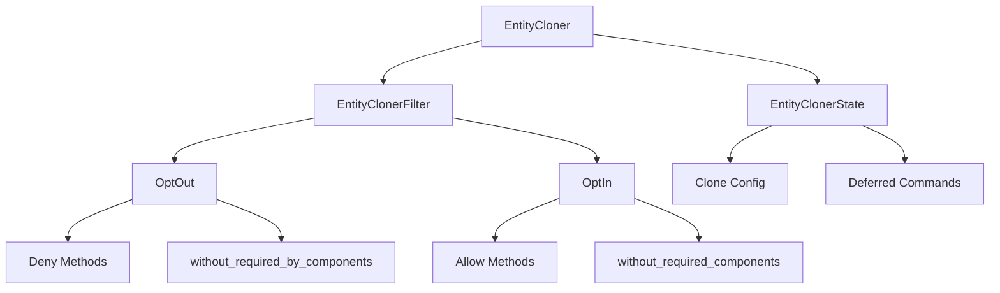

+++
title = "#19649 Split `EntityClonerBuilder` in `OptOut` and `OptIn` variants"
date = "2025-06-24T00:00:00"
draft = false
template = "pull_request_page.html"
in_search_index = true

[taxonomies]
list_display = ["show"]

[extra]
current_language = "en"
available_languages = {"en" = { name = "English", url = "/pull_request/bevy/2025-06/pr-19649-en-20250624" }, "zh-cn" = { name = "中文", url = "/pull_request/bevy/2025-06/pr-19649-zh-cn-20250624" }}
labels = ["C-Bug", "C-Feature", "A-ECS", "C-Code-Quality"]
+++

# Technical Analysis of PR #19649: Split `EntityClonerBuilder` in `OptOut` and `OptIn` variants

## Basic Information
- **Title**: Split `EntityClonerBuilder` in `OptOut` and `OptIn` variants
- **PR Link**: https://github.com/bevyengine/bevy/pull/19649
- **Author**: urben1680
- **Status**: MERGED
- **Labels**: C-Bug, C-Feature, A-ECS, C-Code-Quality, S-Ready-For-Final-Review
- **Created**: 2025-06-15T01:08:37Z
- **Merged**: 2025-06-24T00:39:04Z
- **Merged By**: alice-i-cecile

## Description Translation
The original description is in English and is preserved as-is:

# Objective

Further tests after #19326 showed that configuring `EntityCloner` with required components is bug prone and the current design has several weaknesses in it's API:

- Mixing `EntityClonerBuilder::allow` and `EntityClonerBuilder::deny` requires extra care how to support that which has an impact on surrounding code that has to keep edge cases in mind. This is especially true for attempts to fix the following issues. There is no use-case known (to me) why someone would mix those.
- A builder with `EntityClonerBuilder::allow_all` configuration tries to support required components like `EntityClonerBuilder::deny_all` does, but the meaning of that is conflicting with how you'd expect things to work:
  - If all components should be cloned except component `A`, do you also want to exclude required components of `A` too? Or are these also valid without `A` at the target entity?
  - If `EntityClonerBuilder::allow_all` should ignore required components and not add them to be filtered away, which purpose has `EntityClonerBuilder::without_required_components` for this cloner?
- Other bugs found with the linked PR are:
  - Denying `A` also denies required components of `A` even when `A` does not exist at the source entity
  - Allowing `A` also allows required components of `A` even when `A` does not exist at the source entity
- Adding `allow_if_new` filters to the cloner faces the same issues and require a common solution to dealing with source-archetype sensitive cloning 

Alternative to #19632 and #19635.

# Solution

`EntityClonerBuilder` is made generic and split into `EntityClonerBuilder<OptOut>` and `EntityClonerBuilder<OptIn>`

For an overview of the changes, see the migration guide. It is generally a good idea to start a review of that.

## Algorithm

The generic of `EntityClonerBuilder` contains the filter data that is needed to build and clone the entity components.

As the filter needs to be borrowed mutably for the duration of the clone, the borrow checker forced me to separate the filter value and all other fields in `EntityCloner`. The latter are now in the `EntityClonerConfig` struct. This caused many changed LOC, sorry.

To make reviewing easier:

1. Check the migration guide
2. Many methods of `EntityCloner` now just call identitcal `EntityClonerConfig` methods with a mutable borrow of the filter
3. Check `EntityClonerConfig::clone_entity_internal` which changed a bit regarding the filter usage that is now trait powered (`CloneByFilter`) to support `OptOut`, `OptIn` and `EntityClonerFilter` (an enum combining the first two)
4. Check `OptOut` type that no longer tracks required components but has a `insert_mode` field
5. Check `OptIn` type that has the most logic changes

# Testing

I added a bunch of tests that cover the new logic parts and the fixed issues.

Benchmarks are in a comment a bit below which shows ~4% to 9% regressions, but it varied wildly for me. For example at one run the reflection-based clonings were on-par with main while the other are not, and redoing that swapped the situation for both.

It would be really cool if I could get some hints how to get better benchmark results or if you could run them on your machine too.

Just be aware this is not a Performance PR but a Bugfix PR, even if I smuggled in some more functionalities. So doing changes to `EntityClonerBuilder` is kind of required here which might make us bite the bullet.

## The Story of This Pull Request

### The Problem and Context
The `EntityCloner` API had several design weaknesses that made it error-prone to configure:
1. Mixing `allow` and `deny` methods created complex edge cases
2. Required component handling was inconsistent:
   - `allow_all` configuration tried to handle required components like `deny_all` but with conflicting semantics
   - Denying a component would incorrectly deny its required components even when absent
   - Allowing a component would incorrectly allow its required components even when absent
3. The `allow_if_new` feature inherited these issues

These problems made the API difficult to use correctly and led to subtle bugs. The core issue was that a single configuration interface tried to support two fundamentally different filtering approaches: opt-in (allow-list) and opt-out (deny-list).

### The Solution Approach
The PR splits `EntityClonerBuilder` into two distinct types:
- `EntityClonerBuilder<OptOut>`: Default opt-out behavior (clone all except explicitly denied)
- `EntityClonerBuilder<OptIn>`: Opt-in behavior (clone only explicitly allowed)

Key design decisions:
1. **Separate state tracking**: 
   - `EntityCloner` now holds a filter (`EntityClonerFilter`) and state (`EntityClonerState`)
   - This separation was necessary due to borrow checker constraints during cloning
2. **Trait-based filtering**: 
   - Introduced `CloneByFilter` trait with implementations for both variants
   - `OptOut` uses simple component ID exclusion
   - `OptIn` requires complex dependency tracking for required components
3. **Required component handling**:
   - `OptOut`: Denying a component no longer automatically denies its required components
   - `OptIn`: Added scoped configuration via `without_required_components`
4. **New insertion modes**:
   - Added `InsertMode::Keep` to avoid overwriting existing components
   - `allow_if_new` maps to this insertion mode in the `OptIn` variant

### The Implementation
The core changes occur in `clone_entities.rs` where:
1. `EntityCloner` was refactored into:
   ```rust
   pub struct EntityCloner {
       filter: EntityClonerFilter,
       state: EntityClonerState,
   }
   ```
2. New builder entry points:
   ```rust
   pub fn build_opt_out(world: &mut World) -> EntityClonerBuilder<OptOut>
   pub fn build_opt_in(world: &mut World) -> EntityClonerBuilder<OptIn>
   ```
3. The `OptIn` filter tracks component dependencies:
   ```rust
   struct OptIn {
       allow: HashMap<ComponentId, Explicit>,
       required_of_allow: Vec<ComponentId>,
       required: HashMap<ComponentId, Required>,
       attach_required_components: bool,
   }
   ```
4. Filtering logic was moved to the `CloneByFilter` trait:
   ```rust
   trait CloneByFilter {
       fn clone_components<'a>(...);
   }
   ```

### Technical Insights
1. **Performance Considerations**:
   - Benchmarks showed 4-9% regression in some cases
   - The `OptIn` variant has higher overhead due to dependency tracking
   - Tradeoff accepted since this is primarily a correctness fix
2. **Borrow Checker Challenges**:
   - The mutable filter borrow during cloning necessitated splitting state
   - `LazyCell` was used for archetype lookups to defer computation
3. **Edge Case Handling**:
   - `OptIn` correctly handles partial cloning of required components
   - Counters track required-by relationships to avoid over-cloning
4. **API Clarity**:
   - Separate methods for each variant prevent invalid configurations
   - Explicit method names (`allow` vs `allow_if_new`) improve intent signaling

### The Impact
1. **Fixed Bugs**:
   - Required components are now handled correctly in both variants
   - Source archetype presence is properly respected
   - Component insertion modes work as expected
2. **API Improvements**:
   - Clear separation of concerns between opt-in/opt-out
   - New insertion modes provide finer control
   - Required component configuration is scoped
3. **Migration Path**:
   - Added comprehensive migration guide
   - Deprecated methods replaced with variant-specific alternatives
4. **Test Coverage**:
   - Added 11 new benchmark scenarios
   - Expanded test coverage for edge cases

## Visual Representation



## Key Files Changed

### `crates/bevy_ecs/src/entity/clone_entities.rs` (+962/-372)
Core refactor of the cloning system:
```rust
// Before: Monolithic EntityCloner
pub struct EntityCloner {
    filter_allows_components: bool,
    filter: HashSet<ComponentId>,
    // ... other fields ...
}

// After: Split design
pub struct EntityCloner {
    filter: EntityClonerFilter,
    state: EntityClonerState,
}

pub enum EntityClonerFilter {
    OptOut(OptOut),
    OptIn(OptIn),
}

pub struct EntityClonerState {
    clone_behavior_overrides: HashMap<ComponentId, ComponentCloneBehavior>,
    // ... other config fields ...
}

// New filtering trait
trait CloneByFilter {
    fn clone_components<'a>(...);
}
```

### `benches/benches/bevy_ecs/entity_cloning.rs` (+173/-47)
Added comprehensive filter benchmarking:
```rust
enum FilterScenario {
    OptOutNone,
    OptOutNoneKeep(bool),
    // ... 11 scenarios total ...
}

fn bench_filter<B: Bundle + Default>(
    b: &mut Bencher, 
    scenario: FilterScenario
) {
    // Configures cloner based on scenario
    match scenario {
        FilterScenario::OptOutNone => {
            target = spawn(true);
            cloner = EntityCloner::default();
        }
        // ... other scenarios ...
    }
}
```

### `crates/bevy_ecs/src/world/entity_ref.rs` (+143/-39)
Updated entity methods to use new variants:
```rust
// Before
pub fn clone_with(
    &mut self,
    target: Entity,
    config: impl FnOnce(&mut EntityClonerBuilder),
) -> &mut Self

// After
pub fn clone_with_opt_out(
    &mut self,
    target: Entity,
    config: impl FnOnce(&mut EntityClonerBuilder<OptOut>),
) -> &mut Self

pub fn clone_with_opt_in(
    &mut self,
    target: Entity,
    config: impl FnOnce(&mut EntityClonerBuilder<OptIn>),
) -> &mut Self
```

### `crates/bevy_ecs/src/system/commands/mod.rs` (+113/-24)
Updated commands API:
```rust
// Before
pub fn clone_with(
    target: Entity,
    config: impl FnOnce(&mut EntityClonerBuilder),
) -> impl EntityCommand

// After
pub fn clone_with_opt_out(
    target: Entity,
    config: impl FnOnce(&mut EntityClonerBuilder<OptOut>),
) -> impl EntityCommand

pub fn clone_with_opt_in(
    target: Entity,
    config: impl FnOnce(&mut EntityClonerBuilder<OptIn>),
) -> impl EntityCommand
```

### `release-content/migration-guides/entity_cloner_builder_split.md` (+73/-0)
Added migration guide:
```markdown
## Migration Guide

- `EntityCloner::build` replaced with:
  - `EntityCloner::build_opt_out`
  - `EntityCloner::build_opt_in`
- Method renames:
  - `clone_with` → `clone_with_opt_out`/`clone_with_opt_in`
  - `clone_and_spawn_with` → `clone_and_spawn_with_opt_out`/`clone_and_spawn_with_opt_in`

Example migration:
```rust
// 0.16
EntityCloner::build(&mut world)
    .allow_all()
    .deny::<ComponentA>();

// 0.17
EntityCloner::build_opt_out(&mut world)
    .deny::<ComponentA>();
```

## Further Reading
1. [Entity Component System Architecture](https://en.wikipedia.org/wiki/Entity_component_system)
2. [Bevy ECS Documentation](https://bevyengine.org/learn/book/plugins/ecs/)
3. [Rust Borrow Checker Patterns](https://doc.rust-lang.org/nomicon/lifetimes.html)