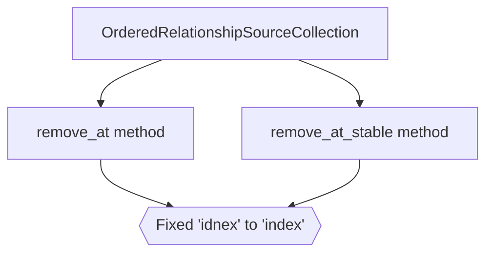

+++
title = "#19651 Fix typos"
date = "2025-06-15T00:00:00"
draft = false
template = "pull_request_page.html"
in_search_index = true

[taxonomies]
list_display = ["show"]

[extra]
current_language = "en"
available_languages = {"en" = { name = "English", url = "/pull_request/bevy/2025-06/pr-19651-en-20250615" }, "zh-cn" = { name = "中文", url = "/pull_request/bevy/2025-06/pr-19651-zh-cn-20250615" }}
labels = ["D-Trivial"]
+++

# Fix typos

## Basic Information
- **Title**: Fix typos
- **PR Link**: https://github.com/bevyengine/bevy/pull/19651
- **Author**: tbillington
- **Status**: MERGED
- **Labels**: D-Trivial, S-Ready-For-Final-Review
- **Created**: 2025-06-15T05:24:42Z
- **Merged**: 2025-06-15T08:07:51Z
- **Merged By**: mockersf

## Description Translation
Minor typo fix

## The Story of This Pull Request

This PR addresses a minor but important issue in Bevy's ECS (Entity Component System) module - specifically in the relationship management functionality. The problem was straightforward: documentation comments for two methods in the `OrderedRelationshipSourceCollection` trait contained spelling errors ("idnex" instead of "index"). 

While not affecting runtime behavior, these typos reduced code clarity and could cause confusion for developers reading or using these APIs. The importance lies in maintaining professional documentation standards and preventing potential misunderstandings during API usage.

The solution approach was direct and localized. The developer identified the misspellings in the method documentation and made surgical corrections. No alternatives were considered since the fix was unambiguous. The implementation required only two character changes across two lines, preserving all surrounding functionality and documentation structure.

These changes maintain the existing architecture and patterns in the relationship management system. The corrections specifically appear in the documentation for the `remove_at` and `remove_at_stable` methods of the `OrderedRelationshipSourceCollection` trait. These methods handle ordered collections of entity relationships, where precise documentation is important since they manage index-based operations.

The impact is improved documentation clarity without any functional changes. Developers working with relationship collections will encounter correctly spelled parameter descriptions, reducing potential confusion. This change exemplifies the importance of attention to detail in documentation, even for minor elements like parameter names.

## Visual Representation



## Key Files Changed

### `crates/bevy_ecs/src/relationship/relationship_source_collection.rs`
- **Changes**: Corrected two documentation typos in method parameter descriptions
- **Why**: To improve code documentation clarity and maintain professionalism
- **Relation to PR**: Directly implements the typo fixes described in the PR

```rust
// Before:
/// Removes the entity at the specified idnex if it exists.
fn remove_at(&mut self, index: usize) -> Option<Entity>;

/// Removes the entity at the specified idnex if it exists.
fn remove_at_stable(&mut self, index: usize) -> Option<Entity>;

// After:
/// Removes the entity at the specified index if it exists.
fn remove_at(&mut self, index: usize) -> Option<Entity>;

/// Removes the entity at the specified index if it exists.
fn remove_at_stable(&mut self, index: usize) -> Option<Entity>;
```

## Further Reading
- [Bevy ECS Relationships Documentation](https://docs.rs/bevy_ecs/latest/bevy_ecs/relationship/index.html)
- [Rust API Documentation Guidelines](https://rust-lang.github.io/api-guidelines/documentation.html)
- [The Importance of Code Comments](https://stackoverflow.blog/2021/12/23/best-practices-for-writing-code-comments/)