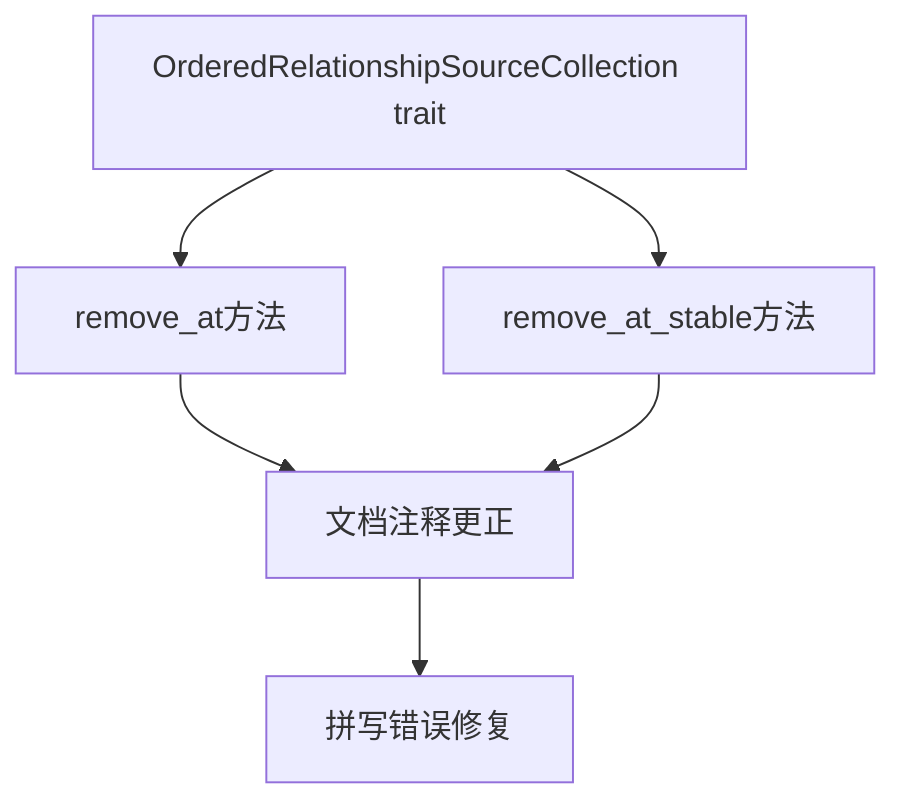

+++
title = "#19651 Fix typos"
date = "2025-06-15T00:00:00"
draft = false
template = "pull_request_page.html"
in_search_index = false

[extra]
current_language = "zh-cn"
available_languages = {"en" = { name = "English", url = "/pull_request/bevy/2025-06/pr-19651-en-20250615" }, "zh-cn" = { name = "中文", url = "/pull_request/bevy/2025-06/pr-19651-zh-cn-20250615" }}
+++

# Fix typos

## 基本信息
- **标题**: Fix typos
- **PR链接**: https://github.com/bevyengine/bevy/pull/19651
- **作者**: tbillington
- **状态**: 已合并
- **标签**: D-Trivial, S-Ready-For-Final-Review
- **创建时间**: 2025-06-15T05:24:42Z
- **合并时间**: 2025-06-15T08:07:51Z
- **合并人**: mockersf

## 描述翻译
修复拼写错误

## PR技术分析

### 问题背景
在审查`bevy_ecs`模块的源代码时，作者发现`OrderedRelationshipSourceCollection` trait 的文档注释中存在两处拼写错误。具体问题出现在`remove_at`和`remove_at_stable`方法的注释中，单词"index"被错误拼写为"idnex"。这种文档注释中的拼写错误虽然不影响代码执行，但会降低代码可读性和专业性，可能给阅读源码的开发者造成困惑。

### 解决方案
解决方案直接明了：将两处"idnex"更正为"index"。这种修改属于典型的文档维护工作：
1. 不需要改动任何功能代码
2. 不涉及API变更
3. 不影响现有测试用例
4. 不改变任何逻辑行为

拼写错误出现在trait方法的文档注释中，这些注释对使用ECS关系系统的开发者有重要参考价值。正确的拼写确保开发者能准确理解方法功能，特别是当他们在集成或扩展`OrderedRelationshipSourceCollection`功能时。

### 技术实现
修改集中在`relationship_source_collection.rs`文件中，针对两个方法的文档注释：
```rust
// 修改前:
/// Removes the entity at the specified idnex if it exists.
fn remove_at(&mut self, index: usize) -> Option<Entity>;

/// Removes the entity at the specified idnex if it exists.
fn remove_at_stable(&mut self, index: usize) -> Option<Entity>;
```

```rust
// 修改后:
/// Removes the entity at the specified index if it exists.
fn remove_at(&mut self, index: usize) -> Option<Entity>;

/// Removes the entity at the specified index if it exists.
fn remove_at_stable(&mut self, index: usize) -> Option<Entity>;
```

### 影响分析
该修改带来的主要影响包括：
1. **可读性提升**：文档注释拼写更正后更易于理解
2. **专业性维护**：保持代码库的文档质量标准
3. **开发体验优化**：避免开发者因拼写错误产生困惑
4. **贡献流程示范**：展示如何通过简单有效的贡献改进项目

这类修改被标记为"D-Trivial"(琐碎级难度)是合理的，因为不涉及复杂逻辑变更。PR在创建后约2.5小时内被合并，表明维护团队认可这类文档改进的价值。

## 视觉表示


## 关键文件变更

### crates/bevy_ecs/src/relationship/relationship_source_collection.rs
**修改说明**：修复`OrderedRelationshipSourceCollection` trait中两个方法的文档注释拼写错误

**代码变更**：
```diff
@@ -86,13 +86,13 @@ pub trait OrderedRelationshipSourceCollection: RelationshipSourceCollection {
     /// Inserts the entity at a specific index.
     /// If the index is too large, the entity will be added to the end of the collection.
     fn insert(&mut self, index: usize, entity: Entity);
-    /// Removes the entity at the specified idnex if it exists.
+    /// Removes the entity at the specified index if it exists.
     fn remove_at(&mut self, index: usize) -> Option<Entity>;
     /// Inserts the entity at a specific index.
     /// This will never reorder other entities.
     /// If the index is too large, the entity will be added to the end of the collection.
     fn insert_stable(&mut self, index: usize, entity: Entity);
-    /// Removes the entity at the specified idnex if it exists.
+    /// Removes the entity at the specified index if it exists.
     /// This will never reorder other entities.
     fn remove_at_stable(&mut self, index: usize) -> Option<Entity>;
     /// Sorts the source collection.
```

## 延伸阅读
1. [Rust文档注释规范](https://doc.rust-lang.org/rustdoc/how-to-write-documentation.html)
2. [Bevy ECS关系系统设计](https://bevyengine.org/learn/book/next/ecs/relationships/)
3. [开源项目贡献指南](https://opensource.guide/how-to-contribute/)
4. [代码可读性最佳实践](https://github.com/microsoft/api-guidelines/blob/vNext/Guidelines.md#57-documentation)