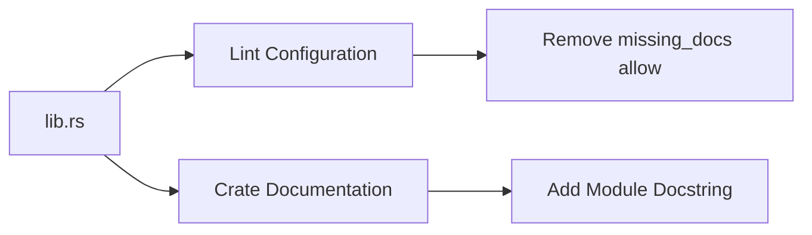

+++
title = "#19654 deny(missing_docs) for bevy_mikktspace"
date = "2025-06-15T00:00:00"
draft = false
template = "pull_request_page.html"
in_search_index = true

[taxonomies]
list_display = ["show"]

[extra]
current_language = "en"
available_languages = {"en" = { name = "English", url = "/pull_request/bevy/2025-06/pr-19654-en-20250615" }, "zh-cn" = { name = "中文", url = "/pull_request/bevy/2025-06/pr-19654-zh-cn-20250615" }}
labels = ["C-Docs", "D-Trivial"]
+++

## Technical Analysis of PR #19654: deny(missing_docs) for bevy_mikktspace

### Basic Information
- **Title**: deny(missing_docs) for bevy_mikktspace  
- **PR Link**: https://github.com/bevyengine/bevy/pull/19654  
- **Author**: theotherphil  
- **Status**: MERGED  
- **Labels**: C-Docs, D-Trivial, S-Ready-For-Final-Review  
- **Created**: 2025-06-15T13:41:38Z  
- **Merged**: 2025-06-15T17:10:23Z  
- **Merged By**: alice-i-cecile  

### Description Translation
**Objective**  
Remove `allow(missing_docs)` from `bevy_mikktspace` and add a simple top-level doc comment, towards https://github.com/bevyengine/bevy/issues/3492  

### The Story of This Pull Request

#### The Problem and Context
Bevy has an ongoing initiative (issue #3492) to enforce documentation standards across its codebase by removing `allow(missing_docs)` attributes. These attributes suppress compiler warnings for undocumented public APIs, which can lead to reduced code maintainability and discoverability. The `bevy_mikktspace` crate was explicitly allowing missing documentation via an `#![allow(missing_docs)]` attribute, accompanied by a `FIXME` comment indicating technical debt related to CI failures. This exception needed removal to align with Bevy's documentation standards.

#### The Solution Approach
The solution involved two coordinated changes:  
1. Removing the `allow(missing_docs)` lint exception to enforce documentation requirements  
2. Adding minimal top-level crate documentation to satisfy the newly enforced lint  

This approach resolves the immediate issue without requiring comprehensive documentation overhaul. The crate's purpose is clearly stated while maintaining focus on the primary goal of lint enforcement.

#### The Implementation
The changes exclusively target `lib.rs`:
1. **Lint Configuration Adjustment**:  
   The `#![allow(...)]` attribute is modified to remove `missing_docs` and its associated `FIXME` comment. This activates the `deny(missing_docs)` behavior implicitly through Bevy's project-wide lints.

2. **Crate Documentation**:  
   A concise module-level doc comment is added using `//!` syntax. It describes the crate's purpose and links to Mikkelsen's algorithm documentation:
   ```rust
   //! An implementation of [Mikkelsen's algorithm] for tangent space generation.
   //!
   //! [Mikkelsen's algorithm]: http://www.mikktspace.com
   ```

#### Technical Insights
- **Lint Cascade**: Removing `allow(missing_docs)` subjects the crate to Bevy's root `deny(missing_docs)` configuration. This leverages Rust's lint inheritance system where child modules inherit parent lint levels unless overridden.  
- **Documentation Minimalism**: The added documentation follows Rust's best practices by:  
  - Providing a brief purpose statement  
  - Linking to external authoritative resources  
  - Using semantic line breaks for readability  
- **Technical Debt Resolution**: The removed `FIXME(15321)` comment indicates resolution of prior CI issues, likely related to intermediate lint states during earlier refactors.

#### The Impact
- **Immediate Effect**: Public API documentation is now enforced at compile-time for `bevy_mikktspace`  
- **Codebase Consistency**: Advances Bevy's documentation initiative by eliminating a lint exception  
- **Maintainability**: The top-level doc comment provides crucial context for future contributors  
- **Technical Debt Reduction**: Resolves a documented `FIXME` regarding CI/lint configuration  

### Visual Representation


### Key Files Changed

#### `crates/bevy_mikktspace/src/lib.rs` (+5/-3)
**Changes**:  
1. Removed `allow(missing_docs)` exception and associated FIXME comment  
2. Added crate-level documentation  

**Code Comparison**:  
```rust
// Before:
#![allow(
    unsafe_op_in_unsafe_fn,
    clippy::all,
    clippy::undocumented_unsafe_blocks,
    clippy::ptr_cast_constness,
    // FIXME(15321): solve CI failures, then replace with `#![expect()]`.
    missing_docs
)]

// After:
#![allow(
    unsafe_op_in_unsafe_fn,
    clippy::all,
    clippy::undocumented_unsafe_blocks,
    clippy::ptr_cast_constness
)]

//! An implementation of [Mikkelsen's algorithm] for tangent space generation.
//!
//! [Mikkelsen's algorithm]: http://www.mikktspace.com
```

**Relationship to PR Goal**:  
The changes directly implement the PR's objective by enforcing documentation requirements (`deny(missing_docs)`) while providing minimal required documentation to satisfy the linter.

### Further Reading
1. [Rust Documentation Guidelines](https://rust-lang.github.io/api-guidelines/documentation.html)  
2. [Bevy's Documentation Initiative (#3492)](https://github.com/bevyengine/bevy/issues/3492)  
3. [Mikkelsen's Tangent Space Algorithm](http://www.mikktspace.com)  
4. [Rust Lint Levels Explained](https://doc.rust-lang.org/rustc/lints/levels.html)