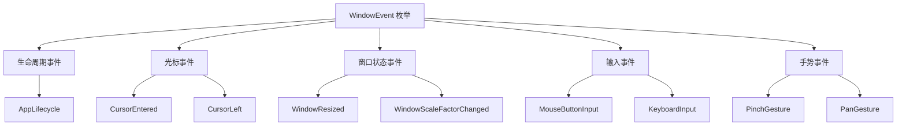

+++
title = "#19655 deny(missing_docs) for bevy_window"
date = "2025-06-19T00:00:00"
draft = false
template = "pull_request_page.html"
in_search_index = false

[extra]
current_language = "zh-cn"
available_languages = {"en" = { name = "English", url = "/pull_request/bevy/2025-06/pr-19655-en-20250619" }, "zh-cn" = { name = "中文", url = "/pull_request/bevy/2025-06/pr-19655-zh-cn-20250619" }}
+++

## deny(missing_docs) for bevy_window

### 基本信息
- **标题**: deny(missing_docs) for bevy_window
- **PR链接**: https://github.com/bevyengine/bevy/pull/19655
- **作者**: theotherphil
- **状态**: 已合并
- **标签**: C-Docs, D-Trivial, S-Ready-For-Final-Review
- **创建时间**: 2025-06-15T14:02:02Z
- **合并时间**: 2025-06-19T19:53:10Z
- **合并者**: alice-i-cecile

### 描述翻译
# 目标 (Objective)

编写更多的模板式文档（boilerplate-y docs），以便让一个 crate 更接近解决 https://github.com/bevyengine/bevy/issues/3492。

### PR 技术分析

#### 问题背景
在 Bevy 引擎的代码质量改进计划中（跟踪于 issue #3492），`bevy_window` crate 存在一个技术债务：`WindowEvent` 枚举的多数组件缺少文档注释。这违反了 Rust 的最佳实践，也影响了代码可维护性。具体表现在：

1. `WindowEvent` 枚举的所有变体都标记了 `#[expect(missing_docs)]` 属性，主动压制了 missing_docs lint 警告
2. 开发者无法通过文档快速理解各事件变体的用途和语义
3. 阻碍了 `deny(missing_docs)` 的全面启用，这是 Bevy 代码库的长期质量目标

#### 解决方案
通过系统化的文档补充解决该问题：
1. 移除压制 lint 的 `#[expect(missing_docs)]` 属性
2. 为 `WindowEvent` 的每个变体添加精确的单行或多行文档注释
3. 保持原有枚举结构和变体命名不变
4. 文档内容聚焦于解释事件的实际语义和使用场景

技术决策依据：
- **最小化变更**：仅添加文档，不修改任何功能代码
- **语义精确**：每个文档注释准确描述对应事件的行为
- **上下文补充**：对特殊用例(如 `KeyboardFocusLost`)添加额外解释

#### 实现细节
核心改动在 `event.rs` 文件中，涉及 `WindowEvent` 枚举的改造：
```rust
// 修改前：
#[expect(missing_docs, reason = "Not all docs are written yet, see #3492.")]
pub enum WindowEvent {
    AppLifecycle(AppLifecycle),
    CursorEntered(CursorEntered),
    // ...其他变体均无文档...
}

// 修改后：
pub enum WindowEvent {
    /// 应用生命周期事件
    AppLifecycle(AppLifecycle),
    
    /// 用户光标进入窗口
    CursorEntered(CursorEntered),
    
    /// 用户光标离开窗口
    CursorLeft(CursorLeft),
    
    // ...其他变体均添加类似文档...
    
    /// 所有Bevy窗口失去焦点时发送
    ///
    /// 用于清除已按下按键的状态
    KeyboardFocusLost(KeyboardFocusLost),
}
```
关键改进点：
1. **移除 lint 压制**：删除 `#[expect(missing_docs)]` 属性，使文档要求强制执行
2. **事件分类文档**：
   - 输入事件 (如 `MouseButtonInput`)
   - 手势事件 (如 `PinchGesture`)
   - 窗口状态事件 (如 `WindowResized`)
3. **特殊用例说明**：对需要额外解释的变体(如 `KeyboardFocusLost`)添加多行注释

#### 技术影响
1. **代码质量提升**：`bevy_window` crate 现在完全符合 `deny(missing_docs)` 要求
2. **开发体验改善**：开发者可通过文档直接理解各事件语义，无需查阅源码
3. **进度推进**：向解决 issue #3492 (全代码库文档化) 迈出具体一步
4. **模式示范**：为其他 crate 的类似文档工作提供了可复用的模式

潜在改进方向：
- 未来可扩展为更详细的示例代码和用法说明
- 考虑将事件文档与 Bevy 官方文档系统集成

### 可视化表示



### 关键文件变更

#### `crates/bevy_window/src/event.rs`
**变更说明**：为 `WindowEvent` 枚举的所有变体添加文档注释，并移除缺失文档的 lint 例外标记

**代码变更**：
```diff
@@ -502,38 +502,66 @@ impl AppLifecycle {
     all(feature = "serialize", feature = "bevy_reflect"),
     reflect(Serialize, Deserialize)
 )]
-#[expect(missing_docs, reason = "Not all docs are written yet, see #3492.")]
 pub enum WindowEvent {
+    /// An application lifecycle event.
     AppLifecycle(AppLifecycle),
+    /// The user's cursor has entered a window.
     CursorEntered(CursorEntered),
+    ///The user's cursor has left a window.
     CursorLeft(CursorLeft),
+    /// The user's cursor has moved inside a window.
     CursorMoved(CursorMoved),
+    /// A file drag and drop event.
     FileDragAndDrop(FileDragAndDrop),
+    /// An Input Method Editor event.
     Ime(Ime),
+    /// A redraw of all of the application's windows has been requested.
     RequestRedraw(RequestRedraw),
+    /// The window's OS-reported scale factor has changed.
     WindowBackendScaleFactorChanged(WindowBackendScaleFactorChanged),
+    /// The OS has requested that a window be closed.
     WindowCloseRequested(WindowCloseRequested),
+    /// A new window has been created.
     WindowCreated(WindowCreated),
+    /// A window has been destroyed by the underlying windowing system.
     WindowDestroyed(WindowDestroyed),
+    /// A window has received or lost focus.
     WindowFocused(WindowFocused),
+    /// A window has been moved.
     WindowMoved(WindowMoved),
+    /// A window has started or stopped being occluded.
     WindowOccluded(WindowOccluded),
+    /// A window's logical size has changed.
     WindowResized(WindowResized),
+    /// A window's scale factor has changed.
     WindowScaleFactorChanged(WindowScaleFactorChanged),
+    /// Sent for windows that are using the system theme when the system theme changes.
     WindowThemeChanged(WindowThemeChanged),
 
+    /// The state of a mouse button has changed.
     MouseButtonInput(MouseButtonInput),
+    /// The physical position of a pointing device has changed.
     MouseMotion(MouseMotion),
+    /// The mouse wheel has moved.
     MouseWheel(MouseWheel),
 
+    /// A two finger pinch gesture.
     PinchGesture(PinchGesture),
+    /// A two finger rotation gesture.
     RotationGesture(RotationGesture),
+    /// A double tap gesture.
     DoubleTapGesture(DoubleTapGesture),
+    /// A pan gesture.
     PanGesture(PanGesture),
 
+    /// A touch input state change.
     TouchInput(TouchInput),
 
+    /// A keyboard input.
     KeyboardInput(KeyboardInput),
+    /// Sent when focus has been lost for all Bevy windows.
+    ///
+    /// Used to clear pressed key state.
     KeyboardFocusLost(KeyboardFocusLost),
 }
```

### 延伸阅读
1. [Rust 文档注释指南](https://doc.rust-lang.org/rustdoc/how-to-write-documentation.html)
2. [Bevy 代码文档化计划 (#3492)](https://github.com/bevyengine/bevy/issues/3492)
3. [Rust lint 机制详解](https://doc.rust-lang.org/rustc/lints/index.html)
4. [Bevy 事件系统架构](https://bevy-cheatbook.github.io/programming/events.html)