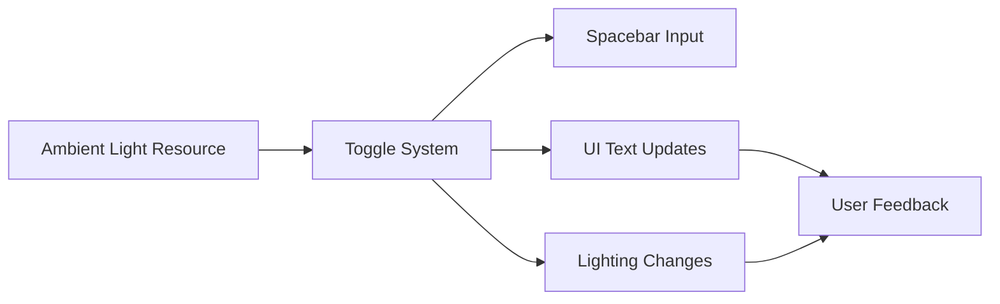

+++
title = "#19658 lighting.rs example: Improved ambient light showcase"
date = "2025-06-15T00:00:00"
draft = false
template = "pull_request_page.html"
in_search_index = true

[taxonomies]
list_display = ["show"]

[extra]
current_language = "en"
available_languages = {"en" = { name = "English", url = "/pull_request/bevy/2025-06/pr-19658-en-20250615" }, "zh-cn" = { name = "中文", url = "/pull_request/bevy/2025-06/pr-19658-zh-cn-20250615" }}
labels = ["A-Rendering", "C-Examples", "M-Deliberate-Rendering-Change"]
+++

## Title  
lighting.rs example: Improved ambient light showcase  

## Basic Information  
- **Title**: lighting.rs example: Improved ambient light showcase  
- **PR Link**: https://github.com/bevyengine/bevy/pull/19658  
- **Author**: RosyArts  
- **Status**: MERGED  
- **Labels**: A-Rendering, C-Examples, S-Ready-For-Final-Review, M-Deliberate-Rendering-Change  
- **Created**: 2025-06-15T15:04:01Z  
- **Merged**: 2025-06-15T17:10:23Z  
- **Merged By**: alice-i-cecile  

## Description Translation  
# Objective  

As someone who is currently learning Bevy, I found the implementation of the ambient light in the 3d/lighting.rs example unsatisfactory.   

## Solution  

- I adjusted the brightness of the ambient light in the scene to 200 (where the default is 80). It was previously 0.02, a value so low it has no noticeable effect.  
- I added a keybind (space bar) to toggle the ambient light, allowing users to see the difference it makes. I also added text showing the state of the ambient light (on, off) and text showing the keybind.  

I'm very new to Bevy and Rust, so apologies if any of this code is not up to scratch.  

## Testing  

I checked all the text still updates correctly and all keybinds still work. In my testing, it looks to work okay.  
I'd appreciate others testing too, just to make sure.   

---  

## Showcase  

<details>  
  <summary>Click to view showcase</summary>  
  
  
</details>  

## The Story of This Pull Request  

The lighting example in Bevy's 3D showcase had an issue where its ambient light was practically invisible. The ambient light brightness was set to 0.02 – a value too low to produce any noticeable effect in the scene. This undermined the example's educational purpose, as users couldn't observe how ambient light contributes to overall scene illumination.  

To address this, the PR author made two key changes: First, they increased the ambient light brightness to 200.0, a value that produces clear visual impact. Second, they implemented a toggle system bound to the space key, allowing users to dynamically compare scenes with and without ambient light. This approach provides immediate visual feedback about ambient light's contribution.  

The implementation required modifications to both the scene setup and UI systems. The ambient light resource initialization was updated with the new brightness value, and a new `toggle_ambient_light` system was added to the Update schedule. This system checks for spacebar presses and swaps the ambient light brightness between 0 (off) and 200 (on). The UI text was reorganized to display the ambient light state and new control instructions, requiring adjustments to text indexing in the exposure update system.  

The changes demonstrate effective use of Bevy's ECS patterns. The ambient light resource is cleanly modified through a `ResMut<AmbientLight>` parameter, while the UI updates leverage Bevy's text writer component. The solution maintains the example's educational focus by making previously invisible lighting mechanics observable and interactive.  

## Visual Representation  


## Key Files Changed  

### `examples/3d/lighting.rs` (+38/-5)  
1. **Ambient light initialization**: Increased brightness from negligible to visible level  
```rust
// Before:
commands.insert_resource(AmbientLight {
    color: ORANGE_RED.into(),
    brightness: 0.02,
    ..default()
});

// After:
commands.insert_resource(AmbientLight {
    color: ORANGE_RED.into(),
    brightness: 200.0,
    ..default()
});
```

2. **System registration**: Added new toggle system to Update schedule  
```rust
// Before:
.add_systems(Update, (update_exposure, movement, animate_light_direction))

// After:
.add_systems(
    Update,
    (
        update_exposure,
        toggle_ambient_light, // New system
        movement,
        animate_light_direction,
    ),
)
```

3. **UI modifications**: Added ambient light status and control instructions  
```rust
// Text layout changes:
children![
    TextSpan::new("Ambient light is on\n"), // New status line
    TextSpan(format!("Aperture: f/{:.0}\n", parameters.aperture_f_stops,)),
    // ... existing lines ...
    TextSpan::new("Space - Toggle ambient light\n"), // New control line
]
```

4. **New toggle system**: Handles input and updates state  
```rust
fn toggle_ambient_light(
    key_input: Res<ButtonInput<KeyCode>>,
    mut ambient_light: ResMut<AmbientLight>,
    text: Single<Entity, With<Text>>,
    mut writer: TextUiWriter,
) {
    if key_input.just_pressed(KeyCode::Space) {
        // Toggle between 0 (off) and 200 (on)
        if ambient_light.brightness > 1. {
            ambient_light.brightness = 0.;
        } else {
            ambient_light.brightness = 200.;
        }
        
        // Update UI text
        let entity = *text;
        let ambient_light_state_text: &str = match ambient_light.brightness {
            0. => "off",
            _ => "on",
        };
        *writer.text(entity, 1) = format!("Ambient light is {}\n", ambient_light_state_text);
    }
}
```

## Further Reading  
- [Bevy Lighting Documentation](https://bevyengine.org/learn/book/next/pbr/lighting/)  
- [Bevy Input Handling Guide](https://bevyengine.org/learn/book/next/input/)  
- [Physically Based Rendering Theory](https://en.wikipedia.org/wiki/Physically_based_rendering)  

# Full Code Diff  
```diff
diff --git a/examples/3d/lighting.rs b/examples/3d/lighting.rs
index b8d7883763019..100816feb6f53 100644
--- a/examples/3d/lighting.rs
+++ b/examples/3d/lighting.rs
@@ -20,7 +20,15 @@ fn main() {
             sensor_height: 0.01866,
         }))
         .add_systems(Startup, setup)
-        .add_systems(Update, (update_exposure, movement, animate_light_direction))
+        .add_systems(
+            Update,
+            (
+                update_exposure,
+                toggle_ambient_light,
+                movement,
+                animate_light_direction,
+            ),
+        )
         .run();
 }
 
@@ -111,9 +119,10 @@ fn setup(
     ));
 
     // ambient light
+    // ambient lights' brightnesses are measured in candela per meter square, calculable as (color * brightness)
     commands.insert_resource(AmbientLight {
         color: ORANGE_RED.into(),
-        brightness: 0.02,
+        brightness: 200.0,
         ..default()
     });
 
@@ -211,6 +220,7 @@ fn setup(
             ..default()
         },
         children![
+            TextSpan::new("Ambient light is on\n"),
             TextSpan(format!("Aperture: f/{:.0}\n", parameters.aperture_f_stops,)),
             TextSpan(format!(
                 "Shutter speed: 1/{:.0}s\n",
@@ -224,6 +234,7 @@ fn setup(
             TextSpan::new("Controls\n"),
             TextSpan::new("---------------\n"),
             TextSpan::new("Arrow keys - Move objects\n"),
+            TextSpan::new("Space - Toggle ambient light\n"),
             TextSpan::new("1/2 - Decrease/Increase aperture\n"),
             TextSpan::new("3/4 - Decrease/Increase shutter speed\n"),
             TextSpan::new("5/6 - Decrease/Increase sensitivity\n"),
@@ -267,16 +278,38 @@ fn update_exposure(
         *parameters = Parameters::default();
     }
 
-    *writer.text(entity, 1) = format!("Aperture: f/{:.0}\n", parameters.aperture_f_stops);
-    *writer.text(entity, 2) = format!(
+    *writer.text(entity, 2) = format!("Aperture: f/{:.0}\n", parameters.aperture_f_stops);
+    *writer.text(entity, 3) = format!(
         "Shutter speed: 1/{:.0}s\n",
         1.0 / parameters.shutter_speed_s
     );
-    *writer.text(entity, 3) = format!("Sensitivity: ISO {:.0}\n", parameters.sensitivity_iso);
+    *writer.text(entity, 4) = format!("Sensitivity: ISO {:.0}\n", parameters.sensitivity_iso);
 
     **exposure = Exposure::from_physical_camera(**parameters);
 }
 
+fn toggle_ambient_light(
+    key_input: Res<ButtonInput<KeyCode>>,
+    mut ambient_light: ResMut<AmbientLight>,
+    text: Single<Entity, With<Text>>,
+    mut writer: TextUiWriter,
+) {
+    if key_input.just_pressed(KeyCode::Space) {
+        if ambient_light.brightness > 1. {
+            ambient_light.brightness = 0.;
+        } else {
+            ambient_light.brightness = 200.;
+        }
+
+        let entity = *text;
+        let ambient_light_state_text: &str = match ambient_light.brightness {
+            0. => "off",
+            _ => "on",
+        };
+        *writer.text(entity, 1) = format!("Ambient light is {}\n", ambient_light_state_text);
+    }
+}
+
 fn animate_light_direction(
     time: Res<Time>,
     mut query: Query<&mut Transform, With<DirectionalLight>>,
```