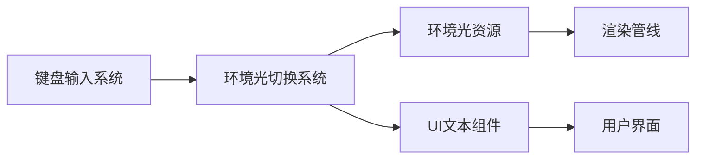

+++
title = "#19658 lighting.rs example: Improved ambient light showcase"
date = "2025-06-15T00:00:00"
draft = false
template = "pull_request_page.html"
in_search_index = false

[extra]
current_language = "zh-cn"
available_languages = {"en" = { name = "English", url = "/pull_request/bevy/2025-06/pr-19658-en-20250615" }, "zh-cn" = { name = "中文", url = "/pull_request/bevy/2025-06/pr-19658-zh-cn-20250615" }}
+++

# lighting.rs示例：改进的环境光展示

## 基本信息
- **标题**: lighting.rs example: Improved ambient light showcase
- **PR链接**: https://github.com/bevyengine/bevy/pull/19658
- **作者**: RosyArts
- **状态**: 已合并
- **标签**: A-Rendering, C-Examples, S-Ready-For-Final-Review, M-Deliberate-Rendering-Change
- **创建时间**: 2025-06-15T15:04:01Z
- **合并时间**: 2025-06-15T17:10:23Z
- **合并人**: alice-i-cecile

## 描述翻译
### 目标
作为正在学习Bevy的用户，我发现3d/lighting.rs示例中环境光(ambient light)的实现效果不理想。

### 解决方案
- 将场景中环境光的亮度调整为200（默认值为80）。之前的值0.02过低，几乎没有任何视觉效果。
- 添加按键绑定（空格键）用于切换环境光开关状态，让用户能直观看到环境光的影响差异。
- 添加文本显示当前环境光状态（开启/关闭）和对应的按键绑定说明。

我是Bevy和Rust的新手，如果代码有任何不足，敬请谅解。

### 测试
我验证了所有文本都能正确更新，所有按键绑定功能正常。在我的测试中运行良好。
建议其他开发者协助测试验证。

---

### 效果展示
<details>
  <summary>点击查看效果</summary>


</details>

## 本次PR的技术分析

### 问题背景
在Bevy的3D光照示例(`lighting.rs`)中，环境光(ambient light)的实现存在两个主要问题：
1. **亮度值过低**：原环境光亮度设置为0.02，远低于有效视觉阈值（默认值80），导致环境光在场景中几乎不可见
2. **缺乏交互演示**：用户无法直观比较开启/关闭环境光时的渲染差异，降低了示例的教学价值

环境光作为基础光照模型的关键组件，其效果演示对于理解全局光照概念至关重要。原实现未能有效展示环境光对场景的贡献，影响了示例的教育意义。

### 解决方案设计
PR采用直接有效的改进方案：
1. **调整环境光亮度**：将`brightness`值从0.02提升到200.0，使其达到可见水平
2. **添加交互控制**：
   - 引入空格键切换功能
   - 添加实时状态显示文本
   - 更新操作说明文档

技术实现上保持最小化修改原则，通过新增独立系统`toggle_ambient_light`处理交互逻辑，避免污染现有功能。

### 关键技术实现
核心修改集中在三方面：

**1. 环境光参数调整**
```rust
// Before:
commands.insert_resource(AmbientLight {
    color: ORANGE_RED.into(),
    brightness: 0.02,  // 无效值
    ..default()
});

// After:
commands.insert_resource(AmbientLight {
    color: ORANGE_RED.into(),
    brightness: 200.0,  // 有效可见值
    ..default()
});
```
添加了单位说明注释：`// ambient lights' brightnesses are measured in candela per meter square, calculable as (color * brightness)`，帮助理解物理光照模型。

**2. 交互控制系统**
新增`toggle_ambient_light`系统：
```rust
fn toggle_ambient_light(
    key_input: Res<ButtonInput<KeyCode>>,
    mut ambient_light: ResMut<AmbientLight>,
    text: Single<Entity, With<Text>>,
    mut writer: TextUiWriter,
) {
    if key_input.just_pressed(KeyCode::Space) {
        // 切换逻辑
        if ambient_light.brightness > 1. {
            ambient_light.brightness = 0.;
        } else {
            ambient_light.brightness = 200.;
        }
        
        // 更新UI文本
        let entity = *text;
        let ambient_light_state_text: &str = match ambient_light.brightness {
            0. => "off",
            _ => "on",
        };
        *writer.text(entity, 1) = format!("Ambient light is {}\n", ambient_light_state_text);
    }
}
```
该系统实现了：
- 空格键事件检测
- 环境光资源动态修改
- 文本组件实时更新

**3. UI与系统集成**
```rust
// 文本内容更新
children![
    TextSpan::new("Ambient light is on\n"),  // 新增状态行
    TextSpan(format!("Aperture: f/{:.0}\n", parameters.aperture_f_stops,)),
    ...
]

// 操作说明新增
TextSpan::new("Space - Toggle ambient light\n"),

// 系统调度注册
.add_systems(
    Update,
    (
        update_exposure,
        toggle_ambient_light,  // 新增系统
        movement,
        animate_light_direction,
    ),
)
```

### 技术细节处理
1. **文本索引调整**：因新增首行文本，后续文本索引全部+1
   ```rust
   // Before:
   *writer.text(entity, 1) = format!("Aperture...");
   
   // After:
   *writer.text(entity, 2) = format!("Aperture...");
   ```
   
2. **状态机设计**：使用简单阈值比较实现开关切换
   ```rust
   if ambient_light.brightness > 1. {
       ambient_light.brightness = 0.;  // 关闭
   } else {
       ambient_light.brightness = 200.;  // 开启
   }
   ```

3. **资源安全访问**：通过`ResMut<AmbientLight>`确保线程安全的环境光资源修改

### 影响与价值
1. **教学价值提升**：通过可视化对比，清晰展示环境光对场景的贡献
2. **交互体验改进**：用户可主动探索不同光照状态的效果
3. **物理单位明确**：添加的注释帮助理解光照参数计算方式
4. **代码质量保持**：修改范围控制在单一文件，新增系统与原有逻辑解耦

## 可视化表示



## 关键文件变更

### `examples/3d/lighting.rs`
**变更描述**：改进环境光展示效果，添加交互控制功能

**核心修改**：
```rust
// 环境光亮度调整
// Before:
commands.insert_resource(AmbientLight {
    color: ORANGE_RED.into(),
    brightness: 0.02,
    ..default()
});

// After:
commands.insert_resource(AmbientLight {
    color: ORANGE_RED.into(),
    brightness: 200.0,
    ..default()
});

// 新增环境光切换系统
fn toggle_ambient_light(
    key_input: Res<ButtonInput<KeyCode>>,
    mut ambient_light: ResMut<AmbientLight>,
    text: Single<Entity, With<Text>>,
    mut writer: TextUiWriter,
) {
    if key_input.just_pressed(KeyCode::Space) {
        if ambient_light.brightness > 1. {
            ambient_light.brightness = 0.;
        } else {
            ambient_light.brightness = 200.;
        }

        let entity = *text;
        let ambient_light_state_text: &str = match ambient_light.brightness {
            0. => "off",
            _ => "on",
        };
        *writer.text(entity, 1) = format!("Ambient light is {}\n", ambient_light_state_text);
    }
}

// UI文本更新
// Before:
children![
    TextSpan(format!("Aperture: f/{:.0}\n", parameters.aperture_f_stops,)),
    ...
]

// After:
children![
    TextSpan::new("Ambient light is on\n"),  // 新增状态显示
    TextSpan(format!("Aperture: f/{:.0}\n", parameters.aperture_f_stops,)),
    ...
    TextSpan::new("Space - Toggle ambient light\n"),  // 新增操作提示
]

// 系统注册
// Before:
.add_systems(Update, (update_exposure, movement, animate_light_direction))

// After:
.add_systems(Update, (update_exposure, toggle_ambient_light, movement, animate_light_direction))
```

## 扩展阅读
1. [Bevy光照系统文档](https://bevyengine.org/learn/book/features/3d-lighting/)
2. [物理光照模型基础](https://learnopengl.com/Lighting/Basic-Lighting)
3. [Bevy ECS系统设计模式](https://bevyengine.org/learn/book/programming/ecs/system-design/)
4. [交互式示例开发指南](https://github.com/bevyengine/bevy/blob/main/examples/README.md)