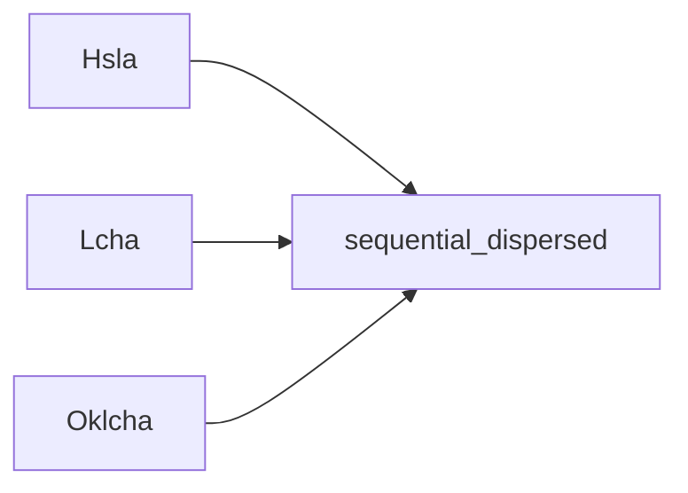

+++
title = "#19659 Make sequential_dispersed fn constant"
date = "2025-06-15T00:00:00"
draft = false
template = "pull_request_page.html"
in_search_index = true

[taxonomies]
list_display = ["show"]

[extra]
current_language = "en"
available_languages = {"en" = { name = "English", url = "/pull_request/bevy/2025-06/pr-19659-en-20250615" }, "zh-cn" = { name = "中文", url = "/pull_request/bevy/2025-06/pr-19659-zh-cn-20250615" }}
labels = ["D-Trivial", "C-Usability", "A-Color"]
+++

## Title: Make sequential_dispersed fn constant

## Basic Information
- **Title**: Make sequential_dispersed fn constant
- **PR Link**: https://github.com/bevyengine/bevy/pull/19659
- **Author**: alice-i-cecile
- **Status**: MERGED
- **Labels**: D-Trivial, C-Usability, S-Ready-For-Final-Review, A-Color
- **Created**: 2025-06-15T16:36:08Z
- **Merged**: 2025-06-15T17:22:22Z
- **Merged By**: alice-i-cecile

## Description Translation
# Objective

- Try to make more of `bevy_color` const now that we have const_float_arithmetic.

## Solution

Fail abjectly, because of our heavy use of traits.

I did find these functions though, so you can have a PR 🙃 

## The Story of This Pull Request

The developer recognized an opportunity to leverage Rust's const_float_arithmetic feature to make color functions in bevy_color usable at compile time. This would allow defining constant color palettes directly in code without runtime initialization. However, most color operations rely on traits that aren't yet supported in const contexts, limiting what could be converted.

The developer identified three functions - `sequential_dispersed` in the Hsla, Lcha, and Oklcha color spaces - that could be made const. These functions generate perceptually distinct hues using the golden ratio method, which relies only on basic arithmetic operations already supported in const contexts. No trait implementations were involved in their calculations.

The implementation approach was straightforward: add the `const` keyword to each function declaration. The functions' internals required no modifications since they only use:
1. Constant values (`FRAC_U32MAX_GOLDEN_RATIO`, `RATIO_360`)
2. Basic arithmetic operations (multiplication, addition)
3. Type casting
All these operations are const-compatible with const_float_arithmetic enabled.

This change allows developers to generate color sequences at compile time. For example:
```rust
const PALETTE: [Hsla; 5] = [
    Hsla::sequential_dispersed(0),
    Hsla::sequential_dispersed(1),
    Hsla::sequential_dispersed(2),
    Hsla::sequential_dispersed(3),
    Hsla::sequential_dispersed(4),
];
```
The main limitation encountered was Rust's current inability to use traits in const contexts, which prevented converting more complex color operations. This constraint is noted in the PR description as the reason only these specific functions were modified.

## Visual Representation



## Key Files Changed

### `crates/bevy_color/src/hsla.rs`
**Change**: Made `sequential_dispersed` function const  
**Why**: Enable compile-time color sequence generation  
```rust
// Before:
pub fn sequential_dispersed(index: u32) -> Self {
    const FRAC_U32MAX_GOLDEN_RATIO: u32 = 2654435769;
    const RATIO_360: f32 = 360.0 / u32::MAX as f32;
    // ... implementation unchanged ...
}

// After:
pub const fn sequential_dispersed(index: u32) -> Self {
    const FRAC_U32MAX_GOLDEN_RATIO: u32 = 2654435769;
    const RATIO_360: f32 = 360.0 / u32::MAX as f32;
    // ... implementation unchanged ...
}
```

### `crates/bevy_color/src/lcha.rs`
**Change**: Made `sequential_dispersed` function const  
**Why**: Consistent const support across color spaces  
```rust
// Before:
pub fn sequential_dispersed(index: u32) -> Self {
    const FRAC_U32MAX_GOLDEN_RATIO: u32 = 2654435769;
    const RATIO_360: f32 = 360.0 / u32::MAX as f32;
    // ... implementation unchanged ...
}

// After:
pub const fn sequential_dispersed(index: u32) -> Self {
    const FRAC_U32MAX_GOLDEN_RATIO: u32 = 2654435769;
    const RATIO_360: f32 = 360.0 / u32::MAX as f32;
    // ... implementation unchanged ...
}
```

### `crates/bevy_color/src/oklcha.rs`
**Change**: Made `sequential_dispersed` function const  
**Why**: Complete coverage for perceptual color spaces  
```rust
// Before:
pub fn sequential_dispersed(index: u32) -> Self {
    const FRAC_U32MAX_GOLDEN_RATIO: u32 = 2654435769;
    const RATIO_360: f32 = 360.0 / u32::MAX as f32;
    // ... implementation unchanged ...
}

// After:
pub const fn sequential_dispersed(index: u32) -> Self {
    const FRAC_U32MAX_GOLDEN_RATIO: u32 = 2654435769;
    const RATIO_360: f32 = 360.0 / u32::MAX as f32;
    // ... implementation unchanged ...
}
```

## Further Reading
1. [Rust Reference: Const Functions](https://doc.rust-lang.org/reference/const_eval.html)
2. [Bevy Color Documentation](https://docs.rs/bevy_color/latest/bevy_color/)
3. [Golden Ratio in Color Generation](https://martin.ankerl.com/2009/12/09/how-to-create-random-colors-programmatically/)
4. [Const Float Arithmetic Tracking Issue](https://github.com/rust-lang/rust/issues/57241)