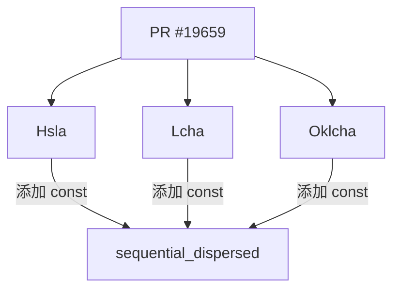

+++
title = "#19659 Make sequential_dispersed fn constant"
date = "2025-06-15T00:00:00"
draft = false
template = "pull_request_page.html"
in_search_index = false

[extra]
current_language = "zh-cn"
available_languages = {"en" = { name = "English", url = "/pull_request/bevy/2025-06/pr-19659-en-20250615" }, "zh-cn" = { name = "中文", url = "/pull_request/bevy/2025-06/pr-19659-zh-cn-20250615" }}
labels = ["D-Trivial", "C-Usability", "A-Color"]
+++

# Make sequential_dispersed fn constant

## Basic Information
- **Title**: Make sequential_dispersed fn constant
- **PR Link**: https://github.com/bevyengine/bevy/pull/19659
- **Author**: alice-i-cecile
- **Status**: MERGED
- **Labels**: D-Trivial, C-Usability, S-Ready-For-Final-Review, A-Color
- **Created**: 2025-06-15T16:36:08Z
- **Merged**: 2025-06-15T17:22:22Z
- **Merged By**: alice-i-cecile

## Description Translation
# 目标

- 由于我们现在有了常量浮点数运算 (const_float_arithmetic)，尝试让 `bevy_color` 中更多的函数成为常量函数。

## 解决方案

由于我们大量使用 trait，因此失败了。

不过我还是找到了这些函数，所以你可以有一个PR 🙃 

## The Story of This Pull Request

### 问题和背景
在 Rust 支持常量浮点数运算 (const float arithmetic) 后，Bevy 团队希望利用这一特性将 `bevy_color` 模块中更多的函数转为常量函数。常量函数可以在编译期执行计算，有利于性能优化和常量初始化。然而，由于 `bevy_color` 重度依赖 trait 系统，大部分函数无法直接转为常量函数。

开发者 alice-i-cecile 在探索过程中发现，`Hsla`、`Lcha` 和 `Oklcha` 结构体中的 `sequential_dispersed` 函数具备成为常量函数的条件。该函数使用黄金分割率生成视觉上均匀分布的色相序列，常用于创建调色板。原始实现虽然只使用基本算术运算，但缺少 `const` 关键字限制了其在编译期的使用场景。

### 解决方案和实施
解决方案直接明了：为 `sequential_dispersed` 函数添加 `const` 修饰符。该函数实现仅包含常量表达式：
1. 使用预定义的黄金分割率整数近似值：`FRAC_U32MAX_GOLDEN_RATIO = 2654435769`
2. 执行整数乘法和取模运算：`(index.wrapping_mul(FRAC_U32MAX_GOLDEN_RATIO) % u32::MAX`
3. 将结果转换为角度值：`RATIO_360 * hue`

这些操作在编译期均可完成，符合 Rust 的常量函数要求。修改涉及三个文件中的相同模式：
- 在函数签名前添加 `const` 关键字
- 保持内部逻辑完全不变
- 维持所有注释和常量定义

### 技术见解
1. **常量函数优势**：编译期执行避免运行时计算开销，支持常量上下文初始化
2. **算法特性**：使用黄金分割率 (Φ) 确保生成的色相在色环上均匀分布
3. **数值处理**：
   - `wrapping_mul` 避免整数溢出 panic（在常量上下文中必须安全）
   - `u32::MAX as f32` 显式类型转换保持精度
4. **维护性**：三个颜色空间的实现保持完全一致的修改模式

### 影响
1. **使用场景扩展**：开发者现在可在编译期初始化颜色序列：
   ```rust
   const PALETTE: [Hsla; 5] = [
       Hsla::sequential_dispersed(0),
       Hsla::sequential_dispersed(1),
       // ...
   ];
   ```
2. **零运行时开销**：调用该函数时直接使用编译期计算结果
3. **后续优化基础**：为其他颜色函数转为常量提供参考实现
4. **无破坏性变更**：函数签名兼容性保持，不影响现有调用方

## Visual Representation



## Key Files Changed

1. `crates/bevy_color/src/hsla.rs`
   - 变更：将 `sequential_dispersed` 转为常量函数
   - 代码差异：
```diff
-    pub fn sequential_dispersed(index: u32) -> Self {
+    pub const fn sequential_dispersed(index: u32) -> Self {
         const FRAC_U32MAX_GOLDEN_RATIO: u32 = 2654435769; // (u32::MAX / Φ) rounded up
         const RATIO_360: f32 = 360.0 / u32::MAX as f32;
```

2. `crates/bevy_color/src/lcha.rs`
   - 变更：相同函数签名修改
   - 代码差异：
```diff
-    pub fn sequential_dispersed(index: u32) -> Self {
+    pub const fn sequential_dispersed(index: u32) -> Self {
         const FRAC_U32MAX_GOLDEN_RATIO: u32 = 2654435769; // (u32::MAX / Φ) rounded up
         const RATIO_360: f32 = 360.0 / u32::MAX as f32;
```

3. `crates/bevy_color/src/oklcha.rs`
   - 变更：相同函数签名修改
   - 代码差异：
```diff
-    pub fn sequential_dispersed(index: u32) -> Self {
+    pub const fn sequential_dispersed(index: u32) -> Self {
         const FRAC_U32MAX_GOLDEN_RATIO: u32 = 2654435769; // (u32::MAX / Φ) rounded up
         const RATIO_360: f32 = 360.0 / u32::MAX as f32;
```

## Further Reading
1. [Rust 常量函数文档](https://doc.rust-lang.org/reference/const_eval.html)
2. [Rust 常量浮点数运算演进](https://github.com/rust-lang/rust/issues/57241)
3. [黄金分割率在颜色分布的应用](https://en.wikipedia.org/wiki/Golden_ratio#Applications_and_observations)
4. [Bevy 颜色系统架构](https://bevyengine.org/learn/book/features/colors/)