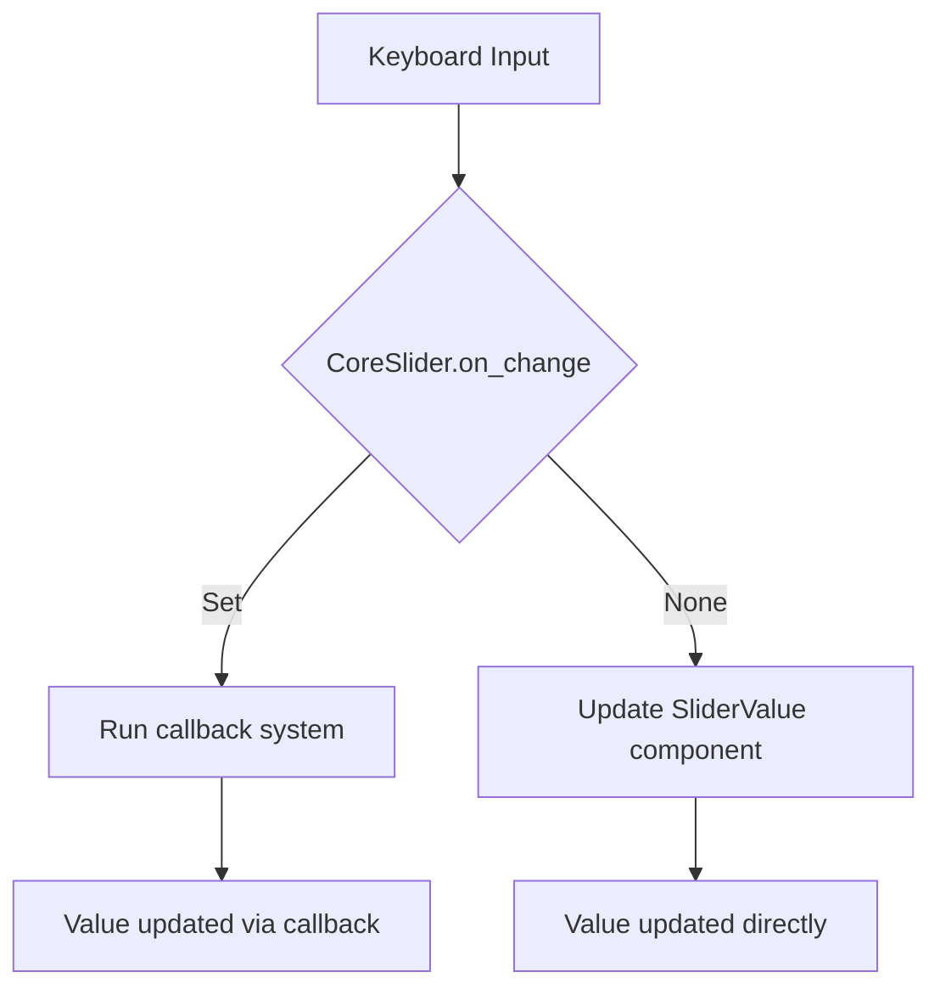

+++
title = "#19661 Fix Keyboard observer not updating SliderValue"
date = "2025-06-16T00:00:00"
draft = false
template = "pull_request_page.html"
in_search_index = true

[taxonomies]
list_display = ["show"]

[extra]
current_language = "en"
available_languages = {"en" = { name = "English", url = "/pull_request/bevy/2025-06/pr-19661-en-20250616" }, "zh-cn" = { name = "中文", url = "/pull_request/bevy/2025-06/pr-19661-zh-cn-20250616" }}
labels = ["C-Bug", "A-UI", "D-Straightforward"]
+++

# Fix Keyboard observer not updating SliderValue

## Basic Information
- **Title**: Fix Keyboard observer not updating SliderValue
- **PR Link**: https://github.com/bevyengine/bevy/pull/19661
- **Author**: HippoGamus
- **Status**: MERGED
- **Labels**: C-Bug, A-UI, S-Ready-For-Final-Review, D-Straightforward
- **Created**: 2025-06-15T17:42:47Z
- **Merged**: 2025-06-16T22:23:09Z
- **Merged By**: alice-i-cecile

## Description Translation
# Objective

When the `CoreSlider`s `on_change` is set to None, Keyboard input, like ArrowKeys, does not update the `SliderValue`.

## Solution

Handle the missing case, like it is done for Pointer.

## Testing

- Did you test these changes?
Yes: core_widgets & core_widgets_observers
in both examples one has to remove / comment out the setting of `CoreSlider::on_change` to test the case of `on_change` being none.

- Are there any parts that need more testing?
No not that I am aware of.

- How can other people (reviewers) test your changes? Is there anything specific they need to know?
Yes: core_widgets & core_widgets_observers
in both examples one has to remove / comment out the setting of `CoreSlider::on_change` to test the case of `on_change` being none.

- If relevant, what platforms did you test these changes on, and are there any important ones you can't test?
I tested on linux + wayland. But it is unlikely that it would effect outcomes.

## The Story of This Pull Request

The problem originated in Bevy's UI system where keyboard input wasn't properly updating slider values in certain configurations. Specifically, when a `CoreSlider` component had its `on_change` callback explicitly set to `None`, arrow key inputs would fail to update the associated `SliderValue` component. This created an inconsistency where pointer-based input worked as expected, but keyboard navigation didn't.

This bug occurred because the keyboard input handler (`slider_on_key_input`) only updated the slider value when an `on_change` callback was present. The relevant code section was:

```rust
if let Some(on_change) = slider.on_change {
    commands.run_system_with(on_change, new_value);
}
```

Notice the missing branch for handling the case when `on_change` is `None`. This meant that when no callback was defined, the keyboard input would trigger the interaction logic but fail to update the actual slider value in the ECS.

The solution was straightforward: mirror the pattern already implemented for pointer input handling. We added an `else` block that directly updates the `SliderValue` component when no callback exists:

```rust
if let Some(on_change) = slider.on_change {
    commands.run_system_with(on_change, new_value);
} else {
    commands
        .entity(trigger.target())
        .insert(SliderValue(new_value));
}
```

This change maintains consistency with the pointer input handler while fixing the keyboard behavior. The fix is minimal (4 lines added) but significant because it ensures consistent behavior across input methods. 

The implementation correctly uses Bevy's ECS commands to modify the `SliderValue` component on the target entity. This approach is efficient as it leverages Bevy's change detection and avoids unnecessary overhead. The solution preserves the existing architecture where callbacks take precedence when present, while falling back to direct component updates when they're absent.

This fix improves accessibility by ensuring keyboard navigation works consistently with mouse interaction. It also prevents potential state desync issues where the visual representation of a slider might not match its underlying value when manipulated via keyboard.

## Visual Representation



## Key Files Changed

### `crates/bevy_core_widgets/src/core_slider.rs`
This file contains the core logic for slider widgets. The change fixes inconsistent keyboard input handling when no change callback is defined.

Code change:
```rust
// Before:
@@ -394,6 +394,10 @@ fn slider_on_key_input(
             trigger.propagate(false);
             if let Some(on_change) = slider.on_change {
                 commands.run_system_with(on_change, new_value);
+            } else {
+                commands
+                    .entity(trigger.target())
+                    .insert(SliderValue(new_value));
             }
         }
     }
 }
```

The change adds the missing logic to update the `SliderValue` component directly when no callback is present, mirroring the existing pointer input behavior.

## Further Reading
1. [Bevy UI System Documentation](https://bevyengine.org/learn/book/getting-started/ui/)
2. [Bevy ECS Commands](https://bevyengine.org/learn/book/getting-started/ecs/#commands)
3. [Bevy Input Handling](https://bevyengine.org/learn/book/getting-started/input/)