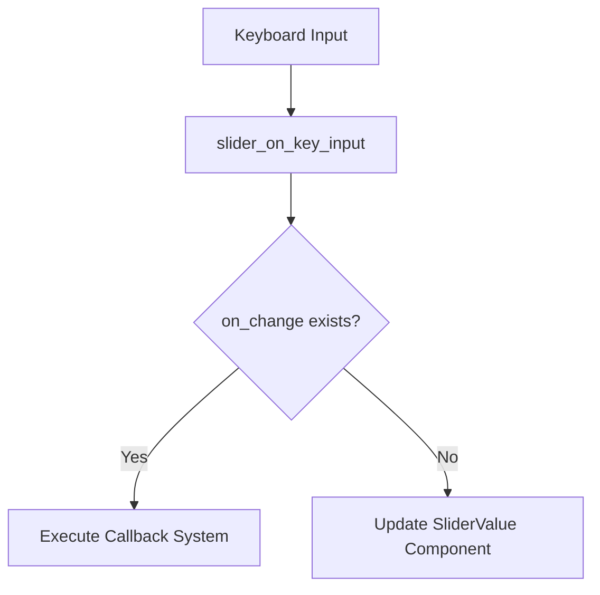

+++
title = "#19661 Fix Keyboard observer not updating SliderValue"
date = "2025-06-16T00:00:00"
draft = false
template = "pull_request_page.html"
in_search_index = false

[extra]
current_language = "zh-cn"
available_languages = {"en" = { name = "English", url = "/pull_request/bevy/2025-06/pr-19661-en-20250616" }, "zh-cn" = { name = "中文", url = "/pull_request/bevy/2025-06/pr-19661-zh-cn-20250616" }}
+++

# Fix Keyboard observer not updating SliderValue

## 基本信息
- **标题**: Fix Keyboard observer not updating SliderValue
- **PR链接**: https://github.com/bevyengine/bevy/pull/19661
- **作者**: HippoGamus
- **状态**: MERGED
- **标签**: C-Bug, A-UI, S-Ready-For-Final-Review, D-Straightforward
- **创建时间**: 2025-06-15T17:42:47Z
- **合并时间**: 2025-06-16T22:23:09Z
- **合并者**: alice-i-cecile

## 描述翻译
### 目标

当`CoreSlider`的`on_change`设置为None时，键盘输入（如方向键）无法更新`SliderValue`。

### 解决方案

处理缺失的情况，就像为Pointer所做的那样。

### 测试

- 是否测试了这些更改？  
是的：在core_widgets和core_widgets_observers示例中  
在这两个示例中，需要移除/注释掉`CoreSlider::on_change`的设置，以测试`on_change`为None的情况。

- 是否有部分需要更多测试？  
据我所知不需要。

- 其他人（审阅者）如何测试你的更改？他们需要了解什么具体信息？  
是的：core_widgets和core_widgets_observers  
在这两个示例中，需要移除/注释掉`CoreSlider::on_change`的设置，以测试`on_change`为None的情况。

- 如果相关，你在哪些平台测试了这些更改，有哪些重要平台无法测试？  
我在linux + wayland上测试过。但不太可能影响结果。

## 本次PR的技术背景

### 问题背景
在Bevy引擎的UI系统中，`CoreSlider`组件允许开发者通过`on_change`回调处理滑块值变化。但当开发者选择不设置`on_change`回调时（设为None），发现键盘操作（如方向键）无法更新滑块值。这是一个边界情况处理缺失的问题，导致UI行为不一致。

### 解决方案分析
解决方案参考了鼠标指针事件处理逻辑。在`slider_on_key_input`函数中，当键盘输入触发滑块值变化时：
1. 如果`on_change`回调存在，执行回调系统
2. 如果不存在，直接更新目标实体的`SliderValue`组件

这种处理方式与鼠标事件处理逻辑保持一致：
```rust
// 鼠标事件处理参考
if let Some(on_change) = slider.on_change {
    commands.run_system_with(on_change, new_value);
} else {
    commands.entity(trigger.target()).insert(SliderValue(new_value));
}
```

### 实现细节
核心修改在键盘事件处理函数中增加了`else`分支：
```rust
fn slider_on_key_input(
    // ...参数不变...
) {
    // ...现有逻辑...
    if key_input.just_pressed(KeyCode::ArrowLeft) {
        // ...计算new_value...
        if let Some(on_change) = slider.on_change {
            commands.run_system_with(on_change, new_value);
        } else {
            // 新增处理分支
            commands
                .entity(trigger.target())
                .insert(SliderValue(new_value));
        }
    }
    // ...其他按键处理...
}
```

### 技术影响
1. **行为一致性**：键盘输入现在与鼠标输入处理逻辑对齐
2. **边界情况覆盖**：解决了`on_change=None`时的值更新问题
3. **最小改动**：仅添加4行代码，保持函数原有结构
4. **测试验证**：通过修改示例代码验证了修复效果

### 潜在改进
虽然当前解决方案有效，但长期可考虑：
1. 提取公共处理逻辑避免重复
2. 增加自动化测试覆盖`on_change=None`场景

## 组件关系图



## 关键文件变更

### `crates/bevy_core_widgets/src/core_slider.rs`
**变更原因**：修复键盘输入在`on_change=None`时不更新滑块值的问题

**代码变更**：
```rust
// 变更前:
if let Some(on_change) = slider.on_change {
    commands.run_system_with(on_change, new_value);
}

// 变更后:
if let Some(on_change) = slider.on_change {
    commands.run_system_with(on_change, new_value);
} else {
    commands
        .entity(trigger.target())
        .insert(SliderValue(new_value));
}
```

**技术说明**：
1. 新增`else`分支处理`on_change=None`的情况
2. 直接通过ECS命令更新目标实体的`SliderValue`组件
3. 保持与鼠标事件处理相同的逻辑结构

## 扩展阅读
1. [Bevy UI系统文档](https://bevyengine.org/learn/book/getting-started/ui/)
2. [ECS模式在UI中的应用](https://github.com/bevyengine/bevy/blob/main/docs/plugins_guidelines.md)
3. [事件处理最佳实践](https://bevy-cheatbook.github.io/programming/events.html)