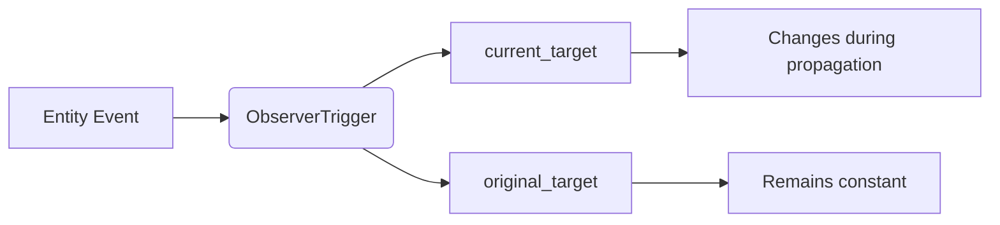

+++
title = "#19663 Provide access to the original target of entity-events in observers"
date = "2025-06-15T00:00:00"
draft = false
template = "pull_request_page.html"
in_search_index = true

[taxonomies]
list_display = ["show"]

[extra]
current_language = "en"
available_languages = {"en" = { name = "English", url = "/pull_request/bevy/2025-06/pr-19663-en-20250615" }, "zh-cn" = { name = "中文", url = "/pull_request/bevy/2025-06/pr-19663-zh-cn-20250615" }}
labels = ["C-Feature", "A-ECS", "X-Contentious", "D-Modest", "A-Picking"]
+++

### Title  
**Provide access to the original target of entity-events in observers**  

## Basic Information  
- **Title**: Provide access to the original target of entity-events in observers  
- **PR Link**: https://github.com/bevyengine/bevy/pull/19663  
- **Author**: alice-i-cecile  
- **Status**: MERGED  
- **Labels**: C-Feature, A-ECS, S-Ready-For-Final-Review, M-Needs-Migration-Guide, M-Needs-Release-Note, X-Contentious, D-Modest, A-Picking  
- **Created**: 2025-06-15T18:37:16Z  
- **Merged**: 2025-06-15T21:15:44Z  
- **Merged By**: alice-i-cecile  

## Description Translation  
# Objective  

Getting access to the original target of an entity-event is really helpful when working with bubbled / propagated events.  

`bevy_picking` special-cases this, but users have requested this for all sorts of bubbled events.  

The existing naming convention was also very confusing. Fixes https://github.com/bevyengine/bevy/issues/17112, but also see #18982.  

## Solution  

1. Rename `ObserverTrigger::target` -> `current_target`.  
1. Store `original_target: Option<Entity>` in `ObserverTrigger`.  
1. Wire it up so this field gets set correctly.  
1. Remove the `target` field on the `Pointer` events from `bevy_picking`.  

Closes https://github.com/bevyengine/bevy/pull/18710, which attempted the same thing. Thanks @emfax!  

## Testing  

I've modified an existing test to check that the entities returned during event bubbling / propagation are correct.  

## Notes to reviewers  

It's a little weird / sad that you can no longer access this infromation via the buffered events for `Pointer`. That said, you already couldn't access any bubbled target. We should probably remove the `BufferedEvent` form of `Pointer` to reduce confusion and overhead, but I didn't want to do so here.  

Observer events can be trivially converted into buffered events (write an observer with an EventWriter), and I suspect that that is the better migration if you want the controllable timing or performance characteristics of buffered events for your specific use case.  

## Future work  

It would be nice to not store this data at all (and not expose any methods) if propagation was disabled. That involves more trait shuffling, and I don't think we should do it here for reviewability.  

---

## The Story of This Pull Request  

### The Problem and Context  
When working with bubbled or propagated entity events in Bevy's ECS, developers needed access to both the *current* event target during propagation and the *original* target where the event originated. Previously, `bevy_picking` handled this by storing the original target in a `target` field on `Pointer` events, but this was inconsistent with other event types and created confusion due to naming ambiguity. The `ObserverTrigger::target` field only tracked the current propagation target, making it impossible to reliably identify the original source of bubbled events. This limitation surfaced in issues like #17112 and #18982, where users reported difficulties distinguishing between propagated event targets.  

### The Solution Approach  
The core strategy involves:  
1. Renaming `ObserverTrigger::target` to `current_target` to clarify its purpose  
2. Adding an `original_target` field to store the initial event target  
3. Propagating `original_target` through the event system  
4. Removing `bevy_picking`'s redundant `Pointer.target` field  

This approach centralizes event-target tracking in the observer system, eliminating the need for per-event-type workarounds. By introducing `original_target`, observers can now access both the current propagation stage and the event's origin. The `current_target` rename resolves naming confusion by explicitly distinguishing between the transient propagation target and the fixed original target.  

### The Implementation  
The changes propagate through three layers:  

1. **Observer internals**: The `ObserverTrigger` struct now stores both targets:  
   ```rust  
   // Before:  
   pub struct ObserverTrigger {  
       pub target: Option<Entity>,  
       // ...  
   }  
   
   // After:  
   pub struct ObserverTrigger {  
       pub current_target: Option<Entity>,  
       pub original_target: Option<Entity>,  
       // ...  
   }  
   ```  
   The `On` observer interface exposes these via new methods:  
   ```rust  
   pub fn target(&self) -> Entity {  
       self.trigger.current_target.unwrap_or(Entity::PLACEHOLDER)  
   }  
   
   pub fn original_target(&self) -> Entity {  
       self.trigger.original_target.unwrap_or(Entity::PLACEHOLDER)  
   }  
   ```  

2. **Event propagation**: The `trigger_observers_with_data` function now accepts both targets:  
   ```rust  
   // Before:  
   Observers::invoke::<_(  
       world,  
       event_type,  
       target,  // single target  
       components,  
       data,  
       propagate  
   );  
   
   // After:  
   Observers::invoke::<_(  
       world,  
       event_type,  
       current_target,  // explicit current  
       original_target, // new original  
       components,  
       data,  
       propagate  
   );  
   ```  
   During bubbling, `original_target` remains constant while `current_target` updates at each propagation step.  

3. **Picking integration**: `bevy_picking`'s `Pointer` events remove their redundant `target` field:  
   ```rust  
   // Before:  
   pub struct Pointer<E: Debug + Clone + Reflect> {  
       pub target: Entity, // removed  
       // ...  
   }  
   
   // Event creation:  
   Pointer::new(pointer_id, location, target, event) // target argument removed  
   ```  
   All event construction sites now omit the target parameter.  

### Testing and Validation  
A propagation test was extended to verify correct target tracking:  
```rust  
world.entity_mut(parent).observe(  
    move |trigger: On<EventPropagating>, mut res: ResMut<Order>| {  
        assert_eq!(trigger.target(), parent); // current = parent  
        assert_eq!(trigger.original_target(), child); // original = child  
    }  
);  
```  
This confirms that during bubbling:  
- Observers at the original target (`child`) see identical current/original targets  
- Parent observers see the original target (`child`) while their current target is `parent`  

### Technical Insights  
1. **Observer consistency**: By moving target-tracking responsibility to the observer system, all entity events gain consistent access to propagation metadata without per-event boilerplate.  
2. **Performance tradeoffs**: Storing `original_target` adds 8 bytes per `ObserverTrigger`, but removes 8 bytes from every `Pointer` event. Net impact depends on event/observer ratios.  
3. **Propagation control**: The `propagate()` method in `On` observers allows dynamically stopping propagation, though this doesn't currently optimize out `original_target` storage.  

### The Impact  
- **Fixed confusion**: Clearer `current_target`/`original_target` terminology replaces ambiguous `target`  
- **Generalized solution**: All entity events now support original-target access via observers  
- **Picking cleanup**: `bevy_picking` sheds redundant data storage  
- **Migration path**: A new migration guide (`pointer_target.md`) explains the transition:  
  ```markdown  
  The `Pointer.target` field... has been removed.  
  Instead... available via `On::original_target()`.  
  ```  

### Future Work  
The PR leaves optimization opportunities:  
- Conditionally skip storing `original_target` when propagation is disabled  
- Deprecate `Pointer`'s buffered events in favor of observer-based workflows  

---  

## Visual Representation  


## Key Files Changed  
1. **`crates/bevy_ecs/src/observer/mod.rs`** (+48/-18)  
   - Added `original_target` to `ObserverTrigger`  
   - Implemented `original_target()` accessor in `On` observers  
   - Updated test to validate propagation targets  
   ```rust  
   // Test snippet:  
   assert_eq!(trigger.target(), parent);  
   assert_eq!(trigger.original_target(), child);  
   ```  

2. **`crates/bevy_picking/src/events.rs`** (+4/-31)  
   - Removed `target` field from `Pointer` struct  
   - Simplified event construction by removing target parameter  
   ```rust  
   // Before:  
   Pointer::new(id, location, target, event)  
   // After:  
   Pointer::new(id, location, event)  
   ```  

3. **`release-content/migration-guides/pointer_target.md`** (+30/-0)  
   - New migration guide explaining:  
     - Removal of `Pointer.target`  
     - Transition to `On::original_target()`  
     - Workaround for buffered event users  

4. **`crates/bevy_ecs/src/world/deferred_world.rs`** (+12/-6)  
   - Modified `trigger_observers_with_data` to handle dual targets  
   ```rust  
   Observers::invoke(  
       ...,  
       current_target,  
       original_target, // New argument  
       ...  
   )  
   ```  

5. **`release-content/release-notes/observer_overhaul.md`** (+10/-2)  
   - Added note about original-target support to observer documentation  

## Further Reading  
1. [Observer System Documentation](https://bevyengine.org/learn/book/events/observers/) - Bevy's observer patterns  
2. [Event Propagation RFC](https://github.com/bevyengine/rfcs/pull/45) - Design rationale for bubbling  
3. [ECS Best Practices](https://github.com/bevyengine/bevy/discussions/6876) - Using observers effectively