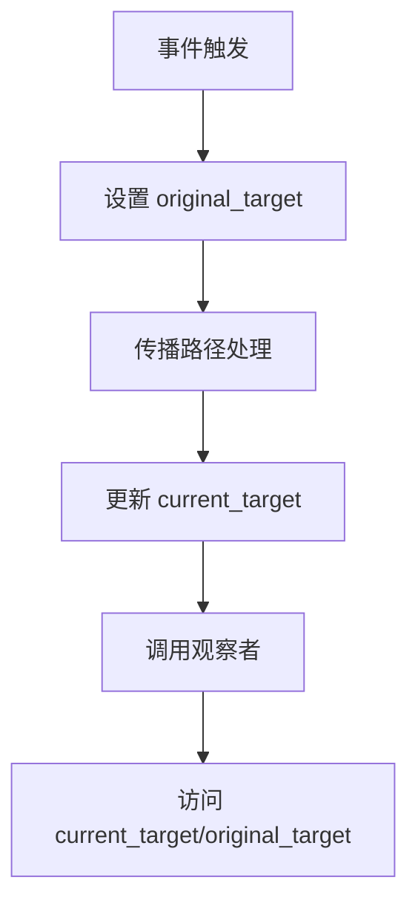

+++
title = "#19663 Provide access to the original target of entity-events in observers"
date = "2025-06-15T00:00:00"
draft = false
template = "pull_request_page.html"
in_search_index = false

[extra]
current_language = "zh-cn"
available_languages = {"en" = { name = "English", url = "/pull_request/bevy/2025-06/pr-19663-en-20250615" }, "zh-cn" = { name = "中文", url = "/pull_request/bevy/2025-06/pr-19663-zh-cn-20250615" }}
+++

## 报告：PR #19663 技术分析 - 实体事件原始目标访问优化

### 基础信息
- **标题**: Provide access to the original target of entity-events in observers
- **PR链接**: https://github.com/bevyengine/bevy/pull/19663
- **作者**: alice-i-cecile
- **状态**: 已合并
- **标签**: C-Feature, A-ECS, S-Ready-For-Final-Review, M-Needs-Migration-Guide, M-Needs-Release-Note, X-Contentious, D-Modest, A-Picking
- **创建时间**: 2025-06-15T18:37:16Z
- **合并时间**: 2025-06-15T21:15:44Z
- **合并者**: alice-i-cecile

### 描述翻译
#### 目标
在事件冒泡/传播场景中获取实体事件的原始目标实体非常有用。虽然 `bevy_picking` 特殊处理了这种情况，但用户需要在各种冒泡事件中访问此信息。现有命名约定也存在混淆问题，修复 #17112 和 #18982。

#### 解决方案
1. 将 `ObserverTrigger::target` 重命名为 `current_target`
2. 在 `ObserverTrigger` 中添加 `original_target: Option<Entity>` 字段
3. 正确设置该字段值
4. 移除 `bevy_picking` 中 `Pointer` 事件的 `target` 字段

关闭了实现相同目标的 #18710，感谢 @emfax！

#### 测试
修改了现有测试以验证事件冒泡/传播期间返回的实体是否正确。

#### 给审阅者的说明
不再能通过 `Pointer` 的缓冲事件访问此信息确实有些不便，但实际上缓冲事件本身也无法访问任何冒泡目标。虽然可以完全移除 `Pointer` 的缓冲事件形式以减少混淆和开销，但本次未实施。

观察者事件可轻松转换为缓冲事件（通过 EventWriter 编写观察者），如需可控时序或性能特性，建议迁移到观察者模式。

#### 后续工作
如果禁用传播，理想情况是不存储此数据（也不暴露任何方法），但这需要更多 trait 调整，本次暂不实施以保证可审阅性。

---

## PR 技术分析

### 问题背景
在事件传播系统中存在两个核心问题：
1. 缺乏原始目标访问：当事件在实体层次结构中冒泡时，无法获取事件最初触发的原始实体
2. 命名混淆：`ObserverTrigger::target` 字段实际表示事件传播路径中的当前实体，而非原始目标实体

这在 UI 交互场景尤为明显，比如点击事件从子元素冒泡到父元素时，开发者需要知道：
- 当前处理事件的实体 (`current_target`)
- 最初被点击的实体 (`original_target`)

`bevy_picking` 模块通过特殊字段 `Pointer::target` 解决此问题，但其他事件类型无法复用此方案，导致用户需要自行实现类似逻辑。

### 解决方案
核心方案包含四个关键变更：
1. **字段重命名**：将 `ObserverTrigger::target` 改为 `current_target` 以准确反映其含义
2. **新增字段**：添加 `ObserverTrigger::original_target` 存储原始目标实体
3. **事件触发逻辑**：在事件传播过程中正确维护这两个字段的值
4. **统一访问接口**：通过 `On::original_target()` 方法暴露原始目标
5. **移除冗余字段**：删除 `bevy_picking` 中的特殊实现 `Pointer::target`

### 实现细节
#### 1. 观察者触发器结构改造
```rust
// crates/bevy_ecs/src/observer/mod.rs
// 修改前
pub struct ObserverTrigger {
    pub event_type: ComponentId,
    components: SmallVec<[ComponentId; 2]>,
    pub target: Option<Entity>,  // 实际表示当前目标
    pub caller: MaybeLocation,
}

// 修改后
pub struct ObserverTrigger {
    pub event_type: ComponentId,
    components: SmallVec<[ComponentId; 2]>,
    pub current_target: Option<Entity>,   // 重命名以明确含义
    pub original_target: Option<Entity>,  // 新增原始目标字段
    pub caller: MaybeLocation,
}
```

#### 2. 新增原始目标访问接口
```rust
// crates/bevy_ecs/src/observer/mod.rs
impl<'w, E: EntityEvent, B: Bundle> On<'w, E, B> {
    // 获取当前目标实体
    pub fn target(&self) -> Entity {
        self.trigger.current_target.unwrap_or(Entity::PLACEHOLDER)
    }

    // 新增原始目标获取方法
    pub fn original_target(&self) -> Entity {
        self.trigger.original_target.unwrap_or(Entity::PLACEHOLDER)
    }
}
```

#### 3. 事件触发逻辑改造
```diff
// crates/bevy_ecs/src/world/deferred_world.rs
pub(crate) unsafe fn trigger_observers_with_data<E, T>(
    &mut self,
    event: ComponentId,
-   target: Option<Entity>,
+   current_target: Option<Entity>,
+   original_target: Option<Entity>,  // 新增原始目标参数
    components: impl Iterator<Item = ComponentId> + Clone,
    data: &mut E,
    mut propagate: bool,
    caller: &dyn Fn() -> Option<&'static Location<'static>>,
) {
    Observers::invoke::<_>(
        self.reborrow(),
        event,
-       target,
+       current_target,
+       original_target,  // 传递原始目标
        components.clone(),
        data,
        &mut propagate,
        caller,
    );
```

#### 4. 移除 bevy_picking 的冗余实现
```diff
// crates/bevy_picking/src/events.rs
#[entity_event(traversal = PointerTraversal, auto_propagate)]
#[reflect(Component, Debug, Clone)]
pub struct Pointer<E: Debug + Clone + Reflect> {
-    /// The original target of this picking event, before bubbling
-    pub target: Entity,  // 删除特殊字段
     /// The pointer that triggered this event
     pub pointer_id: PointerId,
```

所有创建 Pointer 事件的地方同步移除 target 参数：
```rust
// 修改前:
Pointer::new(pointer_id, location.clone(), hovered_entity, Out { hit: hit.clone() })

// 修改后:
Pointer::new(pointer_id, location.clone(), Out { hit: hit.clone() })
```

### 测试验证
添加测试确保事件传播中原始目标保持不变：
```rust
// crates/bevy_ecs/src/observer/mod.rs
world.entity_mut(parent).observe(
    move |trigger: On<EventPropagating>, mut res: ResMut<Order>| {
        res.observed("parent");
        // 验证当前目标是父实体
        assert_eq!(trigger.target(), parent);
        // 验证原始目标是子实体
        assert_eq!(trigger.original_target(), child);
    },
);

world.entity_mut(child).observe(
    move |trigger: On<EventPropagating>, mut res: ResMut<Order>| {
        res.observed("child");
        // 子实体观察者中两者相同
        assert_eq!(trigger.target(), child);
        assert_eq!(trigger.original_target(), child);
    },
);
```

### 技术洞察
1. **事件传播机制**：
   - `current_target` 随事件传播路径动态变化
   - `original_target` 始终保持事件最初触发的实体
   - 禁用传播时两者值相同

2. **设计一致性**：
   - 统一所有实体事件的目标访问方式
   - 消除特殊模块的特殊处理逻辑
   - 通过标准接口降低认知负担

3. **迁移策略**：
   - 提供清晰迁移路径（见迁移指南）
   - 保留缓冲事件转换可能性
   - 详细说明设计取舍

### 影响分析
1. **正向影响**：
   - 统一事件目标访问模式
   - 消除 `bevy_picking` 的特殊实现
   - 明确区分当前目标和原始目标
   - 解决长期存在的命名混淆问题

2. **迁移成本**：
   - 使用 `Pointer::target` 的代码需要迁移
   - 新增迁移指南降低升级成本
   - 提供临时解决方案（事件转换观察者）

3. **性能考量**：
   - 新增字段增加 8 字节/事件内存开销
   - 无额外计算开销
   - 对禁用传播的场景可优化（后续工作）

### 组件关系图


### 关键文件变更
1. **crates/bevy_ecs/src/observer/mod.rs** (+48/-18)
   - 重构 ObserverTrigger 结构
   - 新增 original_target() 访问器
   - 添加传播机制测试用例

2. **crates/bevy_picking/src/events.rs** (+4/-31)
   - 移除 Pointer 事件的冗余 target 字段
   - 更新所有事件创建点

3. **release-content/migration-guides/pointer_target.md** (+30/-0)
   - 新增迁移指南
   - 提供代码迁移示例
   ```rust
   // 事件转换观察者示例
   fn transform_entity_event<E: EntityEvent>(
       trigger: On<E>, 
       event_writer: EventWriter<TransformedEntityEvent<E>>
   ){
       if trigger.target() == trigger.original_target() {
           event_writer.send(trigger.event())
       }
   }
   ```

4. **crates/bevy_ecs/src/world/deferred_world.rs** (+12/-6)
   - 修改事件触发函数签名
   - 传递 original_target 参数

5. **release-content/release-notes/observer_overhaul.md** (+10/-2)
   - 更新发布说明
   - 记录原始目标访问功能

### 延伸阅读
1. [实体事件系统文档](https://docs.rs/bevy_ecs/latest/bevy_ecs/event/trait.EntityEvent.html)
2. [观察者模式指南](https://github.com/bevyengine/bevy/blob/main/docs/plugins_guidelines.md#observers)
3. [事件传播机制 RFC](https://github.com/bevyengine/rfcs/blob/main/rfcs/45-observer-events.md)

此 PR 通过系统化的改造，统一了实体事件的目标访问模式，解决了命名混淆问题，并为事件处理提供了更强大的基础能力。