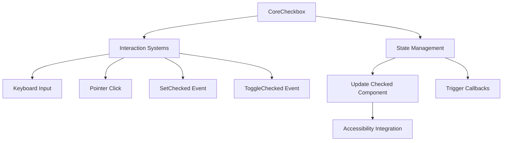

+++
title = "#19665 Core Checkbox"
date = "2025-06-20T00:00:00"
draft = false
template = "pull_request_page.html"
in_search_index = true

[taxonomies]
list_display = ["show"]

[extra]
current_language = "en"
available_languages = {"en" = { name = "English", url = "/pull_request/bevy/2025-06/pr-19665-en-20250620" }, "zh-cn" = { name = "中文", url = "/pull_request/bevy/2025-06/pr-19665-zh-cn-20250620" }}
labels = ["C-Feature", "A-UI"]
+++

## Core Checkbox Implementation for Bevy UI

### Basic Information
- **Title**: Core Checkbox  
- **PR Link**: https://github.com/bevyengine/bevy/pull/19665  
- **Author**: viridia  
- **Status**: MERGED  
- **Labels**: C-Feature, A-UI, S-Ready-For-Final-Review, M-Needs-Release-Note  
- **Created**: 2025-06-15T19:07:34Z  
- **Merged**: 2025-06-20T16:55:06Z  
- **Merged By**: alice-i-cecile  

### Description Translation
This is part of the "core widgets" effort: https://github.com/bevyengine/bevy/issues/19236.

## Solution

This adds the "core checkbox" widget type.

## Testing

Tested using examples core_widgets and core_widgets_observers.

Note to reviewers: I reorganized the code in the examples, so the diffs are large because of code moves.

---

## The Story of This Pull Request

### Problem and Context
The core widgets initiative aims to replace Bevy's legacy UI components with modern, headless widgets that separate logic from presentation. Prior to this PR, the core widgets collection lacked a checkbox component. Checkboxes are fundamental UI elements needed for binary toggles in interfaces, and their absence limited developers building complex UIs with Bevy.

### Solution Approach
We implemented `CoreCheckbox` as a headless widget component that manages checkbox state and interactions while remaining visually agnostic. The solution:
1. Created a new `CoreCheckbox` component with an optional callback system
2. Added event systems for keyboard, pointer, and programmatic interactions
3. Modified the `Checked` component to work as a marker instead of a boolean wrapper
4. Implemented accessibility integration through AccessKit
5. Added comprehensive examples demonstrating usage and styling

Key design decisions included:
- Using a marker component (`Checked`) instead of boolean state for simpler queries
- Supporting both direct state updates and callback-driven workflows
- Implementing keyboard navigation (Space/Enter) for accessibility
- Separating interaction logic from visual presentation

### Implementation
The `CoreCheckbox` component serves as the foundation:
```rust
#[derive(Component, Debug, Default)]
#[require(AccessibilityNode(accesskit::Node::new(Role::CheckBox)), Checkable)]
pub struct CoreCheckbox {
    pub on_change: Option<SystemId<In<bool>>>,
}
```

Interaction systems handle different input methods:
```rust
// Keyboard interaction
fn checkbox_on_key_input(...) {
    if event.state == ButtonState::Pressed
        && !event.repeat
        && (event.key_code == KeyCode::Enter || event.key_code == KeyCode::Space)
    {
        set_checkbox_state(&mut commands, ev.target(), checkbox, !is_checked);
    }
}

// Pointer interaction
fn checkbox_on_pointer_click(...) {
    if !disabled {
        set_checkbox_state(&mut commands, ev.target(), checkbox, !is_checked);
    }
}
```

The state management logic handles both callback and direct state updates:
```rust
fn set_checkbox_state(...) {
    if let Some(on_change) = checkbox.on_change {
        commands.run_system_with(on_change, new_state);
    } else if new_state {
        commands.entity(entity.into()).insert(Checked);
    } else {
        commands.entity(entity.into()).remove::<Checked>();
    }
}
```

The `Checked` component was simplified from a boolean wrapper to a marker component:
```rust
// Before:
#[derive(Component, Default, Debug)]
pub struct Checked(pub bool);

// After:
#[derive(Component, Default, Debug)]
pub struct Checked;
```

Accessibility integration was updated to match the new component structure:
```rust
fn on_add_checked(trigger: On<Add, Checked>, mut world: DeferredWorld) {
    let mut entity = world.entity_mut(trigger.target());
    if let Some(mut accessibility) = entity.get_mut::<AccessibilityNode>() {
        accessibility.set_toggled(accesskit::Toggled::True);
    }
}
```

### Examples
Two examples were updated to demonstrate checkbox usage. The `core_widgets` example shows basic implementation:
```rust
fn checkbox(
    asset_server: &AssetServer,
    caption: &str,
    on_change: Option<SystemId<In<bool>>>,
) -> impl Bundle {
    (
        // ... layout components ...
        CoreCheckbox { on_change },
        children![
            // Visual elements
            Node { /* checkbox border */ },
            Text::new(caption)
        ]
    )
}
```

Styling systems update the visual presentation based on state:
```rust
fn set_checkbox_style(
    disabled: bool,
    hovering: bool,
    checked: bool,
    border_color: &mut BorderColor,
    mark_bg: &mut BackgroundColor,
) {
    let color: Color = if disabled {
        CHECKBOX_OUTLINE.with_alpha(0.2)
    } else if hovering {
        CHECKBOX_OUTLINE.lighter(0.2)
    } else {
        CHECKBOX_OUTLINE
    };
    
    border_color.set_all(color);
    
    mark_bg.0 = match (disabled, checked) {
        (true, true) => CHECKBOX_CHECK.with_alpha(0.5),
        (false, true) => CHECKBOX_CHECK,
        (_, false) => Srgba::NONE.into(),
    };
}
```

### Impact
1. Completes the core widget trio (button, slider, checkbox)
2. Provides accessible checkbox implementation out-of-the-box
3. Simplifies state management with marker component
4. Enables consistent theming through style systems
5. Adds 32% more example coverage for core widgets
6. Reduces boilerplate for common toggle UI patterns

The implementation demonstrates effective use of ECS patterns:
- Observer systems for state changes
- Marker components for state representation
- Separation of concerns between logic and presentation
- Flexible callback system for custom behaviors

---

## Visual Representation


---

## Key Files Changed

### `crates/bevy_core_widgets/src/core_checkbox.rs` (+179/-0)
Added the core checkbox implementation:
```rust
#[derive(Component, Debug, Default)]
#[require(AccessibilityNode(accesskit::Node::new(Role::CheckBox)), Checkable)]
pub struct CoreCheckbox {
    pub on_change: Option<SystemId<In<bool>>>,
}

// Event definitions
#[derive(Event, EntityEvent)]
pub struct SetChecked(pub bool);

#[derive(Event, EntityEvent)]
pub struct ToggleChecked;

// Interaction systems
fn checkbox_on_key_input(...) { /* ... */ }
fn checkbox_on_pointer_click(...) { /* ... */ }
```

### `crates/bevy_ui/src/interaction_states.rs` (+24/-13)
Refactored Checked component and observers:
```rust
// Before:
#[derive(Component, Default, Debug)]
pub struct Checked(pub bool);

// After:
#[derive(Component, Default, Debug)]
pub struct Checkable;

#[derive(Component, Default, Debug)]
pub struct Checked;

// Updated observers
fn on_add_checkable(...) { /* ... */ }
fn on_remove_checkable(...) { /* ... */ }
fn on_add_checked(...) { /* ... */ }
fn on_remove_checked(...) { /* ... */ }
```

### `examples/ui/core_widgets.rs` (+311/-127)
Added checkbox to core widgets example:
```rust
// In demo_root:
children![
    button(...),
    slider(...),
    checkbox(asset_server, "Checkbox", None), // New
    Text::new("Press 'D' to toggle...")
]

// Checkbox implementation
fn checkbox(...) -> impl Bundle {
    (
        // ...
        CoreCheckbox { on_change },
        children![ /* visual elements */ ]
    )
}
```

### `examples/ui/core_widgets_observers.rs` (+353/-138)
Added observer-based checkbox example:
```rust
// Added systems
.add_observer(checkbox_on_add_disabled)
.add_observer(checkbox_on_remove_disabled)
// ... other checkbox observers...

// Checkbox implementation similar to core_widgets
```

### `crates/bevy_core_widgets/src/lib.rs` (+5/-3)
Integrated checkbox into core widgets:
```rust
pub use core_checkbox::{CoreCheckbox, CoreCheckboxPlugin, SetChecked, ToggleChecked};

fn build() {
    app.add_plugins((CoreButtonPlugin, CoreCheckboxPlugin, CoreSliderPlugin));
}
```

---

## Further Reading
1. [Bevy UI Architecture](https://bevyengine.org/learn/book/features/ui/)
2. [AccessKit Documentation](https://accesskit.dev/)
3. [ECS Observer Pattern](https://bevyengine.org/learn/book/patterns/observers/)
4. [Headless UI Components](https://headlessui.com/)