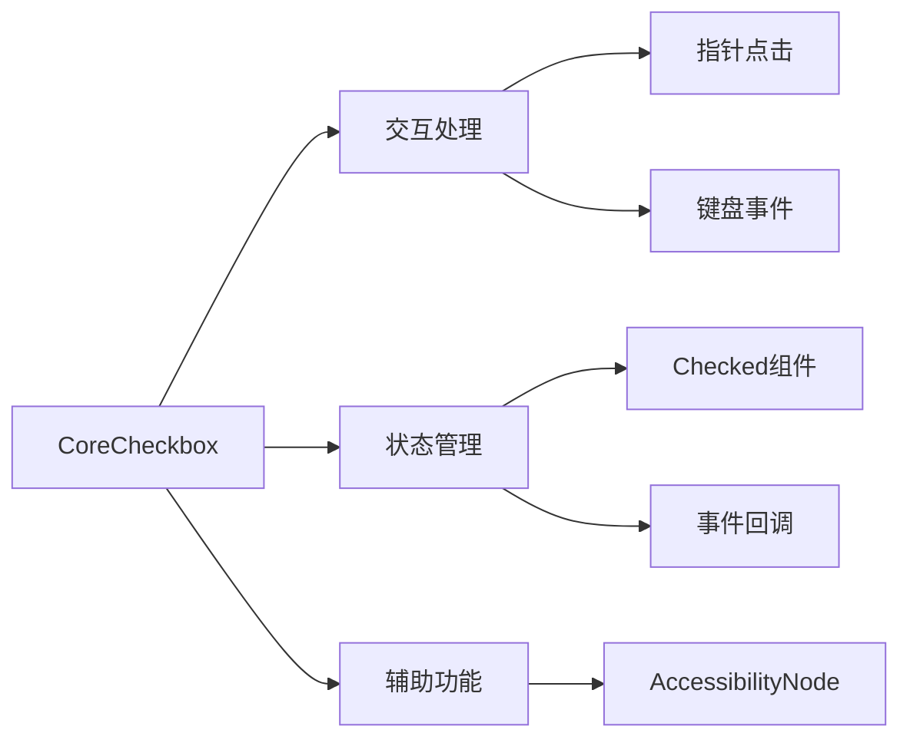

+++
title = "#19665 Core Checkbox"
date = "2025-06-20T00:00:00"
draft = false
template = "pull_request_page.html"
in_search_index = false

[extra]
current_language = "zh-cn"
available_languages = {"en" = { name = "English", url = "/pull_request/bevy/2025-06/pr-19665-en-20250620" }, "zh-cn" = { name = "中文", url = "/pull_request/bevy/2025-06/pr-19665-zh-cn-20250620" }}
labels = ["C-Feature", "A-UI"]
+++

# Core Checkbox

## Basic Information
- **Title**: Core Checkbox
- **PR Link**: https://github.com/bevyengine/bevy/pull/19665
- **Author**: viridia
- **Status**: MERGED
- **Labels**: C-Feature, A-UI, S-Ready-For-Final-Review, M-Needs-Release-Note
- **Created**: 2025-06-15T19:07:34Z
- **Merged**: 2025-06-20T16:55:06Z
- **Merged By**: alice-i-cecile

## Description Translation
该PR是"核心部件"工作的一部分：https://github.com/bevyengine/bevy/issues/19236。

### 解决方案
添加了"核心复选框"部件类型。

### 测试
使用示例 core_widgets 和 core_widgets_observers 进行了测试。

注意：评审者请注意，我重构了示例中的代码，因此由于代码移动，差异较大。

## The Story of This Pull Request

### 背景和问题
Bevy UI 系统正在经历核心部件的重构（headless widgets），旨在替代传统的 Button 和 Interaction 组件。原系统在实现复杂交互部件（如复选框）时存在局限性，特别是缺乏对辅助功能的原生支持。作为核心部件计划的延续，需要实现一个无样式的复选框组件，开发者可以基于此构建自定义样式。

### 解决方案
引入 CoreCheckbox 组件作为复选框的基础实现：
1. 使用纯逻辑组件处理状态管理
2. 通过事件系统处理用户交互
3. 提供两种状态控制方式：直接状态更新或回调函数
4. 重构 Checked 组件使其更符合 ECS 模式

### 实现细节
#### CoreCheckbox 组件
```rust
#[derive(Component, Debug, Default)]
pub struct CoreCheckbox {
    pub on_change: Option<SystemId<In<bool>>>,
}
```
- `on_change` 为可选回调系统
- 无回调时自动管理 Checked 状态
- 添加了 require(AccessibilityNode) 确保辅助功能节点

#### 事件处理
实现四种交互方式：
1. 键盘输入（Enter/Space）
2. 指针点击
3. 显式设置状态（SetChecked）
4. 切换状态（ToggleChecked）

```rust
fn checkbox_on_key_input(...) {
    if event.key_code == KeyCode::Enter || event.key_code == KeyCode::Space {
        set_checkbox_state(...);
    }
}

fn set_checkbox_state(...) {
    if let Some(on_change) = checkbox.on_change {
        commands.run_system_with(on_change, new_state);
    } else if new_state {
        commands.entity(entity).insert(Checked);
    } else {
        commands.entity(entity).remove::<Checked>();
    }
}
```

#### 状态组件重构
将 Checked 从数据组件改为标记组件：
```diff
- #[derive(Component, Default, Debug)]
- pub struct Checked(pub bool);
+ #[derive(Component, Default, Debug)]
+ pub struct Checked;
```
同时引入 Checkable 组件标识可勾选部件：
```rust
#[derive(Component, Default, Debug)]
pub struct Checkable;
```

#### 辅助功能集成
添加多个观察器同步辅助功能状态：
```rust
app.add_observer(checkbox_on_key_input)
   .add_observer(checkbox_on_pointer_click)
   .add_observer(checkbox_on_set_checked)
   .add_observer(checkbox_on_toggle_checked);
```

### 示例实现
在两个示例中集成复选框：
1. core_widgets.rs：添加样式化复选框
2. core_widgets_observers.rs：实现观察器驱动的样式更新

```rust
fn checkbox(...) -> impl Bundle {
    (
        Node { /* ... */ },
        CoreCheckbox { on_change },
        children![
            // 复选框外框
            Node { border: UiRect::all(Val::Px(2.0)) },
            // 复选框内标记
            Node { /* ... */ },
            // 文本标签
            Text::new(caption)
        ]
    )
}
```

### 技术影响
1. 提供标准化的复选框实现
2. 改进状态管理：Checked 改为标记组件更符合 ECS 模式
3. 增强辅助功能支持
4. 为其他开关类部件（如 toggle switch）奠定基础
5. 完善核心部件生态系统

## Visual Representation


## Key Files Changed

### 新增核心组件
`crates/bevy_core_widgets/src/core_checkbox.rs` (+179/-0)
实现 CoreCheckbox 组件及其事件处理逻辑

```rust
#[derive(Component, Debug, Default)]
pub struct CoreCheckbox {
    pub on_change: Option<SystemId<In<bool>>>,
}

#[derive(Event, EntityEvent)]
pub struct SetChecked(pub bool);

#[derive(Event, EntityEvent)]
pub struct ToggleChecked;

fn set_checkbox_state(...) {
    if let Some(on_change) = checkbox.on_change {
        commands.run_system_with(on_change, new_state);
    } else if new_state {
        commands.entity(entity.into()).insert(Checked);
    } else {
        commands.entity(entity.into()).remove::<Checked>();
    }
}
```

### UI 状态管理重构
`crates/bevy_ui/src/interaction_states.rs` (+24/-13)
重构 Checked 组件并添加 Checkable 组件

```diff
- #[derive(Component, Default, Debug)]
- pub struct Checked(pub bool);
+ #[derive(Component, Default, Debug)]
+ pub struct Checkable;
+
+ #[derive(Component, Default, Debug)]
+ pub struct Checked;

- pub(crate) fn on_insert_is_checked(...) {
-     let checked = entity.get::<Checked>().unwrap().get();
+ pub(crate) fn on_add_checked(...) {
+     accessibility.set_toggled(accesskit::Toggled::True);
```

### 示例集成
`examples/ui/core_widgets.rs` (+311/-127)
添加带样式的复选框实现

```rust
fn checkbox(asset_server: &AssetServer, caption: &str, on_change: Option<SystemId<In<bool>>>) -> impl Bundle {
    (
        // 布局容器
        Node { display: Display::Flex, ... },
        CoreCheckbox { on_change },
        children![
            // 复选框外框
            Node { border: UiRect::all(Val::Px(2.0)), ... },
            // 内标记
            Node { width: Val::Px(8.0), height: Val::Px(8.0), ... },
            // 文本标签
            Text::new(caption)
        ]
    )
}

fn set_checkbox_style(disabled: bool, hovering: bool, checked: bool, ...) {
    let color: Color = if disabled {
        CHECKBOX_OUTLINE.with_alpha(0.2)
    } else if hovering {
        CHECKBOX_OUTLINE.lighter(0.2)
    } else {
        CHECKBOX_OUTLINE
    };
    border_color.set_all(color);
}
```

### 观察器示例
`examples/ui/core_widgets_observers.rs` (+353/-138)
实现基于观察器的复选框样式更新

```rust
fn checkbox_on_add_checked(
    trigger: On<Add, Checked>,
    checkboxes: Query<(...), With<DemoCheckbox>>,
    ...
) {
    set_checkbox_style(...);
}
```

### 模块集成
`crates/bevy_core_widgets/src/lib.rs` (+5/-3)
将 CoreCheckbox 集成到核心部件系统

```diff
+ pub use core_checkbox::{CoreCheckbox, CoreCheckboxPlugin, SetChecked, ToggleChecked};
...
- app.add_plugins((CoreButtonPlugin, CoreSliderPlugin));
+ app.add_plugins((CoreButtonPlugin, CoreCheckboxPlugin, CoreSliderPlugin));
```

## Further Reading
1. [Bevy 核心部件计划](https://github.com/bevyengine/bevy/issues/19236)
2. [Bevy 辅助功能指南](https://github.com/bevyengine/bevy/blob/main/docs/plugins_guidelines.md#accessibility)
3. [ECS 模式中的状态管理](https://bevyengine.org/learn/book/getting-started/ecs/)
4. [Bevy 观察器系统文档](https://docs.rs/bevy_ecs/latest/bevy_ecs/observer/index.html)