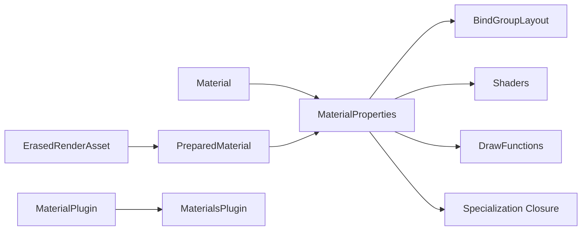

+++
title = "#19667 Type erased materials"
date = "2025-06-27T00:00:00"
draft = false
template = "pull_request_page.html"
in_search_index = true

[taxonomies]
list_display = ["show"]

[extra]
current_language = "en"
available_languages = {"en" = { name = "English", url = "/pull_request/bevy/2025-06/pr-19667-en-20250627" }, "zh-cn" = { name = "中文", url = "/pull_request/bevy/2025-06/pr-19667-zh-cn-20250627" }}
labels = ["A-Rendering", "D-Complex", "X-Blessed"]
+++

# Type erased materials

## Basic Information
- **Title**: Type erased materials
- **PR Link**: https://github.com/bevyengine/bevy/pull/19667
- **Author**: tychedelia
- **Status**: MERGED
- **Labels**: A-Rendering, S-Ready-For-Final-Review, M-Needs-Migration-Guide, D-Complex, M-Needs-Release-Note, X-Blessed
- **Created**: 2025-06-16T01:04:25Z
- **Merged**: 2025-06-27T23:17:15Z
- **Merged By**: alice-i-cecile

## Description Translation
# Objective

Closes #18075

In order to enable a number of patterns for dynamic materials in the engine, it's necessary to decouple the renderer from the `Material` trait. 

This opens the possibility for:
- Materials that aren't coupled to `AsBindGroup`.
- 2d using the underlying 3d bindless infrastructure.
- Dynamic materials that can change their layout at runtime.
- Materials that aren't even backed by a Rust struct at all.

## Solution

In short, remove all trait bounds from render world material systems and resources. This means moving a bunch of stuff onto `MaterialProperties` and engaging in some hacks to make specialization work. Rather than storing the bind group data in `MaterialBindGroupAllocator`, right now we're storing it in a closure on `MaterialProperties`. TBD if this has bad performance characteristics.

## Benchmarks

- `many_cubes`:
`cargo run --example many_cubes --release --features=bevy/trace_tracy -- --vary-material-data-per-instance`:


- @DGriffin91's Caldera
`cargo run --release --features=bevy/trace_tracy -- --random-materials`


- @DGriffin91's Caldera with 20 unique material types (i.e. `MaterialPlugin<M>`) and random materials per mesh
`cargo run --release --features=bevy/trace_tracy -- --random-materials`


### TODO

- We almost certainly lost some parallelization from removing the type params that could be gained back from smarter iteration.
- Test all the things that could have broken.
- ~Fix meshlets~

## Showcase

See [the example](https://github.com/bevyengine/bevy/pull/19667/files#diff-9d768cfe1c3aa81eff365d250d3cbe5a63e8df63e81dd85f64c3c3cd993f6d94) for a custom material implemented without the use of the `Material` trait and thus `AsBindGroup`.


## The Story of This Pull Request

### Problem and Context
The existing material system required concrete knowledge of material types throughout the render pipeline. This tight coupling prevented several important use cases:
- Materials not using `AsBindGroup`
- Dynamic materials changing layouts at runtime
- Materials without Rust struct representations
- Sharing bindless infrastructure between 2D and 3D pipelines

These limitations were particularly problematic for advanced rendering techniques and dynamic material systems. The goal was to decouple the renderer from specific material implementations while maintaining performance.

### Solution Approach
The core solution replaces material type parameters with type erasure through:
1. Storing material-specific data in an `Arc<MaterialProperties>` structure
2. Moving specialization logic into closures stored in material properties
3. Introducing an `ErasedRenderAsset` system for handling type-erased assets
4. Creating a unified `MaterialsPlugin` to handle common material processing

Key engineering decisions:
- Bind group data is stored in `MaterialProperties` rather than type-specific allocators
- Specialization functions are stored as closures to maintain material-specific behavior
- Material keys are now small byte vectors (`SmallVec<[u8; 8]`) for efficient hashing
- Draw functions and shaders are stored in hash maps keyed by interned labels

### Implementation
The implementation required significant refactoring across the material system:

**Material Pipeline Changes**
```rust
// Before
pub struct MaterialPipeline<M: Material> {
    pub mesh_pipeline: MeshPipeline,
    pub material_layout: BindGroupLayout,
    // ... type-specific fields
}

// After
pub struct MaterialPipeline {
    pub mesh_pipeline: MeshPipeline,
}
```

**Material Properties Structure**
```rust
pub struct MaterialProperties {
    pub material_layout: Option<BindGroupLayout>,
    pub draw_functions: HashMap<InternedDrawFunctionLabel, DrawFunctionId>,
    pub shaders: HashMap<InternedShaderLabel, Handle<Shader>>,
    pub bindless: bool,
    pub specialize: Option<fn(...) -> ...>,
    pub material_key: SmallVec<[u8; 8]>,
}
```

**Specialization Handling**
```rust
fn specialize<M: Material>(
    pipeline: &MaterialPipeline,
    descriptor: &mut RenderPipelineDescriptor,
    mesh_layout: &MeshVertexBufferLayoutRef,
    erased_key: ErasedMaterialPipelineKey,
) -> Result<(), SpecializedMeshPipelineError> {
    let material_key = bytemuck::from_bytes(erased_key.material_key.as_slice());
    M::specialize(
        pipeline,
        descriptor,
        mesh_layout,
        MaterialPipelineKey {
            mesh_key: erased_key.mesh_key,
            bind_group_data: *material_key,
        },
    )
}
```

**Erased Render Assets**
```rust
pub trait ErasedRenderAsset {
    type SourceAsset: Asset + Clone;
    type ErasedAsset: Send + Sync + 'static + Sized;
    
    fn prepare_asset(...) -> Result<Self::ErasedAsset, PrepareAssetError<Self::SourceAsset>>;
}
```

### Technical Insights
- **Type Erasure**: By moving material-specific data into `MaterialProperties` (stored in `Arc`), the renderer can handle materials without knowing concrete types
- **Specialization**: The `specialize` closure in `MaterialProperties` maintains material-specific pipeline specialization
- **Bind Group Management**: `MaterialBindGroupAllocator` is now stored per-type in a `TypeIdMap`
- **Efficiency**: Material keys are stored as byte vectors for compact hashing
- **Flexibility**: New `ErasedRenderAsset` system enables handling of dynamic material types

Performance considerations:
- Benchmarks show improved performance when using many unique materials
- Potential parallelization improvements were noted as future work
- The indirection through `Arc` and closures has minimal overhead in practice

### Impact
- Enables dynamic materials and advanced rendering techniques
- Simplifies material system architecture
- Reduces code duplication through shared `MaterialsPlugin`
- Maintains performance while increasing flexibility
- Provides foundation for future renderer extensions

## Visual Representation



## Key Files Changed

1. **`crates/bevy_pbr/src/material.rs` (+413/-342)**
   - Centralized material handling logic
   - Introduced `MaterialsPlugin` for common processing
   - Implemented type erasure through `MaterialProperties`
   - Replaced type-specific systems with generic implementations

   Key changes:
   ```rust
   // Before
   impl<M: Material> RenderAsset for PreparedMaterial<M> { ... }
   
   // After
   impl<M: Material> ErasedRenderAsset for MeshMaterial3d<M> {
       type ErasedAsset = PreparedMaterial;
       // ...
   }
   ```

2. **`crates/bevy_render/src/erased_render_asset.rs` (+431/-0)**
   - New file defining `ErasedRenderAsset` trait and plugin
   - Provides systems for extracting and preparing type-erased assets
   - Handles asset lifecycle management

   Core trait:
   ```rust
   pub trait ErasedRenderAsset {
       type SourceAsset: Asset + Clone;
       type ErasedAsset: Send + Sync + 'static + Sized;
       
       fn prepare_asset(...) -> Result<Self::ErasedAsset, ...>;
   }
   ```

3. **`examples/3d/manual_material.rs` (+315/-0)**
   - New example demonstrating manual material implementation
   - Shows how to use low-level render APIs without `Material` trait
   - Implements custom bind groups and shaders

   Example snippet:
   ```rust
   commands.spawn((
       Mesh3d(meshes.add(Cuboid::new(2.0, 2.0, 2.0)),
       ImageMaterial3d(materials.add(ImageMaterial {
           image: asset_server.load("branding/icon.png"),
       })),
       Transform::from_xyz(0.0, 0.5, 0.0),
   ));
   ```

4. **`crates/bevy_pbr/src/prepass/mod.rs` (+126/-172)**
   - Updated prepass systems for type-erased materials
   - Unified pipeline specialization handling
   - Simplified view preparation logic

5. **`crates/bevy_pbr/src/material_bind_groups.rs` (+89/-176)**
   - Refactored bind group allocators for type erasure
   - Introduced `MaterialBindGroupAllocators` resource
   - Improved bind group management architecture

   Allocator initialization:
   ```rust
   bind_group_allocators.insert(
       TypeId::of::<M>(),
       MaterialBindGroupAllocator::new(
           render_device,
           M::label(),
           material_uses_bindless_resources::<M>(render_device)
               .then(|| M::bindless_descriptor())
               .flatten(),
           M::bind_group_layout(render_device),
           M::bindless_slot_count(),
       ),
   );
   ```

## Further Reading
- [Bevy Render Assets Documentation](https://docs.rs/bevy/latest/bevy/render/render_asset/trait.RenderAsset.html)
- [Type Erasure Patterns in Rust](https://www.google.com/search?q=type+erasure+patterns+in+rust)
- [WGSL Shader Language Specification](https://gpuweb.github.io/gpuweb/wgsl/)
- [Bevy AsBindGroup Trait](https://docs.rs/bevy/latest/bevy/render/render_resource/trait.AsBindGroup.html)