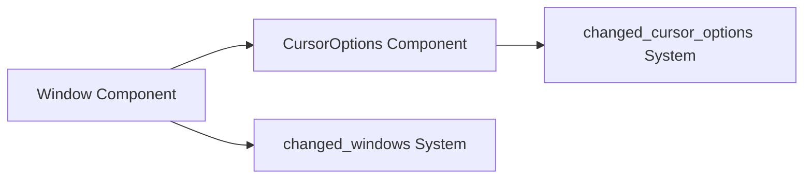

+++
title = "#19668 Split CursorOptions off of Window"
date = "2025-06-17T00:00:00"
draft = false
template = "pull_request_page.html"
in_search_index = true

[taxonomies]
list_display = ["show"]

[extra]
current_language = "en"
available_languages = {"en" = { name = "English", url = "/pull_request/bevy/2025-06/pr-19668-en-20250617" }, "zh-cn" = { name = "中文", url = "/pull_request/bevy/2025-06/pr-19668-zh-cn-20250617" }}
labels = ["A-Input", "A-Windowing", "D-Straightforward"]
+++

# Analysis of PR #19668: Split CursorOptions off of Window

## Basic Information
- **Title**: Split CursorOptions off of Window
- **PR Link**: https://github.com/bevyengine/bevy/pull/19668
- **Author**: janhohenheim
- **Status**: MERGED
- **Labels**: A-Input, A-Windowing, S-Ready-For-Final-Review, M-Needs-Migration-Guide, D-Straightforward
- **Created**: 2025-06-16T04:15:24Z
- **Merged**: 2025-06-17T20:38:46Z
- **Merged By**: alice-i-cecile

## Description Translation
# Objective

- Fixes #19627 
- Tackles part of #19644 
- Supersedes #19629
- `Window` has become a very very very big component
- As such, our change detection does not *really* work on it, as e.g. moving the mouse will cause a change for the entire window
- We circumvented this with a cache
- But, some things *shouldn't* be cached as they can be changed from outside the user's control, notably the cursor grab mode on web
- So, we need to disable the cache for that
- But because change detection is broken, that would result in the cursor grab mode being set every frame the mouse is moved
- That is usually *not* what a dev wants, as it forces the cursor to be locked even when the end-user is trying to free the cursor on the browser
  - the cache in this situation is invalid due to #8949

## Solution

- Split `Window` into multiple components, each with working change detection
- Disable caching of the cursor grab mode
  - This will only attempt to force the grab mode when the `CursorOptions` were touched by the user, which is *much* rarer than simply moving the mouse.
- If this PR is merged, I'll do the exact same for the other constituents of `Window` as a follow-up

## Testing

- Ran all the changed examples

## The Story of This Pull Request

The `Window` component in Bevy had grown too large, causing inefficient change detection. Any mouse movement would mark the entire `Window` component as changed, forcing systems to process all its properties. This was particularly problematic for cursor grab mode on web platforms, where external events could change the cursor state independently.

To address this, we split cursor-related properties into a separate `CursorOptions` component. This allows more granular change detection - mouse movements only affect cursor position in `Window`, while grab mode changes are isolated to `CursorOptions`. 

The implementation required changes across several areas:
1. `CursorOptions` became a standalone component with its own change detection
2. Systems accessing cursor properties were updated to query `CursorOptions`
3. A new `changed_cursor_options` system handles grab mode updates
4. Migration guides help users adapt to the new structure

Key technical decisions included:
- Maintaining both components on the same entity to preserve existing relationships
- Adding `CachedCursorOptions` for tracking state changes
- Creating a dedicated system for cursor option changes
- Preserving existing behavior while improving performance

These changes fix the specific issue with cursor grab mode resetting every frame on web platforms. The cursor grab mode now only updates when explicitly modified, not on every mouse movement. This reduces unnecessary system executions and improves responsiveness.

The refactor also sets the foundation for further decomposition of the `Window` component. Future PRs can split additional properties into dedicated components using the same pattern established here.

## Visual Representation



## Key Files Changed

### `crates/bevy_window/src/lib.rs` (+15/-2)
Modified to handle the new `CursorOptions` component when creating windows. The primary window now gets both `Window` and `CursorOptions` components.

```rust
// Before:
if let Some(primary_window) = &self.primary_window {
    app.world_mut().spawn(primary_window.clone()).insert((
        PrimaryWindow,
        RawHandleWrapperHolder(Arc::new(Mutex::new(None))));
}

// After:
if let Some(primary_window) = &self.primary_window {
    let mut entity_commands = app.world_mut().spawn(primary_window.clone());
    entity_commands.insert((
        PrimaryWindow,
        RawHandleWrapperHolder(Arc::new(Mutex::new(None))));
    if let Some(primary_cursor_options) = &self.primary_cursor_options {
        entity_commands.insert(primary_cursor_options.clone());
    }
}
```

### `crates/bevy_window/src/window.rs` (Structural changes)
Refactored to remove cursor options from `Window` and make `CursorOptions` a separate component.

```rust
// Before:
pub struct Window {
    pub cursor_options: CursorOptions,
    // ...other fields...
}

// After:
#[require(CursorOptions)]
pub struct Window {
    // ...other fields (without cursor_options)...
}

#[derive(Component, Debug, Clone)]
pub struct CursorOptions {
    // ...fields...
}
```

### `crates/bevy_winit/src/system.rs` (+98/-64)
Added new systems and components for handling cursor options separately.

```rust
// New components:
#[derive(Debug, Clone, Component, Deref, DerefMut)]
pub(crate) struct CachedWindow(Window);

#[derive(Debug, Clone, Component, Deref, DerefMut)]
pub(crate) struct CachedCursorOptions(CursorOptions);

// New system for cursor option changes:
pub(crate) fn changed_cursor_options(
    mut changed_windows: Query<
        (Entity, &Window, &mut CursorOptions, &mut CachedCursorOptions),
        Changed<CursorOptions>,
    >,
    // ...
) {
    // Handles grab mode, visibility, and hit test updates
}
```

### `crates/bevy_winit/src/winit_windows.rs` (+8/-7)
Updated window creation to include cursor options.

```rust
// Before:
create_window(event_loop, entity, &window, /* ... */);

// After:
create_window(event_loop, entity, &window, cursor_options, /* ... */);
```

### `examples/helpers/camera_controller.rs` (+8/-8)
Updated to query `CursorOptions` instead of `Window` for cursor settings.

```rust
// Before:
for mut window in &mut windows {
    window.cursor_options.grab_mode = CursorGrabMode::Locked;
}

// After:
for (_, mut cursor_options) in &mut windows {
    cursor_options.grab_mode = CursorGrabMode::Locked;
}
```

### `release-content/migration-guides/split-window.md` (+44/-0)
Added migration guide for the component split.

```markdown
## Migration

// old
fn lock_cursor(primary_window: Single<&mut Window, With<PrimaryWindow>>) {
    primary_window.cursor_options.grab_mode = CursorGrabMode::Locked;
}

// new
fn lock_cursor(primary_cursor_options: Single<&mut CursorOptions, With<PrimaryWindow>>) {
    primary_cursor_options.grab_mode = CursorGrabMode::Locked;
}
```

## Further Reading
- [Bevy ECS Change Detection](https://bevyengine.org/learn/book/development-practices/change-detection/)
- [Component Data in Bevy](https://bevyengine.org/learn/book/development-practices/component/)
- [Window Management in Bevy](https://bevyengine.org/learn/book/features/window/)