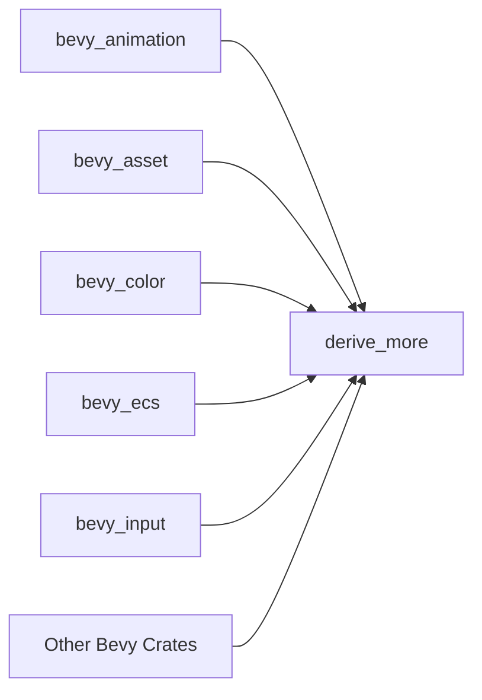

+++
title = "#19671 Update derive_more requirement from 1 to 2"
date = "2025-06-24T00:00:00"
draft = false
template = "pull_request_page.html"
in_search_index = true

[taxonomies]
list_display = ["show"]

[extra]
current_language = "en"
available_languages = {"en" = { name = "English", url = "/pull_request/bevy/2025-06/pr-19671-en-20250624" }, "zh-cn" = { name = "中文", url = "/pull_request/bevy/2025-06/pr-19671-zh-cn-20250624" }}
labels = ["C-Dependencies", "D-Straightforward"]
+++

## Update derive_more requirement from 1 to 2

### Basic Information
- **Title**: Update derive_more requirement from 1 to 2
- **PR Link**: https://github.com/bevyengine/bevy/pull/19671
- **Author**: app/dependabot
- **Status**: MERGED
- **Labels**: C-Dependencies, D-Straightforward, S-Needs-Review
- **Created**: 2025-06-16T06:46:43Z
- **Merged**: 2025-06-24T11:32:01Z
- **Merged By**: mockersf

### Description Translation
Updates the requirements on [derive_more](https://github.com/JelteF/derive_more) to permit the latest version.
<details>
<summary>Release notes</summary>
<p><em>Sourced from <a href="https://github.com/JelteF/derive_more/releases">derive_more's releases</a>.</em></p>
<blockquote>
<h2>2.0.1</h2>
<p><a href="https://docs.rs/derive_more/2.0.1">API docs</a>
<a href="https://github.com/JelteF/derive_more/blob/v2.0.1/CHANGELOG.md#201---2025-02-03">Changelog</a></p>
</blockquote>
</details>
<details>
<summary>Changelog</summary>
<p><em>Sourced from <a href="https://github.com/JelteF/derive_more/blob/master/CHANGELOG.md">derive_more's changelog</a>.</em></p>
<blockquote>
<h2>2.0.1 - 2025-02-03</h2>
<h3>Added</h3>
<ul>
<li>Add crate metadata for the Rust Playground. This makes sure that the Rust
Playground will have all <code>derive_more</code> features available once
<a href="https://docs.rs/selectors/latest/selectors"><code>selectors</code></a> crate updates its
<code>derive_more</code> version.
(<a href="https://redirect.github.com/JelteF/derive_more/pull/445">#445</a>)</li>
</ul>
<h2>2.0.0 - 2025-02-03</h2>
<h3>Breaking changes</h3>
<ul>
<li><code>use derive_more::SomeTrait</code> now imports macro only. Importing macro with
its trait along is possible now via <code>use derive_more::with_trait::SomeTrait</code>.
(<a href="https://redirect.github.com/JelteF/derive_more/pull/406">#406</a>)</li>
<li>Top-level <code>#[display(&quot;...&quot;)]</code> attribute on an enum now has defaulting behavior
instead of replacing when no wrapping is possible (no <code>_variant</code> placeholder).
(<a href="https://redirect.github.com/JelteF/derive_more/pull/395">#395</a>)</li>
</ul>
<h3>Fixed</h3>
<ul>
<li>Associated types of type parameters not being treated as generics in <code>Debug</code>
and <code>Display</code> expansions.
(<a href="https://redirect.github.com/JelteF/derive_more/pull/399">#399</a>)</li>
<li><code>unreachable_code</code> warnings on generated code when <code>!</code> (never type) is used.
(<a href="https://redirect.github.com/JelteF/derive_more/pull/404">#404</a>)</li>
<li>Ambiguous associated item error when deriving <code>TryFrom</code>, <code>TryInto</code> or <code>FromStr</code>
with an associated item called <code>Error</code> or <code>Err</code> respectively.
(<a href="https://redirect.github.com/JelteF/derive_more/pull/410">#410</a>)</li>
<li>Top-level <code>#[display(&quot;...&quot;)]</code> attribute on an enum being incorrectly treated
as transparent or wrapping.
(<a href="https://redirect.github.com/JelteF/derive_more/pull/395">#395</a>)</li>
<li>Omitted raw identifiers in <code>Debug</code> and <code>Display</code> expansions.
(<a href="https://redirect.github.com/JelteF/derive_more/pull/431">#431</a>)</li>
<li>Incorrect rendering of raw identifiers as field names in <code>Debug</code> expansions.
(<a href="https://redirect.github.com/JelteF/derive_more/pull/431">#431</a>)</li>
<li>Top-level <code>#[display(&quot;...&quot;)]</code> attribute on an enum not working transparently
for directly specified fields.
(<a href="https://redirect.github.com/JelteF/derive_more/pull/438">#438</a>)</li>
<li>Incorrect dereferencing of unsized fields in <code>Debug</code> and <code>Display</code> expansions.
(<a href="https://redirect.github.com/JelteF/derive_more/pull/440">#440</a>)</li>
</ul>
<h2>0.99.19 - 2025-02-03</h2>
<ul>
<li>Add crate metadata for the Rust Playground.</li>
</ul>
<h2>1.0.0 - 2024-08-07</h2>
<!-- raw HTML omitted -->
</blockquote>
<p>... (truncated)</p>
</details>
<details>
<summary>Commits</summary>
<ul>
<li><a href="https://github.com/JelteF/derive_more/commit/a78d8ee41dc4c5fd73572b65dee4cc1369a4c6f1"><code>a78d8ee</code></a> chore: Release</li>
<li><a href="https://github.com/JelteF/derive_more/commit/2aeee4d1c0de55b6b42348eab3e016cdfab679a7"><code>2aeee4d</code></a> Update changelog (<a href="https://redirect.github.com/JelteF/derive_more/issues/446">#446</a>)</li>
<li><a href="https://github.com/JelteF/derive_more/commit/5afbaa1d8e776ba86b8341b19519720ddee0e50c"><code>5afbaa1</code></a> Add Rust Playground metadata (<a href="https://redirect.github.com/JelteF/derive_more/issues/445">#445</a>)</li>
<li><a href="https://github.com/JelteF/derive_more/commit/d6c3315f12bc88468c1d463a37581163dbfdaea8"><code>d6c3315</code></a> Prepare 2.0.0 release (<a href="https://redirect.github.com/JelteF/derive_more/issues/444">#444</a>)</li>
<li><a href="https://github.com/JelteF/derive_more/commit/c5e5e82c0ade464539c21b055bd26378579e26e8"><code>c5e5e82</code></a> Fix unsized fields usage in <code>Display</code>/<code>Debug</code> derives (<a href="https://redirect.github.com/JelteF/derive_more/issues/440">#440</a>, <a href="https://redirect.github.com/JelteF/derive_more/issues/432">#432</a>)</li>
<li><a href="https://github.com/JelteF/derive_more/commit/d391493a3c9645c1bc1e139779f8631c48b67d1d"><code>d391493</code></a> Fix field transparency for top-level shared attribute in <code>Display</code> (<a href="https://redirect.github.com/JelteF/derive_more/issues/438">#438</a>)</li>
<li><a href="https://github.com/JelteF/derive_more/commit/f14c7a759af6d0a9a12f36227e3ce21d2c4f406a"><code>f14c7a7</code></a> Fix raw identifiers usage in <code>Display</code>/<code>Debug</code> derives (<a href="https://redirect.github.com/JelteF/derive_more/issues/434">#434</a>, <a href="https://redirect.github.com/JelteF/derive_more/issues/431">#431</a>)</li>
<li><a href="https://github.com/JelteF/derive_more/commit/7b23de3d53616deec91cd507a0afd19b7634e426"><code>7b23de3</code></a> Update <code>convert_case</code> crate from 0.6 to 0.7 version (<a href="https://redirect.github.com/JelteF/derive_more/issues/436">#436</a>)</li>
<li><a href="https://github.com/JelteF/derive_more/commit/cc9957e9cdacb1617547f3b55bac885202284291"><code>cc9957e</code></a> Fix <code>compile_fail</code> tests and make Clippy happy for 1.84 Rust (<a href="https://redirect.github.com/JelteF/derive_more/issues/435">#435</a>)</li>
<li><a href="https://github.com/JelteF/derive_more/commit/17d61c31188bbeb1dc7269246b4179d5dace1375"><code>17d61c3</code></a> Fix transparency and behavior of shared formatting on enums (<a href="https://redirect.github.com/JelteF/derive_more/issues/395">#395</a>, <a href="https://redirect.github.com/JelteF/derive_more/issues/377">#377</a>, <a href="https://redirect.github.com/JelteF/derive_more/issues/411">#411</a>)</li>
<li>Additional commits viewable in <a href="https://github.com/JelteF/derive_more/compare/v1.0.0...v2.0.1">compare view</a></li>
</ul>
</details>
<br />

Dependabot will resolve any conflicts with this PR as long as you don't alter it yourself. You can also trigger a rebase manually by commenting `@dependabot rebase`.

[//]: # (dependabot-automerge-start)
[//]: # (dependabot-automerge-end)

---

<details>
<summary>Dependabot commands and options</summary>
<br />

You can trigger Dependabot actions by commenting on this PR:
- `@dependabot rebase` will rebase this PR
- `@dependabot recreate` will recreate this PR, overwriting any edits that have been made to it
- `@dependabot merge` will merge this PR after your CI passes on it
- `@dependabot squash and merge` will squash and merge this PR after your CI passes on it
- `@dependabot cancel merge` will cancel a previously requested merge and block automerging
- `@dependabot reopen` will reopen this PR if it is closed
- `@dependabot close` will close this PR and stop Dependabot recreating it. You can achieve the same result by closing it manually
- `@dependabot show <dependency name> ignore conditions` will show all of the ignore conditions of the specified dependency
- `@dependabot ignore this major version` will close this PR and stop Dependabot creating any more for this major version (unless you reopen the PR or upgrade to it yourself)
- `@dependabot ignore this minor version` will close this PR and stop Dependabot creating any more for this minor version (unless you reopen the PR or upgrade to it yourself)
- `@dependabot ignore this dependency` will close this PR and stop Dependabot creating any more for this dependency (unless you reopen the PR or upgrade to it yourself)

</details>

### The Story of This Pull Request

Bevy's dependency on the `derive_more` crate needed updating to version 2.0.1 from the previous 1.x series. This update was necessary to incorporate critical bug fixes and improvements in the macro derivation library, particularly around handling of raw identifiers, unsized fields, and enum formatting. The update also added Rust Playground metadata, improving developer experience for Bevy contributors using the playground.

The upgrade process required careful consideration due to breaking changes in `derive_more` 2.0. The most significant changes included:
1. Modified trait import behavior (`use derive_more::SomeTrait` now imports only the macro)
2. New defaulting behavior for `#[display("...")]` attributes on enums
3. Fixed handling of associated types in `Debug` and `Display` expansions

Since Bevy uses `derive_more` across 15 different crates for deriving common traits like `From`, `Display`, and `Into`, the update needed to be applied consistently throughout the codebase. The straightforward nature of the change (version bump only) suggested Bevy's usage patterns were compatible with the new major version out-of-the-box.

The implementation involved systematically updating the version requirement in each affected crate's Cargo.toml file. Dependabot automatically generated these changes, which were then reviewed and merged by the maintainers. The changes followed this consistent pattern:

```toml
# Before:
derive_more = { version = "1", default-features = false, features = ["from"] }

# After:
derive_more = { version = "2", default-features = false, features = ["from"] }
```

The minimal diff indicates no additional code changes were required in Bevy's implementation. This suggests that either:
1) Bevy wasn't using the affected functionality with breaking changes, or
2) The breaking changes were compatible with Bevy's existing usage patterns

The update brings several concrete benefits to the Bevy project:
- Fixes for edge cases in derive macros (raw identifiers, unsized fields)
- Elimination of `unreachable_code` warnings with never types
- Improved consistency in enum display formatting
- Better playground support for Bevy examples

From a maintenance perspective, this update reduces technical debt by keeping dependencies current. The smooth upgrade process demonstrates good encapsulation in Bevy's use of the derive macros - the abstraction boundary held despite underlying library changes.

### Visual Representation



### Key Files Changed

1. **crates/bevy_animation/Cargo.toml**
   - Updated derive_more version from 1 to 2
   - Maintained identical feature flags (`from`)
   ```diff
   - derive_more = { version = "1", default-features = false, features = ["from"] }
   + derive_more = { version = "2", default-features = false, features = ["from"] }
   ```

2. **crates/bevy_ecs/Cargo.toml**
   - Updated version requirement while preserving multiple features
   ```diff
   - derive_more = { version = "1", default-features = false, features = [
   + derive_more = { version = "2", default-features = false, features = [
         "from",
         "display",
         "into",
     ] }
   ```

3. **crates/bevy_render/Cargo.toml**
   - Simple version bump maintaining existing configuration
   ```diff
   - derive_more = { version = "1", default-features = false, features = ["from"] }
   + derive_more = { version = "2", default-features = false, features = ["from"] }
   ```

4. **crates/bevy_tasks/Cargo.toml**
   - Updated version while keeping deref-related features
   ```diff
   - derive_more = { version = "1", default-features = false, features = [
   + derive_more = { version = "2", default-features = false, features = [
         "deref",
         "deref_mut",
     ] }
   ```

5. **crates/bevy_reflect/Cargo.toml**
   - Standard version update preserving minimal feature set
   ```diff
   - derive_more = { version = "1", default-features = false, features = ["from"] }
   + derive_more = { version = "2", default-features = false, features = ["from"] }
   ```

### Further Reading
1. [derive_more v2.0.0 Release Notes](https://github.com/JelteF/derive_more/blob/v2.0.1/CHANGELOG.md#200---2025-02-03)
2. [Rust's Macro Derivation Patterns](https://doc.rust-lang.org/reference/procedural-macros.html)
3. [Semantic Versioning in Rust Dependencies](https://doc.rust-lang.org/cargo/reference/specifying-dependencies.html)

### Full Code Diff
```diff
diff --git a/crates/bevy_animation/Cargo.toml b/crates/bevy_animation/Cargo.toml
index adf17a858..637231fd4 100644
--- a/crates/bevy_animation/Cargo.toml
+++ b/crates/bevy_animation/Cargo.toml
@@ -37,7 +37,7 @@ serde = "1"
 blake3 = { version = "1.0" }
 downcast-rs = { version = "2", default-features = false, features = ["std"] }
 thiserror = { version = "2", default-features = false }
-derive_more = { version = "1", default-features = false, features = ["from"] }
+derive_more = { version = "2", default-features = false, features = ["from"] }
 either = "1.13"
 thread_local = "1"
 uuid = { version = "1.13.1", features = ["v4"] }
diff --git a/crates/bevy_asset/Cargo.toml b/crates/bevy_asset/Cargo.toml
index 0835b3b49..edf898613 100644
--- a/crates/bevy_asset/Cargo.toml
+++ b/crates/bevy_asset/Cargo.toml
@@ -57,7 +57,7 @@ parking_lot = { version = "0.12", default-features = false, features = [
 ron = { version = "0.10", default-features = false }
 serde = { version = "1", default-features = false, features = ["derive"] }
 thiserror = { version = "2", default-features = false }
-derive_more = { version = "1", default-features = false, features = ["from"] }
+derive_more = { version = "2", default-features = false, features = ["from"] }
 uuid = { version = "1.13.1", default-features = false, features = [
   "v4",
   "serde",
diff --git a/crates/bevy_color/Cargo.toml b/crates/bevy_color/Cargo.toml
index 298f80e54..99ac8a70d 100644
--- a/crates/bevy_color/Cargo.toml
+++ b/crates/bevy_color/Cargo.toml
@@ -19,7 +19,7 @@ serde = { version = "1.0", features = [
   "derive",
 ], default-features = false, optional = true }
 thiserror = { version = "2", default-features = false }
-derive_more = { version = "1", default-features = false, features = ["from"] }
+derive_more = { version = "2", default-features = false, features = ["from"] }
 wgpu-types = { version = "24", default-features = false, optional = true }
 encase = { version = "0.10", default-features = false, optional = true }
 
diff --git a/crates/bevy_ecs/Cargo.toml b/crates/bevy_ecs/Cargo.toml
index 5aa3dfe5e..1e94aa5ee 100644
--- a/crates/bevy_ecs/Cargo.toml
+++ b/crates/bevy_ecs/Cargo.toml
@@ -104,7 +104,7 @@ serde = { version = "1", default-features = false, features = [
   "serde_derive",
 ], optional = true }
 thiserror = { version = "2", default-features = false }
-derive_more = { version = "1", default-features = false, features = [
+derive_more = { version = "2", default-features = false, features = [
   "from",
   "display",
   "into",
diff --git a/crates/bevy_input/Cargo.toml b/crates/bevy_input/Cargo.toml
index 2961c0d11..7c69aad54 100644
--- a/crates/bevy_input/Cargo.toml
+++ b/crates/bevy_input/Cargo.toml
@@ -75,7 +75,7 @@ serde = { version = "1", features = [
   "derive",
 ], default-features = false, optional = true }
 thiserror = { version = "2", default-features = false }
-derive_more = { version = "1", default-features = false, features = ["from"] }
+derive_more = { version = "2", default-features = false, features = ["from"] }
 smol_str = { version = "0.2", default-features = false, optional = true }
 log = { version = "0.4", default-features = false }
 
diff --git a/crates/bevy_math/Cargo.toml b/crates/bevy_math/Cargo.toml
index f28e9466e..3fad8e620 100644
--- a/crates/bevy_math/Cargo.toml
+++ b/crates/bevy_math/Cargo.toml
@@ -12,7 +12,7 @@ rust-version = "1.85.0"
 [dependencies]
 glam = { version = "0.29.3", default-features = false, features = ["bytemuck"] }
 thiserror = { version = "2", default-features = false }
-derive_more = { version = "1", default-features = false, features = [
+derive_more = { version = "2", default-features = false, features = [
   "from",
   "into",
 ] }
diff --git a/crates/bevy_pbr/Cargo.toml b/crates/bevy_pbr/Cargo.toml
index 4ecf53a77..f2e973eae 100644
--- a/crates/bevy_pbr/Cargo.toml
+++ b/crates/bevy_pbr/Cargo.toml
@@ -54,7 +54,7 @@ bevy_platform = { path = "../bevy_platform", version = "0.17.0-dev", default-fea
 bitflags = "2.3"
 fixedbitset = "0.5"
 thiserror = { version = "2", default-features = false }
-derive_more = { version = "1", default-features = false, features = ["from"] }
+derive_more = { version = "2", default-features = false, features = ["from"] }
 # meshlet
 lz4_flex = { version = "0.11", default-features = false, features = [
   "frame",
diff --git a/crates/bevy_reflect/Cargo.toml b/crates/bevy_reflect/Cargo.toml
index 087cdb44d..60f8478ba 100644
--- a/crates/bevy_reflect/Cargo.toml
+++ b/crates/bevy_reflect/Cargo.toml
@@ -93,7 +93,7 @@ erased-serde = { version = "0.4", default-features = false, features = [
 disqualified = { version = "1.0", default-features = false }
 downcast-rs = { version = "2", default-features = false }
 thiserror = { version = "2", default-features = false }
-derive_more = { version = "1", default-features = false, features = ["from"] }
+derive_more = { version = "2", default-features = false, features = ["from"] }
 serde = { version = "1", default-features = false, features = ["alloc"] }
 assert_type_match = "0.1.1"
 smallvec = { version = "1.11", default-features = false, optional = true }
diff --git a/crates/bevy_render/Cargo.toml b/crates/bevy_render/Cargo.toml
index 3797c51e0..9ecbbfc74 100644
--- a/crates/bevy_render/Cargo.toml
+++ b/crates/bevy_render/Cargo.toml
@@ -102,7 +102,7 @@ serde = { version = "1", features = ["derive"] }
 bytemuck = { version = "1.5", features = ["derive", "must_cast"] }
 downcast-rs = { version = "2", default-features = false, features = ["std"] }
 thiserror = { version = "2", default-features = false }
-derive_more = { version = "1", default-features = false, features = ["from"] }
+derive_more = { version = "2", default-features = false, features = ["from"] }
 futures-lite = "2.0.1"
 encase = { version = "0.10", features = ["glam"] }
 # For wgpu profiling using tracing. Use `RUST_LOG=info` to also capture the wgpu spans.
diff --git a/crates/bevy_scene/Cargo.toml b/crates/bevy_scene/Cargo.toml
index 919a10620..48d718b41 100644
--- a/crates/bevy_scene/Cargo.toml
+++ b/crates/bevy_scene/Cargo.toml
@@ -36,7 +36,7 @@ bevy_platform = { path = "../bevy_platform", version = "0.17.0-dev", default-fea
 serde = { version = "1.0", features = ["derive"], optional = true }
 uuid = { version = "1.13.1", features = ["v4"] }
 thiserror = { version = "2", default-features = false }
-derive_more = { version = "1", default-features = false, features = ["from"] }
+derive_more = { version = "2", default-features = false, features = ["from"] }
 
 [target.'cfg(target_arch = "wasm32")'.dependencies]
 # TODO: Assuming all wasm builds are for the browser. Require `no_std` support to break assumption.
diff --git a/crates/bevy_solari/Cargo.toml b/crates/bevy_solari/Cargo.toml
index 03976dea3..ffaca58ba 100644
--- a/crates/bevy_solari/Cargo.toml
+++ b/crates/bevy_solari/Cargo.toml
@@ -29,7 +29,7 @@ bevy_transform = { path = "../bevy_transform", version = "0.17.0-dev" }
 
 # other
 bytemuck = { version = "1" }
-derive_more = { version = "1", default-features = false, features = ["from"] }
+derive_more = { version = "2", default-features = false, features = ["from"] }
 tracing = { version = "0.1", default-features = false, features = ["std"] }
 
 [lints]
diff --git a/crates/bevy_sprite/Cargo.toml b/crates/bevy_sprite/Cargo.toml
index 1d356fdc4..1538ac1eb 100644
--- a/crates/bevy_sprite/Cargo.toml
+++ b/crates/bevy_sprite/Cargo.toml
@@ -36,7 +36,7 @@ bevy_platform = { path = "../bevy_platform", version = "0.17.0-dev", default-fea
 # other
 bytemuck = { version = "1", features = ["derive", "must_cast"] }
 fixedbitset = "0.5"
-derive_more = { version = "1", default-features = false, features = ["from"] }
+derive_more = { version = "2", default-features = false, features = ["from"] }
 bitflags = "2.3"
 radsort = "0.1"
 nonmax = "0.5"
diff --git a/crates/bevy_tasks/Cargo.toml b/crates/bevy_tasks/Cargo.toml
index 61b07448e..e28d7fc88 100644
--- a/crates/bevy_tasks/Cargo.toml
+++ b/crates/bevy_tasks/Cargo.toml
@@ -55,7 +55,7 @@ futures-lite = { version = "2.0.1", default-features = false, features = [
   "alloc",
 ] }
 async-task = { version = "4.4.0", default-features = false }
-derive_more = { version = "