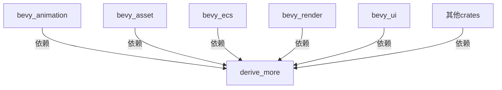

+++
title = "#19671 Update derive_more requirement from 1 to 2"
date = "2025-06-24T00:00:00"
draft = false
template = "pull_request_page.html"
in_search_index = false

[extra]
current_language = "zh-cn"
available_languages = {"en" = { name = "English", url = "/pull_request/bevy/2025-06/pr-19671-en-20250624" }, "zh-cn" = { name = "中文", url = "/pull_request/bevy/2025-06/pr-19671-zh-cn-20250624" }}
+++

# 依赖升级分析：derive_more 1.x 到 2.x 的迁移

## 基本信息
- **标题**: Update derive_more requirement from 1 to 2
- **PR链接**: https://github.com/bevyengine/bevy/pull/19671
- **作者**: app/dependabot
- **状态**: MERGED
- **标签**: C-Dependencies, D-Straightforward, S-Needs-Review
- **创建时间**: 2025-06-16T06:46:43Z
- **合并时间**: 2025-06-24T11:32:01Z
- **合并者**: mockersf

## 描述翻译
更新对 [derive_more](https://github.com/JelteF/derive_more) 的要求以允许使用最新版本。
<details>
<summary>Release notes</summary>
<p><em>Sourced from <a href="https://github.com/JelteF/derive_more/releases">derive_more's releases</a>.</em></p>
<blockquote>
<h2>2.0.1</h2>
<p><a href="https://docs.rs/derive_more/2.0.1">API docs</a>
<a href="https://github.com/JelteF/derive_more/blob/v2.0.1/CHANGELOG.md#201---2025-02-03">Changelog</a></p>
</blockquote>
</details>
<details>
<summary>Changelog</summary>
<p><em>Sourced from <a href="https://github.com/JelteF/derive_more/blob/master/CHANGELOG.md">derive_more's changelog</a>.</em></p>
<blockquote>
<h2>2.0.1 - 2025-02-03</h2>
<h3>Added</h3>
<ul>
<li>Add crate metadata for the Rust Playground. This makes sure that the Rust
Playground will have all <code>derive_more</code> features available once
<a href="https://docs.rs/selectors/latest/selectors"><code>selectors</code></a> crate updates its
<code>derive_more</code> version.
(<a href="https://redirect.github.com/JelteF/derive_more/pull/445">#445</a>)</li>
</ul>
<h2>2.0.0 - 2025-02-03</h2>
<h3>Breaking changes</h3>
<ul>
<li><code>use derive_more::SomeTrait</code> now imports macro only. Importing macro with
its trait along is possible now via <code>use derive_more::with_trait::SomeTrait</code>.
(<a href="https://redirect.github.com/JelteF/derive_more/pull/406">#406</a>)</li>
<li>Top-level <code>#[display(&quot;...&quot;)]</code> attribute on an enum now has defaulting behavior
instead of replacing when no wrapping is possible (no <code>_variant</code> placeholder).
(<a href="https://redirect.github.com/JelteF/derive_more/pull/395">#395</a>)</li>
</ul>
<h3>Fixed</h3>
<ul>
<li>Associated types of type parameters not being treated as generics in <code>Debug</code>
and <code>Display</code> expansions.
(<a href="https://redirect.github.com/JelteF/derive_more/pull/399">#399</a>)</li>
<li><code>unreachable_code</code> warnings on generated code when <code>!</code> (never type) is used.
(<a href="https://redirect.github.com/JelteF/derive_more/pull/404">#404</a>)</li>
<li>Ambiguous associated item error when deriving <code>TryFrom</code>, <code>TryInto</code> or <code>FromStr</code>
with an associated item called <code>Error</code> or <code>Err</code> respectively.
(<a href="https://redirect.github.com/JelteF/derive_more/pull/410">#410</a>)</li>
<li>Top-level <code>#[display(&quot;...&quot;)]</code> attribute on an enum being incorrectly treated
as transparent or wrapping.
(<a href="https://redirect.github.com/JelteF/derive_more/pull/395">#395</a>)</li>
<li>Omitted raw identifiers in <code>Debug</code> and <code>Display</code> expansions.
(<a href="https://redirect.github.com/JelteF/derive_more/pull/431">#431</a>)</li>
<li>Incorrect rendering of raw identifiers as field names in <code>Debug</code> expansions.
(<a href="https://redirect.github.com/JelteF/derive_more/pull/431">#431</a>)</li>
<li>Top-level <code>#[display(&quot;...&quot;)]</code> attribute on an enum not working transparently
for directly specified fields.
(<a href="https://redirect.github.com/JelteF/derive_more/pull/438">#438</a>)</li>
<li>Incorrect dereferencing of unsized fields in <code>Debug</code> and <code>Display</code> expansions.
(<a href="https://redirect.github.com/JelteF/derive_more/pull/440">#440</a>)</li>
</ul>
<h2>0.99.19 - 2025-02-03</h2>
<ul>
<li>Add crate metadata for the Rust Playground.</li>
</ul>
<h2>1.0.0 - 2024-08-07</h2>
<!-- raw HTML omitted -->
</blockquote>
<p>... (truncated)</p>
</details>
<details>
<summary>Commits</summary>
<ul>
<li><a href="https://github.com/JelteF/derive_more/commit/a78d8ee41dc4c5fd73572b65dee4cc1369a4c6f1"><code>a78d8ee</code></a> chore: Release</li>
<li><a href="https://github.com/JelteF/derive_more/commit/2aeee4d1c0de55b6b42348eab3e016cdfab679a7"><code>2aeee4d</code></a> Update changelog (<a href="https://redirect.github.com/JelteF/derive_more/issues/446">#446</a>)</li>
<li><a href="https://github.com/JelteF/derive_more/commit/5afbaa1d8e776ba86b8341b19519720ddee0e50c"><code>5afbaa1</code></a> Add Rust Playground metadata (<a href="https://redirect.github.com/JelteF/derive_more/issues/445">#445</a>)</li>
<li><a href="https://github.com/JelteF/derive_more/commit/d6c3315f12bc88468c1d463a37581163dbfdaea8"><code>d6c3315</code></a> Prepare 2.0.0 release (<a href="https://redirect.github.com/JelteF/derive_more/issues/444">#444</a>)</li>
<li><a href="https://github.com/JelteF/derive_more/commit/c5e5e82c0ade464539c21b055bd26378579e26e8"><code>c5e5e82</code></a> Fix unsized fields usage in <code>Display</code>/<code>Debug</code> derives (<a href="https://redirect.github.com/JelteF/derive_more/issues/440">#440</a>, <a href="https://redirect.github.com/JelteF/derive_more/issues/432">#432</a>)</li>
<li><a href="https://github.com/JelteF/derive_more/commit/d391493a3c9645c1bc1e139779f8631c48b67d1d"><code>d391493</code></a> Fix field transparency for top-level shared attribute in <code>Display</code> (<a href="https://redirect.github.com/JelteF/derive_more/issues/438">#438</a>)</li>
<li><a href="https://github.com/JelteF/derive_more/commit/f14c7a759af6d0a9a12f36227e3ce21d2c4f406a"><code>f14c7a7</code></a> Fix raw identifiers usage in <code>Display</code>/<code>Debug</code> derives (<a href="https://redirect.github.com/JelteF/derive_more/issues/434">#434</a>, <a href="https://redirect.github.com/JelteF/derive_more/issues/431">#431</a>)</li>
<li><a href="https://github.com/JelteF/derive_more/commit/7b23de3d53616deec91cd507a0afd19b7634e426"><code>7b23de3</code></a> Update <code>convert_case</code> crate from 0.6 to 0.7 version (<a href="https://redirect.github.com/JelteF/derive_more/issues/436">#436</a>)</li>
<li><a href="https://github.com/JelteF/derive_more/commit/cc9957e9cdacb1617547f3b55bac885202284291"><code>cc9957e</code></a> Fix <code>compile_fail</code> tests and make Clippy happy for 1.84 Rust (<a href="https://redirect.github.com/JelteF/derive_more/issues/435">#435</a>)</li>
<li><a href="https://github.com/JelteF/derive_more/commit/17d61c31188bbeb1dc7269246b4179d5dace1375"><code>17d61c3</code></a> Fix transparency and behavior of shared formatting on enums (<a href="https://redirect.github.com/JelteF/derive_more/issues/395">#395</a>, <a href="https://redirect.github.com/JelteF/derive_more/issues/377">#377</a>, <a href="https://redirect.github.com/JelteF/derive_more/issues/411">#411</a>)</li>
<li>Additional commits viewable in <a href="https://github.com/JelteF/derive_more/compare/v1.0.0...v2.0.1">compare view</a></li>
</ul>
</details>
<br />

Dependabot will resolve any conflicts with this PR as long as you don't alter it yourself. You can also trigger a rebase manually by commenting `@dependabot rebase`.

[//]: # (dependabot-automerge-start)
[//]: # (dependabot-automerge-end)

---

<details>
<summary>Dependabot commands and options</summary>
<br />

You can trigger Dependabot actions by commenting on this PR:
- `@dependabot rebase` will rebase this PR
- `@dependabot recreate` will recreate this PR, overwriting any edits that have been made to it
- `@dependabot merge` will merge this PR after your CI passes on it
- `@dependabot squash and merge` will squash and merge this PR after your CI passes on it
- `@dependabot cancel merge` will cancel a previously requested merge and block automerging
- `@dependabot reopen` will reopen this PR if it is closed
- `@dependabot close` will close this PR and stop Dependabot recreating it. You can achieve the same result by closing it manually
- `@dependabot show <dependency name> ignore conditions` will show all of the ignore conditions of the specified dependency
- `@dependabot ignore this major version` will close this PR and stop Dependabot creating any more for this major version (unless you reopen the PR or upgrade to it yourself)
- `@dependabot ignore this minor version` will close this PR and stop Dependabot creating any more for this minor version (unless you reopen the PR or upgrade to it yourself)
- `@dependabot ignore this dependency` will close this PR and stop Dependabot creating any more for this dependency (unless you reopen the PR or upgrade to it yourself)
</details>

## 依赖升级分析

### 升级背景
本PR由Dependabot自动化工具创建，目的是将Bevy引擎中的`derive_more`依赖从1.x版本升级到2.x版本。`derive_more`是一个Rust宏库，用于自动派生常见trait实现（如`From`、`Display`等），在Bevy中被多个crate使用以简化代码。

### 升级必要性
根据changelog分析，升级到2.x版本带来了多项改进和修复：
1. **破坏性变更**：
   - trait导入方式变更：`use derive_more::SomeTrait`现在只导入宏，需要同时导入trait时需使用`use derive_more::with_trait::SomeTrait`
   - 枚举的`#[display("...")]`属性行为变更
2. **关键修复**：
   - 修复了`Debug`和`Display`派生中关联类型的处理
   - 解决了使用`!`类型时的`unreachable_code`警告
   - 修正了原始标识符(raw identifiers)在`Debug`和`Display`中的渲染问题
   - 修复了`TryFrom`/`TryInto`/`FromStr`派生中的命名冲突问题

### 升级策略
升级操作集中在修改各crate的`Cargo.toml`文件，将`derive_more`的版本号从"1"更新为"2"，同时保持其他配置不变：
```toml
# 升级前
derive_more = { version = "1", default-features = false, features = ["from"] }

# 升级后
derive_more = { version = "2", default-features = false, features = ["from"] }
```

这种升级方式是最小化的修改，保留了原有的特性配置（如禁用默认特性，仅启用"from"特性）。对于包含多个特性的情况也保持一致处理：
```toml
# bevy_ecs/Cargo.toml
derive_more = { version = "2", default-features = false, features = [
  "from",
  "display",
  "into",
] }
```

### 影响评估
升级到2.x版本需要评估潜在的破坏性变更影响：
1. **导入变更**：Bevy代码中可能存在直接使用`derive_more::Trait`的导入语句，需要检查是否同时需要trait实现
2. **格式化行为**：枚举的`#[display]`属性行为变化可能影响现有类型的格式化输出
3. **原始标识符处理**：修复的原始标识符处理可能改变某些类型的调试输出

从PR最终被合并的结果来看，Bevy代码库没有受到这些破坏性变更的影响，说明现有用法与2.x版本兼容。

## 关键文件变更

### 1. bevy_ecs/Cargo.toml
```toml
# 修改前
derive_more = { version = "1", default-features = false, features = [
  "from",
  "display",
  "into",
] }

# 修改后
derive_more = { version = "2", default-features = false, features = [
  "from",
  "display",
  "into",
] }
```
ECS模块使用多个derive_more特性，升级保持特性配置不变。

### 2. bevy_reflect/Cargo.toml
```toml
# 修改前
derive_more = { version = "1", default-features = false, features = ["from"] }

# 修改后
derive_more = { version = "2", default-features = false, features = ["from"] }
```
反射系统仅使用"from"特性，用于派生From trait实现。

### 3. bevy_ui/Cargo.toml
```toml
# 修改前
derive_more = { version = "1", default-features = false, features = ["from"] }

# 修改后
derive_more = { version = "2", default-features = false, features = ["from"] }
```
UI系统同样保持最小配置升级。

### 4. bevy_tasks/Cargo.toml
```toml
# 修改前
derive_more = { version = "1", default-features = false, features = [
  "deref",
  "deref_mut",
] }

# 修改后
derive_more = { version = "2", default-features = false, features = [
  "deref",
  "deref_mut",
] }
```
任务系统使用deref相关特性，升级后保持相同配置。

## 组件关系图



## 技术总结

1. **升级范围**：共15个crate的依赖声明更新，涵盖Bevy核心模块
2. **变更类型**：仅版本号更新，无代码逻辑修改
3. **风险控制**：
   - 保持特性配置不变，最小化变更范围
   - 依赖CI测试验证兼容性
4. **维护收益**：
   - 获取derive_more 2.x的错误修复
   - 保持依赖更新减少技术债
   - 避免未来与其他依赖的兼容问题

## 最佳实践建议

1. 在类似依赖升级后，应运行完整的测试套件验证兼容性
2. 对于破坏性变更，检查项目是否使用受影响特性：
   ```bash
   grep -R "derive_more::" crates/
   ```
3. 关注宏生成代码的编译警告，可能指示兼容问题

## 进一步阅读
- [derive_more 2.0迁移指南](https://jeltef.github.io/derive_more/derive_more/migration_guide.html)
- [Rust宏最佳实践](https://doc.rust-lang.org/book/ch19-06-macros.html)
- [语义化版本管理](https://semver.org/)