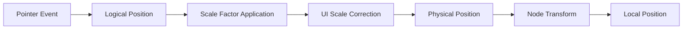

+++
title = "#19676 slider widget track click position `UiScale` fix"
date = "2025-06-16T00:00:00"
draft = false
template = "pull_request_page.html"
in_search_index = true

[taxonomies]
list_display = ["show"]

[extra]
current_language = "en"
available_languages = {"en" = { name = "English", url = "/pull_request/bevy/2025-06/pr-19676-en-20250616" }, "zh-cn" = { name = "中文", url = "/pull_request/bevy/2025-06/pr-19676-zh-cn-20250616" }}
labels = ["C-Bug", "D-Trivial", "A-UI"]
+++

# Slider Widget Track Click Position UiScale Fix

## Basic Information
- **Title**: slider widget track click position `UiScale` fix
- **PR Link**: https://github.com/bevyengine/bevy/pull/19676
- **Author**: ickshonpe
- **Status**: MERGED
- **Labels**: C-Bug, D-Trivial, A-UI, S-Ready-For-Final-Review
- **Created**: 2025-06-16T11:55:40Z
- **Merged**: 2025-06-16T22:28:57Z
- **Merged By**: alice-i-cecile

## Description Translation
# Objective

The position for track clicks in `core_slider` is calculated incorrectly when using `UiScale`.

## Solution

`trigger.event().pointer_location.position` uses logical window coordinates, that is:

`position = physical_position / window_scale_factor`

while `ComputedNodeTarget::scale_factor` returns the window scale factor multiplied by Ui Scale:

`target_scale_factor = window_scale_factor * ui_scale`

So to get the physical position need to divide by the `UiScale`:

```
position * target_scale_factor / ui_scale
= (physical_postion / window_scale_factor) * (window_scale_factor * ui_scale) / ui_scale
=  physical_position
```

I thought this was fixed during the slider PR review, but must have got missed somewhere or lost in a merge.

## Testing

Can test using the `core_widgets` example` with `.insert_resource(UiScale(2.))` added to the bevy app.

## The Story of This Pull Request

This PR addresses a specific coordinate calculation bug in Bevy's slider widget when UI scaling is applied. The issue manifested when users clicked on a slider track - the jump position would be miscalculated when `UiScale` was used, causing the thumb to move to an incorrect position.

The root cause was a coordinate system mismatch in the track click position calculation. The slider system was using logical window coordinates from pointer events while applying a scale factor that included both window scaling and UI scaling. As the author noted, `trigger.event().pointer_location.position` provides logical window coordinates (physical position divided by window scale factor), while `ComputedNodeTarget::scale_factor` returns the product of window scale factor and UI scale.

The mathematical relationship between these coordinate systems explains the bug:
```
logical_position = physical_position / window_scale_factor
target_scale_factor = window_scale_factor * ui_scale

// Previous calculation:
logical_position * target_scale_factor 
= (physical_position / window_scale_factor) * (window_scale_factor * ui_scale) 
= physical_position * ui_scale  // Incorrect result
```

The solution adds a division by the current UI scale factor to correct the calculation. This transforms the logical position into the proper physical position needed for the inverse transform operation:

```rust
trigger.event().pointer_location.position * node_target.scale_factor() / ui_scale.0
```

The implementation required two key changes:
1. Adding the `UiScale` resource as a system parameter
2. Modifying the coordinate transformation to include the UI scale division

The fix maintains compatibility with existing slider usage while ensuring correct behavior when UI scaling is applied. Developers can verify the fix by inserting `.insert_resource(UiScale(2.))` in the core_widgets example and observing proper track click behavior.

This case illustrates the importance of consistent coordinate system handling in UI frameworks. The fix shows how Bevy's resource system allows clean access to global rendering parameters like UI scale when transforming between coordinate spaces.

## Visual Representation



## Key Files Changed

### crates/bevy_core_widgets/src/core_slider.rs
This file contains the core slider widget implementation. The changes fix the coordinate transformation for track clicks when UI scaling is applied.

**Changes:**
```rust
// Before:
pub(crate) fn slider_on_pointer_down(
    // ... existing parameters ...
) {
    // ...
    let local_pos = transform.try_inverse().unwrap().transform_point2(
        trigger.event().pointer_location.position * node_target.scale_factor()
    );
    // ...
}

// After:
pub(crate) fn slider_on_pointer_down(
    // ... existing parameters ...
    ui_scale: Res<UiScale>,  // Added resource access
) {
    // ...
    let local_pos = transform.try_inverse().unwrap().transform_point2(
        trigger.event().pointer_location.position * node_target.scale_factor() / ui_scale.0
    );
    // ...
}
```

**Explanation:**
1. Added `ui_scale: Res<UiScale>` to system parameters to access the current UI scale factor
2. Modified the coordinate transformation to divide by `ui_scale.0` after applying the node target scale factor
3. This corrects the coordinate calculation by removing the extra UI scale factor that was improperly included

## Further Reading
1. [Bevy UI Coordinates Documentation](https://bevyengine.org/learn/book/migration-guides/0.12-to-0.13/#ui-coordinates-are-now-logical-pixels)
2. [Bevy UiScale Resource Documentation](https://docs.rs/bevy_ui/latest/bevy_ui/struct.UiScale.html)
3. [Coordinate Systems in Game UI Development](https://www.gamedeveloper.com/programming/coordinate-systems-in-game-ui-development)