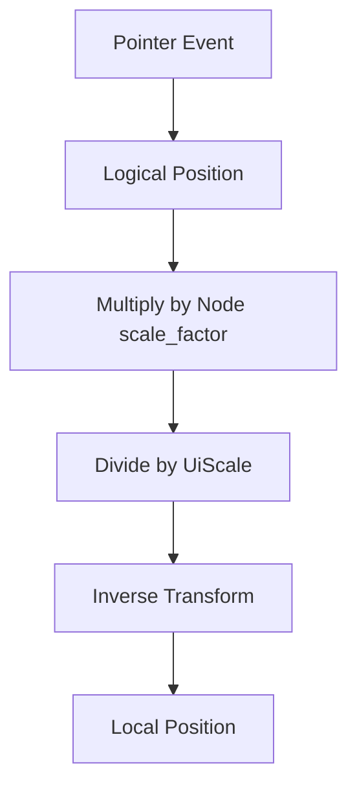

+++
title = "#19676 slider widget track click position `UiScale` fix"
date = "2025-06-16T00:00:00"
draft = false
template = "pull_request_page.html"
in_search_index = false

[extra]
current_language = "zh-cn"
available_languages = {"en" = { name = "English", url = "/pull_request/bevy/2025-06/pr-19676-en-20250616" }, "zh-cn" = { name = "中文", url = "/pull_request/bevy/2025-06/pr-19676-zh-cn-20250616" }}
labels = ["C-Bug", "D-Trivial", "A-UI"]
+++

# slider widget track click position `UiScale` fix

## Basic Information
- **Title**: slider widget track click position `UiScale` fix
- **PR Link**: https://github.com/bevyengine/bevy/pull/19676
- **Author**: ickshonpe
- **Status**: MERGED
- **Labels**: C-Bug, D-Trivial, A-UI, S-Ready-For-Final-Review
- **Created**: 2025-06-16T11:55:40Z
- **Merged**: 2025-06-16T22:28:57Z
- **Merged By**: alice-i-cecile

## Description Translation
当使用 `UiScale` 时，`core_slider` 中的轨道点击位置计算不正确。

## 解决方案

`trigger.event().pointer_location.position` 使用逻辑窗口坐标，即：

`position = physical_position / window_scale_factor`

而 `ComputedNodeTarget::scale_factor` 返回的是窗口缩放因子乘以 UI 缩放因子：

`target_scale_factor = window_scale_factor * ui_scale`

因此，要获取物理位置需要除以 `UiScale`：

```
position * target_scale_factor / ui_scale
= (physical_postion / window_scale_factor) * (window_scale_factor * ui_scale) / ui_scale
=  physical_position
```

我认为在 slider PR 审查期间已经修复了这个问题，但可能在合并过程中遗漏了。

## 测试

可以通过在 bevy app 中添加 `.insert_resource(UiScale(2.))`，使用 `core_widgets` 示例进行测试。

## The Story of This Pull Request

### 问题背景
在 Bevy 的 UI 系统中，滑块组件(core_slider)处理轨道点击事件时存在坐标转换错误。当使用 `UiScale` 资源进行全局 UI 缩放时，用户点击滑块轨道的位置计算会出现偏差，导致滑块拇指(thumb)跳转到错误位置。这个问题源于坐标系统转换过程中没有正确处理 UI 缩放因子与窗口缩放因子的关系。

### 解决方案分析
问题核心在于两种坐标系的转换：
1. 输入事件提供的 `pointer_location.position` 是逻辑窗口坐标，已经过窗口缩放因子(window_scale_factor)处理
2. UI 节点的 `scale_factor` 同时包含窗口缩放因子和 UI 缩放因子(ui_scale)

原始实现直接使用两者相乘：
```rust
position * node_target.scale_factor()
```
这会导致双重缩放问题，因为：
```
(logical_position) * (window_scale * ui_scale) 
= (physical_position / window_scale) * (window_scale * ui_scale)
= physical_position * ui_scale  // 多出ui_scale因子
```

### 具体实现
修正方案是在坐标转换链中加入 `UiScale` 除法：
```diff
 let local_pos = transform.try_inverse().unwrap().transform_point2(
-    trigger.event().pointer_location.position * node_target.scale_factor(),
+    trigger.event().pointer_location.position * node_target.scale_factor() / ui_scale.0,
 );
```
数学推导证明修正后的转换正确：
```
position * target_scale_factor / ui_scale
= (physical_position / window_scale_factor) * (window_scale_factor * ui_scale) / ui_scale
= physical_position
```

函数签名相应添加 `ui_scale` 参数依赖：
```diff
 pub(crate) fn slider_on_pointer_down(
     ...
+    ui_scale: Res<UiScale>,
 )
```

### 技术考量
关键点在于区分两种缩放因子：
1. **窗口缩放因子(window_scale_factor)**：操作系统级别的DPI缩放
2. **UI缩放因子(ui_scale)**：应用级别的全局UI缩放

Bevy的输入系统在`pointer_location.position`中已应用窗口缩放因子，而UI节点变换需要完整物理坐标。该修复确保坐标转换链正确处理所有缩放阶段。

### 影响评估
该修复：
1. 解决`UiScale`下的滑块轨道点击位置偏差
2. 保持原有API兼容性
3. 仅修改单个函数，影响范围可控
4. 通过添加资源依赖明确缩放因子来源

### 测试验证
测试方案明确具体：
1. 在app中添加`.insert_resource(UiScale(2.0))`
2. 运行`core_widgets`示例
3. 验证滑块轨道点击位置是否精确对应物理坐标

## Visual Representation



## Key Files Changed

### crates/bevy_core_widgets/src/core_slider.rs
**修改目的**：修复滑块轨道点击位置在UiScale下的计算错误  
**关键变更**：添加UiScale资源依赖并修正坐标转换公式

#### 修改前：
```rust
pub(crate) fn slider_on_pointer_down(
    // ...existing parameters...
) {
    // ...
    let local_pos = transform.try_inverse().unwrap().transform_point2(
        trigger.event().pointer_location.position * node_target.scale_factor(),
    );
    // ...
}
```

#### 修改后：
```rust
pub(crate) fn slider_on_pointer_down(
    // ...existing parameters...
    ui_scale: Res<UiScale>,  // 新增资源依赖
) {
    // ...
    let local_pos = transform.try_inverse().unwrap().transform_point2(
        trigger.event().pointer_location.position * node_target.scale_factor() / ui_scale.0,
    );
    // ...
}
```

## Further Reading
1. [Bevy UI 坐标系统文档](https://docs.rs/bevy_ui/latest/bevy_ui/struct.UiScale.html)
2. [输入事件处理指南](https://github.com/bevyengine/bevy/blob/main/examples/input/mouse_input.rs)
3. [UI 变换系统原理](https://github.com/bevyengine/bevy/blob/main/crates/bevy_ui/src/update.rs#L50-L78)