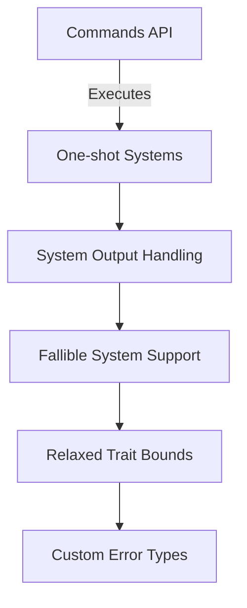

+++
title = "#19678 Support fallible one-shot systems"
date = "2025-06-17T00:00:00"
draft = false
template = "pull_request_page.html"
in_search_index = true

[taxonomies]
list_display = ["show"]

[extra]
current_language = "en"
available_languages = {"en" = { name = "English", url = "/pull_request/bevy/2025-06/pr-19678-en-20250617" }, "zh-cn" = { name = "中文", url = "/pull_request/bevy/2025-06/pr-19678-zh-cn-20250617" }}
labels = ["A-ECS", "C-Usability", "D-Straightforward"]
+++

# Support fallible one-shot systems

## Basic Information
- **Title**: Support fallible one-shot systems
- **PR Link**: https://github.com/bevyengine/bevy/pull/19678
- **Author**: Pascualex
- **Status**: MERGED
- **Labels**: A-ECS, C-Usability, S-Ready-For-Final-Review, X-Uncontroversial, D-Straightforward
- **Created**: 2025-06-16T12:25:31Z
- **Merged**: 2025-06-17T20:37:56Z
- **Merged By**: alice-i-cecile

## Description Translation
Closes #19677.

I don't think that the output type needs to be `Send`. I've done some test at it seems to work fine without it, which in IMO makes sense, but please correct me if that is not the case.

## The Story of This Pull Request

The PR addresses a limitation in Bevy's ECS where one-shot systems couldn't properly handle fallible operations. Previously, systems executed through commands (`run_system_cached` and related methods) required their output types to implement the `Send` trait, which prevented using non-thread-safe error types in fallible systems. This was particularly problematic for error handling patterns where developers needed to return custom error types that weren't thread-safe.

The solution involved relaxing the trait bounds on system output types throughout the command execution pipeline. By removing the unnecessary `Send` requirement while maintaining the `'static` lifetime bound, the changes allow systems to return any error type regardless of its thread safety characteristics. This modification maintains system safety since one-shot systems execute on the main thread during command application, where thread safety isn't a concern.

The implementation required coordinated changes across multiple ECS modules. In `command.rs`, the `run_system_cached` and `run_system_cached_with` functions were modified to accept generic output types without the `Send` constraint. For example:

```rust
// Before:
pub fn run_system_cached<M, S>(system: S) -> impl Command<Result>
where
    M: 'static,
    S: IntoSystem<(), (), M> + Send + 'static,

// After:
pub fn run_system_cached<O, M, S>(system: S) -> impl Command<Result>
where
    O: 'static,
    M: 'static,
    S: IntoSystem<(), O, M> + Send + 'static,
```

Similar changes were made in `commands/mod.rs` to propagate the updated trait bounds through the public command API. The `run_system`, `register_system`, and related methods now only require `O: 'static` instead of `O: Send + 'static`. This change maintains backward compatibility while enabling new use cases.

To validate the changes, new tests were added to `system_registry.rs` that verify proper handling of fallible systems. These tests confirm that:
1. Systems returning `Result` with non-`Send` error types execute correctly
2. Command-based execution properly handles fallible systems
3. Cached system execution propagates errors as expected

The tests use simple counter systems to verify execution counts and error propagation:

```rust
#[test]
fn fallible_system() {
    fn sys() -> Result<()> {
        Err("error")?;
        Ok(())
    }

    let mut world = World::new();
    let fallible_system_id = world.register_system(sys);
    let output = world.run_system(fallible_system_id);
    assert!(matches!(output, Ok(Err(_))));
}
```

The changes improve error handling ergonomics in Bevy by allowing developers to use custom error types in one-shot systems without artificial constraints. This aligns with Rust's error handling best practices while maintaining the ECS's safety guarantees. The solution demonstrates how carefully evaluating trait bounds can remove unnecessary restrictions without compromising system safety.

## Visual Representation



## Key Files Changed

### 1. `crates/bevy_ecs/src/system/commands/command.rs`
Modified system command functions to support fallible systems by relaxing output type constraints.

**Key Changes:**
```rust
// Before:
pub fn run_system_cached<M, S>(system: S) -> impl Command<Result>
where
    M: 'static,
    S: IntoSystem<(), (), M> + Send + 'static,

// After:
pub fn run_system_cached<O, M, S>(system: S) -> impl Command<Result>
where
    O: 'static,
    M: 'static,
    S: IntoSystem<(), O, M> + Send + 'static,
```

### 2. `crates/bevy_ecs/src/system/commands/mod.rs`
Updated command methods to propagate relaxed output type constraints through the public API.

**Key Changes:**
```rust
// Before:
pub fn run_system_cached<M, S>(&mut self, system: S)
where
    M: 'static,
    S: IntoSystem<(), (), M> + Send + 'static,

// After:
pub fn run_system_cached<O, M, S>(&mut self, system: S)
where
    O: 'static,
    M: 'static,
    S: IntoSystem<(), O, M> + Send + 'static,
```

### 3. `crates/bevy_ecs/src/system/system_registry.rs`
Added tests to verify fallible system behavior and command execution.

**Key Additions:**
```rust
#[test]
fn fallible_system() {
    fn sys() -> Result<()> {
        Err("error")?;
        Ok(())
    }

    let mut world = World::new();
    let fallible_system_id = world.register_system(sys);
    let output = world.run_system(fallible_system_id);
    assert!(matches!(output, Ok(Err(_))));
}
```

## Further Reading
1. [Bevy ECS System Documentation](https://bevyengine.org/learn/book/next/ecs/system)
2. [Rust Error Handling Best Practices](https://doc.rust-lang.org/book/ch09-00-error-handling.html)
3. [Understanding Rust Trait Bounds](https://doc.rust-lang.org/book/ch10-02-traits.html#trait-bound-syntax)