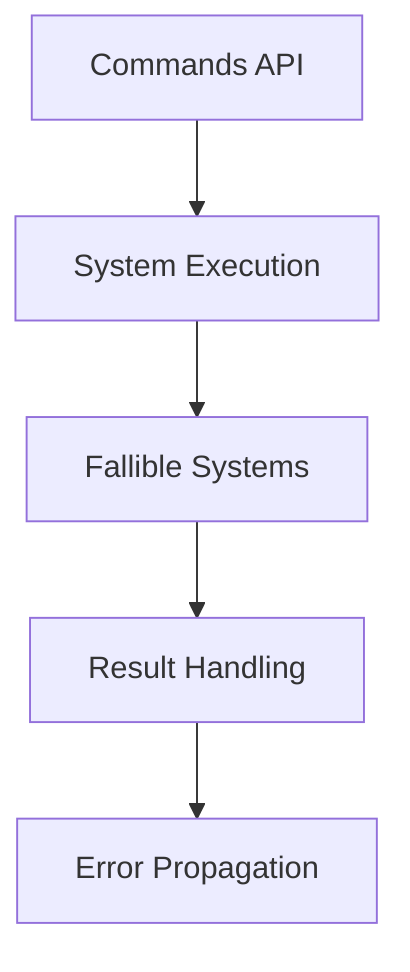

+++
title = "#19678 Support fallible one-shot systems"
date = "2025-06-17T00:00:00"
draft = false
template = "pull_request_page.html"
in_search_index = false

[extra]
current_language = "zh-cn"
available_languages = {"en" = { name = "English", url = "/pull_request/bevy/2025-06/pr-19678-en-20250617" }, "zh-cn" = { name = "中文", url = "/pull_request/bevy/2025-06/pr-19678-zh-cn-20250617" }}
+++

# Support fallible one-shot systems

## 基本信息
- **标题**: Support fallible one-shot systems
- **PR链接**: https://github.com/bevyengine/bevy/pull/19678
- **作者**: Pascualex
- **状态**: MERGED
- **标签**: A-ECS, C-Usability, S-Ready-For-Final-Review, X-Uncontroversial, D-Straightforward
- **创建时间**: 2025-06-16T12:25:31Z
- **合并时间**: 2025-06-17T20:37:56Z
- **合并者**: alice-i-cecile

## 描述翻译
关闭 #19677。

我认为输出类型不需要是 `Send`。我进行了一些测试，没有它似乎也能正常工作，这在我看来是合理的，但如果情况并非如此，请纠正我。

## 本PR的技术分析

### 问题与背景
在Bevy的ECS系统中，一次性系统(one-shot systems)允许开发者动态执行特定逻辑。然而，现有实现存在一个限制：这些系统不能正确处理可能失败的操作。具体来说：
1. 系统输出类型被限制为必须实现 `Send` trait
2. 系统无法返回 `Result` 类型来处理错误
3. 命令(command)API不支持可失败的系统执行

这导致开发者无法在一次性系统中实现健壮的错误处理，限制了API的实用性。问题#19677明确指出了这个限制。

### 解决方案
PR的核心修改是放宽对系统输出类型的约束：
1. 移除 `O: Send` 约束，只保留 `O: 'static`
2. 允许系统返回任意类型（包括 `Result`）
3. 更新相关API以支持新的类型约束

这个修改基于一个关键观察：系统输出类型不需要是 `Send`，因为：
- 系统在命令队列中执行时已在正确线程
- 输出值不需要跨线程发送
- 测试验证了非 `Send` 类型也能正常工作

### 具体实现
修改主要涉及三个文件，统一调整了类型约束：

#### 1. `command.rs` 中的命令函数
```diff
- pub fn run_system_cached<M, S>(system: S) -> impl Command<Result>
+ pub fn run_system_cached<O, M, S>(system: S) -> impl Command<Result>
 where
+     O: 'static,
      M: 'static,
-     S: IntoSystem<(), (), M> + Send + 'static,
+     S: IntoSystem<(), O, M> + Send + 'static,
```
关键变更：
- 引入输出类型参数 `O`
- 移除 `O: Send` 约束
- 允许系统返回任意 `'static` 类型

类似修改也应用于 `run_system_cached_with` 和 `unregister_system` 函数。

#### 2. `commands/mod.rs` 中的公共API
```diff
- pub fn run_system<O: 'static>(&mut self, id: SystemId<(), O>) {
+ pub fn run_system<O: 'static>(&mut self, id: SystemId<(), O>) {
```
调整了所有相关方法的类型约束，与 `command.rs` 的修改保持一致：
- `run_system`
- `register_system`
- `unregister_system`
- `run_system_cached`
- `run_system_cached_with`

#### 3. 新增测试验证功能
在 `system_registry.rs` 中添加了三个关键测试：
```rust
#[test]
fn fallible_system() {
    fn sys() -> Result<()> {
        Err("error")?;
        Ok(())
    }

    let mut world = World::new();
    let fallible_system_id = world.register_system(sys);
    let output = world.run_system(fallible_system_id);
    assert!(matches!(output, Ok(Err(_))));
}

#[test]
fn cached_fallible_system() {
    // 测试缓存的可失败系统
}

#[test]
fn cached_fallible_system_commands() {
    fn sys(mut counter: ResMut<Counter>) -> Result {
        counter.0 += 1;
        Ok(())
    }

    // 验证通过commands执行可失败系统
}
```
这些测试验证了：
1. 可失败系统能正确返回错误
2. 缓存系统正确处理错误
3. 命令API支持可失败系统

### 技术影响
1. **增强错误处理能力**：开发者现在可以在一次性系统中使用 `Result` 类型
```rust
fn fallible_system() -> Result<(), MyError> {
    // 可能失败的操作
}
```
2. **提高API灵活性**：支持任意输出类型，不再限于 `()`
3. **保持兼容性**：现有返回 `()` 的系统继续正常工作
4. **简化类型约束**：移除不必要的 `Send` 要求

### 潜在注意事项
- 错误处理责任转移给调用方：需要正确处理 `Result` 输出
- 系统注册/执行API现在支持更广泛的输出类型
- 缓存系统机制保持不变，但支持更多用例

## 可视化表示



## 关键文件变更

### 1. `crates/bevy_ecs/src/system/commands/command.rs`
**变更原因**：放宽命令函数的类型约束以支持可失败系统  
**关键修改**：
```diff
- pub fn run_system_cached<M, S>(system: S) -> impl Command<Result>
+ pub fn run_system_cached<O, M, S>(system: S) -> impl Command<Result>
 where
+     O: 'static,
      M: 'static,
-     S: IntoSystem<(), (), M> + Send + 'static,
+     S: IntoSystem<(), O, M> + Send + 'static,
```

### 2. `crates/bevy_ecs/src/system/commands/mod.rs`
**变更原因**：更新公共API以匹配新的类型约束  
**关键修改**：
```diff
- pub fn run_system_cached<M, S>(&mut self, system: S)
+ pub fn run_system_cached<O, M, S>(&mut self, system: S)
 where
+     O: 'static,
      M: 'static,
-     S: IntoSystem<(), (), M> + Send + 'static,
+     S: IntoSystem<(), O, M> + Send + 'static,
```

### 3. `crates/bevy_ecs/src/system/system_registry.rs`
**变更原因**：添加测试验证可失败系统功能  
**关键测试**：
```rust
#[test]
fn fallible_system() {
    fn sys() -> Result<()> {
        Err("error")?;
        Ok(())
    }
    
    let mut world = World::new();
    let fallible_system_id = world.register_system(sys);
    let output = world.run_system(fallible_system_id);
    assert!(matches!(output, Ok(Err(_))));
}
```

## 延伸阅读
1. [Bevy ECS 系统文档](https://docs.rs/bevy_ecs/latest/bevy_ecs/system/index.html)
2. [Rust 错误处理指南](https://doc.rust-lang.org/book/ch09-00-error-handling.html)
3. [Bevy 命令系统详解](https://bevy-cheatbook.github.io/programming/commands.html)