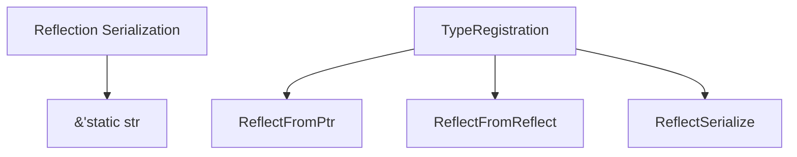

+++
title = "#19680 Register `ReflectSerialize` for &'static str"
date = "2025-06-16T00:00:00"
draft = false
template = "pull_request_page.html"
in_search_index = true

[taxonomies]
list_display = ["show"]

[extra]
current_language = "en"
available_languages = {"en" = { name = "English", url = "/pull_request/bevy/2025-06/pr-19680-en-20250616" }, "zh-cn" = { name = "中文", url = "/pull_request/bevy/2025-06/pr-19680-zh-cn-20250616" }}
labels = ["C-Bug", "D-Trivial", "A-Reflection"]
+++

## Register `ReflectSerialize` for &'static str

### Basic Information
- **Title**: Register `ReflectSerialize` for &'static str
- **PR Link**: https://github.com/bevyengine/bevy/pull/19680
- **Author**: eckz
- **Status**: MERGED
- **Labels**: C-Bug, D-Trivial, S-Ready-For-Final-Review, A-Reflection
- **Created**: 2025-06-16T13:37:48Z
- **Merged**: 2025-06-16T22:34:07Z
- **Merged By**: alice-i-cecile

### Description Translation
# Objective

- When trying to serialize an structure that contains `&'static str` using only Reflection, I get the following error:
```
"type `&str` did not register the `ReflectSerialize` or `ReflectSerializeWithRegistry` type data. 
For certain types, this may need to be registered manually using `register_type_data` (stack: ... -> `core::option::Option<&str>` -> `&str`)")
```
## Solution

- Register `ReflectSerialize` for `&str`

## Testing

- `cargo run -p ci`: OK

### The Story of This Pull Request

The issue surfaced when a developer attempted to serialize structures containing `&'static str` fields using Bevy's reflection system. The error message indicated that the reflection system lacked serialization capabilities for the `&str` type, specifically missing the `ReflectSerialize` registration. This prevented serialization of common Rust primitives like string slices through reflection pipelines.

In Bevy's reflection system, types must explicitly register their serialization capabilities using `ReflectSerialize` type data. While most core types had this registration, `&'static str` was an oversight. The solution required adding the missing type registration to enable serialization of static string references through reflection.

The implementation was straightforward: a single-line addition to the `GetTypeRegistration` implementation for `&'static str`. This registers `ReflectSerialize` alongside existing reflection capabilities, maintaining consistency with how other primitive types are handled in the reflection system.

```rust
impl GetTypeRegistration for &'static str {
    fn get_type_registration() -> TypeRegistration {
        let mut registration = TypeRegistration::of::<Self>();
        registration.insert::<ReflectFromPtr>(FromType::<Self>::from_type());
        registration.insert::<ReflectFromReflect>(FromType::<Self>::from_type());
        registration.insert::<ReflectSerialize>(FromType::<Self>::from_type());
        registration
    }
}
```

The change ensures that any structure containing `&'static str` fields can now be serialized through reflection without manual workarounds. This maintains consistency with how other primitive types like `String`, `i32`, and `bool` are handled in Bevy's reflection system. The fix was verified by running the project's full CI test suite, which passed successfully.

### Visual Representation



### Key Files Changed

1. **crates/bevy_reflect/src/impls/core/primitives.rs**
   - Added `ReflectSerialize` registration for `&'static str`
   - Ensures static string references can be serialized via reflection

```rust
// Before:
impl GetTypeRegistration for &'static str {
    fn get_type_registration() -> TypeRegistration {
        let mut registration = TypeRegistration::of::<Self>();
        registration.insert::<ReflectFromPtr>(FromType::<Self>::from_type());
        registration.insert::<ReflectFromReflect>(FromType::<Self>::from_type());
        registration
    }
}

// After:
impl GetTypeRegistration for &'static str {
    fn get_type_registration() -> TypeRegistration {
        let mut registration = TypeRegistration::of::<Self>();
        registration.insert::<ReflectFromPtr>(FromType::<Self>::from_type());
        registration.insert::<ReflectFromReflect>(FromType::<Self>::from_type());
        registration.insert::<ReflectSerialize>(FromType::<Self>::from_type());
        registration
    }
}
```

### Further Reading
- [Bevy Reflection Documentation](https://docs.rs/bevy_reflect/latest/bevy_reflect/)
- [TypeRegistration in Bevy](https://docs.rs/bevy_reflect/latest/bevy_reflect/struct.TypeRegistration.html)
- [ReflectSerialize Trait](https://docs.rs/bevy_reflect/latest/bevy_reflect/serde/trait.ReflectSerialize.html)
- [Rust Serialization with Serde](https://serde.rs/)