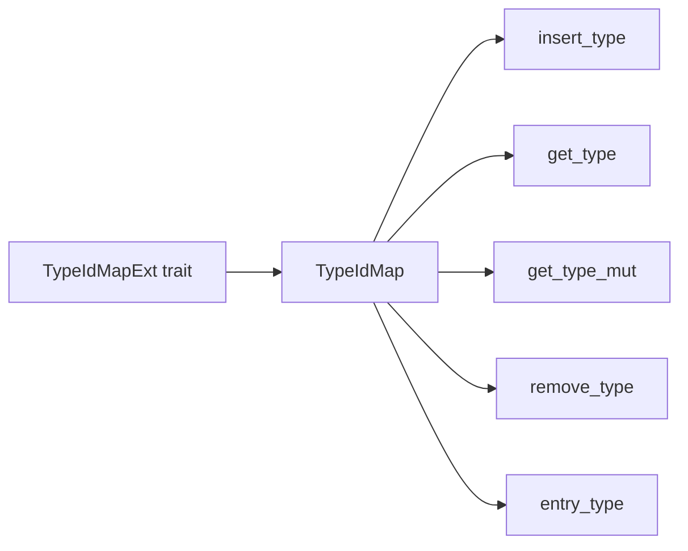

+++
title = "#19683 Add TypeIdMapExt trait to make TypeIdMap operations more ergonomic"
date = "2025-06-17T00:00:00"
draft = false
template = "pull_request_page.html"
in_search_index = true

[taxonomies]
list_display = ["show"]

[extra]
current_language = "en"
available_languages = {"en" = { name = "English", url = "/pull_request/bevy/2025-06/pr-19683-en-20250617" }, "zh-cn" = { name = "中文", url = "/pull_request/bevy/2025-06/pr-19683-zh-cn-20250617" }}
labels = ["A-ECS", "C-Usability", "D-Straightforward"]
+++

## Add TypeIdMapExt trait to make TypeIdMap operations more ergonomic

### Basic Information
- **Title**: Add TypeIdMapExt trait to make TypeIdMap operations more ergonomic
- **PR Link**: https://github.com/bevyengine/bevy/pull/19683
- **Author**: theotherphil
- **Status**: MERGED
- **Labels**: A-ECS, C-Usability, S-Ready-For-Final-Review, D-Straightforward
- **Created**: 2025-06-16T18:30:22Z
- **Merged**: 2025-06-17T21:24:34Z
- **Merged By**: alice-i-cecile

### Description Translation
# Objective

Fix https://github.com/bevyengine/bevy/issues/19642 by enabling e.g.

```
map.get_type::<MyType>();
```

in place of

```
map.get(&TypeId::of::<MyType>());
```

## Solution

Add an extension trait `TypeIdMapExt` with `insert_type`, `get_type`, `get_type_mut` and `remove_type` counterparts for `insert`, `get`, `get_mut` and `remove`.

## Testing

Doc test.

### The Story of This Pull Request

The core issue addressed in this PR was the verbosity and potential for errors when working with Bevy's `TypeIdMap` collections. Previously, developers needed to manually look up `TypeId` values using `TypeId::of::<T>()` for every map operation, which added boilerplate and increased the chance of mismatched types. This friction was documented in GitHub issue #19642.

The solution introduces a new extension trait `TypeIdMapExt` that abstracts away the `TypeId` lookup through generic methods. This approach maintains the existing `TypeIdMap` performance characteristics while significantly improving ergonomics. The implementation consists of thin wrapper methods that automatically derive the `TypeId` from the generic type parameter:

```rust
pub trait TypeIdMapExt<V> {
    fn insert_type<T: ?Sized + 'static>(&mut self, v: V) -> Option<V>;
    fn get_type<T: ?Sized + 'static>(&self) -> Option<&V>;
    fn get_type_mut<T: ?Sized + 'static>(&mut self) -> Option<&mut V>;
    fn remove_type<T: ?Sized + 'static>(&mut self) -> Option<V>;
    fn entry_type<T: ?Sized + 'static>(&mut self) -> Entry<'_, TypeId, V, NoOpHash>;
}
```

Each method is implemented with `#[inline]` attributes to ensure zero runtime overhead compared to manual `TypeId` lookups. The trait covers all essential map operations - insertion, retrieval, mutation, removal, and entry-based access - providing a complete ergonomic alternative to the raw map API.

The documentation includes a clear comparison showing the reduction in boilerplate:
```rust
// Before
map.insert(TypeId::of::<MyType>(), 7);
assert_eq!(map.get(&TypeId::of::<MyType>()), Some(&7));

// After
map.insert_type::<MyType>(7);
assert_eq!(map.get_type::<MyType>(), Some(&7));
```

This change directly impacts developer experience in Bevy's ECS system where `TypeIdMap` is frequently used for type-based storage. The new API reduces cognitive load by eliminating the need to manually handle `TypeId` values and decreases the likelihood of type mismatches. The implementation maintains full backward compatibility, allowing gradual adoption of the new methods throughout the codebase.

### Visual Representation



### Key Files Changed

- `crates/bevy_utils/src/map.rs` (+74/-2)

#### Changes in `map.rs`:
The main change introduces the `TypeIdMapExt` trait and its implementation for `TypeIdMap`. The trait provides ergonomic wrappers around existing map operations.

Before the change:
```rust
// No extension trait existed
let mut map = TypeIdMap::default();
map.insert(TypeId::of::<MyType>(), 7);
let value = map.get(&TypeId::of::<MyType>());
```

After the change:
```rust
// New trait implementation
impl<V> TypeIdMapExt<V> for TypeIdMap<V> {
    #[inline]
    fn insert_type<T: ?Sized + 'static>(&mut self, v: V) -> Option<V> {
        self.insert(TypeId::of::<T>(), v)
    }

    #[inline]
    fn get_type<T: ?Sized + 'static>(&self) -> Option<&V> {
        self.get(&TypeId::of::<T>())
    }
    
    // ... similar implementations for other methods
}
```

The implementation preserves all existing behaviors while adding the new convenience methods. The diff also includes comprehensive documentation with usage examples.

### Further Reading
1. [Rust Traits: Defining Shared Behavior](https://doc.rust-lang.org/book/ch10-02-traits.html)
2. [TypeId documentation](https://doc.rust-lang.org/std/any/struct.TypeId.html)
3. [Extension Trait Pattern](https://rust-lang.github.io/rfcs/0445-extension-trait-conventions.html)

### Full Code Diff
```diff
diff --git a/crates/bevy_utils/src/map.rs b/crates/bevy_utils/src/map.rs
index ca74e34dbbb4f..3b54a357aad69 100644
--- a/crates/bevy_utils/src/map.rs
+++ b/crates/bevy_utils/src/map.rs
@@ -1,7 +1,7 @@
 use core::{any::TypeId, hash::Hash};
 
 use bevy_platform::{
-    collections::HashMap,
+    collections::{hash_map::Entry, HashMap},
     hash::{Hashed, NoOpHash, PassHash},
 };
 
@@ -38,6 +38,78 @@ impl<K: Hash + Eq + PartialEq + Clone, V> PreHashMapExt<K, V> for PreHashMap<K,
 /// Iteration order only depends on the order of insertions and deletions.
 pub type TypeIdMap<V> = HashMap<TypeId, V, NoOpHash>;
 
+/// Extension trait to make use of [`TypeIdMap`] more ergonomic.
+///
+/// Each function on this trait is a trivial wrapper for a function
+/// on [`HashMap`], replacing a `TypeId` key with a
+/// generic parameter `T`.
+///
+/// # Examples
+///
+/// ```rust
+/// # use std::any::TypeId;
+/// # use bevy_utils::TypeIdMap;
+/// use bevy_utils::TypeIdMapExt;
+///
+/// struct MyType;
+///
+/// // Using the built-in `HashMap` functions requires manually looking up `TypeId`s.
+/// let mut map = TypeIdMap::default();
+/// map.insert(TypeId::of::<MyType>(), 7);
+/// assert_eq!(map.get(&TypeId::of::<MyType>()), Some(&7));
+///
+/// // Using `TypeIdMapExt` functions does the lookup for you.
+/// map.insert_type::<MyType>(7);
+/// assert_eq!(map.get_type::<MyType>(), Some(&7));
+/// ```
+pub trait TypeIdMapExt<V> {
+    /// Inserts a value for the type `T`.
+    ///
+    /// If the map did not previously contain this key then [`None`] is returned,
+    /// otherwise the value for this key is updated and the old value returned.
+    fn insert_type<T: ?Sized + 'static>(&mut self, v: V) -> Option<V>;
+
+    /// Returns a reference to the value for type `T`, if one exists.
+    fn get_type<T: ?Sized + 'static>(&self) -> Option<&V>;
+
+    /// Returns a mutable reference to the value for type `T`, if one exists.
+    fn get_type_mut<T: ?Sized + 'static>(&mut self) -> Option<&mut V>;
+
+    /// Removes type `T` from the map, returning the value for this
+    /// key if it was previously present.
+    fn remove_type<T: ?Sized + 'static>(&mut self) -> Option<V>;
+
+    /// Gets the type `T`'s entry in the map for in-place manipulation.
+    fn entry_type<T: ?Sized + 'static>(&mut self) -> Entry<'_, TypeId, V, NoOpHash>;
+}
+
+impl<V> TypeIdMapExt<V> for TypeIdMap<V> {
+    #[inline]
+    fn insert_type<T: ?Sized + 'static>(&mut self, v: V) -> Option<V> {
+        self.insert(TypeId::of::<T>(), v)
+    }
+
+    #[inline]
+    fn get_type<T: ?Sized + 'static>(&self) -> Option<&V> {
+        self.get(&TypeId::of::<T>())
+    }
+
+    #[inline]
+    fn get_type_mut<T: ?Sized + 'static>(&mut self) -> Option<&mut V> {
+        self.get_mut(&TypeId::of::<T>())
+    }
+
+    #[inline]
+    fn remove_type<T: ?Sized + 'static>(&mut self) -> Option<V> {
+        self.remove(&TypeId::of::<T>())
+    }
+
+    #[inline]
+    fn entry_type<T: ?Sized + 'static>(&mut self) -> Entry<'_, TypeId, V, NoOpHash> {
+        self.entry(TypeId::of::<T>())
+    }
+}
+
 #[cfg(test)]
 mod tests {
     use super::*;
@@ -67,7 +139,7 @@ mod tests {
         #[test]
         fn stable_hash_within_same_program_execution() {
             use alloc::vec::Vec;
-    
+
             let mut map_1 = <HashMap<_, _>>::default();
             let mut map_2 = <HashMap<_, _>>::default();
             for i in 1..10 {
```