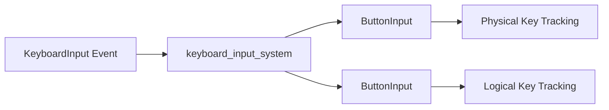

+++
title = "#19684 Add support for ButtonInput<Key>"
date = "2025-06-18T00:00:00"
draft = false
template = "pull_request_page.html"
in_search_index = true

[taxonomies]
list_display = ["show"]

[extra]
current_language = "en"
available_languages = {"en" = { name = "English", url = "/pull_request/bevy/2025-06/pr-19684-en-20250618" }, "zh-cn" = { name = "中文", url = "/pull_request/bevy/2025-06/pr-19684-zh-cn-20250618" }}
labels = ["A-Input", "X-Contentious"]
+++

### Title  
Add support for ButtonInput<Key>

### Basic Information  
- **Title**: Add support for ButtonInput<Key>  
- **PR Link**: https://github.com/bevyengine/bevy/pull/19684  
- **Author**: kristoff3r  
- **Status**: MERGED  
- **Labels**: A-Input, S-Ready-For-Final-Review, M-Needs-Release-Note, X-Contentious  
- **Created**: 2025-06-16T20:19:06Z  
- **Merged**: 2025-06-18T20:34:16Z  
- **Merged By**: alice-i-cecile  

### Description Translation  
#### Objective  
While `KeyCode` is often the correct way to handle keyboard input, it fails for symbols like plus, minus, or parentheses. Currently, developers must read `EventReader<KeyboardInput>` and reimplement `ButtonInput` logic (e.g., pressed/released) for use cases like zoom controls. This caused confusion in issues like [#3278](https://github.com/bevyengine/bevy/issues/3278).  

#### Solution  
Add a `ButtonInput<Key>` resource.  

#### Testing  
Modified the `keyboard_input` example to test the implementation.  

#### Open Questions  
- Is duplicating key processing logic the right approach?  
- Alternative: Create a new struct combining `Key` and `KeyCode` (more churn).  
- Alternative: Skip due to niche use cases.  

---

### The Story of This Pull Request  

#### The Problem and Context  
Developers needed to handle logical keys (e.g., `+`, `-`, `?`) whose physical locations vary by keyboard layout. `KeyCode` only tracks physical key positions, forcing developers to use low-level `KeyboardInput` events and manually manage press/release states. This led to redundant code and bugs like [#3278](https://github.com/bevyengine/bevy/issues/3278).  

#### The Solution Approach  
Introduce `ButtonInput<Key>` to track logical keys, mirroring `ButtonInput<KeyCode>`. This leverages Bevy's existing input state management without requiring new abstractions. Trade-offs:  
- **Pros**: Unified API for logical keys, no manual state tracking.  
- **Cons**: Duplicates key processing logic; potential misuse if developers use `Key` where `KeyCode` suffices.  
The author chose minimal churn over a combined struct (`Key` + `KeyCode`).  

#### The Implementation  
1. **Generalized `ButtonInput`**:  
   - Relaxed `T: Copy` to `T: Clone` in `ButtonInput` to support `Key` (which contains a `String`).  
   - Updated `press()`/`release()` to clone values:  
     ```rust
     // crates/bevy_input/src/button_input.rs
     if self.pressed.insert(input.clone()) {
         self.just_pressed.insert(input);
     }
     ```  

2. **Extended Input System**:  
   - Modified `keyboard_input_system` to update both `ButtonInput<KeyCode>` and `ButtonInput<Key>`:  
     ```rust
     // crates/bevy_input/src/keyboard.rs
     pub fn keyboard_input_system(
         mut keycode_input: ResMut<ButtonInput<KeyCode>>,
         mut key_input: ResMut<ButtonInput<Key>>,
         mut keyboard_input_events: EventReader<KeyboardInput>,
     ) {
         keycode_input.clear();
         key_input.clear();
         for event in keyboard_input_events.read() {
             match event.state {
                 ButtonState::Pressed => {
                     keycode_input.press(event.key_code); // Physical key
                     key_input.press(event.logical_key.clone()); // Logical key
                 }
                 ButtonState::Released => { /* ... */ }
             }
         }
     }
     ```  

3. **Integrated Resource**:  
   - Added `ButtonInput<Key>` to Bevy's input plugin:  
     ```rust
     // crates/bevy_input/src/lib.rs
     .init_resource::<ButtonInput<Key>>()
     ```  

4. **Example Update**:  
   - Extended `keyboard_input` example to demo `ButtonInput<Key>` for the `?` key:  
     ```rust
     // examples/input/keyboard_input.rs
     let key = Key::Character("?".into());
     if key_input.pressed(key.clone()) {
         info!("'?' currently pressed");
     }
     ```  

#### Technical Insights  
- **Why `Clone` over `Copy`?**: `Key` contains a `String` (for `Character` variant), requiring cloning. This is backward-compatible since `Copy` types implement `Clone`.  
- **Performance**: Minimal overhead. `HashSet` operations are O(1), and keyboard events are low-volume.  
- **Key vs. KeyCode**:  
  - Use `KeyCode` for position-dependent actions (e.g., WASD movement).  
  - Use `Key` for layout-dependent symbols (e.g., `+`/`-` for zoom).  

#### The Impact  
- **New Feature**: Direct access to logical key states via `Res<ButtonInput<Key>>`.  
- **Fixed Pitfall**: Eliminates manual state tracking for logical keys.  
- **Backward Compatibility**: Existing `ButtonInput<KeyCode>` usage unchanged.  
- **Release Notes**: Added documentation clarifying `Key`/`KeyCode` use cases.  

---

### Visual Representation  


---

### Key Files Changed  

1. **`crates/bevy_input/src/button_input.rs`**  
   - **Changes**: Generalized `ButtonInput<T>` from `T: Copy` to `T: Clone`.  
   - **Code Snippet**:  
     ```diff
     - pub struct ButtonInput<T: Copy + Eq + Hash + Send + Sync + 'static> {
     + pub struct ButtonInput<T: Clone + Eq + Hash + Send + Sync + 'static> {
       ...
       pub fn press(&mut self, input: T) {
     -     if self.pressed.insert(input) {
     +     if self.pressed.insert(input.clone()) {
             self.just_pressed.insert(input);
           }
       }
     ```  
   - **Why**: Supports `Key` (non-`Copy` type).  

2. **`crates/bevy_input/src/keyboard.rs`**  
   - **Changes**: Updated `keyboard_input_system` to manage both `KeyCode` and `Key` resources.  
   - **Code Snippet**:  
     ```diff
     - mut key_input: ResMut<ButtonInput<KeyCode>>,
     + mut keycode_input: ResMut<ButtonInput<KeyCode>>,
     + mut key_input: ResMut<ButtonInput<Key>>,
       ...
     - key_input.clear();
     + keycode_input.clear();
     + key_input.clear();
       for event in keyboard_input_events.read() {
           match event.state {
     -         ButtonState::Pressed => key_input.press(event.key_code),
     +         ButtonState::Pressed => {
     +             keycode_input.press(event.key_code);
     +             key_input.press(event.logical_key.clone());
     +         }
           }
       }
     ```  
   - **Why**: Enables simultaneous tracking of physical/logical keys.  

3. **`examples/input/keyboard_input.rs`**  
   - **Changes**: Added demo for `ButtonInput<Key>` detecting the `?` key.  
   - **Code Snippet**:  
     ```diff
     + let key = Key::Character("?".into());
     + if key_input.pressed(key.clone()) {
     +     info!("'?' currently pressed");
     + }
     ```  
   - **Why**: Illustrates layout-independent symbol handling.  

4. **`release-content/release-notes/key_buttoninput.md`**  
   - **Changes**: Added release note explaining `Key` usage.  
   - **Snippet**:  
     ```markdown
     Bevy now has a `ButtonInput<Key>` resource... 
     Use `Key` for symbols like '+'/'-' for zoom.
     ```  

5. **`crates/bevy_input/src/lib.rs`**  
   - **Changes**: Registered `ButtonInput<Key>` resource.  
   - **Snippet**:  
     ```diff
     + .init_resource::<ButtonInput<Key>>()
     ```  

---

### Further Reading  
- [UI Events KeyboardEvent Code Values](https://w3c.github.io/uievents-code/): Spec for `KeyCode` physical positions.  
- [Bevy Input Documentation](https://docs.rs/bevy_input/latest/bevy_input/): Details on `ButtonInput` API.  
- [Issue #3278](https://github.com/bevyengine/bevy/issues/3278): Original problem case.