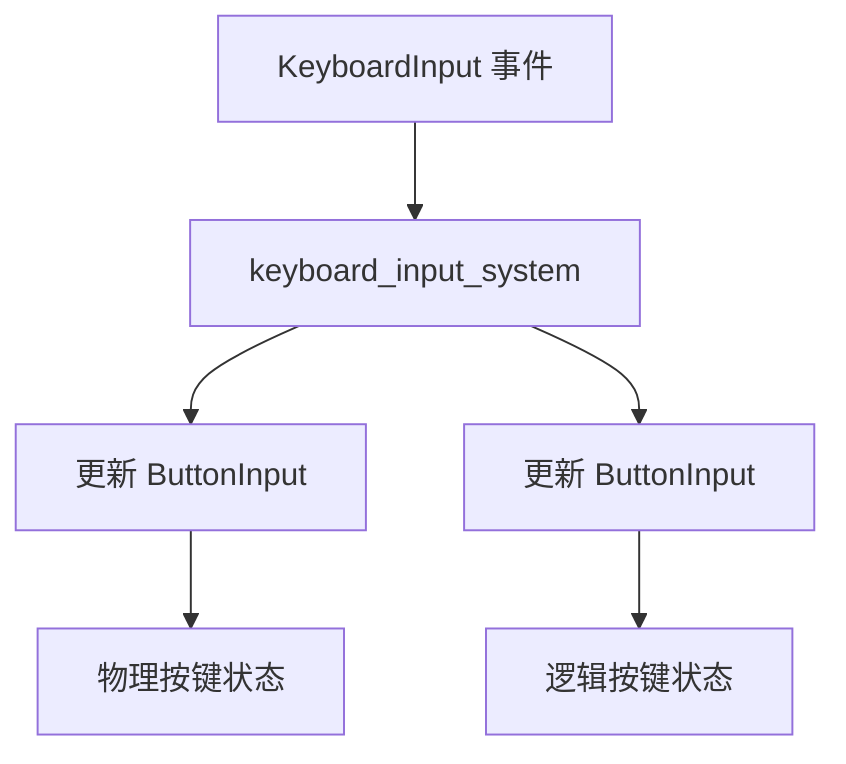

+++
title = "#19684 Add support for ButtonInput<Key>"
date = "2025-06-18T00:00:00"
draft = false
template = "pull_request_page.html"
in_search_index = false

[extra]
current_language = "zh-cn"
available_languages = {"en" = { name = "English", url = "/pull_request/bevy/2025-06/pr-19684-en-20250618" }, "zh-cn" = { name = "中文", url = "/pull_request/bevy/2025-06/pr-19684-zh-cn-20250618" }}
+++

# PR #19684: Add support for ButtonInput<Key>

## 基本信息
- **标题**: Add support for ButtonInput<Key>
- **PR链接**: https://github.com/bevyengine/bevy/pull/19684
- **作者**: kristoff3r
- **状态**: MERGED
- **标签**: A-Input, S-Ready-For-Final-Review, M-Needs-Release-Note, X-Contentious
- **创建时间**: 2025-06-16T20:19:06Z
- **合并时间**: 2025-06-18T20:34:16Z
- **合并者**: alice-i-cecile

## 描述翻译
### 目标
虽然 `KeyCode` 通常是处理键盘输入的正确方式，但在许多情况下并不适用，特别是对于大多数符号（如加号、减号、不同的括号）。目前获取这些符号的唯一方法是读取 `EventReader<KeyboardInput>`，但这样就需要重新实现 `ButtonInput` 的按下/释放逻辑，例如实现依赖加号/减号键的缩放功能。

这之前已经导致过困惑，例如：https://github.com/bevyengine/bevy/issues/3278

### 解决方案
添加一个 `ButtonInput<Key>` 资源。

### 测试
修改了 `keyboard_input` 示例以测试此功能。

### 开放性问题
我不完全确定这是否是正确的前进方向，因为它重复了按键处理逻辑，并可能导致人们在不适当的情况下使用更短的 `ButtonInput<Key>`。

另一种选择是添加一个包含 `Key` 和 `KeyCode` 的新结构体，并用它来替代 `ButtonInput`。那样会更具有解释性，但会带来很多改动。

第三个选择是不做这个改动，因为它太小众。

如果我们要推进这个改动，我会添加更多文档并退出草稿状态。

## 这个Pull Request的故事

### 问题与背景
在Bevy引擎中处理键盘输入时，开发者通常使用 `ButtonInput<KeyCode>` 资源。`KeyCode` 表示物理按键的位置（例如，QWERTY键盘上的"A"键），而不是实际输入的字符。这在处理如WASD移动控制时很有用，因为按键位置在不同键盘布局中是一致的。

然而，当需要处理实际输入的字符（如符号 '+', '-', '?'）时，`KeyCode` 就不够用了。因为符号的位置在不同键盘布局中可能不同（例如，在AZERTY键盘上，'+'可能不在与QWERTY相同的位置）。开发者不得不直接处理 `KeyboardInput` 事件，并手动跟踪按键状态，这导致代码重复和潜在的错误。例如，在 issue #3278 中，用户遇到了处理符号键的困难。

### 解决方案方法
PR引入了一个新的 `ButtonInput<Key>` 资源，其中 `Key` 表示逻辑按键（考虑键盘布局的实际输入字符）。这样，开发者可以直接使用 `ButtonInput<Key>` 来检测特定字符的按下状态，而不必关心其物理位置。

考虑过的替代方案：
1. 创建一个同时包含 `Key` 和 `KeyCode` 的新结构体：这更明确但需要大量改动
2. 不做任何改动：但鉴于历史 issue，社区确实需要此功能

最终选择添加 `ButtonInput<Key>`，因为它直接解决问题且改动范围可控。

### 实现细节
实现的核心是在现有的键盘输入系统中增加对 `ButtonInput<Key>` 的处理：

```rust
// crates/bevy_input/src/keyboard.rs
pub fn keyboard_input_system(
    mut keycode_input: ResMut<ButtonInput<KeyCode>>,
    mut key_input: ResMut<ButtonInput<Key>>, // 新增资源
    mut keyboard_input_events: EventReader<KeyboardInput>,
    mut focus_events: EventReader<KeyboardFocusLost>,
) {
    keycode_input.bypass_change_detection().clear();
    key_input.bypass_change_detection().clear(); // 新增清理逻辑
    
    for event in keyboard_input_events.read() {
        match event.state {
            ButtonState::Pressed => {
                keycode_input.press(event.key_code); // 更新物理按键
                key_input.press(event.logical_key.clone()); // 新增：更新逻辑按键
            }
            ButtonState::Released => {
                keycode_input.release(event.key_code);
                key_input.release(event.logical_key.clone()); // 新增
            }
        }
    }
    
    if !focus_events.is_empty() {
        keycode_input.release_all();
        key_input.release_all(); // 新增：窗口失焦时释放所有按键
        focus_events.clear();
    }
}
```

在输入插件中初始化新资源：
```rust
// crates/bevy_input/src/lib.rs
.init_resource::<ButtonInput<Key>>() // 新增资源初始化
```

由于 `Key` 类型包含字符串值（如 `Key::Character("?".into())`），需要修改 `ButtonInput` 的约束条件：
```diff
// crates/bevy_input/src/button_input.rs
- pub struct ButtonInput<T: Copy + Eq + Hash + Send + Sync + 'static> {
+ pub struct ButtonInput<T: Clone + Eq + Hash + Send + Sync + 'static> {
```

在按键处理方法中使用克隆：
```rust
if self.pressed.insert(input.clone()) { // 使用 clone 而非 copy
    self.just_pressed.insert(input);
}
```

### 技术洞察
1. **按键类型区别**：
   - `KeyCode`：物理按键位置（位置不变）
   - `Key`：逻辑按键值（内容随键盘布局变化）
2. **克隆 vs 复制**：
   - `Key` 包含 `String` 类型，需要 `Clone` 而非 `Copy`
   - 修改 `ButtonInput` 的约束为 `Clone` 以支持 `Key` 类型
3. **资源管理**：
   - 新增资源与现有 `ButtonInput<KeyCode>` 并行工作
   - 相同的清理和更新机制确保一致性

### 影响
1. **功能增强**：
   - 开发者可直接使用 `ButtonInput<Key>` 检测特定字符
   - 简化了符号键处理（如 '+/-' 缩放控制）
2. **向后兼容**：
   - 现有 `ButtonInput<KeyCode>` 保持不变
   - 新增功能不影响现有代码
3. **文档清晰化**：
   - 更新文档明确两种按键类型的区别
   - 添加发布说明指导正确使用场景

## 视觉表示



## 关键文件变更

1. **crates/bevy_input/src/keyboard.rs** (+45/-13)
   - 修改键盘输入系统以支持两种按键资源
   - 增强文档解释按键类型区别

```rust
// 关键修改
pub fn keyboard_input_system(
    mut keycode_input: ResMut<ButtonInput<KeyCode>>,
    mut key_input: ResMut<ButtonInput<Key>>, // 新增资源参数
    // ...
) {
    // ...
    for event in keyboard_input_events.read() {
        match event.state {
            ButtonState::Pressed => {
                keycode_input.press(event.key_code);
                key_input.press(event.logical_key.clone()); // 新增逻辑按键处理
            }
            // ...
        }
    }
}
```

2. **crates/bevy_input/src/button_input.rs** (+4/-4)
   - 放宽类型约束以支持 `Key`

```diff
- pub struct ButtonInput<T: Copy + Eq + Hash + Send + Sync + 'static> {
+ pub struct ButtonInput<T: Clone + Eq + Hash + Send + Sync + 'static> {
```

3. **crates/bevy_input/src/lib.rs** (+2/-1)
   - 初始化新资源

```diff
.init_resource::<ButtonInput<KeyCode>>()
+.init_resource::<ButtonInput<Key>>() // 新增资源初始化
```

4. **examples/input/keyboard_input.rs** (+22/-3)
   - 更新示例展示两种按键检测方式

```rust
fn keyboard_input_system(
    keyboard_input: Res<ButtonInput<KeyCode>>, // 物理按键
    key_input: Res<ButtonInput<Key>>, // 新增：逻辑按键
) {
    // KeyCode 示例（位置不变）
    if keyboard_input.just_pressed(KeyCode::KeyA) { ... }
    
    // Key 示例（内容不变）
    let key = Key::Character("?".into());
    if key_input.just_pressed(key.clone()) { ... }
}
```

5. **release-content/release-notes/key_buttoninput.md** (+13/-0)
   - 新增发布说明文档

```markdown
Bevy now has a `ButtonInput<Key>` resource...
Use `KeyCode` for location, `Key` for actual symbols
```

## 延伸阅读

1. [UI Events KeyboardEvent.code 规范](https://w3c.github.io/uievents-code/#code-value-tables) - 物理按键定位标准
2. [Bevy 输入系统文档](https://docs.rs/bevy_input/latest/bevy_input/) - 官方输入模块参考
3. [Issue #3278](https://github.com/bevyengine/bevy/issues/3278) - 原始问题展示实际需求