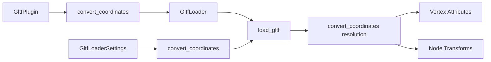

+++
title = "#19685 Allow setting correct glTF coordinate conversions globally"
date = "2025-06-24T00:00:00"
draft = false
template = "pull_request_page.html"
in_search_index = true

[taxonomies]
list_display = ["show"]

[extra]
current_language = "en"
available_languages = {"en" = { name = "English", url = "/pull_request/bevy/2025-06/pr-19685-en-20250624" }, "zh-cn" = { name = "中文", url = "/pull_request/bevy/2025-06/pr-19685-zh-cn-20250624" }}
labels = ["C-Usability", "D-Straightforward", "A-glTF"]
+++

## Allow setting correct glTF coordinate conversions globally

### Basic Information
- **Title**: Allow setting correct glTF coordinate conversions globally
- **PR Link**: https://github.com/bevyengine/bevy/pull/19685
- **Author**: janhohenheim
- **Status**: MERGED
- **Labels**: C-Usability, S-Ready-For-Final-Review, D-Straightforward, A-glTF
- **Created**: 2025-06-16T23:26:30Z
- **Merged**: 2025-06-24T00:41:42Z
- **Merged By**: alice-i-cecile

### Description Translation
# Objective

- Followup to https://github.com/bevyengine/bevy/pull/19633
- As discussed, it's a bit cumbersome to specify that you want the correct orientation every single time
- Also, glTFs loaded from third parties will still be loaded incorrectly

## Solution

- Allow opting into the new behavior globally or per-asset
- Also improved some docs while on it :)

## Testing

- Ran the animation examples
- Ran the test scene from the last PR with all configuration combinations 

### The Story of This Pull Request

#### The Problem and Context
Bevy's coordinate system differs from glTF's standard. In glTF:
- Forward: Z
- Up: Y
- Right: -X

In Bevy:
- Forward: -Z
- Up: Y
- Right: X

This mismatch causes imported glTF assets to appear rotated incorrectly in Bevy scenes. Previous work in PR #19633 added per-asset coordinate conversion, but this required manual configuration for every asset load. Without conversion, third-party glTFs would still load incorrectly by default.

#### The Solution Approach
This PR extends the coordinate conversion system with two key improvements:
1. Adds a global configuration option in `GltfPlugin`
2. Maintains per-asset override capability
3. Improves documentation of coordinate systems

The solution maintains backward compatibility by defaulting to the original behavior (no conversion). Users can now configure conversion globally while retaining the ability to override per asset.

#### The Implementation
The implementation modifies several key components:

**Global Configuration (GltfPlugin)**
```rust
// crates/bevy_gltf/src/lib.rs
pub struct GltfPlugin {
    // ...existing fields...
    pub convert_coordinates: bool,
}

impl Default for GltfPlugin {
    fn default() -> Self {
        GltfPlugin {
            // ...existing fields...
            convert_coordinates: false,  // Default to original behavior
        }
    }
}
```

**Loader Integration**
```rust
// crates/bevy_gltf/src/loader/mod.rs
pub struct GltfLoader {
    // ...existing fields...
    pub default_convert_coordinates: bool,
}

pub struct GltfLoaderSettings {
    // Changed from bool to Option<bool>
    pub convert_coordinates: Option<bool>,
}

impl Default for GltfLoaderSettings {
    fn default() -> Self {
        GltfLoaderSettings {
            // ...existing fields...
            convert_coordinates: None,  // Use global default
        }
    }
}
```

**Coordinate Resolution**
The loading logic resolves the conversion setting using:
```rust
// crates/bevy_gltf/src/loader/mod.rs
let convert_coordinates = match settings.convert_coordinates {
    Some(convert_coordinates) => convert_coordinates,
    None => loader.default_convert_coordinates,
};
```

**Vertex Processing**
The vertex attribute handling was updated with better documentation:
```rust
// crates/bevy_gltf/src/vertex_attributes.rs
VertexAttributeIter::F32x3(it) => Ok(if convert_coordinates {
    // The following f32x3 values need to be converted:
    // - Positions
    // - Normals
    Values::Float32x3(it.map(ConvertCoordinates::convert_coordinates).collect())
} else {
    Values::Float32x3(it.collect())
}),
```

#### Technical Insights
The implementation follows these key principles:
1. **Backward Compatibility**: Default behavior remains unchanged (`convert_coordinates: false`)
2. **Flexibility**: Global configuration with per-asset override
3. **Explicit Control**: `Option<bool>` clearly indicates override behavior
4. **Documentation**: Added spec references and conversion details

The coordinate conversion is applied to:
- Positions (Vec3)
- Normals (Vec3)
- Tangents (Vec4)
- Rotations (Quat)
- Transforms (Mat4)

#### The Impact
These changes provide:
1. Reduced boilerplate for users who want consistent coordinate conversion
2. Correct default handling of third-party glTFs when configured globally
3. Clearer documentation of the conversion process
4. Maintained flexibility for per-asset control

### Visual Representation



### Key Files Changed

1. **crates/bevy_gltf/src/lib.rs**  
   Added global configuration option to `GltfPlugin`:
   ```rust
   // Before:
   pub struct GltfPlugin {
       pub default_sampler: ImageSamplerDescriptor,
       pub custom_vertex_attributes: HashMap<Box<str>, MeshVertexAttribute>,
   }
   
   // After:
   pub struct GltfPlugin {
       pub default_sampler: ImageSamplerDescriptor,
       pub convert_coordinates: bool,
       pub custom_vertex_attributes: HashMap<Box<str>, MeshVertexAttribute>,
   }
   ```

2. **crates/bevy_gltf/src/loader/mod.rs**  
   Updated loader settings and resolution logic:
   ```rust
   // Before:
   pub struct GltfLoaderSettings {
       // ...
       pub convert_coordinates: bool,
   }
   
   // After:
   pub struct GltfLoaderSettings {
       // ...
       pub convert_coordinates: Option<bool>,
   }
   
   // Resolution logic:
   let convert_coordinates = match settings.convert_coordinates {
       Some(convert_coordinates) => convert_coordinates,
       None => loader.default_convert_coordinates,
   };
   ```

3. **crates/bevy_gltf/src/vertex_attributes.rs**  
   Added documentation about coordinate conversion:
   ```rust
   // Before:
   Values::Float32x3(it.map(ConvertCoordinates::convert_coordinates).collect())
   
   // After:
   // The following f32x3 values need conversion:
   // - Positions
   // - Normals
   Values::Float32x3(it.map(ConvertCoordinates::convert_coordinates).collect())
   ```

4. **release-content/release-notes/convert-coordinates.md**  
   Updated usage examples:
   ```markdown
   // Before:
   settings.convert_coordinates = true;
   
   // After:
   // Global configuration
   GltfPlugin { convert_coordinates: true }
   
   // Per-asset configuration
   settings.convert_coordinates = Some(true);
   ```

### Further Reading
1. [glTF Coordinate System Specification](https://registry.khronos.org/glTF/specs/2.0/glTF-2.0.html#coordinate-system-and-units)
2. [Previous Coordinate Conversion PR (#19633)](https://github.com/bevyengine/bevy/pull/19633)
3. [Bevy's Coordinate System Documentation](https://bevyengine.org/learn/book/getting-started/coordinate-system/)