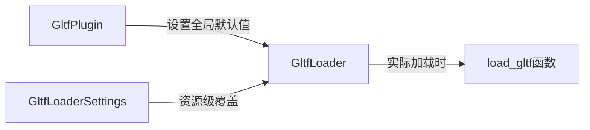

+++
title = "#19685 Allow setting correct glTF coordinate conversions globally"
date = "2025-06-24T00:00:00"
draft = false
template = "pull_request_page.html"
in_search_index = false

[extra]
current_language = "zh-cn"
available_languages = {"en" = { name = "English", url = "/pull_request/bevy/2025-06/pr-19685-en-20250624" }, "zh-cn" = { name = "中文", url = "/pull_request/bevy/2025-06/pr-19685-zh-cn-20250624" }}
+++

# 分析报告：PR #19685 - 允许全局设置正确的glTF坐标系转换

## 基本信息
- **标题**: Allow setting correct glTF coordinate conversions globally
- **PR链接**: https://github.com/bevyengine/bevy/pull/19685
- **作者**: janhohenheim
- **状态**: 已合并
- **标签**: C-Usability, S-Ready-For-Final-Review, D-Straightforward, A-glTF
- **创建时间**: 2025-06-16T23:26:30Z
- **合并时间**: 2025-06-24T00:41:42Z
- **合并者**: alice-i-cecile

## 描述翻译
### Objective
- 作为 https://github.com/bevyengine/bevy/pull/19633 的后续改进
- 当前每次加载glTF时都需要单独指定坐标系转换，操作较为繁琐
- 从第三方加载的glTF资源仍会存在坐标系不正确的问题

### Solution
- 允许全局或按资源启用新的坐标系转换行为
- 同时改进了相关文档说明

### Testing
- 运行了动画示例(animation examples)
- 使用所有配置组合运行了上一个PR的测试场景

## PR技术分析

### 问题背景
glTF标准使用Z轴向前/Y轴向上的坐标系（右手系），而Bevy引擎使用-Y轴向前/Y轴向上的坐标系（左手系）。这种差异导致直接导入的3D模型方向错误。之前的PR#19633虽然提供了坐标系转换选项，但存在两个主要问题：
1. 每次加载资源都需要显式设置`convert_coordinates = true`
2. 第三方glTF资源无法自动应用转换

### 解决方案
核心思路是引入分层配置机制：
1. 在`GltfPlugin`添加全局开关`convert_coordinates`
2. 保留资源级设置，优先级高于全局配置
3. 优化文档说明转换规则



### 关键技术实现
**配置继承机制**：
```rust
let convert_coordinates = match settings.convert_coordinates {
    Some(convert_coordinates) => convert_coordinates,
    None => loader.default_convert_coordinates,
};
```
当资源级设置为`Some`时优先使用，否则回退到全局默认值。

**坐标系转换点**：
1. 顶点位置/法线转换（F32x3类型）：
```rust
Values::Float32x3(it.map(ConvertCoordinates::convert_coordinates).collect())
```
2. 切线数据转换（F32x4类型）：
```rust
Values::Float32x4(it.map(ConvertCoordinates::convert_coordinates).collect())
```

**文档改进**：
明确列出坐标系映射关系：
```markdown
- glTF:
  - forward: Z
  - up: Y
  - right: -X
- Bevy:
  - forward: -Z
  - up: Y
  - right: X
```

### 技术决策考量
1. **向后兼容**：默认保持`convert_coordinates=false`，避免破坏现有项目
2. **灵活控制**：
   - 全局配置：`GltfPlugin::convert_coordinates`
   - 资源级配置：`GltfLoaderSettings::convert_coordinates`
3. **性能优化**：仅在启用转换时执行坐标变换运算
4. **代码可读性**：在顶点属性处理处添加详细注释，说明哪些数据类型需要转换

### 实际影响
1. 简化工作流：项目初始化时设置一次全局配置即可
2. 修复第三方资源问题：通过全局配置确保所有glTF资源正确转换
3. 文档改进：明确坐标系差异和转换规则

## 关键文件变更

### crates/bevy_gltf/src/lib.rs
**变更原因**：添加全局配置开关
```diff
pub struct GltfPlugin {
    ...
+    pub convert_coordinates: bool,
     ...
 }

 impl Default for GltfPlugin {
     fn default() -> Self {
         GltfPlugin {
             ...
+            convert_coordinates: false,
         }
     }
 }
```

### crates/bevy_gltf/src/loader/mod.rs
**变更原因**：实现配置继承逻辑
```diff
 pub struct GltfLoader {
     ...
+    pub default_convert_coordinates: bool,
 }

 pub struct GltfLoaderSettings {
     ...
-    pub convert_coordinates: bool,
+    pub convert_coordinates: Option<bool>,
 }

 async fn load_gltf(...) {
+    let convert_coordinates = match settings.convert_coordinates {
+        Some(convert_coordinates) => convert_coordinates,
+        None => loader.default_convert_coordinates,
+    };
    
     // 所有后续转换点使用此变量
-    if settings.convert_coordinates { ... }
+    if convert_coordinates { ... }
 }
```

### crates/bevy_gltf/src/vertex_attributes.rs
**变更原因**：添加转换注释说明
```diff
 VertexAttributeIter::F32x3(it) => Ok(if convert_coordinates {
+    // 以下f32x3值需要转换坐标系：
+    // - 位置(Positions)
+    // - 法线(Normals)
     Values::Float32x3(it.map(ConvertCoordinates::convert_coordinates).collect())
 }),
```

### release-content/release-notes/convert-coordinates.md
**变更原因**：更新使用文档
```diff
- This is why we are now gradually rolling out support...
+ pull_requests: [19633, 19685]
 
- let handle = asset_server.load_with_settings(
-    "fox.gltf#Scene0",
-    |settings: &mut GltfLoaderSettings| {
-        settings.convert_coordinates = true;
-    },
- );
+// 全局配置
+App::new()
+    .add_plugins(DefaultPlugins.set(GltfPlugin {
+        convert_coordinates: true,
+        ..default()
+    }))
+
+// 资源级配置
+settings.convert_coordinates = Some(true);
```

## 延伸阅读
1. [glTF坐标系规范](https://registry.khronos.org/glTF/specs/2.0/glTF-2.0.html#coordinate-system-and-units)
2. [原始实现PR#19633](https://github.com/bevyengine/bevy/pull/19633)
3. [Bevy坐标系统文档](https://bevyengine.org/learn/book/getting-started/coordinate-system/)