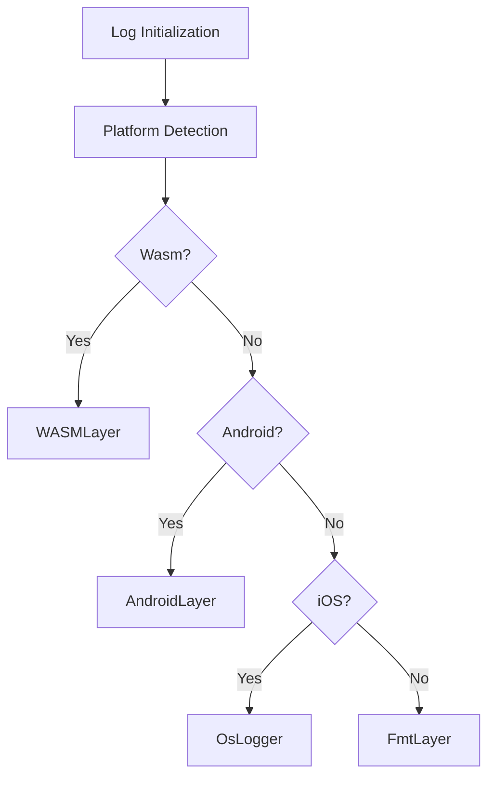

+++
title = "#19705 Revert \"bevy_log: refactor how log layers are wired together (#19248)\""
date = "2025-06-17T00:00:00"
draft = false
template = "pull_request_page.html"
in_search_index = true

[taxonomies]
list_display = ["show"]

[extra]
current_language = "en"
available_languages = {"en" = { name = "English", url = "/pull_request/bevy/2025-06/pr-19705-en-20250617" }, "zh-cn" = { name = "中文", url = "/pull_request/bevy/2025-06/pr-19705-zh-cn-20250617" }}
labels = ["C-Bug", "D-Trivial", "P-Critical", "A-Diagnostics"]
+++

## Revert "bevy_log: refactor how log layers are wired together (#19248)"

### Basic Information
- **Title**: Revert "bevy_log: refactor how log layers are wired together (#19248)"
- **PR Link**: https://github.com/bevyengine/bevy/pull/19705
- **Author**: alice-i-cecile
- **Status**: MERGED
- **Labels**: C-Bug, D-Trivial, S-Ready-For-Final-Review, P-Critical, A-Diagnostics
- **Created**: 2025-06-17T20:17:23Z
- **Merged**: 2025-06-17T21:01:03Z
- **Merged By**: alice-i-cecile

### Description Translation
This reverts commit 8661e914a57d4e5c8bec20f0a840041c0e8aea25, aka #19248.

Fixes #19689.

### The Story of This Pull Request

The problem arose when PR #19248 refactored Bevy's logging layer wiring. This change introduced a regression where iOS logging stopped functioning entirely (#19689). Since iOS is a supported platform and logging is critical for debugging, this was a high-priority issue requiring immediate resolution.

The solution approach was straightforward: revert the problematic commit to restore the previous working implementation. Given the severity of the regression and time constraints, this was deemed the most efficient way to resolve the issue while maintaining stability. The alternative would have been to debug and fix the new implementation, but with the root cause not immediately obvious, reverting provided a faster path to restore functionality.

The implementation reverts two main changes:
1. The core logging infrastructure in `bevy_log`
2. The log layers example that depended on the refactored API

Before the revert, the logging system used a vector-based approach to combine layers:
```rust
let mut layers: Vec<BoxedLayer> = Vec::new();
// ... populate layers ...
let subscriber = Registry::default().with(layers);
```

After reverting, we return to the previous method of chaining layers:
```rust
let subscriber = Registry::default()
    .with(custom_layer)
    .with(filter_layer)
    .with(error_layer)
    .with(fmt_layer);
```

This change restores iOS logging by preserving the platform-specific layer handling that was removed in #19248. The key technical insight is that the vector-based approach didn't properly handle platform-specific layer composition, particularly the iOS-specific `tracing_oslog::OsLogger` integration.

The impact is immediate restoration of iOS logging functionality without changing other platforms' behavior. This revert maintains the previous architecture's trade-offs: while slightly more verbose, it's proven stable across all targets. Future improvements to layer composition should include comprehensive platform testing before merging.

### Visual Representation



### Key Files Changed

1. `crates/bevy_log/src/lib.rs`
   - Reverted layer composition to chained `with()` calls
   - Restored platform-specific layer handling
   - Fixed iOS logging regression

Before:
```rust
let mut layers: Vec<BoxedLayer> = Vec::new();
layers.push(Self::build_filter_layer(...));
layers.push(Self::build_system_output_layer(...));
let subscriber = Registry::default().with(layers);
```

After:
```rust
let subscriber = Registry::default()
    .with(custom_layer)
    .with(filter_layer);
#[cfg(feature = "trace")]
let subscriber = subscriber.with(tracing_error::ErrorLayer::default());
let subscriber = subscriber.with(fmt_layer);
```

2. `examples/app/log_layers.rs`
   - Updated type signature to match original API
   - Removed unnecessary boxing

Before:
```rust
fn fmt_layer(_app: &mut App) -> Option<BoxedLayer> {
    Some(
        Layer::default()
            .without_time()
            .boxed()
    )
}
```

After:
```rust
fn fmt_layer(_app: &mut App) -> Option<BoxedFmtLayer> {
    Some(Box::new(
        Layer::default()
            .without_time()
    ))
}
```

### Further Reading
1. [tracing_subscriber Layering Documentation](https://docs.rs/tracing-subscriber/latest/tracing_subscriber/layer/index.html#composing-layers)
2. [Bevy Logging Architecture Discussion](https://github.com/bevyengine/bevy/discussions/19529)
3. [iOS Logging Issue #19689](https://github.com/bevyengine/bevy/issues/19689)

### Full Code Diff
<details>
<summary>View full diff</summary>

```diff
diff --git a/crates/bevy_log/src/lib.rs b/crates/bevy_log/src/lib.rs
index c0ad83468d8b1..7a80a21cc3ade 100644
--- a/crates/bevy_log/src/lib.rs
+++ b/crates/bevy_log/src/lib.rs
@@ -56,6 +56,7 @@ use bevy_app::{App, Plugin};
 use tracing_log::LogTracer;
 use tracing_subscriber::{
     filter::{FromEnvError, ParseError},
+    layer::Layered,
     prelude::*,
     registry::Registry,
     EnvFilter, Layer,
@@ -83,8 +84,6 @@ pub(crate) struct FlushGuard(SyncCell<tracing_chrome::FlushGuard>);
 ///   logging to `stdout`.
 /// * Using [`android_log-sys`](https://crates.io/crates/android_log-sys) on Android,
 ///   logging to Android logs.
-/// * Using [`tracing_oslog`](https://crates.io/crates/tracing_oslog) on iOS,
-///   logging to iOS logs.
 /// * Using [`tracing-wasm`](https://crates.io/crates/tracing-wasm) in Wasm, logging
 ///   to the browser console.
 ///
@@ -255,15 +254,26 @@ pub struct LogPlugin {
     /// timestamp from the log output.
     ///
     /// Please see the `examples/log_layers.rs` for a complete example.
-    ///
-    /// Note that this field has no effect when `os_target` is `android`, `ios` or `wasm`, as on those
-    /// platforms we don't use [`tracing_subscriber::fmt::Layer`] but rather the platform default.
-    pub fmt_layer: fn(app: &mut App) -> Option<BoxedLayer>,
+    pub fmt_layer: fn(app: &mut App) -> Option<BoxedFmtLayer>,
 }
 
 /// A boxed [`Layer`] that can be used with [`LogPlugin::custom_layer`].
 pub type BoxedLayer = Box<dyn Layer<Registry> + Send + Sync + 'static>;
 
+#[cfg(feature = "trace")]
+type BaseSubscriber =
+    Layered<EnvFilter, Layered<Option<Box<dyn Layer<Registry> + Send + Sync>>, Registry>>;
+
+#[cfg(feature = "trace")]
+type PreFmtSubscriber = Layered<tracing_error::ErrorLayer<BaseSubscriber>, BaseSubscriber>;
+
+#[cfg(not(feature = "trace"))]
+type PreFmtSubscriber =
+    Layered<EnvFilter, Layered<Option<Box<dyn Layer<Registry> + Send + Sync>>, Registry>>;
+
+/// A boxed [`Layer`] that can be used with [`LogPlugin::fmt_layer`].
+pub type BoxedFmtLayer = Box<dyn Layer<PreFmtSubscriber> + Send + Sync + 'static>;
+
 /// The default [`LogPlugin`] [`EnvFilter`].
 pub const DEFAULT_FILTER: &str = "wgpu=error,naga=warn";
 
@@ -290,25 +300,30 @@ impl Plugin for LogPlugin {
             }));
         }
 
-        // We use a Vec of BoxedLayer instead of adding each layer individually using the
-        // `layer.with(next_layer)`.
-        // Otherwise, the types of each successive layer becomes unwieldy,
-        // as the type of each new layer would depend on the types of the previous layers.
-        let mut layers: Vec<BoxedLayer> = Vec::new();
-
-        // Add optional layer provided by user
-        // As they are added first, any of the following layers won't be applied.
-        // In particular, it won't be affected by the filtering we put in place next.
-        if let Some(layer) = (self.custom_layer)(app) {
-            layers.push(layer);
-        }
+        let finished_subscriber;
+        let subscriber = Registry::default();
 
-        layers.push(Self::build_filter_layer(self.level, &self.filter));
+        // add optional layer provided by user
+        let subscriber = subscriber.with((self.custom_layer)(app));
 
-        #[cfg(feature = "trace")]
-        layers.push(tracing_error::ErrorLayer::default().boxed());
+        let default_filter = { format!("{},{}", self.level, self.filter) };
+        let filter_layer = EnvFilter::try_from_default_env()
+            .or_else(|from_env_error| {
+                _ = from_env_error
+                    .source()
+                    .and_then(|source| source.downcast_ref::<ParseError>())
+                    .map(|parse_err| {
+                        // we cannot use the `error!` macro here because the logger is not ready yet.
+                        eprintln!("LogPlugin failed to parse filter from env: {}", parse_err);
+                    });
+
+                Ok::<EnvFilter, FromEnvError>(EnvFilter::builder().parse_lossy(&default_filter))
+            })
+            .unwrap();
+        let subscriber = subscriber.with(filter_layer);
 
-        layers.push(Self::build_system_output_layer((self.fmt_layer)(app)));
+        #[cfg(feature = "trace")]
+        let subscriber = subscriber.with(tracing_error::ErrorLayer::default());
 
         #[cfg(all(
             not(target_arch = "wasm32"),
@@ -317,136 +332,84 @@ impl Plugin for LogPlugin {
         ))]
         {
             #[cfg(feature = "tracing-chrome")]
-            {
-                let (chrome_layer, guard) = Self::build_chrome_layer();
+            let chrome_layer = {
+                let mut layer = tracing_chrome::ChromeLayerBuilder::new();
+                if let Ok(path) = std::env::var("TRACE_CHROME") {
+                    layer = layer.file(path);
+                }
+                let (chrome_layer, guard) = layer
+                    .name_fn(Box::new(|event_or_span| match event_or_span {
+                        tracing_chrome::EventOrSpan::Event(event) => event.metadata().name().into(),
+                        tracing_chrome::EventOrSpan::Span(span) => {
+                            if let Some(fields) =
+                                span.extensions().get::<FormattedFields<DefaultFields>>()
+                            {
+                                format!("{}: {}", span.metadata().name(), fields.fields.as_str())
+                            } else {
+                                span.metadata().name().into()
+                            }
+                        }
+                    }))
+                    .build();
                 app.insert_resource(FlushGuard(SyncCell::new(guard));
-                layers.push(chrome_layer);
-            }
-            #[cfg(feature = "tracing-tracy")]
-            layers.push(tracing_tracy::TracyLayer::default().boxed());
-        }
+                chrome_layer
+            };
 
-        let subscriber = Registry::default().with(layers);
-
-        let logger_already_set = LogTracer::init().is_err();
-        let subscriber_already_set = tracing::subscriber::set_global_default(subscriber).is_err();
-
-        match (logger_already_set, subscriber_already_set) {
-            (true, true) => error!(
-                "Could not set global logger and tracing subscriber as they are already set. Consider disabling LogPlugin."
-            ),
-            (true, false) => error!("Could not set global logger as it is already set. Consider disabling LogPlugin."),
-            (false, true) => error!("Could not set global tracing subscriber as it is already set. Consider disabling LogPlugin."),
-            (false, false) => (),
-        }
-    }
-}
+            #[cfg(feature = "tracing-tracy")]
+            let tracy_layer = tracing_tracy::TracyLayer::default();
 
-impl LogPlugin {
-    /// Build a [`BoxedLayer`] that will filter which logs are outputted.
-    /// It will read the `RUST_LOG` env variable to override the settings
-    /// on a given run, the default will fallback to the provided `level` and `filter`
-    fn build_filter_layer(level: Level, filter: &str) -> BoxedLayer {
-        let default_filter = { format!("{},{}", level, filter) };
+            let fmt_layer = (self.fmt_layer)(app).unwrap_or_else(|| {
+                // note: the implementation of `Default` reads from the env var NO_COLOR
+                // to decide whether to use ANSI color codes, which is common convention
+                // https://no-color.org/
+                Box::new(tracing_subscriber::fmt::Layer::default().with_writer(std::io::stderr))
+            });
 
-        EnvFilter::try_from_default_env()
-            .or_else(|from_env_error| {
-                _ = from_env_error
-                    .source()
-                    .and_then(|source| source.downcast_ref::<ParseError>())
-                    .map(|parse_err| {
-                        #[expect(
-                            clippy::print_stderr,
-                            reason = "We cannot use the `error!` macro here because the logger is not ready yet."
-                        )]
-                        {
-                        eprintln!("LogPlugin failed to parse filter from env: {}", parse_err);
-                        }
-                    });
+            // bevy_render::renderer logs a `tracy.frame_mark` event every frame
+            // at Level::INFO. Formatted logs should omit it.
+            #[cfg(feature = "tracing-tracy")]
+            let fmt_layer =
+                fmt_layer.with_filter(tracing_subscriber::filter::FilterFn::new(|meta| {
+                    meta.fields().field("tracy.frame_mark").is_none()
+                }));
 
-                Ok::<EnvFilter, FromEnvError>(EnvFilter::builder().parse_lossy(&default_filter))
-            })
-            .unwrap().boxed()
-    }
+            let subscriber = subscriber.with(fmt_layer);
 
-    #[cfg(feature = "tracing-chrome")]
-    /// [`BoxedLayer`] to build the necessary output when the `tracing-chrome` feature is enabled.
-    /// The [`tracing_chrome::FlushGuard`] must be kept around till we don't need to output logs
-    /// any more
-    fn build_chrome_layer() -> (BoxedLayer, tracing_chrome::FlushGuard) {
-        let mut layer = tracing_chrome::ChromeLayerBuilder::new();
-        if let Ok(path) = std::env::var("TRACE_CHROME") {
-            layer = layer.file(path);
+            #[cfg(feature = "tracing-chrome")]
+            let subscriber = subscriber.with(chrome_layer);
+            #[cfg(feature = "tracing-tracy")]
+            let subscriber = subscriber.with(tracy_layer);
+            finished_subscriber = subscriber;
         }
-        let (chrome_layer, guard) = layer
-            .name_fn(Box::new(|event_or_span| match event_or_span {
-                tracing_chrome::EventOrSpan::Event(event) => event.metadata().name().into(),
-                tracing_chrome::EventOrSpan::Span(span) => {
-                    if let Some(fields) = span.extensions().get::<FormattedFields<DefaultFields>>()
-                    {
-                        format!("{}: {}", span.metadata().name(), fields.fields.as_str())
-                    } else {
-                        span.metadata().name().into()
-                    }
-                }
-            }))
-            .build();
-        (chrome_layer.boxed(), guard)
-    }
 
-    #[expect(
-        clippy::allow_attributes,
-        reason = "We can't switch to `expect` for allow(unused_variables) as we use it if not on those platforms"
-    )]
-    #[allow(unused_variables, reason = "Not used on `wasm32`, `android` or `ios")]
-    /// Build a [`BoxedLayer`] that outputs logs to the system default.
-    /// On most platforms, it will be `stderr` with [`tracing_subscriber::fmt::Layer`], expect on `android`, `ios` and` wasm32` where it
-    /// uses those system default log infrastructure.
-    /// It is possible to override how you output those logs by providing a `custom_format_layer`.
-    /// Note that won't have an effect on platform that don't use [`tracing_subscriber::fmt::Layer`]
-    fn build_system_output_layer(custom_format_layer: Option<BoxedLayer>) -> BoxedLayer {
-        let layer: BoxedLayer;
         #[cfg(target_arch = "wasm32")]
         {
-            layer = tracing_wasm::WASMLayer::new(tracing_wasm::WASMLayerConfig::default()).boxed();
+            finished_subscriber = subscriber.with(tracing_wasm::WASMLayer::new(
+                tracing_wasm::WASMLayerConfig::default(),
+            ));
         }
 
         #[cfg(target_os = "android")]
         {
-            layer = android_tracing::AndroidLayer::default().boxed();
+            finished_subscriber = subscriber.with(android_tracing::AndroidLayer::default());
         }
 
         #[cfg(target_os = "ios")]
         {
-            layer = tracing_oslog::OsLogger::default().boxed();
+            finished_subscriber = subscriber.with(tracing_oslog::OsLogger::default());
         }
 
-        #[cfg(all(
-            not(target_arch = "wasm32"),
-            not(target_os = "android"),
-            not(target_os = "ios")
-        ))]
-        {
-            layer = {
-                let fmt_layer = custom_format_layer.unwrap_or_else(|| {
-                    tracing_subscriber::fmt::Layer::default()
-                        // note: the implementation of `Default` reads from the env var NO_COLOR
-                        // to decide whether to use ANSI color codes, which is common convention
-                        // https://no-color.org/
-                        .with_writer(std::io::stderr)
-                        .boxed()
-                });
-
-                // bevy_render::renderer logs a `tracy.frame_mark` event every frame
-                // at Level::INFO. Formatted logs should omit it.
-                #[cfg(feature = "tracing-tracy")]
-                let fmt_layer =
-                    fmt_layer.with_filter(tracing_subscriber::filter::FilterFn::new(|meta| {
-                        meta.fields().field("tracy.frame_mark").is_none()
-                    }));
-                fmt_layer.boxed()
-            }
+        let logger_already_set = LogTracer::init().is_err();
+        let subscriber_already_set =
+            tracing::subscriber::set_global_default(finished_subscriber).is_err();
+
+        match (logger_already_set, subscriber_already_set) {
+            (true, true) => error!(
+                "Could not set global logger and tracing subscriber as they are already set. Consider disabling LogPlugin."
+            ),
+            (true, false) => error!("Could not set global logger as it is already set. Consider disabling LogPlugin."),
+            (false, true) => error!("Could not set global tracing subscriber as it is already set. Consider disabling LogPlugin."),
+            (false, false) => (),
         }
-        layer
     }
 }
diff --git a/examples/app/log_layers.rs b/examples/app/log_layers.rs
index 83e17ef107b79..8f454e9ee0c9b 100644
--- a/examples/app/log_layers.rs
+++ b/examples/app/log_layers.rs
@@ -4,7 +4,7 @@ use bevy::{
     log::{
         tracing::{self, Subscriber},
         tracing_subscriber::Layer,
-        BoxedLayer,
+        BoxedFmtLayer, BoxedLayer,
     },
     prelude::*,
 };
@@ -41,13 +41,12 @@ fn custom_layer(_app: &mut App) -> Option<BoxedLayer> {
 // `fmt_layer` option.
 //
 // In this example, we're disabling the timestamp in the log output.
-fn fmt_layer(_app: &mut App) -> Option<BoxedLayer> {
-    Some(
+fn fmt_layer(_app: &mut App) -> Option<BoxedFmtLayer> {
+    Some(Box::new(
         bevy::log::tracing_subscriber::fmt::Layer::default()
             .without_time()
-            .with_writer(std::io::stderr)
-            .boxed(),
-    )
+            .with_writer(std::io::stderr),
+    ))
 }
 
 fn main() {
```
</details>