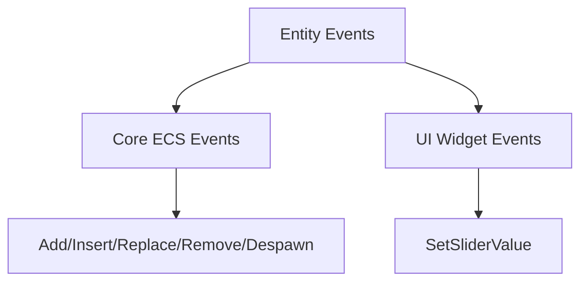

+++
title = "#19708 Added clone bounds to EntityEvents that were missing them"
date = "2025-06-17T00:00:00"
draft = false
template = "pull_request_page.html"
in_search_index = true

[taxonomies]
list_display = ["show"]

[extra]
current_language = "en"
available_languages = {"en" = { name = "English", url = "/pull_request/bevy/2025-06/pr-19708-en-20250617" }, "zh-cn" = { name = "中文", url = "/pull_request/bevy/2025-06/pr-19708-zh-cn-20250617" }}
labels = ["D-Trivial", "A-ECS", "A-UI", "C-Usability"]
+++

## Analysis of PR #19708: Added clone bounds to EntityEvents that were missing them

### Basic Information
- **Title**: Added clone bounds to EntityEvents that were missing them
- **PR Link**: https://github.com/bevyengine/bevy/pull/19708
- **Author**: MalekiRe
- **Status**: MERGED
- **Labels**: D-Trivial, A-ECS, A-UI, C-Usability, S-Ready-For-Final-Review
- **Created**: 2025-06-17T21:04:57Z
- **Merged**: 2025-06-17T21:40:08Z
- **Merged By**: alice-i-cecile

### The Story of This Pull Request

#### The Problem and Context
In Bevy's ECS system, several built-in event types used for entity lifecycle management (`Add`, `Insert`, `Replace`, `Remove`, `Despawn`) and UI components (`SetSliderValue`) lacked `Clone` trait implementations. This created practical limitations when working with these events in systems that needed to clone them - a common requirement when passing events between systems or storing them for deferred processing. Without `Clone` implementations, developers would need to implement workarounds or manually clone fields, adding unnecessary complexity to their code.

#### The Solution Approach
The solution was straightforward: add `Clone` trait derivations to the affected event types. This approach maintains consistency with other Bevy events that already implement `Clone` and requires minimal code changes. The implementation leverages Rust's derive macros to automatically generate the necessary trait implementations without modifying any existing functionality.

#### The Implementation
The changes were implemented by adding the `Clone` trait to the derive attribute lists for the affected event types. Here's a breakdown of the key modifications:

1. **UI Component Event (`SetSliderValue`)**:
```rust
// File: crates/bevy_core_widgets/src/core_slider.rs
// Before:
#[derive(Event, EntityEvent)]
pub enum SetSliderValue { ... }

// After:
#[derive(Event, EntityEvent, Clone)]
pub enum SetSliderValue { ... }
```

2. **ECS Lifecycle Events**:
```rust
// File: crates/bevy_ecs/src/lifecycle.rs
// Before:
#[derive(Event, EntityEvent, Debug)]
pub struct Add;

// After:
#[derive(Event, EntityEvent, Debug, Clone)]
pub struct Add;
```
Similar changes were applied to `Insert`, `Replace`, `Remove`, and `Despawn` events in the same file.

#### Technical Insights
The change demonstrates Bevy's consistent approach to event design:
- All events now implement `Clone`, maintaining a uniform interface
- Zero-cost abstraction: Deriving `Clone` has no runtime overhead for these empty structs
- Backward compatibility: Existing code works unchanged while enabling new use cases
- The change affects both ECS core (lifecycle events) and UI systems (slider events), showing cross-cutting concerns in the engine

#### The Impact
This change improves developer experience by:
1. Enabling event cloning in systems that need to store or forward events
2. Removing boilerplate code for manual cloning workarounds
3. Maintaining consistency across Bevy's event system
4. Supporting more flexible event handling patterns

For example, developers can now directly clone events when building event queues:
```rust
let event_copy = original_event.clone();
event_queue.push(event_copy);
```

### Visual Representation


### Key Files Changed

1. **crates/bevy_ecs/src/lifecycle.rs** (+5/-5)
   - Added `Clone` derivation to five ECS lifecycle events
   - Ensures consistent behavior across core entity management events
   - Changes:
```rust
// Before:
#[derive(Event, EntityEvent, Debug)]
pub struct Add;

// After:
#[derive(Event, EntityEvent, Debug, Clone)]
pub struct Add;
```

2. **crates/bevy_core_widgets/src/core_slider.rs** (+1/-1)
   - Added `Clone` to slider value event
   - Enables cloning UI interaction events
   - Changes:
```rust
// Before:
#[derive(Event, EntityEvent)]
pub enum SetSliderValue { ... }

// After:
#[derive(Event, EntityEvent, Clone)]
pub enum SetSliderValue { ... }
```

### Further Reading
1. [Rust Clone Trait Documentation](https://doc.rust-lang.org/std/clone/trait.Clone.html)
2. [Bevy Events Documentation](https://docs.rs/bevy/latest/bevy/ecs/event/index.html)
3. [Entity Component System Pattern](https://en.wikipedia.org/wiki/Entity_component_system)

This PR demonstrates how small, focused changes can improve API consistency and developer ergonomics in a game engine. By maintaining trait uniformity across core systems, Bevy becomes more predictable and easier to work with.