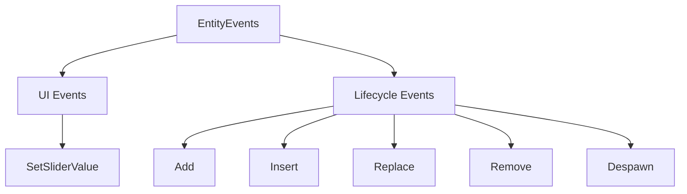

+++
title = "#19708 Added clone bounds to EntityEvents that were missing them."
date = "2025-06-17T00:00:00"
draft = false
template = "pull_request_page.html"
in_search_index = false

[extra]
current_language = "zh-cn"
available_languages = {"en" = { name = "English", url = "/pull_request/bevy/2025-06/pr-19708-en-20250617" }, "zh-cn" = { name = "中文", url = "/pull_request/bevy/2025-06/pr-19708-zh-cn-20250617" }}
+++

# Added clone bounds to EntityEvents that were missing them.

## Basic Information
- **标题**: Added clone bounds to EntityEvents that were missing them.
- **PR链接**: https://github.com/bevyengine/bevy/pull/19708
- **作者**: MalekiRe
- **状态**: 已合并 (MERGED)
- **标签**: D-Trivial, A-ECS, A-UI, C-Usability, S-Ready-For-Final-Review
- **创建时间**: 2025-06-17T21:04:57Z
- **合并时间**: 2025-06-17T21:40:08Z
- **合并人**: alice-i-cecile

## 描述翻译
### 目标 (Objective)
某些内置事件缺少克隆 (clone) 功能

### 解决方案 (Solution)
为这些事件添加了克隆 (clone) 功能

### 测试 (Testing)

### 展示 (Showcase)


## 本次 Pull Request 的技术分析

在 Bevy 的实体组件系统 (ECS) 中，实体事件 (EntityEvents) 是核心的通信机制，允许系统响应实体状态变化。某些内置事件类型缺少 `Clone` trait 实现，这在需要复制事件实例的场景中会导致编译错误。这个问题影响 UI 交互和实体生命周期管理两个关键领域。

开发者通过添加 `Clone` trait 派生解决了这个问题。解决方案直接明了：为缺少该实现的每个事件类型添加 `#[derive(Clone)]` 属性。由于这些事件都是空结构体 (unit structs) 或简单枚举，自动派生完全满足需求，不需要手动实现克隆逻辑。

修改集中在两个文件：
1. **UI 组件**：`core_slider.rs` 中的 `SetSliderValue` 事件
2. **ECS 生命周期**：`lifecycle.rs` 中的实体状态变更事件

这些修改保持了事件系统的一致性，因为其他事件通常已实现 `Clone`。技术决策的关键点在于：
- 空结构体的克隆是零成本的 (zero-cost)
- 枚举克隆要求所有变体都可克隆（本案例中已满足）
- 不影响现有事件处理逻辑

影响范围包括：
- 开发者现在可以自由克隆这些事件实例
- 支持将事件存储到容器中（如 `Vec<impl Clone>`）
- 允许事件数据在多处复用
- 保持事件系统行为的一致性



## 关键文件变更

1. **`crates/bevy_core_widgets/src/core_slider.rs`**
   - 为滑块组件事件添加 `Clone` 实现
   - 变更：`SetSliderValue` 枚举现在可克隆

```rust
// 修改前：
#[derive(Event, EntityEvent)]
pub enum SetSliderValue {
    Absolute(f32),
    Relative(f32),
}

// 修改后：
#[derive(Event, EntityEvent, Clone)]
pub enum SetSliderValue {
    Absolute(f32),
    Relative(f32),
}
```

2. **`crates/bevy_ecs/src/lifecycle.rs`**
   - 为5个实体生命周期事件添加 `Clone` 实现
   - 影响事件：`Add`, `Insert`, `Replace`, `Remove`, `Despawn`

```rust
// 修改前：
#[derive(Event, EntityEvent, Debug)]
pub struct Add;

// 修改后：
#[derive(Event, EntityEvent, Debug, Clone)]
pub struct Add;

// 其他事件类似修改：
// Insert, Replace, Remove, Despawn
```

## 完整代码差异

```diff
diff --git a/crates/bevy_core_widgets/src/core_slider.rs b/crates/bevy_core_widgets/src/core_slider.rs
index e07a61a9c2b76..ecd6d52fbe3a3 100644
--- a/crates/bevy_core_widgets/src/core_slider.rs
+++ b/crates/bevy_core_widgets/src/core_slider.rs
@@ -461,7 +461,7 @@ pub(crate) fn slider_on_insert_step(trigger: On<Insert, SliderStep>, mut world:
 ///     commands.trigger_targets(SetSliderValue::Relative(-0.25), slider);
 /// }
 /// ```
-#[derive(Event, EntityEvent)]
+#[derive(Event, EntityEvent, Clone)]
 pub enum SetSliderValue {
     /// Set the slider value to a specific value.
     Absolute(f32),
diff --git a/crates/bevy_ecs/src/lifecycle.rs b/crates/bevy_ecs/src/lifecycle.rs
index be5765beee295..e92c6cc7f92d4 100644
--- a/crates/bevy_ecs/src/lifecycle.rs
+++ b/crates/bevy_ecs/src/lifecycle.rs
@@ -328,7 +328,7 @@ pub const DESPAWN: ComponentId = ComponentId::new(4);
 /// Trigger emitted when a component is inserted onto an entity that does not already have that
 /// component. Runs before `Insert`.
 /// See [`crate::lifecycle::ComponentHooks::on_add`] for more information.
-#[derive(Event, EntityEvent, Debug)]
+#[derive(Event, EntityEvent, Debug, Clone)]
 #[cfg_attr(feature = "bevy_reflect", derive(Reflect))]
 #[cfg_attr(feature = "bevy_reflect", reflect(Debug))]
 #[doc(alias = "OnAdd")]
@@ -337,7 +337,7 @@ pub struct Add;
 /// Trigger emitted when a component is inserted, regardless of whether or not the entity already
 /// had that component. Runs after `Add`, if it ran.
 /// See [`crate::lifecycle::ComponentHooks::on_insert`] for more information.
-#[derive(Event, EntityEvent, Debug)]
+#[derive(Event, EntityEvent, Debug, Clone)]
 #[cfg_attr(feature = "bevy_reflect", derive(Reflect))]
 #[cfg_attr(feature = "bevy_reflect", reflect(Debug))]
 #[doc(alias = "OnInsert")]
@@ -348,7 +348,7 @@ pub struct Insert;
 ///
 /// Runs before the value is replaced, so you can still access the original component data.
 /// See [`crate::lifecycle::ComponentHooks::on_replace`] for more information.
-#[derive(Event, EntityEvent, Debug)]
+#[derive(Event, EntityEvent, Debug, Clone)]
 #[cfg_attr(feature = "bevy_reflect", derive(Reflect))]
 #[cfg_attr(feature = "bevy_reflect", reflect(Debug))]
 #[doc(alias = "OnReplace")]
@@ -357,7 +357,7 @@ pub struct Replace;
 /// Trigger emitted when a component is removed from an entity, and runs before the component is
 /// removed, so you can still access the component data.
 /// See [`crate::lifecycle::ComponentHooks::on_remove`] for more information.
-#[derive(Event, EntityEvent, Debug)]
+#[derive(Event, EntityEvent, Debug, Clone)]
 #[cfg_attr(feature = "bevy_reflect", derive(Reflect))]
 #[cfg_attr(feature = "bevy_reflect", reflect(Debug))]
 #[doc(alias = "OnRemove")]
@@ -365,7 +365,7 @@ pub struct Remove;
 
 /// Trigger emitted for each component on an entity when it is despawned.
 /// See [`crate::lifecycle::ComponentHooks::on_despawn`] for more information.
-#[derive(Event, EntityEvent, Debug)]
+#[derive(Event, EntityEvent, Debug, Clone)]
 #[cfg_attr(feature = "bevy_reflect", derive(Reflect))]
 #[cfg_attr(feature = "bevy_reflect", reflect(Debug))]
 #[doc(alias = "OnDespawn")]
```

## 扩展阅读
- Rust 的 `Clone` trait 文档: https://doc.rust-lang.org/std/clone/trait.Clone.html
- Bevy 事件系统指南: https://bevy-cheatbook.github.io/programming/events.html
- 派生宏工作原理: https://doc.rust-lang.org/reference/procedural-macros.html#derive-macros