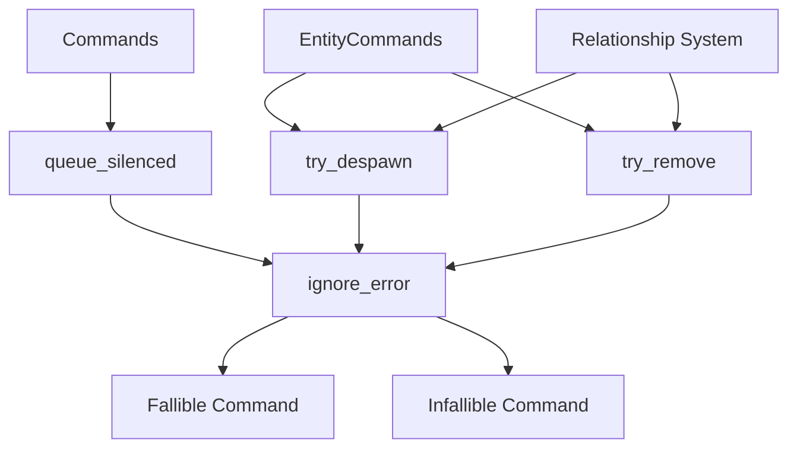

+++
title = "#19718 Don't create errors for ignored failed commands"
date = "2025-06-29T00:00:00"
draft = false
template = "pull_request_page.html"
in_search_index = true

[taxonomies]
list_display = ["show"]

[extra]
current_language = "en"
available_languages = {"en" = { name = "English", url = "/pull_request/bevy/2025-06/pr-19718-en-20250629" }, "zh-cn" = { name = "中文", url = "/pull_request/bevy/2025-06/pr-19718-zh-cn-20250629" }}
labels = ["A-ECS", "C-Performance", "C-Usability", "D-Straightforward"]
+++

# Technical Analysis: PR #19718 - Don't create errors for ignored failed commands

## Basic Information
- **Title**: Don't create errors for ignored failed commands
- **PR Link**: https://github.com/bevyengine/bevy/pull/19718
- **Author**: brianreavis
- **Status**: MERGED
- **Labels**: A-ECS, C-Performance, C-Usability, S-Ready-For-Final-Review, D-Straightforward
- **Created**: 2025-06-18T15:42:40Z
- **Merged**: 2025-06-29T16:53:41Z
- **Merged By**: alice-i-cecile

## Description Translation
# Objective

1. Reduce overhead from error handling for ECS commands that intentionally ignore errors, such as `try_despawn`. These commands currently allocate error objects and pass them to a no-op handler (`ignore`), which can impact performance when many operations fail.

2. Fix a hang when removing `ChildOf` components during entity despawning. Excessive logging of these failures can cause significant hangs (I'm noticing around 100ms).
    - Fixes https://github.com/bevyengine/bevy/issues/19777
    - Fixes https://github.com/bevyengine/bevy/issues/19753


## Solution

* Added a `ignore_error` method to the `HandleError` trait to use instead of `handle_error_with(ignore)`. It swallows errors and does not create error objects.
* Replaced `remove::<ChildOf>` with `try_remove::<ChildOf>` to suppress expected (?) errors and reduce log noise.

## Testing

- I ran these changes on a local project.

## The Story of This Pull Request

### The Problem and Context
The PR addresses two related performance issues in Bevy's ECS command system. First, commands designed to ignore errors (like `try_despawn` and `try_remove`) were inefficiently handling potential failures. These commands used `handle_error_with(ignore)`, which unnecessarily allocated error objects before discarding them. This allocation overhead became significant when processing many failing operations, such as during mass entity despawning.

Second, the relationship system was causing substantial hangs during entity despawning. When removing `ChildOf` components, the system logged errors for each failure, which could accumulate to around 100ms delays in scenes with deep hierarchies. This was particularly problematic because these failures were expected in normal operation when despawning entities.

### The Solution Approach
The solution centered on optimizing the error handling path for intentionally ignored errors. Rather than creating full error objects only to discard them, we needed a lightweight mechanism to suppress errors without allocation. The approach was to introduce a new `ignore_error` method that bypasses error object creation entirely.

Additionally, the relationship system needed to switch from standard removal commands to their error-ignoring variants (`try_remove` and `try_despawn`) to prevent log spam and associated performance costs.

### The Implementation
The core change adds `ignore_error` to the `HandleError` trait with three implementations:

1. For fallible commands (returning `Result`):
```rust
fn ignore_error(self) -> impl Command {
    move |world: &mut World| {
        let _ = self.apply(world);
    }
}
```
This simply swallows errors without allocation.

2. For infallible commands (returning `Never`):
```rust
fn ignore_error(self) -> impl Command {
    move |world: &mut World| {
        self.apply(world);
    }
}
```

3. For commands already returning `()`:
```rust
fn ignore_error(self) -> impl Command {
    self
}
```

The `Commands` API was extended with `queue_silenced`:
```rust
pub fn queue_silenced<C: Command<T> + HandleError<T>, T>(&mut self, command: C) {
    self.queue_internal(command.ignore_error());
}
```

This replaced all instances of `queue_handled(..., ignore)` with `queue_silenced(...)` throughout the command API. For example:

```rust
// Before:
self.queue_handled(entity_command::remove::<B>(), ignore)

// After:
self.queue_silenced(entity_command::remove::<B>())
```

In the relationship system, four key replacements were made:
```rust
// Before:
world.commands().queue(command.with_entity(target_entity).handle_error_with(ignore));
commands.entity(source_entity).remove::<Self::Relationship>();
commands.entity(source_entity).despawn();

// After:
world.commands().queue_silenced(command.with_entity(target_entity));
commands.entity(source_entity).try_remove::<Self::Relationship>();
commands.entity(source_entity).try_despawn();
```

### Technical Insights
The optimization works by eliminating three sources of overhead:
1. Error object allocation
2. Error handler invocation
3. Logging infrastructure overhead

The new `ignore_error` approach is essentially a compile-time optimization of the common "try and ignore failure" pattern. The relationship system changes demonstrate how this optimization is applied to real-world scenarios where failures are expected and acceptable.

### The Impact
These changes resolve two reported issues (#19777 and #19753) by:
1. Eliminating 100ms hangs during entity despawning
2. Reducing memory allocations for ignored errors
3. Preventing log spam from expected failures
4. Providing a cleaner API for error suppression

The performance improvements are most noticeable in scenes with deep entity hierarchies and frequent despawning operations.

## Visual Representation



## Key Files Changed

### 1. `crates/bevy_ecs/src/error/command_handling.rs` (+19/-0)
Added the `ignore_error` method to `HandleError` trait with implementations for different command types.

Key code:
```rust
pub trait HandleError<Out = ()>: Send + 'static {
    // ...
    fn ignore_error(self) -> impl Command;
}

impl<C, T, E> HandleError<Result<T, E>> for C {
    fn ignore_error(self) -> impl Command {
        move |world: &mut World| {
            let _ = self.apply(world);
        }
    }
}

impl<C> HandleError<Never> for C {
    fn ignore_error(self) -> impl Command {
        move |world: &mut World| {
            self.apply(world);
        }
    }
}
```

### 2. `crates/bevy_ecs/src/relationship/mod.rs` (+4/-4)
Updated relationship management to use error-ignoring commands.

Key code:
```rust
// Before:
commands.entity(source_entity).remove::<Self::Relationship>();

// After:
commands.entity(source_entity).try_remove::<Self::Relationship>();

// Before:
commands.entity(source_entity).despawn();

// After:
commands.entity(source_entity).try_despawn();
```

### 3. `crates/bevy_ecs/src/system/commands/mod.rs` (+23/-7)
Added `queue_silenced` API and updated command methods.

Key code:
```rust
// New method:
pub fn queue_silenced<C: Command<T> + HandleError<T>, T>(&mut self, command: C) {
    self.queue_internal(command.ignore_error());
}

// Updated methods:
pub fn try_insert(&mut self, bundle: impl Bundle) -> &mut Self {
    self.queue_silenced(entity_command::insert(bundle, InsertMode::Replace))
}

pub fn try_remove<B: Bundle>(&mut self) -> &mut Self {
    self.queue_silenced(entity_command::remove::<B>())
}

pub fn try_despawn(&mut self) {
    self.queue_silenced(entity_command::despawn());
}
```

## Further Reading
1. Original issues:
   - [Issue #19777](https://github.com/bevyengine/bevy/issues/19777)
   - [Issue #19753](https://github.com/bevyengine/bevy/issues/19753)
2. Bevy ECS Commands documentation
3. Error handling patterns in systems programming
4. Performance optimization through allocation avoidance