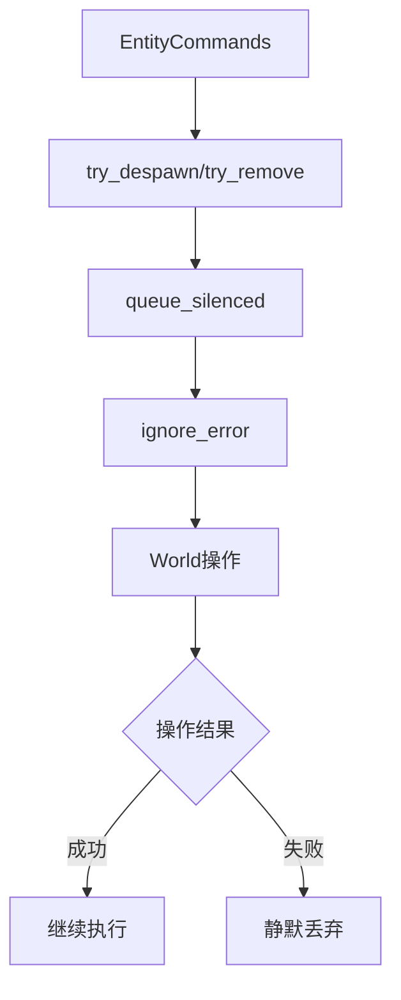

+++
title = "#19718 Don't create errors for ignored failed commands"
date = "2025-06-29T00:00:00"
draft = false
template = "pull_request_page.html"
in_search_index = false

[extra]
current_language = "zh-cn"
available_languages = {"en" = { name = "English", url = "/pull_request/bevy/2025-06/pr-19718-en-20250629" }, "zh-cn" = { name = "中文", url = "/pull_request/bevy/2025-06/pr-19718-zh-cn-20250629" }}
+++

## 标题：优化忽略错误的命令处理以避免性能开销和卡顿问题

## 基本信息
- **标题**: Don't create errors for ignored failed commands
- **PR链接**: https://github.com/bevyengine/bevy/pull/19718
- **作者**: brianreavis
- **状态**: 已合并
- **标签**: A-ECS, C-Performance, C-Usability, S-Ready-For-Final-Review, D-Straightforward
- **创建时间**: 2025-06-18T15:42:40Z
- **合并时间**: 2025-06-29T16:53:41Z
- **合并者**: alice-i-cecile

## 描述翻译
### 目标

1. 减少ECS命令中故意忽略错误（如`try_despawn`）的错误处理开销。这些命令当前会分配错误对象并将其传递给空操作处理程序(`ignore`)，当大量操作失败时会影响性能。
   
2. 修复在实体删除期间移除`ChildOf`组件时的卡顿问题。这些失败的过度日志记录会导致严重卡顿（我注意到约100ms）。
   - 修复 https://github.com/bevyengine/bevy/issues/19777
   - 修复 https://github.com/bevyengine/bevy/issues/19753


### 解决方案

* 在`HandleError` trait中添加`ignore_error`方法以替代`handle_error_with(ignore)`。它直接忽略错误且不创建错误对象。
* 将`remove::<ChildOf>`替换为`try_remove::<ChildOf>`以抑制预期错误并减少日志噪音。

### 测试

- 我在本地项目中运行了这些更改。

## 本PR的技术解析

### 问题与背景
在Bevy的ECS命令系统中，`try_despawn`和`try_remove`等方法设计为静默忽略失败操作。但现有实现仍会为每个失败命令分配错误对象，并通过`ignore`处理程序传递。当处理大量实体时（如删除具有复杂父子关系的实体），这会导致两方面问题：

1. **性能开销**：每个失败操作都产生不必要的错误对象分配和函数调用开销
2. **卡顿问题**：特定情况下（如删除`ChildOf`组件），错误日志的过度输出导致约100ms的卡顿（#19777和#19753）

### 解决方案与实现
核心方案是引入直接忽略错误的轻量级路径，避免中间错误对象分配。在`HandleError` trait中添加`ignore_error`方法：

```rust
// crates/bevy_ecs/src/error/command_handling.rs
pub trait HandleError<Out = ()>: Send + 'static {
    fn ignore_error(self) -> impl Command;
}

impl<C, T, E> HandleError<Result<T, E>> for C
where
    C: Command<Result<T, E>> + Send + 'static,
{
    fn ignore_error(self) -> impl Command {
        move |world: &mut World| {
            let _ = self.apply(world); // 直接忽略结果
        }
    }
}
```

该方法与现有`handle_error_with(ignore)`的关键区别：
- 不构造`Result`对象
- 不调用错误处理闭包
- 使用`let _ =`直接丢弃结果

在命令队列系统中新增`queue_silenced`接口：

```rust
// crates/bevy_ecs/src/system/commands/mod.rs
impl<'w, 's> Commands<'w, 's> {
    pub fn queue_silenced<C: Command<T> + HandleError<T>, T>(&mut self, command: C) {
        self.queue_internal(command.ignore_error());
    }
}
```

### 集成与调用点优化
在关系系统(relationship system)中，将易产生噪音的操作替换为新接口：

```rust
// crates/bevy_ecs/src/relationship/mod.rs
// 替换前
commands.entity(source_entity).remove::<Self::Relationship>();

// 替换后
commands.entity(source_entity).try_remove::<Self::Relationship>();
```

对应的实体命令方法统一改用静默处理：
```rust
// crates/bevy_ecs/src/system/commands/mod.rs
// 所有try_*方法统一更新
pub fn try_remove<B: Bundle>(&mut self) -> &mut Self {
    self.queue_silenced(entity_command::remove::<B>())
}
```

### 技术洞察
1. **零成本错误忽略**：`ignore_error`利用Rust的`let _ =`模式实现零分配的错误丢弃，比通过闭包处理的`handle_error_with(ignore)`更高效
2. **错误处理分层**：
   - `handle_error_with`：需要自定义处理时使用
   - `ignore_error`：明确需要静默时使用
3. **API一致性**：所有`try_`前缀方法(`try_despawn`, `try_remove`)现在内部使用相同错误处理机制

### 影响与改进
1. **性能提升**：消除错误对象分配和闭包调用开销，在批量操作失败场景显著提升性能
2. **修复卡顿**：通过抑制`ChildOf`移除的冗余日志，解决#19777和#19753报告的100ms级卡顿
3. **资源节约**：减少临时对象分配和日志I/O操作
4. **意图清晰**：`queue_silenced`明确表达"静默忽略"语义，比`queue_handled(..., ignore)`更直观

## 可视化表示



## 关键文件变更

### crates/bevy_ecs/src/error/command_handling.rs
新增`ignore_error` trait方法，提供轻量级错误忽略路径：
```rust
// 新增方法定义
pub trait HandleError<Out = ()>: Send + 'static {
    fn ignore_error(self) -> impl Command;
}

// 针对Result命令的实现
fn ignore_error(self) -> impl Command {
    move |world: &mut World| {
        let _ = self.apply(world);
    }
}

// 针对Never类型命令的实现
#[inline]
fn ignore_error(self) -> impl Command {
    move |world: &mut World| {
        self.apply(world);
    }
}
```

### crates/bevy_ecs/src/system/commands/mod.rs
1. 新增`queue_silenced`命令队列接口：
```rust
pub fn queue_silenced<C: Command<T> + HandleError<T>, T>(&mut self, command: C) {
    self.queue_internal(command.ignore_error());
}
```

2. 更新所有try_*方法使用新机制：
```rust
// try_insert
pub fn try_insert(&mut self, bundle: impl Bundle) -> &mut Self {
    self.queue_silenced(entity_command::insert(bundle, InsertMode::Replace))
}

// try_remove
pub fn try_remove<B: Bundle>(&mut self) -> &mut Self {
    self.queue_silenced(entity_command::remove::<B>())
}

// try_despawn
pub fn try_despawn(&mut self) {
    self.queue_silenced(entity_command::despawn());
}
```

### crates/bevy_ecs/src/relationship/mod.rs
将关系操作更新为try_*版本：
```rust
// 替换前
commands.entity(source_entity).remove::<Self::Relationship>();

// 替换后
commands.entity(source_entity).try_remove::<Self::Relationship>();
```

## 延伸阅读
1. [Rust错误处理指南](https://doc.rust-lang.org/book/ch09-00-error-handling.html)
2. [Bevy ECS命令系统文档](https://bevyengine.org/learn/book/getting-started/ecs/)
3. [零成本抽象原则](https://blog.rust-lang.org/2015/05/11/traits.html)