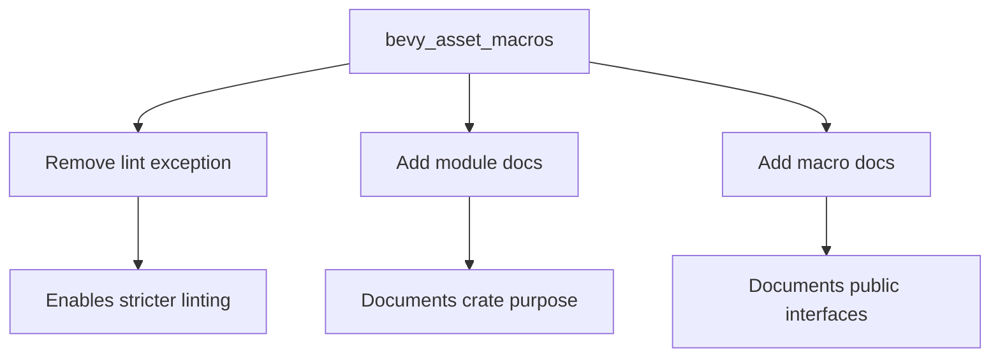

+++
title = "#19719 deny(missing_docs) for bevy_asset_macros"
date = "2025-06-19T00:00:00"
draft = false
template = "pull_request_page.html"
in_search_index = true

[taxonomies]
list_display = ["show"]

[extra]
current_language = "en"
available_languages = {"en" = { name = "English", url = "/pull_request/bevy/2025-06/pr-19719-en-20250619" }, "zh-cn" = { name = "中文", url = "/pull_request/bevy/2025-06/pr-19719-zh-cn-20250619" }}
labels = ["C-Docs", "D-Trivial"]
+++

# deny(missing_docs) for bevy_asset_macros

## Basic Information
- **Title**: deny(missing_docs) for bevy_asset_macros
- **PR Link**: https://github.com/bevyengine/bevy/pull/19719
- **Author**: theotherphil
- **Status**: MERGED
- **Labels**: C-Docs, D-Trivial, S-Ready-For-Final-Review
- **Created**: 2025-06-18T16:51:46Z
- **Merged**: 2025-06-19T02:23:04Z
- **Merged By**: alice-i-cecile

## Description Translation
# Objective

More boilerplate docs, towards https://github.com/bevyengine/bevy/issues/3492.

Another place where https://github.com/bevyengine/bevy/issues/19537 might be worth doing as a follow up - I've added a comment on that issue.

## The Story of This Pull Request

The `bevy_asset_macros` crate contained public macros without documentation, which violated Bevy's documentation standards. This was temporarily allowed using an `expect` lint attribute referencing issue #3492 ("Not all docs are written yet"). The goal was to improve documentation coverage while working toward enabling `deny(missing_docs)` across the codebase.

The solution approach was straightforward: remove the temporary lint exception and add basic documentation for the crate's public items. This required:
1. Removing the `#![expect(missing_docs)]` attribute that suppressed documentation warnings
2. Adding a module-level doc comment explaining the crate's purpose
3. Adding doc comments for both public macros (`Asset` and `VisitAssetDependencies`)

The implementation modified only the crate's root module file. The `expect` attribute was completely removed rather than replaced with `deny`, since the actual enforcement would be handled in a separate PR (referenced in issue #19537). The added doc comments provide basic explanations of each macro's functionality:

```rust
// Before:
#![expect(missing_docs, reason = "Not all docs are written yet, see #3492.")]
#![cfg_attr(docsrs, feature(doc_auto_cfg))]

// After:
#![cfg_attr(docsrs, feature(doc_auto_cfg))]

//! Macros for deriving asset traits.
```

For each macro, a single-line doc comment was added describing its purpose:

```rust
// Before:
#[proc_macro_derive(Asset, attributes(dependency))]
pub fn derive_asset(input: TokenStream) -> TokenStream {

// After:
/// Implement the `Asset` trait.
#[proc_macro_derive(Asset, attributes(dependency))]
pub fn derive_asset(input: TokenStream) -> TokenStream {
```

These changes follow standard Rust documentation practices while keeping the docs concise. The "boilerplate" nature of these docs acknowledges they're minimal starting points that can be expanded later, as noted in the PR description's reference to issue #3492.

The impact is immediate documentation coverage for public interfaces in this crate. This change:
1. Removes technical debt by eliminating the temporary lint exception
2. Provides basic documentation for macro users
3. Enables future enforcement of `deny(missing_docs)` in this crate
4. Maintains consistency with Bevy's documentation standards

The changes are simple but important for long-term code health. They demonstrate incremental progress toward project-wide documentation goals while maintaining backwards compatibility.

## Visual Representation



## Key Files Changed

### crates/bevy_asset/macros/src/lib.rs
This is the only modified file. Changes prepare the crate for `deny(missing_docs)` by adding documentation and removing the temporary lint exception.

**Key modifications:**
```rust
// Before:
#![expect(missing_docs, reason = "Not all docs are written yet, see #3492.")]
#![cfg_attr(docsrs, feature(doc_auto_cfg))]

// After:
#![cfg_attr(docsrs, feature(doc_auto_cfg))]

//! Macros for deriving asset traits.
```

```rust
// Before:
#[proc_macro_derive(Asset, attributes(dependency))]
pub fn derive_asset(input: TokenStream) -> TokenStream {

// After:
/// Implement the `Asset` trait.
#[proc_macro_derive(Asset, attributes(dependency))]
pub fn derive_asset(input: TokenStream) -> TokenStream {
```

```rust
// Before:
#[proc_macro_derive(VisitAssetDependencies, attributes(dependency))]
pub fn derive_asset_dependency_visitor(input: TokenStream) -> TokenStream {

// After:
/// Implement the `VisitAssetDependencies` trait.
#[proc_macro_derive(VisitAssetDependencies, attributes(dependency))]
pub fn derive_asset_dependency_visitor(input: TokenStream) -> TokenStream {
```

## Further Reading
1. [Rust Documentation Guidelines](https://rust-lang.github.io/api-guidelines/documentation.html)
2. [Bevy's Documentation Issue #3492](https://github.com/bevyengine/bevy/issues/3492)
3. [Tracking Issue for deny(missing_docs) #19537](https://github.com/bevyengine/bevy/issues/19537)
4. [Rust's lint attributes documentation](https://doc.rust-lang.org/rustc/lints/levels.html)