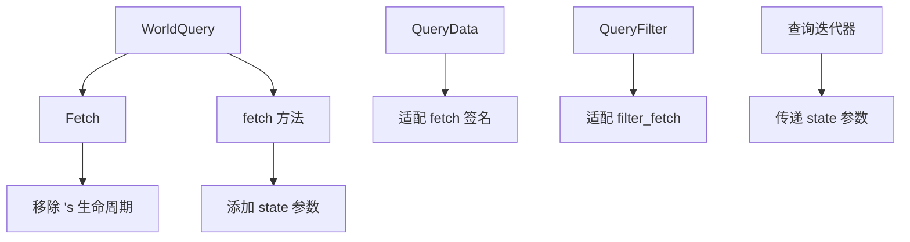

+++
title = "#19720 Remove `'s` lifetime from `WorldQuery::Fetch"
date = "2025-06-19T00:00:00"
draft = false
template = "pull_request_page.html"
in_search_index = false

[extra]
current_language = "zh-cn"
available_languages = {"en" = { name = "English", url = "/pull_request/bevy/2025-06/pr-19720-en-20250619" }, "zh-cn" = { name = "中文", url = "/pull_request/bevy/2025-06/pr-19720-zh-cn-20250619" }}
+++

# 移除 `WorldQuery::Fetch` 中的 `'s` 生命周期

## 基础信息
- **标题**: Remove `'s` lifetime from `WorldQuery::Fetch`
- **PR 链接**: https://github.com/bevyengine/bevy/pull/19720
- **作者**: chescock
- **状态**: MERGED
- **标签**: A-ECS, S-Ready-For-Final-Review
- **创建时间**: 2025-06-18T17:45:46Z
- **合并时间**: 2025-06-19T01:18:16Z
- **合并人**: alice-i-cecile

## 描述翻译
### 目标
解除 #18162 的阻塞。

### 背景
#15396 为 `QueryData::Item` 添加了 `'s` 生命周期，使查询项能从状态中借用。为此它也为 `WorldQuery::Fetch` 添加了 `'s` 生命周期，以便传递借用。

然而，让 `WorldQuery::Fetch` 从状态借用会导致无法拥有状态（owned state），因为在迭代期间状态和 `Fetch` 存储在同一个结构体中。

### 解决方案
1. 撤销为 `WorldQuery::Fetch` 添加的 `'s` 生命周期
2. 改为在 `QueryData::fetch()` 和 `QueryFilter::filter_fetch()` 中添加 `&'s Self::State` 参数
3. 通过状态参数直接向查询项传递借用

## PR 技术分析

### 问题背景与约束
该 PR 解决了 ECS 查询系统中的一个关键限制。之前的实现（#15396）在 `WorldQuery::Fetch` 中引入了 `'s` 生命周期以实现状态借用，但这导致状态和 Fetch 数据必须共存于同一结构体，阻止了拥有状态的可能性。这直接阻塞了 #18162 的实现，需要调整查询系统的生命周期设计。

### 解决方案设计
核心变更包括：
1. **移除 `Fetch` 的 `'s` 生命周期**：
   - `WorldQuery::Fetch` 现在只保留 `'w` 生命周期
   - 解决了状态和 Fetch 数据必须共存的问题
   
2. **引入状态参数**：
   - 在 `QueryData::fetch()` 添加 `&'s Self::State` 参数
   - 在 `QueryFilter::filter_fetch()` 添加 `&Self::State` 参数
   - 通过参数显式传递状态，替代之前的隐式生命周期关联

3. **架构影响**：
   - 查询迭代器现在需显式传递状态参数
   - 所有查询实现需要适配新签名
   - 宏生成的代码需更新以处理状态参数

### 实现细节
#### 关键修改：`WorldQuery` trait
```rust
// 修改前
pub unsafe trait WorldQuery {
    type Fetch<'w, 's>: Clone;
    // ...
}

// 修改后
pub unsafe trait WorldQuery {
    type Fetch<'w>: Clone; // 移除了 's 生命周期
    // ...
}
```

#### 查询执行流程变更
```rust
// 修改前的查询获取
unsafe fn fetch<'w, 's>(
    fetch: &mut Self::Fetch<'w, 's>,
    entity: Entity,
    table_row: TableRow,
) -> Self::Item<'w, 's>;

// 修改后的查询获取
unsafe fn fetch<'w, 's>(
    state: &'s Self::State, // 新增状态参数
    fetch: &mut Self::Fetch<'w>, // 移除了 's 生命周期
    entity: Entity,
    table_row: TableRow,
) -> Self::Item<'w, 's>;
```

#### 迭代器适配
查询迭代器现在需要显式传递状态：
```rust
// 在 QueryIter 中的变化
let item = D::fetch(
    &self.query_state.fetch_state, // 新增状态传递
    &mut self.cursor.fetch,
    *entity,
    row,
);
```

### 关键文件变更分析

1. **`crates/bevy_ecs/src/query/fetch.rs`**
   - 重构了所有 `WorldQuery` 实现
   - 移除了 `Fetch` 类型的 `'s` 生命周期参数
   - 为 `fetch` 方法添加状态参数
   - 示例变更：
```diff
 unsafe impl WorldQuery for Entity {
-    type Fetch<'w, 's> = ();
+    type Fetch<'w> = ();
     
     unsafe fn fetch<'w, 's>(
-        _fetch: &mut Self::Fetch<'w, 's>,
+        _state: &'s Self::State,
+        _fetch: &mut Self::Fetch<'w>,
         entity: Entity,
         _table_row: TableRow,
     ) -> Self::Item<'w, 's> {
         entity
     }
 }
```

2. **`crates/bevy_ecs/src/query/filter.rs`**
   - 更新了所有过滤器实现
   - 为 `filter_fetch` 添加状态参数
   - 示例变更：
```diff
 unsafe impl<T: Component> QueryFilter for With<T> {
     unsafe fn filter_fetch(
-        _fetch: &mut Self::Fetch<'_, '_>,
+        _state: &Self::State,
+        _fetch: &mut Self::Fetch<'_>,
         _entity: Entity,
         _table_row: TableRow,
     ) -> bool {
         true
     }
 }
```

3. **`crates/bevy_ecs/src/query/iter.rs`**
   - 更新迭代逻辑以传递状态
   - 修改了查询执行路径
   - 关键变更：
```diff
 let item = D::fetch(
+    &self.query_state.fetch_state,
     &mut self.cursor.fetch,
     *entity,
     row,
 );
```

4. **`crates/bevy_ecs/macros/src/query_data.rs`**
   - 更新了查询派生宏
   - 生成适配新签名的代码
   - 关键变更：
```diff
 unsafe fn fetch<'__w, '__s>(
-    _fetch: &mut Self::Fetch<'__w, '__s>,
+    _state: &'__s Self::State,
+    _fetch: &mut Self::Fetch<'__w>,
     _entity: Entity,
     _table_row: TableRow,
 ) -> Self::Item<'__w, '__s> {
     Self::Item {
-        #field: <#field_type>::fetch(&mut _fetch.#field, ...)
+        #field: <#field_type>::fetch(&_state.#field, &mut _fetch.#field, ...)
     }
 }
```

5. **`crates/bevy_render/src/sync_world.rs`**
   - 适配渲染相关的特殊查询
   - 同步签名变更：
```diff
 unsafe impl WorldQuery for RenderEntity {
-    type Fetch<'w, 's> = ...;
+    type Fetch<'w> = ...;
     
     unsafe fn fetch<'w, 's>(
-        fetch: &mut Self::Fetch<'w, 's>,
+        state: &'s Self::State,
+        fetch: &mut Self::Fetch<'w>,
         entity: Entity,
         table_row: TableRow,
     ) -> Self::Item<'w, 's> {
-        ...
+        <&RenderEntity as QueryData>::fetch(state, fetch, ...)
     }
 }
```

### 技术影响与启示
1. **解决的问题**：
   - 解除了拥有状态（owned state）的限制
   - 为 #18162 的实现扫除了障碍
   - 保持查询系统的灵活性同时修复生命周期约束

2. **性能考量**：
   - 引入额外指针传递但无新增分配
   - 对性能影响应为中性
   - 生成的汇编应保持高效

3. **迁移要求**：
   - 自定义 `WorldQuery` 实现需移除 `Fetch` 的 `'s` 生命周期
   - 需在 `fetch/filter_fetch` 中添加状态参数
   - 派生宏自动处理了大部分用例

4. **设计启示**：
   - 显式状态传递比隐式生命周期更灵活
   - 复杂生命周期约束可通过参数设计解决
   - 宏在系统编程中能显著降低迁移成本

## 组件关系图


## 关键文件变更
1. `crates/bevy_ecs/src/query/fetch.rs`
   - 移除了 `WorldQuery::Fetch` 的 `'s` 生命周期
   - 为所有查询实现添加状态参数
   - 更新了 `fetch` 方法签名

2. `crates/bevy_ecs/src/query/filter.rs`
   - 更新了过滤器 trait 方法
   - 为 `filter_fetch` 添加状态参数

3. `crates/bevy_ecs/src/query/iter.rs`
   - 修改迭代逻辑以传递状态
   - 更新了实体处理流程

4. `crates/bevy_ecs/macros/src/query_data.rs`
   - 重构了查询派生宏
   - 生成适配新签名的代码

5. `crates/bevy_render/src/sync_world.rs`
   - 适配了渲染专用查询
   - 保持特殊查询的功能完整性

## 延伸阅读
1. [生命周期在 ECS 中的高级应用](https://docs.rs/bevy_ecs/latest/bevy_ecs/query/index.html)
2. [Rust 生命周期进阶指南](https://doc.rust-lang.org/nomicon/lifetimes.html)
3. [Bevy ECS 查询系统设计](https://bevyengine.org/learn/book/design/ecs-query-system/)
4. [相关 PR #15396](https://github.com/bevyengine/bevy/pull/15396)
5. [被阻塞的 PR #18162](https://github.com/bevyengine/bevy/pull/18162)

该变更通过重构查询系统的生命周期设计，解决了拥有状态的根本限制，同时保持了 API 的一致性和性能特征。