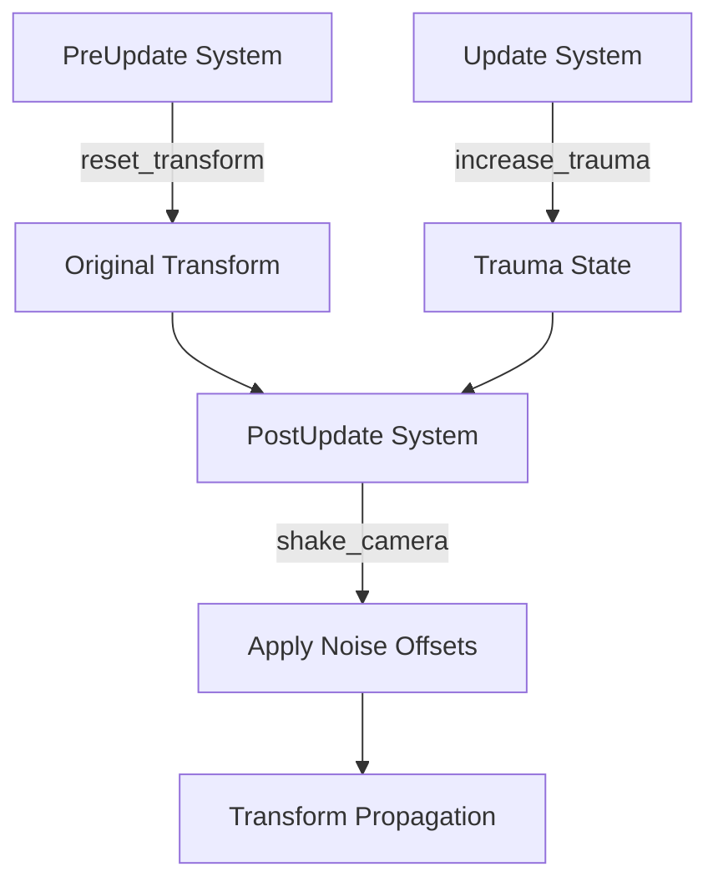

+++
title = "#19724 Rewrite camera shake example"
date = "2025-06-20T00:00:00"
draft = false
template = "pull_request_page.html"
in_search_index = true

[taxonomies]
list_display = ["show"]

[extra]
current_language = "en"
available_languages = {"en" = { name = "English", url = "/pull_request/bevy/2025-06/pr-19724-en-20250620" }, "zh-cn" = { name = "中文", url = "/pull_request/bevy/2025-06/pr-19724-zh-cn-20250620" }}
labels = ["A-Rendering", "C-Examples", "D-Modest", "M-Deliberate-Rendering-Change", "A-Camera"]
+++

# Rewrite camera shake example

## Basic Information
- **Title**: Rewrite camera shake example
- **PR Link**: https://github.com/bevyengine/bevy/pull/19724
- **Author**: janhohenheim
- **Status**: MERGED
- **Labels**: A-Rendering, C-Examples, S-Ready-For-Final-Review, D-Modest, M-Deliberate-Rendering-Change, A-Camera
- **Created**: 2025-06-18T23:10:49Z
- **Merged**: 2025-06-20T17:03:44Z
- **Merged By**: alice-i-cecile

## Description Translation
# Objective

- Alternative to #19721
- The old implementation had several issues:
  - underexplained
  - bit complicated in places
  - did not follow the source as described
    - camera moves away
    - camera does not use noise
    - camera nudges back after shake ends, which looks cinematic, but not what you want in practice

All in all: the old implementation did not really show a typical implementation IMO

## Solution

- Rewrite it :D
- I believe the current implementation is a robust thing you can learn from or just copy-paste into your project

## Testing

https://github.com/user-attachments/assets/bfe74fb6-c428-4d5a-9c9c-cd4a034ba176

## The Story of This Pull Request

The original camera shake example had several technical shortcomings. It used random offsets instead of noise for camera displacement, causing jittery movement rather than smooth shaking. The implementation also modified the camera's position directly, causing it to drift away from its original location during shakes. After shake completion, a cinematic nudge effect returned the camera, which isn't typical for screen shake implementations.

The rewrite implements camera shake following the principles from Squirrel Eiserloh's GDC talk "Math for Game Programmers: Juicing Your Cameras With Math". The core concept uses a "trauma" value (0.0 to 1.0) that decays over time. Shake intensity is calculated as trauma raised to an exponent (trauma² by default) to create a more punchy effect. Camera displacement uses Perlin noise to ensure smooth, continuous movement.

Key technical decisions:
1. Introduced two components:
   - `CameraShakeState`: Tracks current trauma and stores original transform
   - `CameraShakeConfig`: Holds tuning parameters (decay rate, exponents, limits)
2. Implemented a three-stage transform workflow:
   - `PreUpdate`: Restores camera to original position
   - `PostUpdate`: Applies calculated shake before rendering
   - Input handling: Increases trauma on spacebar press
3. Used a custom 1D Perlin noise implementation for smooth displacement
4. Decoupled shake logic from game systems by resetting transforms early

The system ordering ensures transform modifications only affect rendering:
```rust
.add_systems(PreUpdate, reset_transform)
.add_systems(PostUpdate, shake_camera.before(TransformSystems::Propagate))
```

The shake calculation applies noise-based offsets:
```rust
let t = time.elapsed_secs() * config.noise_speed;
let rotation_noise = perlin_noise::generate(t + 0.0);
let x_noise = perlin_noise::generate(t + 100.0);
let y_noise = perlin_noise::generate(t + 200.0);

let shake = powf(camera_shake.trauma, config.exponent);
let roll_offset = rotation_noise * shake * config.max_angle;
let x_offset = x_noise * shake * config.max_translation;
let y_offset = y_noise * shake * config.max_translation;

transform.translation.x += x_offset;
transform.translation.y += y_offset;
transform.rotate_z(roll_offset);
```

This approach provides several advantages:
1. Noise ensures smooth camera movement instead of jarring jumps
2. Trauma decay creates natural shake dissipation
3. Exponential intensity curve makes shakes feel more impactful
4. Transform reset preserves original camera position for game logic
5. Configurable parameters allow tuning shake characteristics

The implementation includes detailed comments explaining each constant and system, making it suitable as a learning resource. Users can copy the components and systems directly into their projects for production-ready camera shake.

## Visual Representation



## Key Files Changed

- `examples/camera/2d_screen_shake.rs` (+245/-121)

### Significant Changes:
1. Complete rewrite of camera shake implementation
2. Added `CameraShakeState` and `CameraShakeConfig` components
3. Implemented noise-based displacement system
4. Added transform management systems
5. Updated instructions and documentation

Key code comparison:

Before:
```rust
#[derive(Resource, Clone)]
struct ScreenShake {
    max_angle: f32,
    max_offset: f32,
    trauma: f32,
    latest_position: Option<Vec2>,
}

fn screen_shake(
    time: Res<Time>,
    mut screen_shake: ResMut<ScreenShake>,
    mut query: Query<(&mut Camera, &mut Transform)>,
) {
    let mut rng = ChaCha8Rng::from_entropy();
    let shake = screen_shake.trauma * screen_shake.trauma;
    let angle = (screen_shake.max_angle * shake).to_radians() * rng.gen_range(-1.0..1.0);
    let offset_x = screen_shake.max_offset * shake * rng.gen_range(-1.0..1.0);
    let offset_y = screen_shake.max_offset * shake * rng.gen_range(-1.0..1.0);
    
    // ... random offset application ...
}
```

After:
```rust
#[derive(Component, Debug)]
#[require(CameraShakeState)]
struct CameraShakeConfig {
    trauma_decay_per_second: f32,
    exponent: f32,
    max_angle: f32,
    max_translation: f32,
    noise_speed: f32,
}

fn shake_camera(
    camera_shake: Single<(&mut CameraShakeState, &CameraShakeConfig, &mut Transform)>,
    time: Res<Time