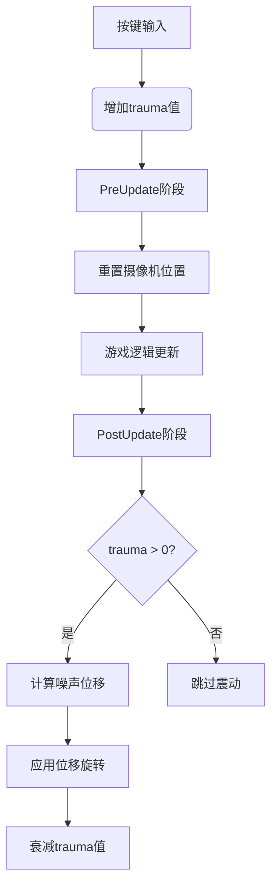

+++
title = "#19724 Rewrite camera shake example"
date = "2025-06-20T00:00:00"
draft = false
template = "pull_request_page.html"
in_search_index = false

[extra]
current_language = "zh-cn"
available_languages = {"en" = { name = "English", url = "/pull_request/bevy/2025-06/pr-19724-en-20250620" }, "zh-cn" = { name = "中文", url = "/pull_request/bevy/2025-06/pr-19724-zh-cn-20250620" }}
labels = ["A-Rendering", "C-Examples", "D-Modest", "M-Deliberate-Rendering-Change", "A-Camera"]
+++

## Rewrite camera shake example

## Basic Information
- **Title**: Rewrite camera shake example
- **PR Link**: https://github.com/bevyengine/bevy/pull/19724
- **Author**: janhohenheim
- **Status**: MERGED
- **Labels**: A-Rendering, C-Examples, S-Ready-For-Final-Review, D-Modest, M-Deliberate-Rendering-Change, A-Camera
- **Created**: 2025-06-18T23:10:49Z
- **Merged**: 2025-06-20T17:03:44Z
- **Merged By**: alice-i-cecile

## Description Translation
### Objective

- 替代方案 #19721
- 旧实现存在若干问题:
  - 解释不足
  - 部分实现过于复杂
  - 未按描述遵循原始方案
    - 摄像机远离
    - 摄像机未使用噪声
    - 震动结束后摄像机会回弹，这看起来有电影感，但实际应用中不理想

总之：旧实现并未展示典型的实现方式 IMO

### Solution

- 重写实现 :D
- 当前实现是可直接复制到项目中的可靠方案

### Testing

https://github.com/user-attachments/assets/bfe74fb6-c428-4d5a-9c9c-cd4a034ba176

## The Story of This Pull Request

### 问题和背景
原屏幕震动示例存在多个技术问题，使其不适合作为学习参考。主要问题包括：
1. 实现未遵循GDC讲座的核心原则，特别是未使用噪声函数控制位移
2. 震动后摄像机回弹行为不符合实际游戏需求
3. 代码结构复杂且缺乏充分注释
4. 未实现指数衰减的震动强度（trauma）控制
5. 使用随机数生成器而非Perlin噪声，导致位移不连续

这些问题使开发者难以理解核心原理或直接复用代码。作为官方示例，需要提供清晰可靠的最佳实践实现。

### 解决方案
新实现完全重构了屏幕震动系统，核心设计基于：
1. **创伤值（trauma）模型**：0.0-1.0范围控制震动强度
2. **指数衰减**：`trauma^exponent` 产生非线性震动强度
3. **Perlin噪声**：生成平滑连续的位移值
4. **时间解耦**：震动仅影响渲染，不干扰游戏逻辑

系统分为三个关键组件：
```rust
// 震动状态组件
struct CameraShakeState {
    trauma: f32,
    original_transform: Transform,
}

// 震动配置组件
struct CameraShakeConfig {
    trauma_decay_per_second: f32,
    exponent: f32,
    max_angle: f32,
    max_translation: f32,
    noise_speed: f32,
}

// Perlin噪声生成模块
mod perlin_noise {
    fn generate(x: f32) -> f32 { ... }
}
```

### 实现细节
系统在特定阶段执行以保证正确性：
1. **PreUpdate阶段**：重置摄像机位置
```rust
fn reset_transform(...) {
    *transform = camera_shake.original_transform;
}
```
2. **Update阶段**：处理按键增加trauma
```rust
fn increase_trauma(mut camera_shake: Single<&mut CameraShakeState>) {
    camera_shake.trauma += TRAUMA_PER_PRESS;
}
```
3. **PostUpdate阶段**：应用震动效果
```rust
fn shake_camera(...) {
    let t = time.elapsed_secs() * config.noise_speed;
    let shake = powf(camera_shake.trauma, config.exponent);
    
    // 计算三轴偏移
    let roll_offset = perlin_noise::generate(t) * shake * config.max_angle;
    let x_offset = perlin_noise::generate(t + 100.0) * shake * config.max_translation;
    let y_offset = perlin_noise::generate(t + 200.0) * shake * config.max_translation;
    
    // 应用偏移
    transform.translation.x += x_offset;
    transform.rotation.z += roll_offset;
    
    // 衰减trauma
    camera_shake.trauma -= config.trauma_decay_per_second * time.delta_secs();
}
```

噪声实现使用优化的1D Perlin噪声：
```rust
fn generate(x: f32) -> f32 {
    let xi0 = x.floor() as usize;
    let xf0 = x - xi0 as f32;
    let t = fade(xf0);
    ...
}

// 平滑过渡函数
fn fade(t: f32) -> f32 {
    t * t * t * (t * (t * 6.0 - 15.0) + 10.0)
}
```

### 技术洞察
1. **时间安排**：震动在PostUpdate阶段应用，确保不影响游戏逻辑
2. **噪声采样**：三轴使用不同采样点避免同步位移
3. **指数曲线**：`trauma^exponent` 增强冲击感（线性值感觉不够强烈）
4. **参数设计**：所有常量可配置且提供调优建议
```rust
const MAX_ANGLE: f32 = 10.0_f32.to_radians(); // 10度弧度值
const TRAUMA_EXPONENT: f32 = 2.0; // 二次方曲线
```

### 影响
1. 示例代码行数增加(+245/-121)，但可读性显著提升
2. 完整实现GDC讲座描述的震动技术
3. 提供可直接复用于生产环境的组件
4. 详细代码注释解释每个技术决策
5. 常量参数集中管理方便调整

## Visual Representation



## Key Files Changed

### `examples/camera/2d_screen_shake.rs` (+245/-121)

**重构说明**：
完全重写屏幕震动示例，使用基于trauma和Perlin噪声的现代实现

**关键变更**:
1. 替换全局资源为组件系统
```rust
// 旧实现: 全局资源
#[derive(Resource)] 
struct ScreenShake { ... }

// 新实现: 实体组件
#[derive(Component)]
struct CameraShakeState { ... }
```

2. 简化控制系统
```rust
// 旧: 复杂的状态管理
fn screen_shake(..., mut query: Query<(&mut Camera, &mut Transform)>) {
    // 20行复杂逻辑
}

// 新: 单一职责系统
fn shake_camera(...) {
    // 专注震动应用
}
fn reset_transform(...) {
    // 专注状态重置
}
```

3. 优化噪声生成
```rust
// 旧: 随机数生成
let mut rng = ChaCha8Rng::from_entropy();
let angle = ... * rng.gen_range(-1.0..1.0);

// 新: Perlin噪声
let rotation_noise = perlin_noise::generate(t + 0.0);
```

4. 增强文档说明
```rust
// 新增模块级文档
//! Camera shake is dependent on a "trauma" value between 0.0 and 1.0...
//! All displacements are governed by a noise function...
```

## Further Reading
1. [GDC讲座: Math for Game Programmers: Juicing Your Cameras With Math](https://www.youtube.com/watch?v=tu-Qe66AvtY)
2. [Bevy官方摄像机文档](https://docs.rs/bevy/latest/bevy/render/camera/struct.Camera.html)
3. [噪声函数可视化参考](https://assets-global.website-files.com/64b6d182aee713bd0401f4b9/64b95974ec292aabac45fc8e_image.png)
4. [Perlin噪声算法详解](https://rtouti.github.io/graphics/perlin-noise-algorithm)