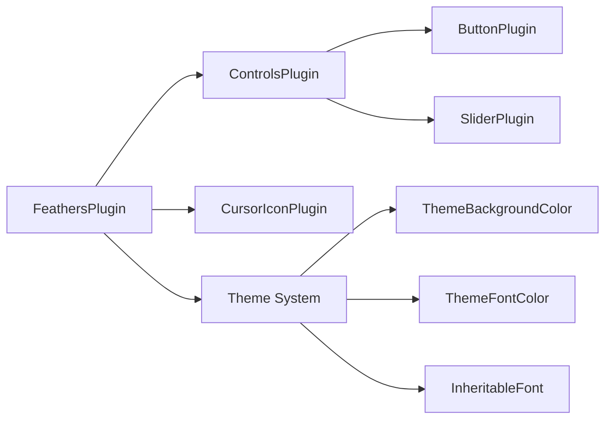

+++
title = "#19730 Bevy Feathers: an opinionated widget toolkit for building Bevy tooling"
date = "2025-06-28T00:00:00"
draft = false
template = "pull_request_page.html"
in_search_index = true

[taxonomies]
list_display = ["show"]

[extra]
current_language = "en"
available_languages = {"en" = { name = "English", url = "/pull_request/bevy/2025-06/pr-19730-en-20250628" }, "zh-cn" = { name = "中文", url = "/pull_request/bevy/2025-06/pr-19730-zh-cn-20250628" }}
labels = ["A-UI", "X-Blessed", "S-Waiting-on-Author"]
+++

# Bevy Feathers: an opinionated widget toolkit for building Bevy tooling

## Basic Information
- **Title**: Bevy Feathers: an opinionated widget toolkit for building Bevy tooling
- **PR Link**: https://github.com/bevyengine/bevy/pull/19730
- **Author**: viridia
- **Status**: MERGED
- **Labels**: A-UI, M-Needs-Release-Note, X-Blessed, S-Waiting-on-Author
- **Created**: 2025-06-19T07:01:19Z
- **Merged**: 2025-06-28T20:12:48Z
- **Merged By**: alice-i-cecile

## Description Translation
# Objective

This PR introduces Bevy Feathers, an opinionated widget toolkit and theming system intended for use by the Bevy Editor, World Inspector, and other tools.

The `bevy_feathers` crate is incomplete and hidden behind an experimental feature flag. The API is going to change significantly before release.

## The Story of This Pull Request

### The Problem and Context
Bevy lacked a standardized widget toolkit for building editor tools and utilities. Each tool had to implement its own UI components, leading to inconsistency and duplication. The solution needed to:
1. Provide reusable, styled UI components (buttons, sliders, etc.)
2. Implement a theming system for visual consistency
3. Support accessibility requirements
4. Maintain compatibility with Bevy's ECS architecture

### The Solution Approach
The author introduced `bevy_feathers`, a widget toolkit with:
- Opinionated, reusable UI controls
- A token-based theming system
- Dynamic styling based on component state
- Font inheritance and cursor management

Key design decisions:
- Implemented as a separate crate (`bevy_feathers`)
- Hidden behind `experimental_bevy_feathers` feature flag
- Built on existing Bevy UI systems (`bevy_ui`, `bevy_core_widgets`)
- Used design tokens for theme properties
- Added cursor management based on hover state

### The Implementation
The implementation consists of several interconnected systems:

1. **Widget Controls**:
   - Button and slider implementations with variants and states
   - Dynamic styling systems that update appearance based on interaction state

2. **Theming System**:
   - `UiTheme` resource mapping tokens to colors
   - Components (`ThemeBackgroundColor`, `ThemeFontColor`) to apply tokens
   - Systems to propagate theme changes

3. **Font Inheritance**:
   - `InheritableFont` component for font specification
   - Propagation system for text styling

4. **Cursor Management**:
   - Automatic cursor icon changes based on hovered entities
   - Default cursor resource with fallback behavior

Key implementation details:

**Button Styling**  
Buttons change appearance based on state (normal, hover, pressed, disabled) and variant (normal, primary). A system updates colors when state changes:

```rust
fn set_button_colors(
    button_ent: Entity,
    variant: &ButtonVariant,
    disabled: bool,
    pressed: bool,
    hovered: bool,
    bg_color: &ThemeBackgroundColor,
    font_color: &ThemeFontColor,
    commands: &mut Commands,
) {
    // Determine token based on state
    let bg_token = match (variant, disabled, pressed, hovered) {
        (ButtonVariant::Normal, true, _, _) => tokens::BUTTON_BG_DISABLED,
        // ... other cases ...
    };
    
    // Update components if needed
    if bg_color.0 != bg_token {
        commands.entity(button_ent).insert(ThemeBackgroundColor(bg_token));
    }
}
```

**Slider Implementation**  
Sliders use a gradient background to represent value position. A system updates both the visual representation and text display:

```rust
fn update_slider_pos(
    mut q_sliders: Query</* ... */>,
    q_children: Query<&Children>,
    mut q_slider_text: Query<&mut Text, With<SliderValueText>>,
) {
    for (slider_ent, value, range, mut gradient) in q_sliders.iter_mut() {
        // Update gradient stops based on value
        let percent_value = range.thumb_position(value.0) * 100.0;
        // ... update gradient ...
        
        // Update text display
        q_children.iter_descendants(slider_ent).for_each(|child| {
            if let Ok(mut text) = q_slider_text.get_mut(child) {
                text.0 = format!("{}", value.0);
            }
        });
    }
}
```

**Theme Propagation**  
A system updates background colors when the theme changes:

```rust
fn update_theme(
    mut q_background: Query<(&mut BackgroundColor, &ThemeBackgroundColor)>,
    theme: Res<UiTheme>,
) {
    if theme.is_changed() {
        for (mut bg, theme_bg) in q_background.iter_mut() {
            bg.0 = theme.color(theme_bg.0);
        }
    }
}
```

### Technical Insights
- **Design Tokens**: String identifiers (e.g., `tokens::BUTTON_BG`) decouple style definitions from component logic
- **State-Driven Styling**: Systems update visuals based on component state changes
- **Resource-Based Theming**: `UiTheme` resource holds theme definitions
- **Hierarchical Propagation**: Font styles propagate down the hierarchy to text entities
- **Embedded Assets**: Fonts are included in the crate for consistent widget styling

Performance considerations:
- Systems use change detection to minimize unnecessary updates
- Styling systems run in `PreUpdate` after picking systems

### The Impact
- Provides foundation for consistent Bevy editor tools
- Reduces duplication in UI implementation
- Enables theme customization through token system
- Improves accessibility with proper component roles
- Adds example demonstrating widget usage

## Visual Representation



## Key Files Changed

1. `crates/bevy_feathers/src/controls/button.rs` (+209/-0)  
   Implements button widget with variants and state handling.  
   Key components:
   ```rust
   pub enum ButtonVariant {
       Normal,
       Primary
   }
   
   pub struct ButtonProps {
       pub variant: ButtonVariant,
       pub corners: RoundedCorners,
       pub on_click: Option<SystemId>
   }
   ```

2. `crates/bevy_feathers/src/controls/slider.rs` (+208/-0)  
   Implements slider widget with value display.  
   Key implementation:
   ```rust
   pub fn slider<B: Bundle>(props: SliderProps, overrides: B) -> impl Bundle {
       // Uses gradient background for value representation
       BackgroundGradient(vec![Gradient::Linear(LinearGradient {
           stops: vec![/* color stops based on value */]
       })])
   }
   ```

3. `examples/ui/feathers.rs` (+180/-0)  
   Demo showing Feathers widgets.  
   Example button creation:
   ```rust
   button(
       ButtonProps { /* ... */ },
       (),
       Spawn((Text::new("Normal"), ThemedText))
   )
   ```

4. `crates/bevy_feathers/src/theme.rs` (+114/-0)  
   Implements theming system.  
   Key components:
   ```rust
   #[derive(Resource)]
   pub struct UiTheme(pub ThemeProps);
   
   #[derive(Component)]
   pub struct ThemeBackgroundColor(pub &'static str);
   ```

5. `crates/bevy_feathers/src/rounded_corners.rs` (+96/-0)  
   Defines rounded corner options for widgets.  
   Conversion to border radius:
   ```rust
   impl RoundedCorners {
       pub fn to_border_radius(&self, radius: f32) -> BorderRadius {
           match self {
               RoundedCorners::All => BorderRadius::all(Val::Px(radius)),
               // Other variants
           }
       }
   }
   ```

## Further Reading
- [Design Tokens Methodology](https://designsystemsrepo.com/design-tokens/)
- [Bevy UI Documentation](https://docs.rs/bevy_ui/latest/bevy_ui/)
- [Accessibility in Game UI](https://developer.mozilla.org/en-US/docs/Games/Techniques/Control_mechanisms/Desktop_with_mouse_and_keyboard)