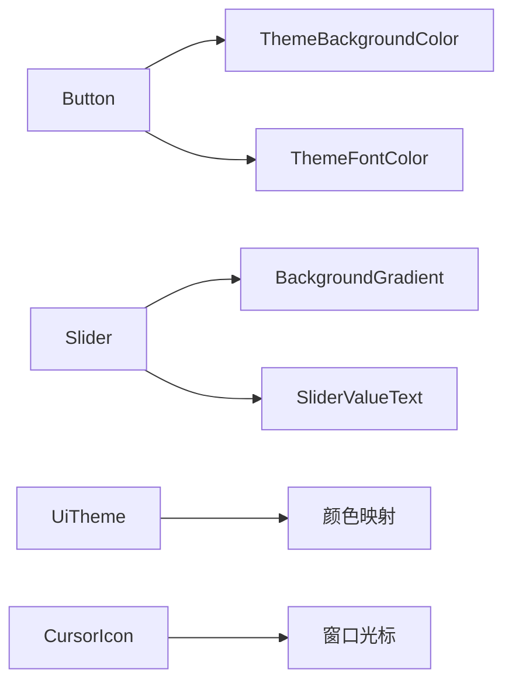

+++
title = "#19730 Bevy Feathers: an opinionated widget toolkit for building Bevy tooling"
date = "2025-06-28T00:00:00"
draft = false
template = "pull_request_page.html"
in_search_index = false

[extra]
current_language = "zh-cn"
available_languages = {"en" = { name = "English", url = "/pull_request/bevy/2025-06/pr-19730-en-20250628" }, "zh-cn" = { name = "中文", url = "/pull_request/bevy/2025-06/pr-19730-zh-cn-20250628" }}
+++

# Bevy Feathers: an opinionated widget toolkit for building Bevy tooling

## 基本信息
- **标题**: Bevy Feathers: an opinionated widget toolkit for building Bevy tooling
- **PR链接**: https://github.com/bevyengine/bevy/pull/19730
- **作者**: viridia
- **状态**: MERGED
- **标签**: A-UI, M-Needs-Release-Note, X-Blessed, S-Waiting-on-Author
- **创建时间**: 2025-06-19T07:01:19Z
- **合并时间**: 2025-06-28T20:12:48Z
- **合并者**: alice-i-cecile

## 描述翻译
### 目标
此PR引入了Bevy Feathers，这是一个意见化的小部件工具包和主题系统，旨在供Bevy编辑器、世界检查器和其他工具使用。

`bevy_feathers` crate还不完整，并且隐藏在一个实验性的功能标志后面。在发布之前，API将会发生显著变化。

## 本PR的故事

### 问题和背景
Bevy引擎需要一个一致且可主题化的UI工具包来构建其编辑器和其他工具。现有的UI系统（`bevy_ui`）提供了基础，但缺少高级小部件和主题支持。开发人员需要一套预构建的小部件（如按钮、滑块等），这些部件具有一致的视觉风格，并且可以通过主题进行自定义。此外，还需要考虑可访问性和交互反馈（如悬停效果）。

### 解决方案
作者创建了`bevy_feathers` crate，提供了一套意见化的小部件和主题系统。该方案包括：
1. **主题系统**：通过设计令牌（design tokens）定义颜色和其他样式属性，允许全局主题切换
2. **小部件**：实现了一些基础小部件（如按钮、滑块），这些小部件使用主题系统进行样式设置
3. **动态样式更新**：小部件会根据状态（如悬停、按下、禁用）自动更新样式
4. **光标反馈**：当鼠标悬停在交互式小部件上时，自动更改光标图标

### 实现
#### 按钮小部件
按钮是最基本的小部件。实现包括：
- 定义按钮变体（普通、主要）和属性（圆角、点击处理）
- 使用`button`函数创建按钮实体，该函数组合了必要的组件（如`Node`、`CoreButton`、`ThemeBackgroundColor`等）
- 状态更新系统：根据按钮的状态（正常、悬停、按下、禁用）更新背景和文字颜色

```rust
// File: crates/bevy_feathers/src/controls/button.rs
pub fn button<C: SpawnableList<ChildOf> + Send + Sync + 'static, B: Bundle>(
    props: ButtonProps,
    overrides: B,
    children: C,
) -> impl Bundle {
    (
        Node {
            height: size::ROW_HEIGHT,
            justify_content: JustifyContent::Center,
            align_items: AlignItems::Center,
            padding: UiRect::axes(Val::Px(8.0), Val::Px(0.)),
            flex_grow: 1.0,
            ..Default::default()
        },
        CoreButton {
            on_click: props.on_click,
        },
        props.variant,
        Hovered::default(),
        CursorIcon::System(bevy_window::SystemCursorIcon::Pointer),
        TabIndex(0),
        props.corners.to_border_radius(4.0),
        ThemeBackgroundColor(tokens::BUTTON_BG),
        ThemeFontColor(tokens::BUTTON_TEXT),
        InheritableFont {
            font: HandleOrPath::Path(fonts::REGULAR.to_owned()),
            font_size: 14.0,
        },
        overrides,
        Children::spawn(children),
    )
}
```

按钮的状态更新系统（`update_button_styles`）会查询按钮状态的变化，并调用`set_button_colors`来设置对应的颜色令牌。

#### 滑块小部件
滑块允许用户通过拖动选择数值。实现包括：
- 定义滑块属性（当前值、范围、变化处理）
- 使用`slider`函数创建滑块实体，该函数包含一个背景渐变（表示滑块轨道）和一个显示当前值的文本
- 状态更新系统：根据滑块状态（禁用）更新颜色，并在值变化时更新滑块位置和文本

```rust
// File: crates/bevy_feathers/src/controls/slider.rs
pub fn slider<B: Bundle>(props: SliderProps, overrides: B) -> impl Bundle {
    (
        Node {
            height: size::ROW_HEIGHT,
            justify_content: JustifyContent::Center,
            align_items: AlignItems::Center,
            padding: UiRect::axes(Val::Px(8.0), Val::Px(0.)),
            flex_grow: 1.0,
            ..Default::default()
        },
        CoreSlider {
            on_change: props.on_change,
            track_click: TrackClick::Drag,
        },
        SliderStyle,
        SliderValue(props.value),
        SliderRange::new(props.min, props.max),
        CursorIcon::System(bevy_window::SystemCursorIcon::EwResize),
        TabIndex(0),
        RoundedCorners::All.to_border_radius(6.0),
        // 使用渐变绘制移动条
        BackgroundGradient(vec![Gradient::Linear(LinearGradient {
            angle: PI * 0.5,
            stops: vec![
                ColorStop::new(Color::NONE, Val::Percent(0.)),
                ColorStop::new(Color::NONE, Val::Percent(50.)),
                ColorStop::new(Color::NONE, Val::Percent(50.)),
                ColorStop::new(Color::NONE, Val::Percent(100.)),
            ],
            color_space: InterpolationColorSpace::Srgb,
        })]),
        overrides,
        children![(
            // 文本容器
            Node {
                display: Display::Flex,
                flex_direction: FlexDirection::Row,
                align_items: AlignItems::Center,
                justify_content: JustifyContent::Center,
                ..Default::default()
            },
            ThemeFontColor(tokens::SLIDER_TEXT),
            InheritableFont {
                font: HandleOrPath::Path(fonts::MONO.to_owned()),
                font_size: 12.0,
            },
            children![(Text::new("10.0"), ThemedText, SliderValueText,)],
        )],
    )
}
```

滑块的位置更新系统（`update_slider_pos`）会根据当前值计算滑块位置并更新渐变停止点，同时更新显示的文本。

#### 主题系统
主题系统使用设计令牌（字符串常量）映射到颜色值。主要组件：
- `UiTheme`：资源，存储设计令牌到颜色的映射
- `ThemeProps`：主题属性，包含颜色映射
- 组件如`ThemeBackgroundColor`、`ThemeFontColor`：用于标记需要主题化的实体

```rust
// File: crates/bevy_feathers/src/theme.rs
#[derive(Resource, Default)]
pub struct UiTheme(pub ThemeProps);

impl UiTheme {
    pub fn color<'a>(&self, token: &'a str) -> Color {
        // ... 查找颜色，未找到时返回错误颜色并记录警告 ...
    }
}

// 组件：根据主题设置背景颜色
#[derive(Component, Clone, Copy)]
pub struct ThemeBackgroundColor(pub &'static str);
```

主题更新系统（`update_theme`）会在主题资源变化时更新所有带`ThemeBackgroundColor`组件的背景颜色。

### 技术洞察
1. **设计令牌**：使用字符串常量（如`tokens::BUTTON_BG`）作为样式属性的键，允许主题统一管理
2. **状态驱动样式**：小部件样式根据状态（如悬停、按下）动态更新，通过系统查询状态变化并更新主题令牌
3. **继承字体样式**：通过`InheritableFont`组件和传播机制，实现字体样式的继承
4. **嵌入式资源**：使用`embedded_asset!`宏嵌入字体文件，确保小部件在没有外部文件时也能工作

### 影响
1. 为Bevy工具开发提供了基础UI组件和主题系统
2. 提高了UI的一致性和可访问性
3. 通过动态样式更新和光标反馈，增强了用户体验
4. 作为实验性功能，允许社区反馈和迭代

## 组件关系图


## 关键文件更改

1. `crates/bevy_feathers/src/controls/slider.rs` (+209/-0)
   - 实现滑块小部件
   - 关键代码：`slider`函数和状态更新系统

2. `crates/bevy_feathers/src/controls/button.rs` (+208/-0)
   - 实现按钮小部件
   - 关键代码：`button`函数和状态更新系统

3. `examples/ui/feathers.rs` (+180/-0)
   - 新增示例，展示Feathers小部件
   - 关键代码：创建按钮和滑块
   ```rust
   button(
       ButtonProps {
           on_click: Some(commands.register_system(|| {
               info!("Normal button clicked!");
           })),
           ..default()
       },
       (),
       Spawn((Text::new("Normal"), ThemedText))
   ),
   slider(
       SliderProps {
           max: 100.0,
           value: 20.0,
           ..default()
       },
       SliderStep(10.)
   )
   ```

4. `crates/bevy_feathers/src/theme.rs` (+114/-0)
   - 实现主题系统
   - 关键代码：`UiTheme`资源和主题更新系统

5. `crates/bevy_feathers/src/rounded_corners.rs` (+96/-0)
   - 实现圆角处理
   - 关键代码：`RoundedCorners`枚举和`to_border_radius`方法
   ```rust
   pub enum RoundedCorners {
       None,
       All,
       TopLeft,
       // ... 其他变体 ...
   }
   
   impl RoundedCorners {
       pub fn to_border_radius(&self, radius: f32) -> BorderRadius {
           // ... 根据枚举值创建对应的圆角 ...
       }
   }
   ```

## 延伸阅读
- [Bevy UI 文档](https://docs.rs/bevy_ui/latest/bevy_ui/)
- [设计令牌概念](https://designsystemsrepo.com/design-tokens/)
- [可访问性指南](https://www.w3.org/WAI/ARIA/apg/)

## 完整代码差异
```diff
diff --git a/Cargo.toml b/Cargo.toml
index 688147ff9ba3e..0f7a449e88cee 100644
--- a/Cargo.toml
+++ b/Cargo.toml
@@ -306,6 +306,9 @@ bevy_input_focus = ["bevy_internal/bevy_input_focus"]
 # Headless widget collection for Bevy UI.
 bevy_core_widgets = ["bevy_internal/bevy_core_widgets"]
 
+# Feathers widget collection.
+experimental_bevy_feathers = ["bevy_internal/bevy_feathers"]
+
 # Enable passthrough loading for SPIR-V shaders (Only supported on Vulkan, shader capabilities and extensions must agree with the platform implementation)
 spirv_shader_passthrough = ["bevy_internal/spirv_shader_passthrough"]
 
@@ -4510,3 +4513,16 @@ name = "Core Widgets (w/Observers)"
 description = "Demonstrates use of core (headless) widgets in Bevy UI, with Observers"
 category = "UI (User Interface)"
 wasm = true
+
+[[example]]
+name = "feathers"
+path = "examples/ui/feathers.rs"
+doc-scrape-examples = true
+required-features = ["experimental_bevy_feathers"]
+
+[package.metadata.example.feathers]
+name = "Feathers Widgets"
+description = "Gallery of Feathers Widgets"
+category = "UI (User Interface)"
+wasm = true
+hidden = true
diff --git a/crates/bevy_core_widgets/src/core_button.rs b/crates/bevy_core_widgets/src/core_button.rs
index 97b15b878d669..0c0c638d2087b 100644
--- a/crates/bevy_core_widgets/src/core_button.rs
+++ b/crates/bevy_core_widgets/src/core_button.rs
@@ -18,7 +18,7 @@ use bevy_ui::{InteractionDisabled, Pressed};
 /// Headless button widget. This widget maintains a "pressed" state, which is used to
 /// indicate whether the button is currently being pressed by the user. It emits a `ButtonClicked`
 /// event when the button is un-pressed.
-#[derive(Component, Debug)]
+#[derive(Component, Default, Debug)]
 #[require(AccessibilityNode(accesskit::Node::new(Role::Button)))]
 pub struct CoreButton {
     /// Optional system to run when the button is clicked, or when the Enter or Space key
diff --git a/crates/bevy_core_widgets/src/core_slider.rs b/crates/bevy_core_widgets/src/core_slider.rs
index d85f12dd22a80..2fab75738a16e 100644
--- a/crates/bevy_core_widgets/src/core_slider.rs
+++ b/crates/bevy_core_widgets/src/core_slider.rs
@@ -92,7 +92,9 @@ pub struct SliderValue(pub f32);
 #[derive(Component, Debug, PartialEq, Clone, Copy)]
 #[component(immutable)]
 pub struct SliderRange {
+    /// The beginning of the allowed range for the slider value.
     start: f32,
+    /// The end of the allowed range for the slider value.
     end: f32,
 }
 
diff --git a/crates/bevy_feathers/Cargo.toml b/crates/bevy_feathers/Cargo.toml
new file mode 100644
index 0000000000000..2f8174c756e24
--- /dev/null
+++ b/crates/bevy_feathers/Cargo.toml
@@ -0,0 +1,40 @@
+[package]
+name = "bevy_feathers"
+version = "0.17.0-dev"
+edition = "2024"
+description = "A collection of UI widgets for building editors and utilities in Bevy"
+homepage = "https://bevyengine.org"
+repository = "https://github.com/bevyengine/bevy"
+license = "MIT OR Apache-2.0"
+keywords = ["bevy"]
+
+[dependencies]
+# bevy
+bevy_app = { path = "../bevy_app", version = "0.17.0-dev" }
+bevy_asset = { path = "../bevy_asset", version = "0.17.0-dev" }
+bevy_color = { path = "../bevy_color", version = "0.17.0-dev" }
+bevy_core_widgets = { path = "../bevy_core_widgets", version = "0.17.0-dev" }
+bevy_ecs = { path = "../bevy_ecs", version = "0.17.0-dev" }
+bevy_input_focus = { path = "../bevy_input_focus", version = "0.17.0-dev" }
+bevy_log = { path = "../bevy_log", version = "0.17.0-dev" }
+bevy_picking = { path = "../bevy_picking", version = "0.17.0-dev" }
+bevy_platform = { path = "../bevy_platform", version = "0.17.0-dev" }
+bevy_text = { path = "../bevy_text", version = "0.17.0-dev" }
+bevy_ui = { path = "../bevy_ui", version = "0.17.0-dev", features = [
+  "bevy_ui_picking_backend",
+] }
+bevy_window = { path = "../bevy_window", version = "0.17.0-dev" }
+bevy_winit = { path = "../bevy_winit", version = "0.17.0-dev" }
+
+# other
+accesskit = "0.19"
+
+[features]
+default = []
+
+[lints]
+workspace = true
+
+[package.metadata.docs.rs]
+rustdoc-args = ["-Zunstable-options", "--generate-link-to-definition"]
+all-features = true
diff --git a/crates/bevy_feathers/src/assets/fonts/FiraMono-LICENSE b/crates/bevy_feathers/src/assets/fonts/FiraMono-LICENSE
new file mode 100644
index 0000000000000..5e4608f24a4b0
--- /dev/null
+++ b/crates/bevy_feathers/src/assets/fonts/FiraMono-LICENSE
@@ -0,0 +1,93 @@
+Digitized data copyright (c) 2012-2015, The Mozilla Foundation and Telefonica S.A.
+
+This Font Software is licensed under the SIL Open Font License, Version 1.1.
+This license is copied below, and is also available with a FAQ at:
+http://scripts.sil.org/OFL
+
+
+-----------------------------------------------------------
+SIL OPEN FONT LICENSE Version 1.1 - 26 February 2007
+-----------------------------------------------------------
+
+PREAMBLE
+The goals of the Open Font License (OFL) are to stimulate worldwide
+development of collaborative font projects, to support the font creation
+efforts of academic and linguistic communities, and to provide a free and
+open framework in which fonts may be shared and improved in partnership
+with others.
+
+The OFL allows the licensed fonts to be used, studied, modified and
+redistributed freely as long as they are not sold by themselves. The
+fonts, including any derivative works, can be bundled, embedded, 
+redistributed and/or sold with any software provided that any reserved
+names are not used by derivative works. The fonts and derivatives,
+however, cannot be released under any other type of license. The
+requirement for fonts to remain under this license does not apply
+to any document created using the fonts or their derivatives.
+
+DEFINITIONS
+"Font Software" refers to the set of files released by the Copyright
+Holder(s) under this license and clearly marked as such. This may
+include source files, build scripts and documentation.
+
+"Reserved Font Name" refers to any names specified as such after the
+copyright statement(s).
+
+"Original Version" refers to the collection of Font Software components as
+distributed by the Copyright Holder(s).
+
+"Modified Version" refers to any derivative made by adding to, deleting,
+or substituting -- in part or in whole -- any of the components of the
+Original Version, by changing formats or by porting the Font Software to a
+new environment.
+
+"Author" refers to any designer, engineer, programmer, technical
+writer or other person who contributed to the Font Software.
+
+PERMISSION & CONDITIONS
+Permission is hereby granted, free of charge, to any person obtaining
+a copy of the Font Software, to use, study, copy, merge, embed, modify,
+redistribute, and sell modified and unmodified copies of the Font
+Software, subject to the following conditions:
+
+1) Neither the Font Software nor any of its individual components,
+in Original or Modified Versions, may be sold by itself.
+
+2) Original or Modified Versions of the Font Software may be bundled,
+redistributed and/or sold with any software, provided that each copy
+contains the above copyright notice and this license. These can be
+included either as stand-alone text files, human-readable headers or
+in the appropriate machine-readable metadata fields within text or
+binary files as long as those fields can be easily viewed by the user.
+
+3) No Modified Version of the Font Software may use the Reserved Font
+Name(s) unless explicit written permission is granted by the corresponding
+Copyright Holder. This restriction only applies to the primary font name as
+presented to the users.
+
+4) The name(s) of the Copyright Holder(s) or the Author(s) of the Font
+Software shall not be used to promote, endorse or advertise any
+Modified Version, except to acknowledge the contribution(s) of the
+Copyright Holder(s) and the Author(s) or with their explicit written
+permission.
+
+5) The Font Software, modified or unmodified, in part or in whole,
+must be distributed entirely under this license, and must not be
+distributed under any other license. The requirement for fonts to
+remain under this license does not apply to any document created
+using the Font Software.
+
+TERMINATION
+This license becomes null and void if any of the above conditions are
+not met.
+
+DISCLAIMER
+THE FONT SOFTWARE IS PROVIDED "AS IS", WITHOUT WARRANTY OF ANY KIND,
+EXPRESS OR IMPLIED, INCLUDING BUT NOT LIMITED TO ANY WARRANTIES OF
+MERCHANTABILITY, FITNESS FOR A PARTICULAR PURPOSE AND NONINFRINGEMENT
+OF COPYRIGHT, PATENT, TRADEMARK, OR OTHER RIGHT. IN NO EVENT SHALL THE
+COPYRIGHT HOLDER BE LIABLE FOR ANY CLAIM, DAMAGES OR OTHER LIABILITY,
+INCLUDING ANY GENERAL, SPECIAL, INDIRECT, INCIDENTAL, OR CONSEQUENTIAL
+DAMAGES, WHETHER IN AN ACTION OF CONTRACT, TORT OR OTHERWISE, ARISING
+FROM, OUT OF THE USE OR INABILITY TO USE THE FONT SOFTWARE OR FROM
+OTHER DEALINGS IN THE FONT SOFTWARE.
diff --git a/crates/bevy_feathers/src/assets/fonts/FiraMono-Medium.ttf b/crates/bevy_feathers/src/assets/fonts/FiraMono-Medium.ttf
new file mode 100755
index 0000000000000..1e95ced4c44be
Binary files /dev/null and b/crates/bevy_feathers/src/assets/fonts/FiraMono-Medium.ttf differ
diff --git a/crates/bevy_feathers/src/assets/fonts/FiraSans-Bold.ttf b/crates/bevy_feathers/src/assets/fonts/FiraSans-Bold.ttf
new file mode 100644
index 0000000000000..e3593fb0f3bd4
Binary files /dev/null and b/crates/bevy_feathers/src/assets/fonts/FiraSans-Bold.ttf differ
diff --git a/crates/bevy_feathers/src/assets/fonts/FiraSans-BoldItalic.ttf b/crates/bevy_feathers/src/assets/fonts/FiraSans-BoldItalic.ttf
new file mode 100644
index 0000000000000..305b0b8bad1c4
Binary files /dev/null and b/crates/bevy_feathers/src/assets/fonts/FiraSans-BoldItalic.ttf differ
diff --git a/crates/bevy_feathers/src/assets/fonts/FiraSans-Italic.ttf b/crates/bevy_feathers/src/assets/fonts/FiraSans-Italic.ttf
new file mode 100644
index 0000000000000..27d32ed961e7b
Binary files /dev/null and b/crates/bevy_feathers/src/assets/fonts/FiraSans-Italic.ttf differ
diff --git a/crates/bevy_feathers/src/assets/fonts/FiraSans-License.txt b/crates/bevy_feathers/src/assets/fonts/FiraSans-License.txt
new file mode 100644
index 0000000000000..0d0213ad4c1a5
--- /dev/null
+++ b/crates/bevy_feathers/src/assets/fonts/FiraSans-License.txt
@@ -0,0 +1,93 @@
+Copyright (c) 2012-2015, The Mozilla Foundation and Telefonica S.A.
+
+This Font Software is licensed under the SIL Open Font License, Version 1.1.
+This license is copied below, and is also available with a FAQ at:
+https://openfontlicense.org
+
+
+-----------------------------------------------------------
+SIL OPEN FONT LICENSE Version 1.1 - 26 February 2007
+-----------------------------------------------------------
+
+PREAMBLE
+The goals of the Open Font License (OFL) are to stimulate worldwide
+development of collaborative font projects, to support the font creation
+efforts of academic and linguistic communities, and to provide a free and
+open framework in which fonts may be shared and improved in partnership
+with others.
+
+The OFL allows the licensed fonts