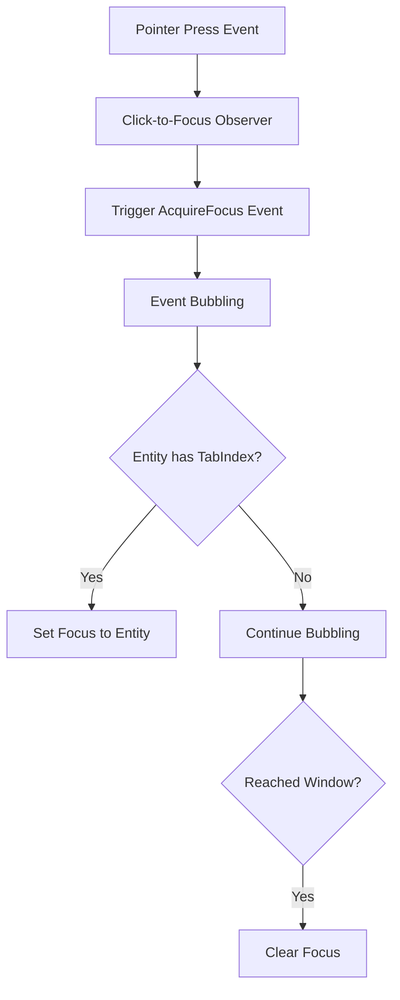

+++
title = "#19736 New simplified \"click to focus\" logic for core widgets."
date = "2025-06-21T00:00:00"
draft = false
template = "pull_request_page.html"
in_search_index = true

[taxonomies]
list_display = ["show"]

[extra]
current_language = "en"
available_languages = {"en" = { name = "English", url = "/pull_request/bevy/2025-06/pr-19736-en-20250621" }, "zh-cn" = { name = "中文", url = "/pull_request/bevy/2025-06/pr-19736-zh-cn-20250621" }}
labels = ["A-UI", "C-Code-Quality", "C-Usability", "D-Straightforward"]
+++

# Technical Analysis of PR #19736: New Simplified "Click to Focus" Logic for Core Widgets

## Basic Information
- **Title**: New simplified "click to focus" logic for core widgets.
- **PR Link**: https://github.com/bevyengine/bevy/pull/19736
- **Author**: viridia
- **Status**: MERGED
- **Labels**: A-UI, C-Code-Quality, C-Usability, S-Ready-For-Final-Review, D-Straightforward
- **Created**: 2025-06-19T17:20:35Z
- **Merged**: 2025-06-21T18:24:47Z
- **Merged By**: alice-i-cecile

## The Story of This Pull Request

### The Problem and Context
Previously, Bevy's UI system implemented "click to focus" behavior redundantly in each headless widget. Both core widgets (`CoreButton` and `CoreSlider`) contained duplicate logic for handling focus acquisition when clicked. This implementation violated the DRY (Don't Repeat Yourself) principle and created maintenance overhead. Any changes to focus behavior required modifications in multiple locations, increasing the risk of inconsistencies and bugs. The existing approach also lacked a centralized mechanism for focus management, making it difficult to extend or modify focus behavior consistently across the UI system.

### The Solution Approach
The solution centralizes focus management by introducing a global observer pattern. Instead of handling focus in each widget, a new system triggers an `AcquireFocus` event on pointer press. This event bubbles through the entity hierarchy until it finds an entity with `TabIndex` (indicating focusability) and sets focus to that entity. The key design decisions were:
1. Create a dedicated bubbling event (`AcquireFocus`) for focus acquisition
2. Implement a global observer for pointer press events
3. Remove widget-specific focus logic
4. Maintain backward compatibility through plugin-based adoption

This approach simplifies the codebase, reduces duplication, and establishes a consistent focus acquisition mechanism.

### The Implementation
The implementation consists of three main parts:

1. **New Event and Observer Infrastructure**  
   A new `AcquireFocus` event was added to `bevy_input_focus`:

   ```rust
   // crates/bevy_input_focus/src/lib.rs
   #[derive(Clone, Event, EntityEvent)]
   #[entity_event(traversal = WindowTraversal, auto_propagate)]
   pub struct AcquireFocus {
       window: Entity,
   }
   ```

   This event bubbles through the hierarchy using `WindowTraversal`.

2. **Global Focus Acquisition Logic**  
   A new observer handles the `AcquireFocus` event:

   ```rust
   // crates/bevy_input_focus/src/tab_navigation.rs
   pub(crate) fn acquire_focus(
       mut ev: On<AcquireFocus>,
       focusable: Query<(), With<TabIndex>>,
       windows: Query<(), With<Window>>,
       mut focus: ResMut<InputFocus>,
   ) {
       if focusable.contains(ev.target()) {
           ev.propagate(false);
           if focus.0 != Some(ev.target()) {
               focus.0 = Some(ev.target());
           }
       } else if windows.contains(ev.target()) {
           ev.propagate(false);
           if focus.0.is_some() {
               focus.clear();
           }
       }
   }
   ```

3. **Click-to-Focus Observer**  
   A new observer triggers the `AcquireFocus` event on pointer press:

   ```rust
   // crates/bevy_input_focus/src/tab_navigation.rs
   fn click_to_focus(
       ev: On<Pointer<Press>>,
       mut focus_visible: ResMut<InputFocusVisible>,
       windows: Query<Entity, With<PrimaryWindow>>,
       mut commands: Commands,
   ) {
       if ev.target() == ev.original_target() {
           if focus_visible.0 {
               focus_visible.0 = false;
           }
           if let Ok(window) = windows.single() {
               commands
                   .entity(ev.target())
                   .trigger(AcquireFocus { window });
           }
       }
   }
   ```

### Widget Simplification
The core widgets were simplified by removing their focus-handling logic:

**Button Widget (`core_button.rs`):**
```rust
// Before:
fn button_on_pointer_down(
    mut trigger: On<Pointer<Press>>,
    mut q_state: Query<(Entity, Has<InteractionDisabled>, Has<Pressed>), With<CoreButton>>,
    focus: Option<ResMut<InputFocus>>,
    focus_visible: Option<ResMut<InputFocusVisible>>,
    mut commands: Commands,
) {
    if let Ok((button, disabled, pressed)) = q_state.get_mut(trigger.target()) {
        trigger.propagate(false);
        if !disabled {
            if !pressed {
                commands.entity(button).insert(Pressed);
            }
            // Focus handling logic removed
        }
    }
}

// After:
fn button_on_pointer_down(
    mut trigger: On<Pointer<Press>>,
    mut q_state: Query<(Entity, Has<InteractionDisabled>, Has<Pressed>), With<CoreButton>>,
    mut commands: Commands,
) {
    if let Ok((button, disabled, pressed)) = q_state.get_mut(trigger.target()) {
        trigger.propagate(false);
        if !disabled && !pressed {
            commands.entity(button).insert(Pressed);
        }
    }
}
```

**Slider Widget (`core_slider.rs`):**
```rust
// Before:
pub(crate) fn slider_on_pointer_down(
    mut trigger: On<Pointer<Press>>,
    q_slider: Query<...>,
    // ... other parameters ...
    focus: Option<ResMut<InputFocus>>,
    focus_visible: Option<ResMut<InputFocusVisible>>,
) {
    if q_thumb.contains(trigger.target()) {
        // ... focus logic for thumb ...
    } else if ... {
        // ... focus logic for track ...
    }
}

// After:
pub(crate) fn slider_on_pointer_down(
    mut trigger: On<Pointer<Press>>,
    q_slider: Query<...>,
    // ... parameters without focus resources ...
) {
    // Focus-related code completely removed
}
```

### Plugin Integration
The `TabNavigationPlugin` was extended to include the new observers:

```rust
// crates/bevy_input_focus/src/tab_navigation.rs
impl Plugin for TabNavigationPlugin {
    fn build(&self, app: &mut App) {
        app.init_resource::<InputFocusVisible>();
        #[cfg(feature = "bevy_reflect")]
        app.register_type::<TabIndex>().register_type::<TabGroup>();
        app.add_observer(acquire_focus);  // New
        app.add_observer(click_to_focus); // New
    }
}
```

Examples were updated to include the plugin:

```rust
// examples/ui/core_widgets.rs
fn main() {
    App::new()
        .add_plugins((
            DefaultPlugins,
            CoreWidgetsPlugin,
            InputDispatchPlugin,
            TabNavigationPlugin, // Added
        ))
        // ...
}
```

### Technical Insights
1. **Event Bubbling**: The solution leverages Bevy's entity event bubbling mechanism. The `AcquireFocus` event bubbles until it finds a focusable entity with `TabIndex`.
2. **Separation of Concerns**: Widgets no longer need to understand focus mechanics, simplifying their implementation.
3. **Backward Compatibility**: Existing code works without changes. The new behavior requires adding `TabNavigationPlugin`.
4. **Performance**: Centralized handling is more efficient than per-widget solutions, though actual performance impact is negligible for this feature.
5. **Consistency**: Ensures uniform focus behavior across all widgets.

### The Impact
- **Code Quality**: Reduced duplication (29 lines removed from slider, 16 from button)
- **Maintainability**: Focus logic exists in a single location
- **Extensibility**: New focus behaviors can be added without modifying widgets
- **Usability**: Provides consistent focus behavior across UI elements

## Visual Representation



## Key Files Changed

1. `crates/bevy_input_focus/src/tab_navigation.rs` (+54/-2)  
   Added the core focus acquisition logic and click handling observers.

2. `crates/bevy_core_widgets/src/core_slider.rs` (+3/-29)  
   Removed focus-handling logic from the slider widget.

3. `crates/bevy_input_focus/src/lib.rs` (+27/-0)  
   Added the `AcquireFocus` event definition.

4. `crates/bevy_core_widgets/src/core_button.rs` (+5/-16)  
   Removed focus-handling logic from the button widget.

5. `examples/ui/core_widgets.rs` (+7/-2)  
   Updated examples to include the new plugin.

## Further Reading
1. [Bevy Entity Events Documentation](https://bevyengine.org/learn/book/events/entity-events/)
2. [Bevy UI System Architecture](https://github.com/bevyengine/bevy/tree/main/crates/bevy_ui)
3. [Accessibility in Game UI Design](https://developer.mozilla.org/en-US/docs/Games/Techniques/Control_mechanisms/Desktop_with_mouse_and_keyboard)
4. [Observer Pattern in Game Development](https://gameprogrammingpatterns.com/observer.html)