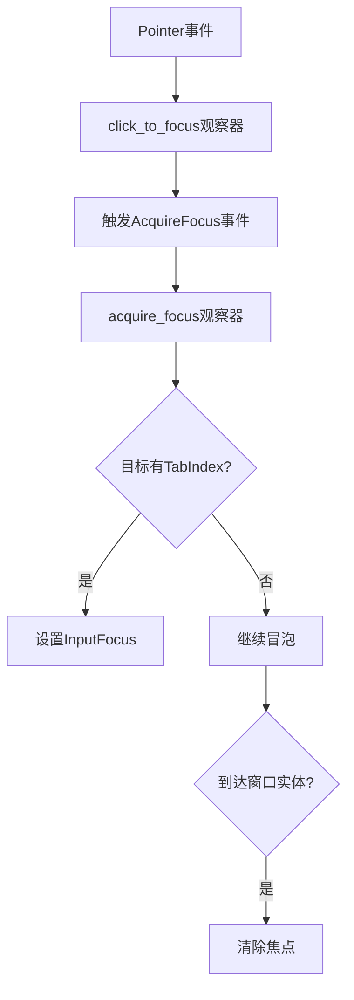

+++
title = "#19736 New simplified \"click to focus\" logic for core widgets"
date = "2025-06-21T00:00:00"
draft = false
template = "pull_request_page.html"
in_search_index = false

[extra]
current_language = "zh-cn"
available_languages = {"en" = { name = "English", url = "/pull_request/bevy/2025-06/pr-19736-en-20250621" }, "zh-cn" = { name = "中文", url = "/pull_request/bevy/2025-06/pr-19736-zh-cn-20250621" }}
+++

# PR分析报告：New simplified "click to focus" logic for core widgets

## 基本信息
- **标题**: New simplified "click to focus" logic for core widgets
- **PR链接**: https://github.com/bevyengine/bevy/pull/19736
- **作者**: viridia
- **状态**: 已合并
- **标签**: A-UI, C-Code-Quality, C-Usability, S-Ready-For-Final-Review, D-Straightforward
- **创建时间**: 2025-06-19T17:20:35Z
- **合并时间**: 2025-06-21T18:24:47Z
- **合并者**: alice-i-cecile

## 描述翻译
点击获取焦点现在是一个全局观察器。

# 目标

之前，"点击获取焦点"行为在每个独立的无头部件(headless widget)中实现，导致冗余逻辑。

## 解决方案

新方案是使用全局观察器，监听指针按下事件并在目标上触发`AcquireFocus`事件。该事件冒泡直到找到带有`TabIndex`的实体，然后将其设为焦点。

## 测试

使用具有可聚焦部件的各种示例测试了更改。（当我为示例添加焦点环支持时，测试将更容易，但那是另一天的事。目前你只需要知道按哪些键。）

## 迁移

此更改向后兼容。需要新行为的人需安装新插件。

## PR实现分析

### 问题背景
在原始实现中，"点击获取焦点"功能分散在各个核心部件中。按钮(`core_button.rs`)和滑块(`core_slider.rs`)组件都包含处理焦点获取的重复逻辑。这导致：
1. 代码冗余：多个部件实现相同的焦点管理逻辑
2. 维护困难：焦点行为变更需要在多个文件中修改
3. 关注点分离不清晰：部件同时处理自身交互和焦点管理

### 解决方案设计
PR引入全局焦点获取机制：
1. 创建新事件`AcquireFocus`，支持冒泡传播
2. 添加全局观察器`click_to_focus`处理指针按下事件
3. 实现`acquire_focus`观察器处理焦点获取逻辑
4. 移除各部件中的焦点管理代码

关键设计决策：
- 使用事件冒泡机制寻找最近可聚焦祖先
- 保持向后兼容性，通过插件启用新行为
- 集中焦点管理逻辑，简化部件实现

### 实现细节
**1. 新事件系统**  
在`lib.rs`中定义`AcquireFocus`事件：
```rust
#[derive(Clone, Event, EntityEvent)]
#[entity_event(traversal = WindowTraversal, auto_propagate)]
pub struct AcquireFocus {
    window: Entity,
}
```
该事件使用`WindowTraversal`实现冒泡，向上寻找可聚焦实体。

**2. 全局焦点获取逻辑**  
在`tab_navigation.rs`中添加：
```rust
pub(crate) fn acquire_focus(
    mut ev: On<AcquireFocus>,
    focusable: Query<(), With<TabIndex>>,
    windows: Query<(), With<Window>>,
    mut focus: ResMut<InputFocus>,
) {
    if focusable.contains(ev.target()) {
        ev.propagate(false);
        if focus.0 != Some(ev.target()) {
            focus.0 = Some(ev.target());
        }
    } else if windows.contains(ev.target()) {
        ev.propagate(false);
        if focus.0.is_some() {
            focus.clear();
        }
    }
}
```
此函数：
- 检查目标是否有`TabIndex`
- 设置焦点或清除焦点（当目标是窗口时）
- 阻止事件继续冒泡

**3. 点击到焦点转换**  
添加全局观察器处理指针点击：
```rust
fn click_to_focus(
    ev: On<Pointer<Press>>,
    mut focus_visible: ResMut<InputFocusVisible>,
    windows: Query<Entity, With<PrimaryWindow>>,
    mut commands: Commands,
) {
    if ev.target() == ev.original_target() {
        if focus_visible.0 {
            focus_visible.0 = false;
        }
        if let Ok(window) = windows.single() {
            commands.entity(ev.target()).trigger(AcquireFocus { window });
        }
    }
}
```
此观察器：
- 仅在原始目标触发
- 隐藏焦点环
- 触发`AcquireFocus`事件

**4. 清理部件代码**  
从按钮组件移除焦点管理代码：
```rust
// core_button.rs 修改后:
fn button_on_pointer_down(
    mut trigger: On<Pointer<Press>>,
    mut q_state: Query<(Entity, Has<InteractionDisabled>, Has<Pressed>), With<CoreButton>>,
    mut commands: Commands,
) {
    if let Ok((button, disabled, pressed)) = q_state.get_mut(trigger.target()) {
        trigger.propagate(false);
        if !disabled && !pressed {
            commands.entity(button).insert(Pressed);
        }
    }
}
```
从滑块组件移除焦点逻辑：
```rust
// core_slider.rs 修改后:
pub(crate) fn slider_on_pointer_down(
    mut trigger: On<Pointer<Press>>,
    q_slider: Query<(...), With<CoreSlider>>,
    q_thumb: Query<&ComputedNode, With<CoreSliderThumb>>,
    q_children: Query<&Children>,
    mut commands: Commands,
    ui_scale: Res<UiScale>,
) {
    // 移除所有InputFocus和InputFocusVisible相关代码
}
```

**5. 启用新功能**  
在示例中添加`TabNavigationPlugin`：
```rust
// examples/ui/core_widgets.rs
.add_plugins((
    DefaultPlugins,
    CoreWidgetsPlugin,
    InputDispatchPlugin,
    TabNavigationPlugin, // 新增
))
```

### 技术洞察
1. **事件冒泡机制**：`AcquireFocus`利用Bevy的事件冒泡系统，自动向上寻找可处理实体
2. **关注点分离**：部件只需关注核心交互，焦点管理由专门系统处理
3. **条件变更检测**：使用`if focus.0 != Some(ev.target())`优化资源变更检测
4. **精确事件处理**：`ev.target() == ev.original_target()`确保只在原始目标触发

### 影响分析
1. **代码简化**：
   - 按钮组件：减少16行代码
   - 滑块组件：减少29行代码
2. **维护性提升**：焦点逻辑集中到单个模块
3. **行为一致性**：所有部件使用相同的焦点获取机制
4. **向后兼容**：通过插件机制保持旧行为可用

## 组件关系图



## 关键文件变更

### 1. `crates/bevy_input_focus/src/tab_navigation.rs` (+54/-2)
**变更说明**：  
添加全局焦点获取系统的核心实现，包括事件处理和观察器注册。

**关键代码**：
```rust
// 新增AcquireFocus事件处理
pub(crate) fn acquire_focus(...) {
    if focusable.contains(ev.target()) {
        ev.propagate(false);
        if focus.0 != Some(ev.target()) {
            focus.0 = Some(ev.target());
        }
    }
}

// 新增点击到焦点转换
fn click_to_focus(...) {
    if ev.target() == ev.original_target() {
        commands.entity(ev.target()).trigger(AcquireFocus { window });
    }
}

// 注册观察器
impl Plugin for TabNavigationPlugin {
    fn build(&self, app: &mut App) {
        app.add_observer(acquire_focus);
        app.add_observer(click_to_focus);
    }
}
```

### 2. `crates/bevy_core_widgets/src/core_slider.rs` (+3/-29)
**变更说明**：  
移除滑块组件中冗余的焦点管理代码。

**修改对比**：
```rust
// 修改前:
if let Some(mut focus) = focus {
    focus.0 = (trigger.target() != Entity::PLACEHOLDER).then_some(trigger.target());
}
if let Some(mut focus_visible) = focus_visible {
    focus_visible.0 = false;
}

// 修改后:
// 完全移除焦点管理代码
```

### 3. `crates/bevy_input_focus/src/lib.rs` (+27/-0)
**变更说明**：  
定义`AcquireFocus`事件及其冒泡规则。

**新增代码**：
```rust
#[derive(Clone, Event, EntityEvent)]
#[entity_event(traversal = WindowTraversal, auto_propagate)]
pub struct AcquireFocus {
    window: Entity,
}

impl Traversal<AcquireFocus> for WindowTraversal {
    fn traverse(...) {
        // 冒泡实现逻辑
    }
}
```

### 4. `crates/bevy_core_widgets/src/core_button.rs` (+5/-16)
**变更说明**：  
清理按钮组件的焦点管理代码。

**修改对比**：
```rust
// 修改前:
if let Some(mut focus) = focus {
    focus.0 = (trigger.target() != Entity::PLACEHOLDER).then_some(trigger.target());
}

// 修改后:
// 焦点管理代码完全移除
```

### 5. `examples/ui/core_widgets.rs` (+7/-2)
**变更说明**：  
在示例中启用新的焦点管理系统。

**关键变更**：
```rust
.add_plugins((
    DefaultPlugins,
    CoreWidgetsPlugin,
    InputDispatchPlugin,
    TabNavigationPlugin, // 新增插件
))
```

## 延伸阅读
1. [Bevy事件系统文档](https://bevyengine.org/learn/book/events/)
2. [实体组件系统模式](https://en.wikipedia.org/wiki/Entity_component_system)
3. [观察者模式在游戏开发中的应用](https://gameprogrammingpatterns.com/observer.html)
4. [UI焦点管理最佳实践](https://www.w3.org/WAI/ARIA/apg/practices/keyboard-interface/)