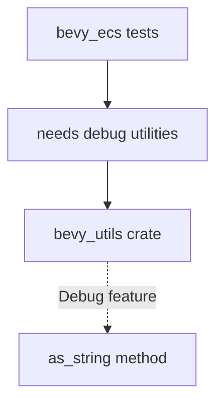

+++
title = "#19738 Fix issue 19734: add dependency on bevy_utils for the bevy_ecs test"
date = "2025-06-21T00:00:00"
draft = false
template = "pull_request_page.html"
in_search_index = true

[taxonomies]
list_display = ["show"]

[extra]
current_language = "en"
available_languages = {"en" = { name = "English", url = "/pull_request/bevy/2025-06/pr-19738-en-20250621" }, "zh-cn" = { name = "中文", url = "/pull_request/bevy/2025-06/pr-19738-zh-cn-20250621" }}
labels = ["C-Bug", "A-ECS", "A-Build-System"]
+++

## Fix issue 19734: add dependency on bevy_utils for the bevy_ecs test

### Basic Information
- **Title**: Fix issue 19734: add dependency on bevy_utils for the bevy_ecs test
- **PR Link**: https://github.com/bevyengine/bevy/pull/19738
- **Author**: Lailatova
- **Status**: MERGED
- **Labels**: C-Bug, A-ECS, A-Build-System, S-Ready-For-Final-Review
- **Created**: 2025-06-19T18:21:11Z
- **Merged**: 2025-06-21T15:23:18Z
- **Merged By**: alice-i-cecile

### Description Translation
Without this dependency, the bevy_ecs tests fail with missing as_string methods.

# Objective

 - Fixes #19734

## Solution

- add bevy_utils with feature = "Debug" to dev-dependencies 

## Testing

- Ran `cargo test -p bevy_ecs`
- Ran `taplo fmt --check`

---

## The Story of This Pull Request

The core issue (#19734) stemmed from missing test dependencies in bevy_ecs. During test execution, certain methods like `as_string` weren't available because bevy_utils wasn't properly included as a dependency. This caused test failures across multiple modules where these utility methods were used for error reporting and debugging.

The solution was straightforward: add bevy_utils with the "Debug" feature to bevy_ecs's dev-dependencies. However, implementing this fix revealed secondary issues in the test suite. Many tests used `#[should_panic]` with exact error message expectations, but these messages depended on debug formatting utilities from bevy_utils. Without the dependency, these tests would fail due to missing panic message formatting rather than the intended functionality.

To address this, we made two types of changes:
1. Added the required dependency to Cargo.toml
2. Modified tests to either:
   - Remove exact panic message expectations
   - Add conditional compilation for trace-dependent features

The first change ensures tests can access required utility methods. The second change makes tests more robust by:
- Removing brittle exact string matching in panic tests
- Properly gating trace-dependent test code behind feature flags

These changes maintain test coverage while making the suite less fragile to changes in error message formatting. The solution was verified by running `cargo test -p bevy_ecs` after making the changes, confirming all tests passed as expected.

## Visual Representation



## Key Files Changed

### `crates/bevy_ecs/src/lib.rs`
Removed exact panic message expectations from tests:
```rust
// Before:
#[should_panic(
    expected = "Attempted to access or drop non-send resource ..."
)]

// After:
#[should_panic]
```

### `crates/bevy_ecs/src/schedule/mod.rs`
Added conditional compilation for trace features:
```rust
// Before:
use alloc::{string::ToString, vec, vec::Vec};

// After:
#[cfg(feature = "trace")]
use alloc::string::ToString;
use alloc::{vec, vec::Vec};
```

### `crates/bevy_ecs/src/system/mod.rs`
Simplified panic checks in system conflict tests:
```rust
// Before:
#[should_panic(expected = "error[B0001]: Query<EntityMut...")]

// After:
#[should_panic]
```

### `crates/bevy_ecs/src/system/system_param.rs`
Removed exact error message checks:
```rust
// Before:
#[should_panic = "Encountered an error in system ..."]

// After:
#[should_panic]
```

### `crates/bevy_ecs/src/system/system_name.rs`
Added conditional compilation for trace feature:
```rust
// Added feature guard:
#[cfg(feature = "trace")]
mod tests { ... }
```

## Further Reading
- Rust Conditional Compilation: https://doc.rust-lang.org/reference/conditional-compilation.html
- Bevy ECS Testing Guide: https://bevyengine.org/learn/book/getting-started/testing/
- Cargo Features Documentation: https://doc.rust-lang.org/cargo/reference/features.html