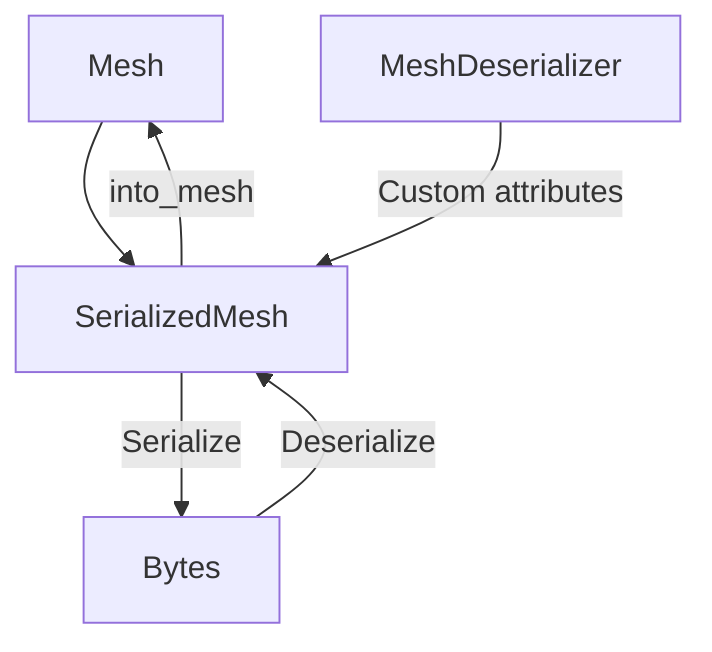

+++
title = "#19743 Implement serializable mesh"
date = "2025-06-24T00:00:00"
draft = false
template = "pull_request_page.html"
in_search_index = true

[taxonomies]
list_display = ["show"]

[extra]
current_language = "en"
available_languages = {"en" = { name = "English", url = "/pull_request/bevy/2025-06/pr-19743-en-20250624" }, "zh-cn" = { name = "中文", url = "/pull_request/bevy/2025-06/pr-19743-zh-cn-20250624" }}
labels = ["A-Rendering", "A-Assets", "A-Editor", "X-Contentious", "D-Straightforward"]
+++

### Implementing Serializable Mesh in Bevy

## Basic Information
- **Title**: Implement serializable mesh
- **PR Link**: https://github.com/bevyengine/bevy/pull/19743
- **Author**: janhohenheim
- **Status**: MERGED
- **Labels**: A-Rendering, A-Assets, S-Ready-For-Final-Review, A-Editor, X-Contentious, D-Straightforward
- **Created**: 2025-06-19T20:31:47Z
- **Merged**: 2025-06-24T00:58:50Z
- **Merged By**: alice-i-cecile

## Description Translation
The original description is in English, so we include it exactly as-is:

# Objective

- Alternative to and closes #19545  
- Resolves #9790 by providing an alternative
- `Mesh` is meant as format optimized for the renderer. There are no guarantees about how it looks, and breaking changes are expected
- This makes it not feasible to implement `Reflect` for all its fields or `Serialize` it.
- However, (de)serializing a mesh has an important use case: send a mesh over BRP to another process, like an editor!
  - In my case, I'm making a navmesh editor and need to copy the level that is running in the game into the editor process
  - Assets don't solve this because
    - They don't work over BRP #19709 and 
    - The meshes may be procedural
- So, we need a way to (de)serialize a mesh for short-term transmissions.

## Solution

- Like `SerializedAnimationGraph` before, let's make a `SerializedMesh`!
- This type's fields are all `private` because we want to keep the internals of `Mesh` hidden, and exposing them
  through this secondary struct would be counter-productive to that
- All this struct can do is be serialized, be deserialized, and be converted to and from a mesh
- It's not a lossless transmission: the handle for morph targets is ignored, and things like the render usages make no sense to be transmitted imo

## Future Work

The same song and dance needs to happen for `Image`, but I can live with completely white meshes for the moment lol

## Testing

- Added a simple test

## The Story of This Pull Request

### The Problem and Context
Bevy's `Mesh` type is optimized for rendering performance, not serialization. Its internal representation changes frequently, making direct serialization impractical. However, real-world use cases require mesh serialization - particularly for editor workflows where meshes need to be transferred between processes. Existing asset systems couldn't solve this because:
1. Assets don't work over Bevy Remote Protocol (#19709)
2. Procedurally generated meshes aren't asset-based
3. Directly implementing `Serialize` on `Mesh` would expose internal details and create maintenance burdens

The author specifically needed this for a navmesh editor that required copying runtime meshes into an editor process. Without serialization, workflows involving custom editors or procedural content were significantly hampered.

### The Solution Approach
The solution introduces a `SerializedMesh` type as a serialization-safe intermediate representation. Key design decisions:
1. **Separation of concerns**: Keep `Mesh` focused on rendering while creating a dedicated serialization type
2. **Lossy serialization**: Only serialize essential data (topology, attributes, indices)
3. **Controlled exposure**: Fields are private to prevent misuse as a general-purpose mesh format
4. **Custom attribute handling**: Allow registration of custom attributes via `MeshDeserializer`
5. **Feature-gating**: Make serialization optional via `serialize` feature flag

The approach mirrors Bevy's existing `SerializedAnimationGraph` pattern. Serialization excludes render-specific data like morph targets and render usage flags since they're irrelevant for transfer purposes.

### The Implementation
The implementation adds serialization support to mesh components while maintaining rendering efficiency. Key changes:

1. **Feature flagging**: Added `serialize` feature to `bevy_mesh` and `bevy_render`
```toml
# crates/bevy_mesh/Cargo.toml
[features]
serialize = ["dep:serde", "wgpu-types/serde"]
```

2. **Serializable types**: Made core types serializable with `serde`
```rust
// crates/bevy_mesh/src/index.rs
#[cfg_attr(feature = "serialize", derive(Serialize, Deserialize))]
pub enum Indices { ... }

// crates/bevy_mesh/src/vertex.rs
#[cfg_attr(feature = "serialize", derive(Serialize, Deserialize))]
pub enum VertexAttributeValues { ... }
```

3. **SerializedMesh implementation**: Added the core serialization struct
```rust
// crates/bevy_mesh/src/mesh.rs
#[cfg(feature = "serialize")]
#[derive(Debug, Clone, Serialize, Deserialize)]
pub struct SerializedMesh {
    primitive_topology: PrimitiveTopology,
    attributes: Vec<(MeshVertexAttributeId, SerializedMeshAttributeData)>,
    indices: Option<Indices>,
}
```

4. **Conversion logic**: Implemented bidirectional conversion between `Mesh` and `SerializedMesh`
```rust
impl SerializedMesh {
    pub fn from_mesh(mesh: Mesh) -> Self { ... }
    pub fn into_mesh(self) -> Mesh { ... }
}
```

5. **Custom attribute handling**: Added `MeshDeserializer` for custom attributes
```rust
pub struct MeshDeserializer {
    custom_vertex_attributes: HashMap<Box<str>, MeshVertexAttribute>,
}

impl MeshDeserializer {
    pub fn add_custom_vertex_attribute(...) { ... }
    pub fn deserialize(...) -> Mesh { ... }
}
```

### Technical Insights
The implementation handles several technical challenges:

1. **Attribute filtering**: During deserialization, only registered attributes are included:
```rust
// In deserialize():
filter_map(|(id, data)| {
    let attribute = data.attribute.clone();
    let Some(data) = data.try_into_mesh_attribute_data(...) else {
        warn!("Ignoring unspecified attribute");
        return None;
    };
    Some((id, data))
})
```

2. **Built-in attribute management**: The deserializer automatically includes all built-in attributes:
```rust
const BUILTINS: [MeshVertexAttribute; ...] = [...];
Self {
    custom_vertex_attributes: BUILTINS
        .into_iter()
        .map(|attribute| (attribute.name.into(), attribute))
        .collect(),
}
```

3. **Version safety**: The serialization format is explicitly version-locked to the current Bevy version. The documentation warns:
> "The mesh representation is not valid across different versions of Bevy"

4. **Data preservation**: The implementation focuses on essential mesh data:
- Primitive topology
- Vertex attributes
- Indices
Render-specific data like morph targets and render usage flags are intentionally excluded.

### The Impact
This PR enables crucial editor workflows without compromising `Mesh`'s rendering efficiency:
1. Allows mesh transfer between processes via BRP
2. Supports procedural mesh serialization
3. Maintains encapsulation of `Mesh` internals
4. Provides clear upgrade path via version locking
5. Adds comprehensive test coverage:

```rust
#[cfg(feature = "serialize")]
#[test]
fn serialize_deserialize_mesh() {
    // Test setup with positions and indices
    let deserialized_mesh = serialized_mesh_from_string.into_mesh();
    assert_eq!(mesh, deserialized_mesh);
}
```

The solution balances practicality with maintainability, providing a focused serialization path while preserving `Mesh`'s core design principles.

## Visual Representation



## Key Files Changed

### crates/bevy_mesh/src/mesh.rs (+162/-1)
Added serialization logic and new types:
```rust
// Before: No serialization support
pub struct Mesh { ... }

// After: Added SerializedMesh and MeshDeserializer
#[cfg(feature = "serialize")]
pub struct SerializedMesh { ... }

#[cfg(feature = "serialize")]
pub struct MeshDeserializer { ... }
```

### crates/bevy_mesh/src/vertex.rs (+70/-3)
Made vertex data serializable:
```rust
// Before: No serialization support
pub enum VertexAttributeValues { ... }

// After: Added derives and serialization helpers
#[cfg_attr(feature = "serialize", derive(Serialize, Deserialize))]
pub enum VertexAttributeValues { ... }

#[cfg(feature = "serialize")]
pub(crate) struct SerializedMeshAttributeData { ... }
```

### crates/bevy_mesh/Cargo.toml (+11/-1)
Added serialization feature and dependencies:
```toml
[features]
serialize = ["dep:serde", "wgpu-types/serde"]

[dev-dependencies]
serde_json = "1.0.140"
```

### crates/bevy_mesh/src/index.rs (+4/-1)
Made indices serializable:
```rust
// Before: No serialization support
pub enum Indices { ... }

// After: Added serialization support
#[cfg_attr(feature = "serialize", derive(Serialize, Deserialize))]
pub enum Indices { ... }
```

### crates/bevy_render/Cargo.toml (+2/-0)
Propagated serialization feature:
```toml
[features]
serialize = ["bevy_mesh/serialize"]
```

## Further Reading
1. [Bevy's ECS Serialization Guide](https://bevyengine.org/learn/book/features/ecs/serialization/)
2. [Serde Documentation](https://serde.rs/)
3. [Bevy Remote Protocol Discussion](https://github.com/bevyengine/bevy/discussions/19709)
4. [Mesh Vertex Attributes Documentation](https://docs.rs/bevy/latest/bevy/render/mesh/struct.Mesh.html#implemented-attributes)