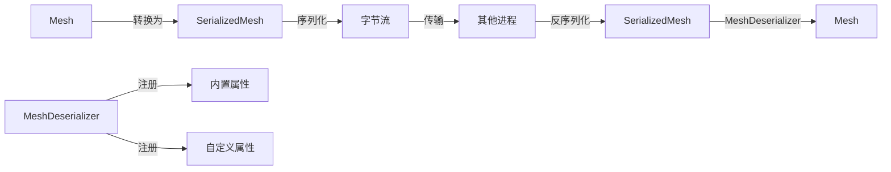

+++
title = "#19743 Implement serializable mesh"
date = "2025-06-24T00:00:00"
draft = false
template = "pull_request_page.html"
in_search_index = false

[extra]
current_language = "zh-cn"
available_languages = {"en" = { name = "English", url = "/pull_request/bevy/2025-06/pr-19743-en-20250624" }, "zh-cn" = { name = "中文", url = "/pull_request/bevy/2025-06/pr-19743-zh-cn-20250624" }}
+++

# 实现可序列化的网格 (Implement serializable mesh)

## 基本信息
- **标题**: Implement serializable mesh
- **PR链接**: https://github.com/bevyengine/bevy/pull/19743
- **作者**: janhohenheim
- **状态**: MERGED
- **标签**: A-Rendering, A-Assets, S-Ready-For-Final-Review, A-Editor, X-Contentious, D-Straightforward
- **创建时间**: 2025-06-19T20:31:47Z
- **合并时间**: 2025-06-24T00:58:50Z
- **合并人**: alice-i-cecile

## 描述翻译
### 目标
- 替代并关闭 #19545
- 通过提供替代方案解决 #9790
- `Mesh` 是针对渲染器优化的格式。对其外观没有保证，预计会有破坏性变更
- 这使得为其所有字段实现 `Reflect` 或 `Serialize` 不可行
- 然而，网格的（反）序列化有一个重要用例：通过 BRP 将网格发送到另一个进程，如编辑器！
  - 在我的案例中，我正在制作导航网格编辑器，需要将游戏中运行的关卡复制到编辑器进程
  - 资产无法解决此问题，因为：
    - 它们无法通过 BRP 工作 #19709
    - 网格可能是过程生成的
- 因此，我们需要一种方式来（反）序列化网格以进行短期传输

### 解决方案
- 像之前的 `SerializedAnimationGraph` 一样，让我们创建一个 `SerializedMesh`!
- 此类型的所有字段都是 `private`，因为我们希望保持 `Mesh` 的内部结构隐藏，通过此辅助结构暴露它们会适得其反
- 此结构只能被序列化、反序列化，并能在网格之间转换
- 这不是无损传输：变形目标的句柄被忽略，像渲染用途这样的内容在传输中无意义

### 后续工作
相同的模式需要应用于 `Image`，但我目前可以接受完全空白的网格

### 测试
- 添加了一个简单的测试

## PR 的技术分析

### 问题背景
在 Bevy 中，`Mesh` 类型是专门为渲染性能优化的数据结构，其内部表示可能会频繁变化。这使得直接实现 `Serialize`/`Deserialize` 变得不可行，因为：
1. 网格格式没有稳定性保证
2. 暴露所有内部字段会破坏封装
3. 某些字段（如变形目标句柄）在进程间传输中没有意义

然而，存在实际需求需要临时传输网格数据：
- 编辑器与运行中游戏之间的数据交换（如导航网格编辑器）
- 过程生成网格的临时传输
- 无法使用资产系统的场景（BRP 限制或过程生成内容）

### 解决方案设计
PR 采用了中间表示策略：
1. 创建专用的 `SerializedMesh` 结构，仅包含可安全传输的必要数据
2. 保持内部字段私有以维护封装
3. 有选择地忽略无关字段（如 morph targets 句柄）
4. 提供显式的转换方法 `from_mesh()` 和 `into_mesh()`

关键设计决策：
- **选择性序列化**：仅保留拓扑、顶点属性和索引
- **无隐式转换**：避免直接为 `Mesh` 实现 `Serialize` 以保持灵活性
- **自定义属性处理**：通过 `MeshDeserializer` 控制反序列化过程

### 实现细节
核心实现在 `bevy_mesh` 模块中：

1. **`SerializedMesh` 结构定义**：
```rust
#[cfg(feature = "serialize")]
#[derive(Debug, Clone, Serialize, Deserialize)]
pub struct SerializedMesh {
    primitive_topology: PrimitiveTopology,
    attributes: Vec<(MeshVertexAttributeId, SerializedMeshAttributeData)>,
    indices: Option<Indices>,
}
```

2. **转换方法**：
```rust
impl SerializedMesh {
    pub fn from_mesh(mesh: Mesh) -> Self {
        Self {
            primitive_topology: mesh.primitive_topology,
            attributes: mesh.attributes.into_iter().map(...).collect(),
            indices: mesh.indices,
        }
    }
    
    pub fn into_mesh(self) -> Mesh {
        MeshDeserializer::default().deserialize(self)
    }
}
```

3. **反序列化控制**：
```rust
pub struct MeshDeserializer {
    custom_vertex_attributes: HashMap<Box<str>, MeshVertexAttribute>,
}

impl MeshDeserializer {
    pub fn add_custom_vertex_attribute(&mut self, name: &str, attribute: MeshVertexAttribute) {
        // 注册自定义属性
    }
    
    pub fn deserialize(&self, serialized_mesh: SerializedMesh) -> Mesh {
        // 过滤未注册的属性
        Mesh {
            attributes: serialized_mesh.attributes.into_iter().filter_map(...).collect(),
            indices: serialized_mesh.indices,
            ..Mesh::new(...)
        }
    }
}
```

4. **支持类型增强**：
- `Indices` 实现 `Serialize`/`Deserialize`
- `VertexAttributeValues` 实现 `PartialEq` 和序列化
- 添加 `SerializedMeshAttributeData` 处理属性转换

### 技术考量
1. **版本兼容性**：
   - 明确声明 `SerializedMesh` 格式不保证跨版本兼容
   - 适合短期进程间通信，不适合长期存储

2. **自定义属性处理**：
   - 内置属性自动处理
   - 自定义属性需要显式注册：
   ```rust
   deserializer.add_custom_vertex_attribute(
       "CUSTOM_ATTR",
       MeshVertexAttribute::new("CUSTOM_ATTR", 100, VertexFormat::Float32x3)
   );
   ```

3. **条件编译**：
   - 通过 `serialize` feature 控制序列化功能
   - 避免对不需要此功能的用户增加开销

4. **测试验证**：
   - 添加往返测试确保序列化-反序列化一致性：
   ```rust
   #[test]
   fn serialize_deserialize_mesh() {
       let mesh = ...;
       let serialized = SerializedMesh::from_mesh(mesh.clone());
       let deserialized = serialized.into_mesh();
       assert_eq!(mesh, deserialized);
   }
   ```

### 影响与价值
1. **解决特定工作流问题**：
   - 实现编辑器-运行时网格传输
   - 支持过程生成网格的临时交换

2. **维护设计一致性**：
   - 遵循 `SerializedAnimationGraph` 的现有模式
   - 保持 `Mesh` 核心实现的稳定性

3. **扩展性基础**：
   - 建立可复用的序列化模式
   - 为 `Image` 等类型的类似实现铺平道路

## 组件关系图



## 关键文件变更

### crates/bevy_mesh/src/mesh.rs (+162/-1)
添加 `SerializedMesh` 结构和相关转换逻辑：
```rust
// 新增 SerializedMesh 定义
#[cfg(feature = "serialize")]
#[derive(Debug, Clone, Serialize, Deserialize)]
pub struct SerializedMesh {
    primitive_topology: PrimitiveTopology,
    attributes: Vec<(MeshVertexAttributeId, SerializedMeshAttributeData)>,
    indices: Option<Indices>,
}

// 新增转换实现
#[cfg(feature = "serialize")]
impl SerializedMesh {
    pub fn from_mesh(mesh: Mesh) -> Self { ... }
    pub fn into_mesh(self) -> Mesh { ... }
}

// 新增 MeshDeserializer
#[cfg(feature = "serialize")]
pub struct MeshDeserializer { ... }

// 添加测试用例
#[cfg(feature = "serialize")]
#[test]
fn serialize_deserialize_mesh() { ... }
```

### crates/bevy_mesh/src/vertex.rs (+70/-3)
增强顶点数据类型以支持序列化：
```rust
// 添加序列化支持
#[derive(Clone, Debug, EnumVariantMeta, PartialEq)]
#[cfg_attr(feature = "serialize", derive(Serialize, Deserialize))]
pub enum VertexAttributeValues { ... }

// 新增序列化中间类型
#[cfg(feature = "serialize")]
#[derive(Debug, Clone, Serialize, Deserialize)]
pub(crate) struct SerializedMeshVertexAttribute { ... }

#[cfg(feature = "serialize")]
#[derive(Debug, Clone, Serialize, Deserialize)]
pub(crate) struct SerializedMeshAttributeData { ... }
```

### crates/bevy_mesh/Cargo.toml (+11/-1)
添加序列化支持依赖：
```toml
[features]
default = []
## Adds serialization support through `serde`.
serialize = ["dep:serde", "wgpu-types/serde"]

[dev-dependencies]
serde_json = "1.0.140"
```

### crates/bevy_mesh/src/index.rs (+4/-1)
为索引添加序列化支持：
```rust
#[derive(Debug, Clone, Reflect, PartialEq)]
#[reflect(Clone)]
#[cfg_attr(feature = "serialize", derive(Serialize, Deserialize))]
pub enum Indices {
    U16(Vec<u16>),
    U32(Vec<u32>),
}
```

### crates/bevy_render/Cargo.toml (+2/-0)
启用网格序列化特性：
```toml
[features]
serialize = ["bevy_mesh/serialize"]
```

## 延伸阅读
1. [Serde 序列化框架](https://serde.rs/)
2. [Bevy 资产系统文档](https://docs.rs/bevy_asset/latest/bevy_asset/)
3. [过程生成内容的最佳实践](https://github.com/bevyengine/bevy/discussions/1328)
4. [边界表示协议(BRP)概念](https://en.wikipedia.org/wiki/Boundary_representation)